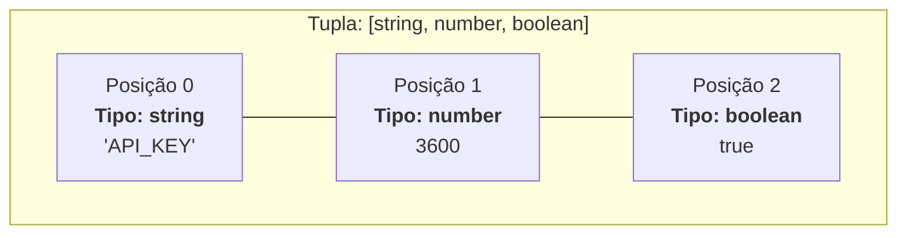

# 16. Tuplas

No capítulo anterior, aprendemos a trabalhar com **Arrays**, a estrutura padrão
para armazenar listas homogêneas e de tamanho dinâmico (onde podemos ter 0, 10
ou milhares de itens do mesmo tipo).

No entanto, existem situações no desenvolvimento de software onde precisamos
representar uma estrutura com **tamanho estritamente fixo**, onde cada posição
possui um **significado e um tipo específico**:

- Um par de coordenadas geográficas: `[latitude, longitude]`.
- Uma resposta de rede com código e status: `[statusCode, statusMessage]`.
- O retorno de funções utilitárias que devolvem pares de dados estruturados.

Para atender a essa necessidade com rigor estático, o TypeScript disponibiliza o
conceito de **Tupla** (_Tuple_).

Neste capítulo, você aprenderá a declarar tuplas fortemente tipadas, utilizar
rótulos descritivos para auto-documentação, saber quando preferir tuplas a
objetos, e garantir a imutabilidade posicional com `as const`.

## O Que É uma Tupla?

Uma **Tupla** é um array com número pré-determinado de elementos, onde cada
posição possui um tipo de dado explicitamente definido pelo contrato.

Enquanto um array comum é declarado como `string[]` (uma lista que aceita
qualquer quantidade de textos), uma tupla é declarada especificando os tipos de
cada posição entre colchetes:

```typescript
// Declaração de Tupla: exatamente 2 elementos [string, number]
let systemUser: [string, number];

// ✅ Atribuição válida: respeita rigorosamente a ordem e os tipos
systemUser = ["Luigi", 28];

// ❌ Erros de compilação detectados pelo TypeScript:
// systemUser = [28, "Luigi"];        // Inversão de tipos! Posição 0 deve ser string.
// systemUser = ["Luigi"];            // Tamanho incorreto! Faltou o segundo elemento.
// systemUser = ["Luigi", 28, true];  // Tamanho incorreto! Excedeu a quantidade de elementos.
```



## Tuplas Rotuladas (_Labeled Tuple Elements_)

Para aumentar a legibilidade do código e melhorar a experiência de
desenvolvimento, o TypeScript permite adicionar **rótulos descritivos** a cada
elemento da tupla:

```typescript
// Tupla com rótulos para documentar cada posição:
type HttpResponse = [statusCode: number, message: string, isSuccess: boolean];

const response: HttpResponse = [200, "Operação realizada com sucesso", true];

// O acesso continua sendo realizado exclusivamente pelo índice numérico:
console.log(`Status ${response[0]}: ${response[1]}`);
// "Status 200: Operação realizada com sucesso"
```

> **Aviso Importante sobre Rótulos:**
>
> Os rótulos em tuplas são **puramente informativos e documentais**:
>
> 1. Eles servem para melhorar o autocompletar e as dicas de tipo no editor.
> 2. Eles **não** criam propriedades de objeto (`response.statusCode` gerará
>    erro de compilação).
> 3. O acesso aos dados continua sendo sempre via índice numérico (`[0]`,
>    `[1]`).

## Quando Usar Tuplas em Vez de Objetos?

Uma dúvida frequente de quem está aprendendo TypeScript é: _"Se um objeto
literal como `{ statusCode: 200, message: 'OK' }` tem nomes explícitos, por que
eu usaria uma tupla `[200, 'OK']`?"_

A regra geral é que **objetos literais continuam sendo o padrão para quase todas
as entidades de negócio** (como `User`, `Product`, `Order`). No entanto, as
tuplas são a melhor escolha em dois cenários específicos:

### 1. Pares e Coordenadas com Ordem Natural

Dados matemáticos, espaciais ou geométricos onde a ordem é universalmente
conhecida e autoexplicativa:

```typescript
type GeoPoint = [latitude: number, longitude: number];
type Dimensions = [width: number, height: number];

const fatecLocation: GeoPoint = [-23.5293, -46.6328];
const bannerSize: Dimensions = [1920, 1080];
```

### 2. Retornos Estruturados com Flexibilidade de Nomeação

Quando uma função precisa retornar dois ou mais valores relacionados e queremos
permitir que quem consome a função nomeie as variáveis livremente no momento de
desempacotar os dados (como veremos no próximo capítulo com _Desestruturação_):

```typescript
// Exemplo clássico nativo: Object.entries retorna um array de tuplas [chave, valor]
const userRoles = {
  admin: "Acesso Total",
  editor: "Edição de Conteúdo",
};

const entries: [string, string][] = Object.entries(userRoles);

for (const entry of entries) {
  console.log(`Chave: ${entry[0]} -> Papel: ${entry[1]}`);
}
```

## Como as Tuplas se Comportam em Tempo de Execução?

Uma das maiores surpresas para quem vem de linguagens como Python (onde tuplas
são tipos de dados nativos e imutáveis do próprio runtime) é descobrir que:

> **Em tempo de execução (JavaScript), Tuplas não existem!**

O JavaScript nativo possui apenas uma única estrutura de lista: o **Array comum**.

Quando você compila seu código TypeScript para JavaScript, todas as anotações de
tipo são completamente apagadas (_Type Erasure_):

```typescript
// 1. Seu código em TypeScript (com a proteção estática da tupla):
const userRecord: [string, number] = ["Luigi", 28];

// 2. O código JavaScript gerado pelo compilador:
const userRecord = ["Luigi", 28]; // Um Array JS tradicional!
```

### O Que Isso Significa na Prática?

1. **Tuplas herdam todos os métodos de Array:** Como a tupla é um array comum por
   baixo dos panos, ela compartilha métodos como `.length`, `.slice()`, `.join()`
   e `.concat()`.
2. **A proteção vive no compilador do TypeScript:** A checagem de tamanho fixo e
   a integridade de tipos em cada posição é uma **garantia estática durante o
   desenvolvimento**.

## Imutabilidade em Tuplas: `readonly` e `as const`

Como o JavaScript subjacente trata tuplas como arrays comuns, métodos como
`.push()` ou atribuições de índice (`tupla[0] = valor`) poderiam tecnicamente
alterar seus dados. Para blindar tuplas contra mutações acidentais, utilizamos
**`readonly`** ou **`as const`**:

### 1. Quando Usar `readonly` (Contratos e Tipos Reutilizáveis)

Utilize **`readonly [Tipo1, Tipo2]`** ao definir **Type Aliases**, interfaces ou
parâmetros de funções. O tipo continua aceitando _quaisquer_ valores que cumpram
os tipos definidos, mas impede que a tupla seja modificada após ser recebida:

```typescript
// Contrato: aceita qualquer par de números, mas proíbe alterações
type GeoCoordinates = readonly [latitude: number, longitude: number];

function displayLocation(coords: GeoCoordinates): void {
  console.log(`Lat: ${coords[0]}, Long: ${coords[1]}`);

  // ❌ Erros de compilação: TypeScript impede qualquer operação de escrita
  // coords[0] = 0;   // Cannot assign to '0' because it is a read-only property.
  // coords.push(10); // Property 'push' does not exist on type 'readonly [...]'.
}

const fatecLocation: GeoCoordinates = [-23.5293, -46.6328];
displayLocation(fatecLocation);
```

### 2. Quando Usar `as const` (Valores Literais Fixos e Configurações)

Utilize a asserção **`as const`** diretamente no momento da criação de um **valor
literal fixo**. Além de tornar a estrutura imutável, o TypeScript passa a inferir
os **valores literais exatos** de cada posição:

```typescript
// Configuração fixa com valores literais:
const serverEndpoint = ["https://api.fatec.br", 8080] as const;
// O TypeScript infere como: readonly ["https://api.fatec.br", 8080]

// ❌ Erro de compilação: Não permite alterar o endpoint configurado
// serverEndpoint[0] = "https://hack.com";
```

### Critério Rápido de Escolha

- **`readonly [T1, T2]`:** Use em **anotações de tipo e contratos de funções**
  (aceita qualquer valor compatível com `T1` e `T2`, mas proíbe mutações).
- **`[valor1, valor2] as const`:** Use em **declarações de constantes de
  configuração** (trava a imutabilidade e fixa os valores literais exatos).

## Resumo Comparativo: Array vs. Tupla

| Característica               | Array (`T[]`)                                    | Tupla (`[T1, T2, ...]`)                            |
| :--------------------------- | :----------------------------------------------- | :------------------------------------------------- |
| **Quantidade de Elementos**  | Dinâmica (0 a N itens).                          | Fixa e pré-determinada no tipo.                    |
| **Homogeneidade dos Tipos**  | Homogêneo (todos os itens do mesmo tipo).        | Heterogêneo (cada posição tem seu próprio tipo).   |
| **Significado das Posições** | Qualquer elemento pode residir em qualquer item. | A posição numérica define a semântica do dado.     |
| **Execução no Runtime (JS)** | Array nativo do JavaScript.                      | Array nativo do JavaScript (_Type Erasure_ no TS). |
| **Exemplo de Uso**           | Lista de produtos, histórico de transações.      | Coordenadas `[lat, long]`, pares `[chave, valor]`. |

## O Que Vem a Seguir?

Até agora, para acessar dados em objetos, arrays ou tuplas, utilizamos acessos
pontuais como `objeto.propriedade` ou `tupla[0]`.

No próximo capítulo, aprenderemos sobre **Desestruturação**
(`17-desestruturacao-de-arrays-e-objetos.md`), um recurso moderno e conciso que
permite desempacotar múltiplas propriedades e posições diretamente em variáveis
locais com uma única linha de código.

---

<a href="15-arrays.md">← Arrays</a>

<p align="right"><a href="17-desestruturacao-de-arrays-e-objetos.md">Próximo: Desestruturação de Arrays e Objetos →</a></p>
