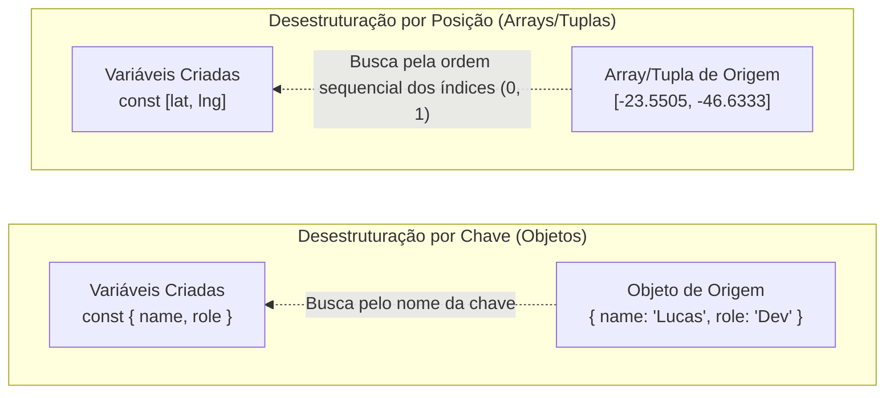

# 17. Desestruturação de Arrays e Objetos

Nos capítulos anteriores, aprendemos a modelar e armazenar dados em objetos
literais (`05-objetos-literais.md`), arrays (`15-arrays.md`) e tuplas
(`16-tuplas.md`). No entanto, no dia a dia do desenvolvimento — especialmente ao
consumir respostas de APIs, gerenciar formulários ou criar componentes no React
—, é extremamente comum precisarmos extrair múltiplos valores dessas estruturas
para utilizá-los em variáveis locais ou parâmetros de funções.

Historicamente, extrair dados exigia dezenas de linhas repetitivas de código.
Para resolver isso, o JavaScript moderno (ES6+) e o TypeScript introduziram a
**Desestruturação** (_Destructuring_), uma sintaxe declarativa que permite
desempacotar propriedades de objetos e elementos de coleções diretamente em
variáveis locais.

## A Dor: O Acesso Manual e Repetitivo

Imagine que sua aplicação receba os dados de um cliente de um serviço web e
precise extrair o nome, o e-mail, a cidade e as coordenadas geográficas de
entrega:

```typescript
type DeliveryUser = {
  name: string;
  email: string;
  address: {
    city: string;
    coordinates: [number, number];
  };
};

// ❌ CÓDIGO VERBOSO: Acesso manual repetitivo a cada propriedade
function processDelivery(user: DeliveryUser): void {
  const name = user.name;
  const email = user.email;
  const city = user.address.city;
  const latitude = user.address.coordinates[0];
  const longitude = user.address.coordinates[1];

  console.log(
    `Enviando pedido de ${name} (${email}) para ${city} [${latitude}, ${longitude}]`,
  );
}
```

Essa abordagem tradicional traz problemas claros:

1. **Repetição desnecessária (_Boilerplate_):** O nome do objeto (`user`,
   `user.address`) precisa ser redigitado a cada acesso.
2. **Poluição visual:** O objetivo central da função fica soterrado sob
   declarações mecânicas de variáveis intermediárias.
3. **Fadiga de manutenção:** Renomear uma propriedade no tipo exige atualizar
   múltiplas linhas de extração manual.

A desestruturação resolve esse problema espelhando a forma da estrutura de dados
diretamente no lado esquerdo da atribuição.



## Desestruturação de Arrays e Tuplas

A desestruturação de arrays e tuplas baseia-se na **posição sequencial
(índice)** dos elementos. Usamos a sintaxe de colchetes `[...]` no lado esquerdo
da atribuição.

### Extração Posicional

Em vez de acessar `coords[0]` e `coords[1]`, definimos variáveis na mesma ordem
em que os elementos estão organizados:

```typescript
// ✅ RECOMENDADO: Extração direta por ordem posicional
const serverCoordinates: [number, number] = [-23.5505, -46.6333];

const [latitude, longitude] = serverCoordinates;

console.log(latitude); // -23.5505 (índice 0)
console.log(longitude); // -46.6333 (índice 1)
```

### Ignorando Posições com Vírgulas

Se você precisa apenas de posições específicas e deseja descartar as anteriores
ou intermediárias, basta deixar os espaços entre as vírgulas em branco:

```typescript
const ranking: string[] = ["Alice", "Bob", "Carlos", "Diana"];

// Ignoramos o 1º e o 2º lugar deixando as posições vazias
const [, , bronzeMedalist] = ranking;

console.log(bronzeMedalist); // "Carlos"
```

### Valores Padrão (_Default Values_)

Se uma posição puder conter `undefined` (por exemplo, ao acessar um índice além
do tamanho da lista), podemos fornecer um valor padrão de contingência
(_fallback_) usando `=`:

```typescript
const userSettings: string[] = ["dark-mode"];

// Como não há 2º elemento, 'language' assume o valor padrão "pt-BR"
const [theme, language = "pt-BR"] = userSettings;

console.log(theme); // "dark-mode"
console.log(language); // "pt-BR"
```

### Inversão de Variáveis (_Swap_) sem Variável Temporária

Um padrão clássico na programação é trocar o valor de duas variáveis. Sem
desestruturação, é necessário criar uma variável temporária auxiliar `temp`. Com
desestruturação, isso é feito em uma única linha atômica:

```typescript
let primaryColor = "#000000";
let secondaryColor = "#FFFFFF";

// Troca direta de valores
[primaryColor, secondaryColor] = [secondaryColor, primaryColor];

console.log(primaryColor); // "#FFFFFF"
console.log(secondaryColor); // "#000000"
```

## Desestruturação de Objetos

Enquanto arrays usam posições numéricas, a desestruturação de objetos busca as
propriedades pelos seus **nomes de chave**, utilizando chaves `{...}` no lado
esquerdo da atribuição.

### Extração por Nome de Chave

As variáveis declaradas recebem exatamente os valores correspondentes às chaves
do objeto:

```typescript
type Developer = {
  name: string;
  age: number;
  role: string;
  active: boolean;
};

const developer: Developer = {
  name: "Lucas Silva",
  age: 24,
  role: "Frontend Engineer",
  active: true,
};

// ✅ Extraímos apenas as propriedades necessárias pelo nome
const { name, role } = developer;

console.log(name); // "Lucas Silva"
console.log(role); // "Frontend Engineer"
```

A ordem em que as chaves são listadas dentro de `{}` não importa: o JavaScript
localiza as propriedades pelo nome exato.

### Renomeando Variáveis (_Aliases_)

Se o nome da propriedade colidir com uma variável já existente no escopo ou não
for descritivo o suficiente, podemos atribuir um novo nome local usando a
sintaxe `chaveOriginal: novoNome`:

```typescript
type ApiResponse = {
  id: string;
  title: string;
};

const response: ApiResponse = {
  id: "USR-9842",
  title: "Administrador de Sistemas",
};

// Renomeia 'id' para 'userId' e 'title' para 'jobTitle'
const { id: userId, title: jobTitle } = response;

console.log(userId); // "USR-9842"
console.log(jobTitle); // "Administrador de Sistemas"
```

> **Atenção à sintaxe no TypeScript: Renomeação NÃO é Tipagem!**
>
> Na desestruturação de objetos, os dois pontos (`:`) servem para **renomear a
> variável**, e **NÃO** para definir seu tipo estático:
>
> ```typescript
> // ❌ ERRO GRAVE: O TypeScript interpreta 'string' como o nome de uma nova variável!
> // const { name: string } = developer;
>
> // ✅ CORRETO: A anotação de tipo fica após o bloco de desestruturação completo
> const { name }: { name: string } = developer;
>
> // ✅ OU AINDA MELHOR: Usando o Type Alias já existente
> const { name: devName }: Developer = developer;
> ```

### Valores Padrão em Propriedades Opcionais

Quando lidamos com propriedades opcionais (`?`), podemos definir valores padrão
caso a propriedade venha como `undefined`:

```typescript
type UserProfile = {
  username: string;
  theme?: string;
  notificationsEnabled?: boolean;
};

const profile: UserProfile = {
  username: "mariadevs",
};

// 'theme' e 'notificationsEnabled' recebem valores padrão caso não estejam definidos
const { username, theme = "system", notificationsEnabled = true } = profile;

console.log(theme); // "system"
console.log(notificationsEnabled); // true
```

### Desestruturação Aninhada

Podemos desestruturar objetos e arrays internos em um único passo:

```typescript
const client = {
  id: 101,
  details: {
    fullName: "Ana Beatriz",
    city: "Campinas",
  },
};

// Extrai diretamente 'fullName' e 'city' do objeto interno 'details'
const {
  details: { fullName, city },
} = client;

console.log(fullName); // "Ana Beatriz"
console.log(city); // "Campinas"
```

> **Dica de Legibilidade:** Evite desestruturações aninhadas excessivamente
> profundas (mais de 2 níveis). Elas tornam o código difícil de ler e depurar.
> Nesses casos, prefira desestruturar em etapas separadas.

## Desestruturação em Parâmetros de Funções

Um dos padrões mais poderosos e populares em TypeScript e frameworks modernos
(como React, Express e Fastify) é a **desestruturação direta na assinatura de
funções**.

Esse padrão simula o conceito de **parâmetros nomeados** (_Named Parameters_),
muito comum em linguagens como Python e Dart.

### Eliminando Parâmetros Posicionais Frágeis

Compare uma função com muitos argumentos posicionais contra uma que recebe um
objeto de configuração:

```typescript
// ❌ FRÁGIL: É fácil inverter a ordem dos parâmetros na chamada
function createButton(
  label: string,
  isPrimary: boolean,
  isDisabled: boolean,
  size: string,
) {
  /* ... */
}

createButton("Salvar", true, false, "large");
```

Para tornar o código mais legível e seguro, agrupamos os parâmetros em um `type`
de opções:

```typescript
type ButtonOptions = {
  label: string;
  isPrimary?: boolean;
  isDisabled?: boolean;
  size?: "small" | "medium" | "large";
};
```

Podemos escrever a função de duas formas equivalentes:

```typescript
// 1️⃣ FORMA EXPLÍCITA: Recebe o objeto 'options' e desestrutura no corpo da função
function createButtonExplicit(options: ButtonOptions): void {
  const {
    label,
    isPrimary = true,
    isDisabled = false,
    size = "medium",
  } = options;

  console.log(`Botão: "${label}" | Primário: ${isPrimary} | Tamanho: ${size}`);
}

// 2️⃣ FORMA CONCISA (IDIOMÁTICA): Desestrutura diretamente na lista de parâmetros
function createButton({
  label,
  isPrimary = true,
  isDisabled = false,
  size = "medium",
}: ButtonOptions): void {
  console.log(`Botão: "${label}" | Primário: ${isPrimary} | Tamanho: ${size}`);
}
```

> **Não se engane: A função recebe UM ÚNICO argumento!**
>
> Ao olhar para `function createButton({ label, isPrimary, ... }: ButtonOptions)`,
> pode parecer que a função possui quatro parâmetros separados. **Isso é uma
> ilusão de ótica:**
>
> - A função espera receber **um único argumento** (um objeto literal que
>   satisfaz o contrato `ButtonOptions`).
> - A desestruturação na assinatura é apenas um atalho sintático para criar as
>   variáveis locais no momento em que o objeto é recebido.
>
> Por isso, a chamada da função **sempre** deve passar um objeto envolvido por
> `{}`:
>
> ```typescript
> // ❌ ERRO: Passar argumentos soltos causará erro de compilação
> // createButton("Confirmar Pedido", true, false, "large");
>
> // ✅ CORRETO: Passamos um único objeto com as propriedades nomeadas
> createButton({
>   label: "Confirmar Pedido",
>   size: "large",
> });
> // Saída: Botão: "Confirmar Pedido" | Primário: true | Tamanho: large
> ```

Essa abordagem traz vantagens imediatas:

- **Auto-documentação:** Na chamada da função, cada valor está explicitamente
  associado ao nome da sua propriedade.
- **Ordem irrelevante:** Você não precisa lembrar se o booleano `isDisabled` era
  o 2º ou o 3º argumento.
- **Evolução segura:** Adicionar novos parâmetros opcionais no tipo
  `ButtonOptions` não quebra nenhuma chamada existente no projeto.

## Resumo Sintático

| Sintaxe                              | Tipo de Desestruturação   | Comportamento Principal                                            |
| :----------------------------------- | :------------------------ | :----------------------------------------------------------------- |
| `const [a, b] = array;`              | **Array / Tupla**         | Extrai elementos por posição sequencial (índice).                  |
| `const [, , c] = array;`             | **Array (Salto)**         | Ignora posições intermediárias com vírgulas vazias.                |
| `const [a = 10] = array;`            | **Array (Valor Padrão)**  | Aplica fallback se a posição for `undefined`.                      |
| `const { name, age } = obj;`         | **Objeto**                | Extrai propriedades correspondentes aos nomes das chaves.          |
| `const { id: userId } = obj;`        | **Objeto (Renomeação)**   | Cria uma variável local com novo nome (`userId`).                  |
| `const { theme = "dark" } = obj;`    | **Objeto (Valor Padrão)** | Aplica fallback se a chave não existir ou for `undefined`.         |
| `function fn({ a, b }: Options) { }` | **Parâmetro de Função**   | Desestrutura campos do objeto diretamente na assinatura da função. |

<details>
<summary>🔍 Aprofundamento: Comportamento de Valores Padrão com <code>null</code> vs <code>undefined</code></summary>

Uma dúvida muito comum entre desenvolvedores iniciantes é por que um valor
padrão às vezes não é aplicado.

Em JavaScript e TypeScript, a desestruturação só aciona o valor padrão (`=
fallback`) se a propriedade for **estritamente `undefined`**. Se o valor for
explicitamente `null`, `false`, `0` ou `""` (string vazia), o valor padrão
**não** será disparado:

```typescript
type ApiResponseData = {
  title?: string;
  description: string | null;
};

const data: ApiResponseData = {
  title: undefined, // Ausente / Indefinido
  description: null, // Explicitamente nulo (ex: retornado pelo banco de dados)
};

const { title = "Sem Título", description = "Sem Descrição" } = data;

console.log(title); // "Sem Título" (undefined disparou o valor padrão!)
console.log(description); // null (null NÃO dispara o valor padrão!)
```

Para tratar valores explicitamente nulos (`null`), utilize o operador de
coalescência nula (`??`) estudado no [Capítulo 08: Expressões e
Operadores](08-expressoes-e-operadores.md):

```typescript
const safeDescription = description ?? "Sem Descrição";
console.log(safeDescription); // "Sem Descrição"
```

</details>

## O Que Vem a Seguir?

Neste capítulo, aprendemos a extrair valores específicos e conhecidos de arrays
e objetos. Mas o que acontece se quisermos capturar **todo o restante dos
elementos** que não foram desestruturados? Ou como podemos **copiar e fundir**
objetos e listas sem modificá-los diretamente?

No próximo capítulo, exploraremos os **Operadores Rest e Spread**
(`18-operadores-rest-e-spread.md`), ferramentas indispensáveis para manipulação
imutável de dados.

---

<a href="16-tuplas.md">← Tuplas</a>

<p align="right"><a href="18-operadores-rest-e-spread.md">Próximo: Operadores Rest e Spread →</a></p>
