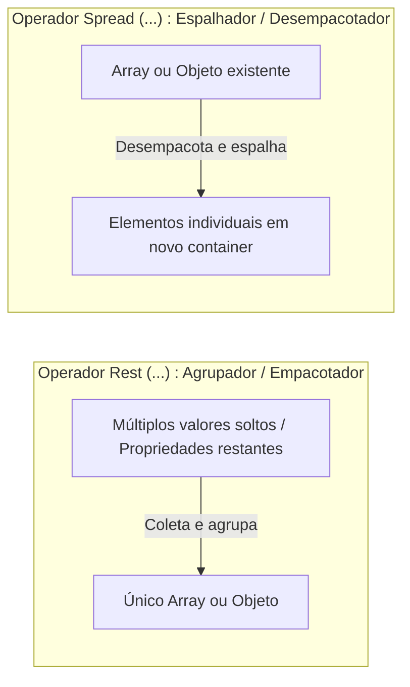

# 18. Operadores Rest e Spread

No capítulo anterior ([17. Desestruturação de Arrays e
Objetos](17-desestruturacao-de-arrays-e-objetos.md)), aprendemos a extrair
valores específicos de estruturas de dados. Contudo, no desenvolvimento de
aplicações modernas, deparamo-nos constantemente com dois desafios
complementares:

1. **Coletar o restante dos dados:** Como extrair uma ou duas propriedades
   específicas e agrupar todas as "sobras" em uma nova variável?
2. **Compor e clonar dados de forma imutável:** Como criar novos objetos e
   arrays a partir de estruturas existentes sem modificar os dados originais na
   memória (evitando os perigos de mutação que estudamos no [Capítulo
   06](06-tipos-por-referencia-e-memoria.md))?

Para solucionar esses dois cenários de forma expressiva, o JavaScript e o
TypeScript utilizam a sintaxe de três pontos (`...`), que desempenha dois papéis
com propósitos opostos: o operador **Rest** e o operador **Spread**.



## O Operador Rest (`...`): Coletando Sobras

O operador **Rest** tem a função de **coletar e agrupar múltiplos elementos
restantes** em uma única estrutura (seja um array ou um objeto). Pense no
operador Rest como a gaveta onde você guarda "o restante dos itens".

### Rest em Desestruturação de Arrays

Ao extrair os primeiros itens de um array, podemos empacotar todos os elementos
subsequentes em uma nova lista tipada:

```typescript
const tournamentScores: number[] = [100, 95, 88, 72, 65, 50];

// Extrai o 1º e 2º colocados, e agrupa o restante em 'remainingScores'
const [firstPlace, secondPlace, ...remainingScores] = tournamentScores;

console.log(firstPlace); // 100
console.log(secondPlace); // 95
console.log(remainingScores); // [88, 72, 65, 50]
```

### Rest em Desestruturação de Objetos (Sanitização de Dados)

Em objetos, o operador Rest é amplamente utilizado para **sanitizar dados** —
isto é, isolar campos sensíveis (como senhas, tokens ou dados internos) e
agrupar todas as demais propriedades em um objeto público seguro:

```typescript
type UserAccount = {
  id: number;
  username: string;
  email: string;
  passwordHash: string;
  twoFactorEnabled: boolean;
};

const account: UserAccount = {
  id: 101,
  username: "ana_clara",
  email: "ana@fatec.br",
  passwordHash: "a8f5c9e2b1f83c74",
  twoFactorEnabled: true,
};

// Remove 'passwordHash' e agrupa todas as demais propriedades em 'publicProfile'
const { passwordHash, ...publicProfile } = account;

console.log(passwordHash); // "a8f5c9e2b1f83c74"
console.log(publicProfile);
// { id: 101, username: "ana_clara", email: "ana@fatec.br", twoFactorEnabled: true }
```

### Parâmetros Rest em Funções (_Rest Parameters_)

O operador Rest também pode ser utilizado no último parâmetro da assinatura de
uma função para permitir que ela receba um número variável e indefinido de
argumentos, empacotando-os automaticamente em um array tipado:

```typescript
// ✅ Recebe uma categoria obrigatória e N valores de preços adicionais
function calculateOrderTotal(category: string, ...prices: number[]): number {
  let total = 0;

  for (const price of prices) {
    total += price;
  }

  console.log(`Total para "${category}": R$ ${total.toFixed(2)}`);
  return total;
}

calculateOrderTotal("Eletrônicos", 1500, 300, 80); // prices será [1500, 300, 80]
calculateOrderTotal("Livros", 50, 42.5); // prices será [50, 42.5]
calculateOrderTotal("Serviços"); // prices será [] (array vazio)
```

> **Regra Obrigatória do Operador Rest:**
>
> O elemento com `...` deve ser **obrigatoriamente o último** item na lista de
> desestruturação ou nos parâmetros da função. Inserir qualquer identificador
> após o Rest causará erro de compilação:
>
> ```typescript
> // ❌ ERRO DE COMPILAÇÃO: O parâmetro Rest precisa ser o último!
> // function register(name: string, ...roles: string[], age: number) { }
> ```

## O Operador Spread (`...`): Espalhando e Compondo Dados

Enquanto o Rest agrupa valores, o operador **Spread** faz o caminho inverso: ele
**desempacota (espalha)** os elementos de uma coleção existente dentro de uma
nova estrutura ou chamada de função.

O Spread é o pilar da **programação imutável** em TypeScript, permitindo gerar
novos estados sem modificar os dados originais na memória.

### Composição e Clonagem Imutável de Arrays

Com o Spread, podemos criar novos arrays combinando elementos existentes e
inserindo novos itens em qualquer posição, sem invocar métodos mutadores como
`.push()`, `.unshift()` ou `.splice()`:

```typescript
const frontendTechs: string[] = ["HTML", "CSS", "TypeScript"];
const backendTechs: string[] = ["Node.js", "Express", "PostgreSQL"];

// Mesclando dois arrays em uma nova coleção independente
const fullStackTechs: string[] = [...frontendTechs, ...backendTechs];
console.log(fullStackTechs);
// ["HTML", "CSS", "TypeScript", "Node.js", "Express", "PostgreSQL"]

// Inserindo novos itens no início e no final de forma imutável
const extendedList: string[] = ["Git", ...frontendTechs, "Docker"];
console.log(extendedList);
// ["Git", "HTML", "CSS", "TypeScript", "Docker"]
console.log(frontendTechs);
// ["HTML", "CSS", "TypeScript"] (o array original permanece 100% intacto!)
```

### Criação e Atualização Imutável de Objetos

No desenvolvimento web moderno, atualizar o estado de um registro ou formulário
significa produzir um **novo objeto** que herda as propriedades anteriores e
sobrescreve apenas as chaves modificadas:

```typescript
type Product = {
  id: string;
  title: string;
  price: number;
  inStock: boolean;
};

const originalProduct: Product = {
  id: "PROD-404",
  title: "Teclado Mecânico",
  price: 250,
  inStock: true,
};

// ✅ Cria uma cópia atualizada sobrescrevendo apenas 'price'
const updatedProduct: Product = {
  ...originalProduct,
  price: 220, // Sobrescreve o preço copiado do original
};

console.log(originalProduct.price); // 250 (original preservado!)
console.log(updatedProduct.price); // 220 (novo estado da aplicação)
```

#### A Ordem de Precedência no Spread de Objetos

No JavaScript, quando chaves com o mesmo nome são declaradas no mesmo objeto
literal, **a última declaração sempre vence**:

```typescript
const baseConfig = { theme: "dark", fontSize: 14 };

// ⚠️ CUIDADO: baseConfig foi espalhado DEPOIS e sobrescreveu fontSize: 18
const badConfig = { fontSize: 18, ...baseConfig };
console.log(badConfig.fontSize); // 14

// ✅ CORRETO: baseConfig é espalhado primeiro; fontSize: 18 sobrescreve o valor padrão
const goodConfig = { ...baseConfig, fontSize: 18 };
console.log(goodConfig.fontSize); // 18
```

> **Lembrete**: Cópia Rasa (_Shallow Copy_) vs. Cópia Profunda (_Deep Copy_)
>
> Conforme mencionado no final do [Capítulo 06: Tipos por Referência e
> Memória](06-tipos-por-referencia-e-memoria.md), o operador Spread realiza
> apenas uma **cópia rasa** (_Shallow Copy_). As propriedades primitivas são
> duplicadas por valor, mas objetos ou arrays aninhados continuam compartilhando
> a mesma referência na memória _Heap_. Caso precise clonar estruturas
> profundamente aninhadas de forma 100% isolada, utilize a função global nativa
> **`structuredClone(objeto)`**.

### Espalhando Elementos como Argumentos de Funções

Se você possui um array ou tupla de valores e precisa passá-los para uma função
que espera argumentos individuais separados por vírgula, use o Spread:

```typescript
const serverCoordinates: [number, number] = [-23.5505, -46.6333];

function setMapCenter(latitude: number, longitude: number): void {
  console.log(`Mapa centralizado em: [${latitude}, ${longitude}]`);
}

// ✅ Espalha a tupla diretamente nos parâmetros posicionais da função
// Equivalente a: setMapCenter(serverCoordinates[0], serverCoordinates[1]);
setMapCenter(...serverCoordinates);

// Outro exemplo clássico da biblioteca padrão: Math.max
const monthlySales: number[] = [1200, 3500, 2100, 4800, 1900];
const maxSale = Math.max(...monthlySales);
console.log(`Maior venda do mês: R$ ${maxSale}`); // 4800
```

## Resumo Comparativo: Rest vs. Spread

| Conceito            | Papel Principal                                | Sintaxe de Exemplo                         | Onde é Declarado                                      |
| :------------------ | :--------------------------------------------- | :----------------------------------------- | :---------------------------------------------------- |
| **Operador Rest**   | **Agrupa** múltiplos valores em uma estrutura. | `const [first, ...rest] = list;`           | Lado esquerdo de atribuições ou parâmetros de função. |
| **Operador Rest**   | **Sanitiza** propriedades restantes em objeto. | `const { pass, ...profile } = user;`       | Lado esquerdo de desestruturações `{}`.               |
| **Parâmetros Rest** | **Recebe** N argumentos avulsos em um array.   | `function sum(...nums: number[])`          | Assinatura de funções.                                |
| **Operador Spread** | **Clona e combina** arrays imutavelmente.      | `const all = [...listA, ...listB];`        | Lado direito em literais de array `[...]`.            |
| **Operador Spread** | **Atualiza** objetos sobrescrevendo chaves.    | `const next = { ...prev, active: false };` | Lado direito em literais de objeto `{...}`.           |
| **Operador Spread** | **Espalha** elementos como argumentos.         | `Math.max(...values);`                     | Chamada de funções `fn(...)`.                         |

## O Que Vem a Seguir?

Agora que dominamos como inspecionar, desestruturar, combinar e clonar coleções
de forma imutável, estamos prontos para um dos tópicos mais expressivos e
transformadores da linguagem.

No próximo capítulo, estudaremos os **Métodos Funcionais de Array**
(`19-metodos-funcionais-de-array.md`), aprendendo a transformar (`map`), filtrar
(`filter`) e agregar (`reduce`) dados com código declarativo e fluente.

---

<a href="17-desestruturacao-de-arrays-e-objetos.md">← Desestruturação de Arrays
e Objetos</a>

<p align="right"><a href="19-metodos-funcionais-de-array.md">Próximo: Métodos Funcionais de Array →</a></p>
