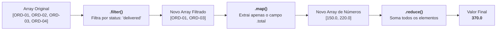
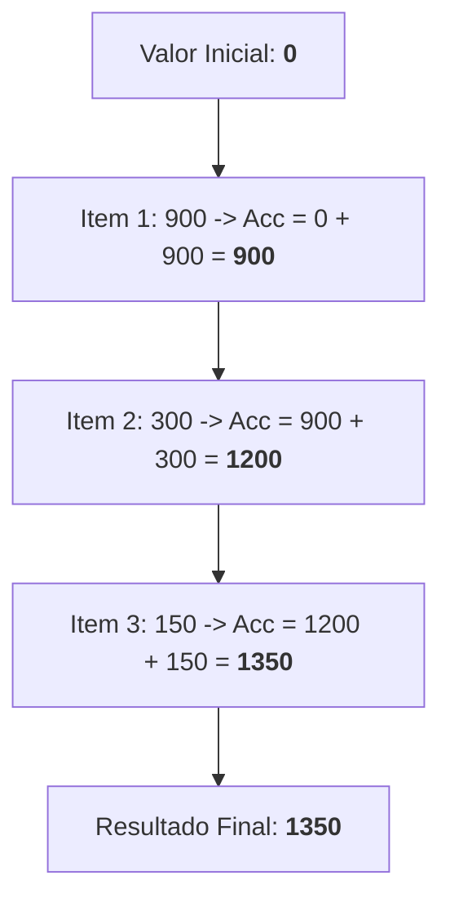

# 19. Métodos Funcionais de Array

Nos capítulos anteriores, aprendemos a modelar coleções com
[Arrays](15-arrays.md) e [Tuplas](16-tuplas.md), descompactamos estruturas com a
[Desestruturação](17-desestruturacao-de-arrays-e-objetos.md) e dominamos a
clonagem imutável com os [Operadores Rest e
Spread](18-operadores-rest-e-spread.md). Também vimos no [Capítulo
12](12-funcoes-de-primeira-classe.md) que funções são cidadãs de primeira classe
e podem ser passadas como argumentos (_Callbacks_).

Agora, esses conceitos se unem para apresentar um dos paradigmas mais produtivos
e elegantes do desenvolvimento web: a **manipulação funcional e declarativa de
coleções**.

Em vez de escrever laços manuais controlando índices e acumulando resultados em
variáveis mutáveis, utilizaremos métodos embutidos de alta ordem (`map`,
`flatMap`, `filter`, `reduce`, `find`, `some`, `every`, `forEach`) para
descrever **o que** queremos fazer com os dados, mantendo a imutabilidade das
listas originais.

## A Dor do Modelo Imperativo vs. Abordagem Declarativa

Imagine que você recebeu de uma API do backend uma lista de pedidos de uma loja
virtual. Sua tarefa no frontend é filtrar apenas os pedidos entregues, extrair
os valores totais e calcular a receita total gerada.

No modelo imperativo clássico (com laço `for`), o código ficaria assim:

```typescript
type Order = {
  id: string;
  customer: string;
  total: number;
  status: "pending" | "delivered" | "cancelled";
};

const orders: Order[] = [
  { id: "ORD-01", customer: "Alice", total: 150.0, status: "delivered" },
  { id: "ORD-02", customer: "Bob", total: 80.0, status: "pending" },
  { id: "ORD-03", customer: "Carol", total: 220.0, status: "delivered" },
  { id: "ORD-04", customer: "David", total: 50.0, status: "cancelled" },
];

// ❌ ABORDAGEM IMPERATIVA: Muito ruído, controle manual de variáveis e alta chance de bugs
let deliveredRevenue = 0;

for (let i = 0; i < orders.length; i++) {
  if (orders[i].status === "delivered") {
    deliveredRevenue += orders[i].total;
  }
}

console.log(`Receita entregue: R$ ${deliveredRevenue}`); // 370
```

Embora o código acima funcione, ele apresenta problemas crônicos de
manutenibilidade:

1. **Ruído sintático:** Você é obrigado a gerenciar variáveis de controle (`i`,
   `length`, `let deliveredRevenue = 0`).
2. **Mutabilidade desnecessária:** A variável `deliveredRevenue` precisa ser
   declarada com `let` e reatribuída a cada iteração.
3. **Dificuldade de reutilização:** Se amanhã você precisar apenas da lista dos
   pedidos entregues (e não da soma), terá que escrever outro laço manual quase
   idêntico.

Com métodos funcionais, expressamos a intenção de forma declarativa e imutável:

```typescript
// ✅ ABORDAGEM DECLARATIVA: Clareza, leitura fluente e sem variáveis mutáveis
const deliveredRevenue = orders
  .filter((order) => order.status === "delivered")
  .map((order) => order.total)
  .reduce((accumulator, ordemTotal) => accumulator + ordemTotal, 0);

console.log(`Receita entregue: R$ ${deliveredRevenue}`); // 370
```

## O Conceito de Pipeline Funcional

Os métodos funcionais tratam coleções de dados como fluxos contínuos. Cada
método recebe uma função de callback, executa uma operação específica e devolve
um novo resultado sem alterar a coleção original.



A seguir, estudaremos cada um dos métodos essenciais e seus papéis na
arquitetura de software.

## 1. Transformação de Dados com `map()`

O método **`map()`** percorre todos os elementos de um array, aplica uma função
de transformação a cada um deles e retorna um **novo array com exatamente o
mesmo tamanho**, contendo os itens resultantes.

A lista original permanece 100% inalterada.

```typescript
type Product = {
  id: string;
  title: string;
  price: number;
  tags: string[];
};

const products: Product[] = [
  { id: "P1", title: "Monitor 24'", price: 900, tags: ["hardware", "video"] },
  {
    id: "P2",
    title: "Teclado Mecânico",
    price: 300,
    tags: ["hardware", "acessorios"],
  },
  { id: "P3", title: "Mouse Gamer", price: 150, tags: ["acessorios"] },
];

// Exemplo 1: Extraindo apenas os títulos dos produtos (Product[] -> string[])
const productTitles: string[] = products.map((product) => product.title);
console.log(productTitles);
// ['Monitor 24\'', 'Teclado Mecânico', 'Mouse Gamer']

// Exemplo 2: Aplicando 10% de desconto em uma nova lista de objetos (imutabilidade)
const discountedProducts: Product[] = products.map((product) => ({
  ...product,
  price: product.price * 0.9,
}));

console.log(discountedProducts[0].price); // 810 (novo array com desconto)
console.log(products[0].price); // 900 (original intacto!)
```

> **Retorno de Objetos Literais em Arrow Functions:**
>
> Ao retornar um objeto literal diretamente de uma arrow function de linha
> única, envolva o objeto entre parênteses `({ ... })`. Caso contrário, o
> JavaScript interpretará as chaves `{}` como o corpo de um bloco de código, e
> não como um objeto.

## 2. Projeção e Achatamento com `flatMap()`

O que acontece quando a função passada para o `map()` retorna ela própria um
array? Você termina com um array de arrays (`T[][]`).

O método **`flatMap()`** resolve esse problema: ele executa uma função de
transformação em cada elemento e, em seguida, **achata o resultado em um nível
de profundidade** (equivalente a chamar `.map().flat(1)` de forma combinada e
mais eficiente).

```typescript
// Cenário: Queremos uma lista com todas as tags de todos os produtos, sem aninhamento

// Com map normal: produz string[][] (array aninhado de arrays)
const nestedTags: string[][] = products.map((product) => product.tags);

console.log(nestedTags);
// [ ['hardware', 'video'], ['hardware', 'acessorios'], ['acessorios'] ]

// ✅ Com flatMap: produz string[] (lista plana de tags)
const allTags: string[] = products.flatMap((product) => product.tags);

console.log(allTags);
// ['hardware', 'video', 'hardware', 'acessorios', 'acessorios']
```

## 3. Filtragem de Coleções com `filter()`

O método **`filter()`** avalia cada elemento com uma função de teste
(**predicado**). Ele retorna um **novo array contendo apenas os itens para os
quais a função retornou `true`**.

Se nenhum elemento passar no teste, o método retorna um array vazio (`[]`),
nunca `null` ou `undefined`.

```typescript
// Filtra apenas produtos com preço abaixo de R$ 500
const affordableProducts: Product[] = products.filter(
  (product) => product.price < 500,
);

console.log(affordableProducts.map((p) => p.title));
// ['Teclado Mecânico', 'Mouse Gamer']

// Filtra apenas produtos que contenham a tag 'video'
const videoProducts: Product[] = products.filter((product) =>
  product.tags.includes("video"),
);

console.log(videoProducts.length); // 1 (apenas o Monitor)
```

### O Padrão "Mapear e Filtrar" com `flatMap` (Passagem Única)

Frequentemente precisamos filtrar um subconjunto de dados e, logo em seguida,
transformá-lo. A abordagem mais comum e legível é encadear `.filter().map()`:

```typescript
// Abordagem clássica: filter -> map (2 iterações completas: O(2N))
const labelsClassic = products
  .filter((product) => product.price >= 200)
  .map((product) => `Frete Grátis: ${product.title}`);
```

No entanto, no encadeamento acima o JavaScript itera duas vezes sobre a coleção
(uma para filtrar e outra para mapear), alocando um array intermediário na
memória.

Utilizando o **`flatMap()`**, podemos transformar e filtrar simultaneamente em
uma **única passagem ($O(N)$)**: se o callback retornar um array de 1 item
(`[valor]`), ele é incluído; se retornar um array vazio (`[]`), o item é
descartado:

```typescript
// ✅ Abordagem otimizada: flatMap (1 única iteração: O(N) sem array intermediário)
const freeShippingLabels: string[] = products.flatMap((product) => {
  if (product.price >= 200) {
    return [`Frete Grátis: ${product.title}`]; // Mapeia e inclui
  }

  return []; // Descarta o elemento ao achatar!
});

console.log(freeShippingLabels);
// ['Frete Grátis: Monitor 24\'', 'Frete Grátis: Teclado Mecânico']
```

> **Decisão de Design: Clareza (`filter -> map`) vs. Performance (`flatMap`)**
>
> O encadeamento `.filter().map()` é altamente declarativo e mais fácil de ler
> em regras de negócio do dia a dia. Já o `flatMap` é uma excelente alternativa
> de design quando você deseja evitar passagens redundantes em coleções maiores
> sem perder a imutabilidade funcional.

## 4. Agregação e Acúmulo com `reduce()`

O método **`reduce()`** é a ferramenta mais versátil de manipulação de coleções.
Ele percorre o array acumulando todos os valores em um **único resultado final**
(que pode ser um número, uma string, um objeto, ou até outra coleção agregada).

A assinatura do `reduce` recebe dois parâmetros principais:

1. Uma **função redutora** com `(accumulator, currentItem, currentIndex, array)
=> newAccumulator`.
2. Um **valor inicial obrigatório** para o acumulador.

### Exemplo 1: Somando Valores Numéricos

```typescript
const cartPrices: number[] = [900, 300, 150];

// O acumulador inicia em 0
const cartTotal = cartPrices.reduce((accumulator, price) => {
  return accumulator + price;
}, 0);

console.log(`Total do carrinho: R$ ${cartTotal}`); // 1350
```



### Exemplo 2: Agrupando e Contando Dados em um Objeto

Podemos usar o `reduce` para agregar uma lista de valores em uma estrutura mais
complexa, como um mapa de contagem de frequência de tags.

Para manter o código limpo e fácil de entender, podemos quebrar o processo em
algumas etapas claras:

```typescript
// 1. Extraímos todas as tags dos produtos em uma lista plana separada
const allTags: string[] = products.flatMap((product) => product.tags);
// Resultado: ['hardware', 'video', 'hardware', 'acessorios', 'acessorios']

// 2. Definimos o tipo do objeto acumulador (chave string -> contagem number)
type TagCount = Record<string, number>;

const initialTagCounts: TagCount = {};

// 3. Declaramos a função redutora separadamente
function countTagOccurrences(
  accumulator: TagCount,
  currentTag: string,
): TagCount {
  // Recupera a contagem existente ou 0 caso a tag esteja sendo vista pela primeira vez
  const previousCount = accumulator[currentTag] ?? 0;

  // Atualiza o total incrementando em 1
  accumulator[currentTag] = previousCount + 1;

  // Retorna o objeto acumulador atualizado para a próxima iteração
  return accumulator;
}

// 4. Passamos a função redutora e o estado inicial para o reduce
const tagFrequency = allTags.reduce(countTagOccurrences, initialTagCounts);

console.log(tagFrequency);
// { hardware: 2, video: 1, acessorios: 2 }
```

#### Versão Concisa (Como você verá no dia a dia)

Depois que você dominar o mecanismo, na prática do dia a dia você verá esse
mesmo processamento escrito de forma fluente e encadeada utilizando _Arrow
Functions_:

```typescript
type TagCount = Record<string, number>;

// ✅ Abordagem concisa e fluente no dia a dia
const conciseTagFrequency = products
  .flatMap((product) => product.tags)
  .reduce<TagCount>((accumulator, tag) => {
    accumulator[tag] = (accumulator[tag] ?? 0) + 1;
    return accumulator;
  }, {});

console.log(conciseTagFrequency);
// { hardware: 2, video: 1, acessorios: 2 }
```

> **Atenção: Sempre forneça o valor inicial no `reduce()`!**
>
> Se você omitir o valor inicial, o `reduce` usará o primeiro elemento do array
> como acumulador inicial e começará a iterar a partir do segundo elemento. Em
> arrays de objetos (ex: `Product[]`), isso causará um erro catastrófico de tipo
> ou de runtime, pois o acumulador começará como um `Product` enquanto você
> esperava um `number`.

## 5. Métodos de Busca e Predicados Existenciais

Nem sempre queremos transformar ou processar a lista inteira. Frequentemente
precisamos apenas localizar um item específico ou validar se uma condição de
negócio é atendida.

### `find()` e `findIndex()`

- **`find()`**: Retorna o **primeiro elemento** que satisfizer a condição ou
  **`undefined`** caso nenhum seja encontrado.
- **`findIndex()`**: Retorna o **índice numérico** do primeiro elemento
  encontrado ou **`-1`** se não existir.

```typescript
// Localiza o produto com ID 'P2'
const selectedProduct: Product | undefined = products.find(
  (product) => product.id === "P2",
);

if (selectedProduct !== undefined) {
  console.log(`Produto encontrado: ${selectedProduct.title}`); // 'Teclado Mecânico'
} else {
  console.log("Produto não encontrado no catálogo.");
}

// Localiza a posição do produto no array
const index = products.findIndex((product) => product.id === "P2");
console.log(`Posição no array: ${index}`); // 1
```

### `some()` e `every()`

- **`some()`**: Retorna `true` se **pelo menos um** elemento satisfizer o teste
  (disjunção lógica $\exists$).
- **`every()`**: Retorna `true` se **todos** os elementos satisfizerem o teste
  (conjunção lógica $\forall$).

```typescript
// Regra 1: Existe algum produto caro no carrinho (acima de R$ 800)?
const hasExpensiveItem: boolean = products.some(
  (product) => product.price > 800,
);
console.log(`Tem item caro? ${hasExpensiveItem}`); // true (Monitor custa 900)

// Regra 2: Todos os produtos custam mais de R$ 50?
const areAllAffordable: boolean = products.every(
  (product) => product.price >= 50,
);
console.log(`Todos custam ao menos 50? ${areAllAffordable}`); // true
```

## 6. Execução de Efeitos Colaterais com `forEach()`

Enquanto `map`, `filter` e `reduce` são projetados para computações puras que
produzem novos valores sem alterar o mundo externo, frequentemente precisamos
apenas **executar uma ação para cada elemento** da coleção (como imprimir logs,
disparar notificações, salvar no banco ou atualizar elementos visuais).

O método **`forEach()`** é a alternativa funcional e declarativa aos laços `for`
tradicionais para a execução de **efeitos colaterais** (_side effects_).

A assinatura do callback de `forEach` recebe `(item, index, array)` e o retorno
do método é estritamente **`void`**:

```typescript
// ✅ Executando uma ação para cada produto (efeito colateral explícito)
products.forEach((product, index) => {
  console.log(`Item #${index + 1}: ${product.title} - R$ ${product.price}`);
});
```

### `forEach()` vs. `map()`: Quando Usar Qual?

| Critério               | `map()`                         | `forEach()`                          |
| :--------------------- | :------------------------------ | :----------------------------------- |
| **Intenção Principal** | Transformar dados               | Executar ações / Efeitos colaterais  |
| **Retorno do Método**  | Um **novo array** `U[]`         | **`void`** (nada)                    |
| **Uso Típico**         | Formatação, cálculos, pipelines | Logs, envio de e-mails, persistência |

```typescript
// ❌ ANTI-PATTERN: Usar map() apenas para causar efeito colateral (aloca array inútil na memória)
products.map((p) => console.log(p.title));

// ✅ CORRETO: Use forEach() quando não precisar do retorno
products.forEach((p) => console.log(p.title));
```

> **Atenção: `forEach()` Não Permite Parada Antecipada (`break`)**
>
> Uma particularidade importante do `forEach()` é que ele **não suporta os
> comandos `break` ou `continue`**. O callback será executado rigorosamente para
> todos os itens do array. Caso precise iterar com a possibilidade de
> interromper a execução no meio do caminho, prefira um laço tradicional
> `for..of` ou métodos predicados como `some()` / `find()`.

## Construindo Pipelines de Processamento Encadeados

O verdadeiro poder dos métodos funcionais se manifesta na composição fluente
(_Method Chaining_). Como métodos como `filter`, `map` e `flatMap` devolvem
novos arrays, podemos conectá-los em sequência para criar pipelines de dados
legíveis e autoexplicativos:

```typescript
type Transaction = {
  id: string;
  type: "income" | "expense";
  amount: number;
  category: string;
};

const transactions: Transaction[] = [
  { id: "T1", type: "income", amount: 5000, category: "Salário" },
  { id: "T2", type: "expense", amount: 120, category: "Transporte" },
  { id: "T3", type: "expense", amount: 450, category: "Alimentação" },
  { id: "T4", type: "income", amount: 800, category: "Freelance" },
  { id: "T5", type: "expense", amount: 200, category: "Alimentação" },
];

// Pipeline: Calcular o total gasto exclusivamente com Alimentação
const foodExpenseTotal = transactions
  .filter((tx) => tx.type === "expense") // 1. Apenas despesas
  .filter((tx) => tx.category === "Alimentação") // 2. Apenas categoria Alimentação
  .map((tx) => tx.amount) // 3. Extrai apenas os valores
  .reduce((acc, amount) => acc + amount, 0); // 4. Soma tudo

console.log(`Total gasto em alimentação: R$ ${foodExpenseTotal}`); // 650
```

## Resumo Comparativo dos Métodos Funcionais

| Método            | Propósito Principal                               | Retorno do Callback | Retorno do Método          | Modifica o Original? |
| :---------------- | :------------------------------------------------ | :------------------ | :------------------------- | :------------------: |
| **`map()`**       | Projeta e transforma cada elemento 1-para-1       | Novo valor `U`      | `U[]` (mesmo tamanho)      |        ❌ Não        |
| **`flatMap()`**   | Projeta e achata elementos 1-para-N               | Array `U[]`         | `U[]` (plano)              |        ❌ Não        |
| **`filter()`**    | Filtra itens por predicado booleano               | `boolean`           | `T[]` (subconjunto)        |        ❌ Não        |
| **`reduce()`**    | Agrega toda a coleção em um valor único           | Novo acumulador `U` | `U` (valor consolidado)    |        ❌ Não        |
| **`find()`**      | Busca o primeiro elemento que atende ao critério  | `boolean`           | `T \| undefined`           |        ❌ Não        |
| **`findIndex()`** | Busca o índice numérico do primeiro elemento      | `boolean`           | `number` (`-1` se ausente) |        ❌ Não        |
| **`some()`**      | Verifica se pelo menos um item atende ao critério | `boolean`           | `boolean`                  |        ❌ Não        |
| **`every()`**     | Verifica se todos os itens atendem ao critério    | `boolean`           | `boolean`                  |        ❌ Não        |
| **`forEach()`**   | Executa uma ação/efeito colateral por elemento    | `void`              | `void`                     |        ❌ Não        |

> **Regra de Ouro: Pureza das Funções de Callback**
>
> As funções passadas para `map`, `filter` e `reduce` devem ser **funções
> puras** — isto é, não devem causar efeitos colaterais externos (como mutar
> variáveis globais, alterar o array original ou disparar requisições de rede).
>
> Se o seu objetivo for apenas causar um efeito colateral (como imprimir no
> console ou salvar no banco) sem transformar os dados, utilize um laço
> `for..of` ou o método `.forEach()`. Nunca use `.map()` se você for ignorar o
> array retornado!

<details>
<summary>🔍 Aprofundamento: Custo de Alocação de Memória vs. Legibilidade na Web Moderna</summary>

Ao encadear `.filter().map().filter()`, cada chamada intermediária aloca um novo
array temporário na memória _Heap_.

Em listas típicas do desenvolvimento Web frontend (contendo dezenas, centenas ou
poucos milhares de itens que cabem na tela de um usuário), o overhead de criação
desses arrays intermediários é da ordem de **frações de milissegundo** —
tornando o ganho em clareza, manutenibilidade e eliminação de bugs infinitamente
mais valioso do que a micro-otimização.

No entanto, se você estiver processando milhões de registros brutos ou operando
em servidores com alta restrição de memória (processamento de grandes arquivos
CSV ou buffers de áudio/vídeo), laços imperativos `for` tradicionais ou
estruturas de geradores/streams (onde os dados são avaliados sob demanda sem
alocar coleções intermediárias) podem ser preferíveis por razões estritas de
desempenho.

</details>

---

<a href="18-operadores-rest-e-spread.md">← Operadores Rest e Spread</a>

<p align="right"><a href="20-closures-e-fabricas-de-funcoes.md">Próximo: Closures e Fábricas de Funções →</a></p>
