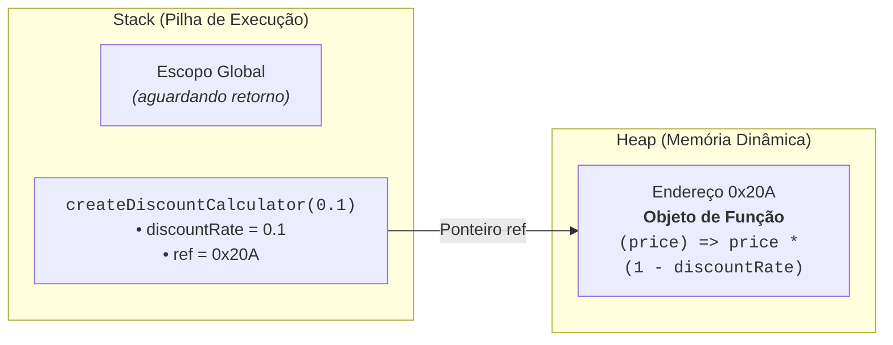
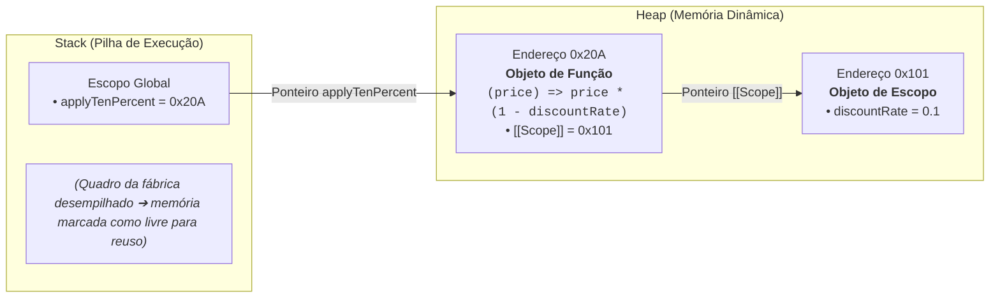
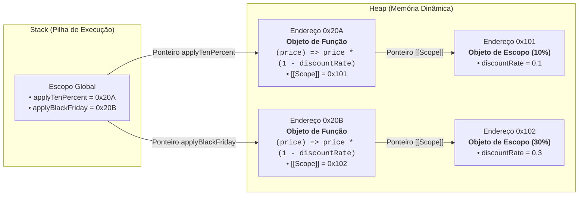

# 20. Closures e Fábricas de Funções

No [Capítulo 12](12-funcoes-de-primeira-classe.md), aprendemos que funções são
cidadãs de primeira classe no TypeScript e podem ser retornadas por outras
funções. No [Capítulo 13](13-escopo-e-sombreamento.md), vimos como a cadeia de
escopos (_Scope Chain_) permite que funções internas acessem variáveis
declaradas em seus escopos externos. E, no [Capítulo
19](19-metodos-funcionais-de-array.md), aplicamos funções de callback para
transformar e filtrar coleções de dados.

Agora, conectaremos todos esses blocos fundamentais para desvendar um dos
recursos mais elegantes da linguagem: as **Closures** e as **Fábricas de
Funções** (_Function Factories_).

Com elas, aprenderemos a gerar funções dinâmicas sob medida, encapsular estados
privados de forma segura sem depender de classes e criar predicados
reutilizáveis para nossos pipelines de processamento.

## A Evolução da Generalização: De Funções Rígidas a Fábricas Dinâmicas

Imagine que você esteja desenvolvendo a camada de precificação de um e-commerce.
Em um primeiro momento ingênuo, para calcular descontos fixos, você poderia se
deparar com esta estrutura:

### Nível 0: Funções Rígidas e Repetitivas

```typescript
// ❌ NÍVEL 0: Funções rígidas que fazem quase a mesma coisa

function applyTenPercentDiscount(price: number): number {
  return price * 0.9;
}

function applyTwentyPercentDiscount(price: number): number {
  return price * 0.8;
}

function applyThirtyPercentDiscount(price: number): number {
  return price * 0.7;
}
```

O problema aqui é óbvio: estamos repetindo a mesma lógica matemática, variando
apenas a taxa de desconto.

### Nível 1: Parametrização de Dados (O Que Já Conhecemos)

A solução clássica que aprendemos nos primeiros capítulos é **generalizar por
parâmetros**: extraímos o valor que varia (`discountRate`) como argumento:

```typescript
// 🔄 NÍVEL 1: Função genérica parametrizada por dados

function applyDiscount(price: number, discountRate: number): number {
  return price * (1 - discountRate);
}

console.log(applyDiscount(100, 0.1)); // 90 (10% de desconto)
console.log(applyDiscount(100, 0.3)); // 70 (30% de desconto)
```

Isso resolve com perfeição as chamadas avulsas e pontuais. Mas o que acontece
quando entramos no mundo real do desenvolvimento web moderno, processando
coleções através de **Pipelines Funcionais** (como vimos no [Capítulo
19](19-metodos-funcionais-de-array.md))?

### O Novo Problema: O Retorno da Duplicação em Pipelines

Métodos como `.map()` esperam um callback com assinatura unária (`(item: number)
=> number`), recebendo apenas o elemento da iteração. Para usar nossa função
`applyDiscount(price, discountRate)` dentro de `.map()`, somos obrigados a
escrever _Arrow Functions_ intermediárias repetitivas em cada ponto da
aplicação:

```typescript
const cartPrices = [100, 250, 400];
const catalogPrices = [80, 150, 300];

// ⚠️ REPETIÇÃO DE CALLBACKS: Toda vez precisamos redeclarar a mesma arrow function
const discountedCart = cartPrices.map((price) => applyDiscount(price, 0.1));
const discountedCatalog = catalogPrices.map((price) =>
  applyDiscount(price, 0.1),
);
```

Perceba que voltamos a ter o mesmo problema do Nível 0, só que em uma escala
diferente:

1. **Repetição de código decorativo:** Sempre que precisamos aplicar o desconto
   padrão de 10% em uma lista, temos que redigitar `(price) =>
applyDiscount(price, 0.1)`.
2. **Fragilidade:** Se a taxa do desconto mudar ou precisarmos alterar a regra,
   teremos que rastrear e alterar dezenas de _Arrow Functions_ idênticas
   espalhadas por múltiplos arquivos.

### Nível 2: Parametrização de Comportamento (Fábricas de Funções)

E se aplicarmos **a mesma lógica de generalização**, mas em vez de parametrizar
um cálculo para ser executado imediatamente, parametrizarmos a **geração do
próprio callback**?

É exatamente isso que uma **Fábrica de Funções** (_Function Factory_) faz: ela
recebe a configuração uma única vez e devolve uma nova função pré-configurada
sob medida:

```typescript
// ✅ NÍVEL 2: Fábrica geradora de comportamentos
function createDiscountCalculator(discountRate: number) {
  // Retorna uma função unária pronta que "lembra" da taxa recebida
  return function (price: number): number {
    return price * (1 - discountRate);
  };
}

// 1. Geramos funções especializadas reutilizáveis
const applyTenPercentDiscount = createDiscountCalculator(0.1);
const applyBlackFridayDiscount = createDiscountCalculator(0.3);

// 2. Passamos as funções diretamente por referência para qualquer pipeline!
const discountedCart = cartPrices.map(applyTenPercentDiscount);
const discountedCatalog = catalogPrices.map(applyTenPercentDiscount);

console.log(discountedCart); // [90, 225, 360]
console.log(discountedCatalog); // [72, 135, 270]
```

Mas como a função interna gerada sabe qual era o valor de `discountRate`, se a
função externa `createDiscountCalculator` já terminou de executar? A resposta
está nas **Closures**.

## O Que É uma Closure?

Uma **Closure** (fechamento léxico) é a combinação de uma **função** com as
**referências ao seu ambiente léxico envolvente** (o conjunto de variáveis que
estavam acessíveis no momento em que a função foi declarada).

Em termos práticos: **uma função "lembra" do escopo em que foi criada**, mesmo
quando for executada em outro lugar do código ou muito tempo depois que sua
função criadora já tiver encerrado a execução.

### O Mecanismo de Memória: Como a Closure Funciona no Stack e Heap

Para entender de verdade por que a variável não desaparece, precisamos revisitar
o modelo de memória do JavaScript ([Capítulo 06: Tipos por Referência e
Memória](06-tipos-por-referencia-e-memoria.md)) em duas etapas cronológicas:

#### Etapa 1: Durante a Execução da Fábrica

Quando invocamos `createDiscountCalculator(0.1)`, um quadro é empilhado na
_Stack_. As variáveis primitivas locais (`discountRate`) ficam registradas no
quadro ativo, enquanto o objeto de função interna é alocado na memória _Heap_:



#### Etapa 2: Após o `return` (A Captura da Closure)

Quando a fábrica chega ao `return`, seu quadro é desempilhado da _Stack_. No
entanto, como a função retornada ainda precisa de `discountRate` para funcionar,
o motor do JavaScript **preserva esse escopo na memória Heap**:



> **Regra de Ouro: Atenção ao Ciclo de Vida da Memória**
>
> Enquanto uma função filha com closure estiver acessível no sistema (por
> exemplo, associada a um event listener no navegador ou guardada em uma
> constante de escopo global), todas as variáveis do seu escopo léxico pai **não
> poderão ser coletadas pelo Garbage Collector**.
>
> Evite reter objetos gigantescos (como buffers pesados ou arrays com milhões de
> itens) dentro de closures que ficarão ativas por muito tempo se a função
> interna precisar apenas de um dado primitivo pequeno.

#### Múltiplas Instâncias e Isolamento de Estado

O que acontece quando chamamos a mesma fábrica novamente para criar
`applyBlackFridayDiscount = createDiscountCalculator(0.3)`?

Cada chamada a uma função cria um **novo contexto de execução independente**.
Por isso, o motor do JavaScript aloca um **novo escopo separado no Heap** para
cada instância gerada:



Essa separação é a razão pela qual duas funções criadas pela mesma fábrica
operam com dados 100% isolados, sem que uma interfira nas variáveis da outra.

## Fábricas de Funções (_Factory Functions_)

Uma **Fábrica de Funções** é qualquer função de alta ordem cujo objetivo
principal é produzir e configurar novas funções especializadas.

### 1. Criando Formatadores Personalizados

Formatadores de texto e moeda são exemplos clássicos onde fábricas de funções
reduzem drasticamente o ruído sintático:

```typescript
type Formatter = (value: number) => string;

function createCurrencyFormatter(currency: string, locale: string): Formatter {
  const intlFormatter = new Intl.NumberFormat(locale, {
    style: "currency",
    currency: currency,
  });

  // A função retornada "captura" intlFormatter via closure
  return (value: number): string => {
    return intlFormatter.format(value);
  };
}

const formatBRL = createCurrencyFormatter("BRL", "pt-BR");
const formatUSD = createCurrencyFormatter("USD", "en-US");

console.log(formatBRL(1250.5)); // "R$ 1.250,50"
console.log(formatUSD(1250.5)); // "$1,250.50"
```

Observe que a inicialização pesada de `Intl.NumberFormat` acontece **uma única
vez** na chamada da fábrica. Todas as chamadas subsequentes de `formatBRL()`
utilizam a mesma instância otimizada retida no escopo.

### 2. Gerando Predicados Dinâmicos para Pipelines de Array

No [Capítulo 19](19-metodos-funcionais-de-array.md), vimos como passar
predicados para `.filter()`. Combinando métodos funcionais com fábricas de
predicados, criamos códigos legíveis e altamente componíveis:

```typescript
type Product = {
  id: string;
  name: string;
  price: number;
  category: "hardware" | "accessories" | "games";
};

const catalog: Product[] = [
  { id: "P1", name: "Mouse Gamer", price: 150, category: "accessories" },
  { id: "P2", name: "Monitor 27'", price: 1200, category: "hardware" },
  { id: "P3", name: "Headset 7.1", price: 350, category: "accessories" },
  { id: "P4", name: "Cadeira Ergonômica", price: 900, category: "accessories" },
];

// Fábrica de predicados de preço
function isPriceBetween(minPrice: number, maxPrice: number) {
  return (product: Product): boolean => {
    return product.price >= minPrice && product.price <= maxPrice;
  };
}

// Fábrica de predicados de categoria
function hasCategory(targetCategory: Product["category"]) {
  return (product: Product): boolean => product.category === targetCategory;
}

// ✅ Filtros dinâmicos compostos e legíveis
const midTierAccessories = catalog
  .filter(hasCategory("accessories"))
  .filter(isPriceBetween(200, 500));

console.log(midTierAccessories.map((item) => item.name));
// ['Headset 7.1']
```

## Encapsulamento e Estado Privado sem Classes

Antes da introdução de campos privados em classes no JavaScript moderno, as
closures eram (e continuam sendo) a forma mais segura de criar **estado
estritamente privado** e inviolável.

Como variáveis dentro de uma função não são acessíveis por fora, podemos expor
apenas um objeto com métodos autorizados a manipulá-las:

```typescript
type BankAccount = {
  deposit: (amount: number) => void;
  withdraw: (amount: number) => boolean;
  getBalance: () => number;
};

function createBankAccount(initialBalance: number, owner: string): BankAccount {
  // Variável privada: inacessível diretamente de fora
  let balance = initialBalance;

  return {
    deposit(amount: number): void {
      if (amount <= 0) {
        console.log("Valor de depósito inválido.");
        return;
      }
      balance += amount;
      console.log(`[${owner}] Depósito de R$ ${amount} realizado com sucesso.`);
    },

    withdraw(amount: number): boolean {
      if (amount <= 0 || amount > balance) {
        console.log(
          `[${owner}] Saque de R$ ${amount} recusado: saldo insuficiente.`,
        );
        return false;
      }
      balance -= amount;
      console.log(`[${owner}] Saque de R$ ${amount} efetuado.`);
      return true;
    },

    getBalance(): number {
      return balance;
    },
  };
}

const aliceAccount = createBankAccount(500, "Alice");

aliceAccount.deposit(200);
console.log(`Saldo atual: R$ ${aliceAccount.getBalance()}`); // 700

// ❌ Tentativa de burlar o saldo diretamente:
// aliceAccount.balance = 1000000; // Erro TS: A propriedade 'balance' não existe no tipo 'BankAccount'
```

O saldo `balance` está completamente protegido na memória _Heap_. A única forma
de alterá-lo é através das regras de negócio implementadas nos métodos `deposit`
e `withdraw`.

<details>
<summary>🔍 Aprofundamento: Closures no Coração do React (Hooks e Stale Closures)</summary>

Se você pretende estudar a biblioteca **React**, saiba que os **React Hooks**
(como `useState` e `useEffect`) são construídos integralmente sobre o mecanismo
de Closures!

No React, um componente visual é uma função TypeScript que é **reexecutada a
cada mudança de estado**. Para manter dados persistidos entre essas
renderizações sucessivas, o React utiliza closures.

Entender esse mecanismo é essencial para evitar o famoso bug de **_Stale
Closure_** (quando uma função interna captura uma "foto antiga" de uma
variável). Veja dois casos clássicos:

### Caso 1: O Bug da Foto Antiga com Operações Assíncronas (`setTimeout`)

**A Abordagem Problemática (Lendo da Closure):**

Imagine um componente que dispara um alerta com 3 segundos de atraso:

```typescript
function DelayedNotification() {
  const [unreadCount, setUnreadCount] = useState(0);

  function handleScheduleAlert() {
    setTimeout(() => {
      console.log(`Alertando: Você tem ${unreadCount} mensagens não lidas.`);
    }, 3000);
  }
}
```

Se o usuário clica no botão quando `unreadCount` vale `0`, a função de callback
passada para o `setTimeout` captura essa variável primitiva via closure.

Se novas mensagens chegarem durante os 3 segundos de espera (fazendo
`unreadCount` subir para `5`), o callback executará exibindo `"Alertando: Você
tem 0 mensagens não lidas"`. A função interna ficou presa à "foto" do escopo em
que foi criada e não enxerga o novo valor.

**A Solução com Objetos Mutáveis no Heap (`useRef`):**

Para resolver isso, o React oferece o hook `useRef`. Em vez de guardar o dado em
uma variável primitiva solta, criamos um objeto container persistente na memória
_Heap_ (`{ current: valor }`):

```typescript
function DelayedNotification() {
  const [unreadCount, setUnreadCount] = useState(0);

  // 1. Criamos um objeto de referência no Heap que sobrevive entre renderizações
  const unreadCountRef = useRef(unreadCount);
  unreadCountRef.current = unreadCount; // mantemos a propriedade sempre atualizada

  function handleScheduleAlert() {
    setTimeout(() => {
      // ✅ SOLUÇÃO: A closure não congela o número primitivo, mas sim o ponteiro do objeto.
      // Ao ler .current no momento do disparo, acessamos o valor em tempo real (ex: 5)!
      console.log(
        `Alertando: Você tem ${unreadCountRef.current} mensagens não lidas.`,
      );
    }, 3000);
  }
}
```

Como estudamos no [Capítulo 06](06-tipos-por-referencia-e-memoria.md), a closure
captura a **referência do objeto** no _Heap_. Quando o callback executa 3
segundos depois, ele segue o ponteiro e lê a propriedade `.current` atualizada.

### Caso 2: Atualizações Consecutivas de Estado

O mesmo fenômeno de escopo fechado ocorre quando tentamos atualizar o estado
várias vezes em sequência dentro de uma mesma função.

**A Abordagem Problemática (Lendo da Closure):**

```typescript
function Counter() {
  const [count, setCount] = useState(0);

  function handleTripleIncrement() {
    // ❌ PROBLEMA: 'count' é lido da closure atual (onde count vale 0 nas três linhas)
    setCount(count + 1); // avalia 0 + 1 -> agenda 1
    setCount(count + 1); // avalia 0 + 1 -> agenda 1
    setCount(count + 1); // avalia 0 + 1 -> agenda 1
  }
}
```

Como as três chamadas leem a variável `count` capturada no escopo do render
atual (onde `count` vale `0`), todas elas avaliam `0 + 1`. O resultado final
será `1`, e não `3`.

**A Solução Funcional (Recebendo o Valor Atualizado):**

Para resolver esse problema, passamos uma função de callback para o `setCount`:

```typescript
function Counter() {
  const [count, setCount] = useState(0);

  function handleTripleIncrement() {
    // ✅ SOLUÇÃO: O React passa o valor mais recente como argumento a cada chamada
    setCount((currentCount) => currentCount + 1); // 0 + 1 -> 1
    setCount((currentCount) => currentCount + 1); // 1 + 1 -> 2
    setCount((currentCount) => currentCount + 1); // 2 + 1 -> 3
  }
}
```

Ao passar uma função em vez de um valor estático, não dependemos mais da
variável capturada na closure. O motor do React injeta o valor real e mais
recente diretamente pelo parâmetro `currentCount`, garantindo que cada
incremento opere sobre o resultado anterior.

Compreender que as closures capturam referências de escopo na memória _Heap_ é o
que permite aos desenvolvedores dominar o fluxo reativo da Web moderna e
escrever códigos assíncronos livres de bugs fantasmas.

</details>

## O Que Vem a Seguir?

Agora que você compreende a fundo como funções e variáveis mantêm estado e se
comportam na memória _Heap_, estamos prontos para explorar como armazenar e
organizar conjuntos de dados com máxima eficiência algorítmica.

Embora tenhamos utilizado arrays e objetos literais ao longo de todo o módulo,
existem cenários onde eles encontram gargalos: arrays não impedem duplicatas por
padrão e possuem buscas lineares ($\mathcal{O}(N)$), enquanto objetos
tradicionais forçam a conversão de todas as chaves para texto.

No **[Capítulo 21: Coleções Nativas: Set e Map](21-colecoes-set-e-map.md)**,
último capítulo deste bloco, você aprenderá a utilizar `Set<T>` para garantir
unicidade de elementos e `Map<K, V>` para construir dicionários flexíveis de
alta performance ($\mathcal{O}(1)$).

---

<a href="19-metodos-funcionais-de-array.md">← Métodos Funcionais de Array</a>

<p align="right"><a href="21-colecoes-set-e-map.md">Próximo: Coleções Set e Map →</a></p>
