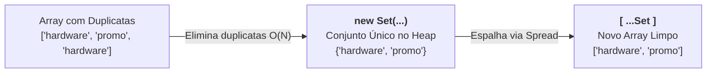

# 21. Coleções Nativas: Set e Map

Ao longo deste módulo, utilizamos amplamente as duas estruturas de dados mais
tradicionais do JavaScript: [Objetos Literais](05-objetos-literais.md) para
modelar registros com pares chave-valor e [Arrays](15-arrays.md) para gerenciar
sequências ordenadas de dados.

No entanto, à medida que construímos aplicações reais na Web, nos deparamos com
desafios específicos de modelagem e performance:

1. **Garantia de Unicidade:** Como manter uma coleção de dados onde elementos
   duplicados são proibidos ou eliminados instantaneamente?
2. **Chaves Dinâmicas Não-Texto:** Como criar dicionários onde as chaves de
   busca possam ser números, símbolos ou até objetos inteiros (como elementos do
   DOM ou instâncias de entidades), sem que o JavaScript as converta
   forçadamente para texto?

Para suprir essas necessidades com máxima eficiência algorítmica
($\mathcal{O}(1)$), o JavaScript moderno introduziu duas coleções nativas
fundamentais: **`Set<T>`** e **`Map<K, V>`**.

Neste capítulo, você aprenderá a manipular conjuntos de valores únicos, criar
mapas de dados com qualquer tipo de chave e dominar os critérios arquiteturais
para escolher entre arrays, objetos, sets e maps.

## A Dor dos Arrays Duplicados e das Chaves de Objetos

Vejamos na prática os dois gargalos que motivaram a criação de `Set` e `Map`.

### 1. O Problema da Desduplicação em Arrays

Imagine que sua aplicação precisa coletar todas as tags de produtos selecionados
pelo usuário em um catálogo e remover as duplicatas:

```typescript
const rawTags: string[] = ["hardware", "promo", "hardware", "setup", "promo"];

// ❌ ABORDAGEM PROBLEMÁTICA: Desduplicação manual com filter + indexOf
const uniqueTags = rawTags.filter((tag, index) => {
  return rawTags.indexOf(tag) === index;
});

console.log(uniqueTags); // ['hardware', 'promo', 'setup']
```

Embora produza o resultado correto, o código acima possui um grave problema de
performance: para cada elemento da lista, o método `indexOf()` percorre o array
novamente desde o início. Essa operação possui complexidade **quadrática
($\mathcal{O}(N^2)$)** — tornando o processamento extremamente lento em listas
com milhares de itens.

### 2. A Limitação de Chaves em Objetos Literais

Objetos JavaScript tradicionais (`{}`) foram projetados para representar
registros fixos, e não dicionários genéricos de dados. Por especificação,
**todas as chaves de um objeto comum são forçadamente convertidas para `string`
ou `symbol`**:

```typescript
type User = { id: string; name: string };

const userAlice: User = { id: "U1", name: "Alice" };
const userBob: User = { id: "U2", name: "Bob" };

// Tentativa de criar um mapa usando objetos de usuário como chave:
const userRoles: Record<string, string> = {};

userRoles[userAlice as any] = "admin";
userRoles[userBob as any] = "editor";

// ❌ COLISÃO DE CHAVES CATASTRÓFICA:
console.log(userRoles);
// Saída: { '[object Object]': 'editor' }
```

Como o objeto literal converteu tanto `userAlice` quanto `userBob` para a string
`"[object Object]"`, a segunda atribuição sobrescreveu a primeira
silenciosamente!

O `Set` e o `Map` foram criados para eliminar esses dois problemas de forma
nativa e elegante.

## `Set<T>`: Coleção de Valores Únicos

O **`Set`** é uma coleção de valores onde **nenhum elemento pode se repetir**.
Se você tentar adicionar um item que já existe no conjunto, a operação é
simplesmente ignorada sem gerar erros.

A busca, inserção e remoção em um `Set` operam em tempo constante médio
(**$\mathcal{O}(1)$**), sendo infinitamente mais rápidas do que operações
equivalentes em arrays.

### Sintaxe e Métodos Essenciais do `Set`

```typescript
// 1. Instanciação tipada
const allowedRoles = new Set<string>();

// 2. Adicionando elementos (.add) - Suporta encadeamento fluente!
allowedRoles.add("admin").add("editor").add("author");

// Tentativa de duplicata: é ignorada silenciosamente
allowedRoles.add("admin");

// 3. Verificando existência (.has) em tempo O(1)
console.log(allowedRoles.has("admin")); // true
console.log(allowedRoles.has("viewer")); // false

// 4. Consultando o total de itens (.size)
console.log(allowedRoles.size); // 3

// 5. Removendo um elemento (.delete)
allowedRoles.delete("author");
console.log(allowedRoles.size); // 2

// 6. Limpando todos os itens (.clear)
// allowedRoles.clear();
```

### O Padrão Moderno de Desduplicação de Arrays

Combinando o construtor do `Set` com o [Operador
Spread](18-operadores-rest-e-spread.md) (`...`), podemos desduplicar qualquer
array em uma **única linha declarativa e de alta performance
($\mathcal{O}(N)$)**:

```typescript
const productTags: string[] = [
  "hardware",
  "promo",
  "hardware",
  "setup",
  "promo",
];

// ✅ Padrão idiomático da indústria: Array -> Set (remove duplicatas) -> Array
const cleanTags: string[] = [...new Set(productTags)];

console.log(cleanTags); // ['hardware', 'promo', 'setup']
```



### Atenção: Igualdade por Valor vs. Igualdade por Referência no `Set`

Para dados primitivos (`string`, `number`, `boolean`), o `Set` compara os
valores diretamente. Porém, para **objetos e arrays**, o `Set` avalia a
**referência de memória na Heap** ([Capítulo
06](06-tipos-por-referencia-e-memoria.md)):

```typescript
type Position = { x: number; y: number };

const points = new Set<Position>();

const p1: Position = { x: 10, y: 20 };
const p2: Position = { x: 10, y: 20 }; // Objeto diferente na Heap!

points.add(p1);
points.add(p2);

// ⚠️ ATENÇÃO: p1 e p2 possuem o mesmo conteúdo, mas endereços distintos na Heap!
console.log(points.size); // 2

// Já adicionar a mesma referência é bloqueado corretamente:
points.add(p1);
console.log(points.size); // 2
```

## `Map<K, V>`: Dicionários Chave-Valor Tipados

O **`Map`** é uma coleção de pares chave-valor onde **as chaves podem ser de
qualquer tipo** (primitivos, funções, objetos ou arrays).

Diferente de objetos literais comuns, o `Map` preserva rigorosamente a **ordem
de inserção** das chaves e possui métodos dedicados para consulta, contagem e
iteração.

### Sintaxe e Métodos Essenciais do `Map`

```typescript
type SessionData = {
  ip: string;
  loginTimestamp: number;
};

// 1. Instanciação com tipos de chave (K) e valor (V)
const userSessions = new Map<string, SessionData>();

// 2. Inserindo dados (.set) - Suporta encadeamento
userSessions.set("usr_101", { ip: "192.168.1.1", loginTimestamp: Date.now() });
userSessions.set("usr_102", { ip: "10.0.0.42", loginTimestamp: Date.now() });

// 3. Recuperando dados (.get) - Retorna V | undefined
const session = userSessions.get("usr_101");
if (session !== undefined) {
  console.log(`IP do usuário: ${session.ip}`);
}

// 4. Verificando existência (.has) e tamanho (.size)
console.log(userSessions.has("usr_102")); // true
console.log(userSessions.size); // 2

// 5. Deletando chave (.delete)
userSessions.delete("usr_102");
```

### Usando Objetos Inteiros como Chaves

A capacidade mais poderosa do `Map` é permitir que **entidades complexas sirvam
de chave**, sem qualquer risco de colisão por conversão de string:

```typescript
type UserEntity = { id: string; name: string };
type UserMetadata = { accessCount: number; lastAction: string };

const alice: UserEntity = { id: "U1", name: "Alice" };
const bob: UserEntity = { id: "U2", name: "Bob" };

// Chave: Objeto UserEntity | Valor: Objeto UserMetadata
const activeMetadata = new Map<UserEntity, UserMetadata>();

activeMetadata.set(alice, { accessCount: 12, lastAction: "checkout" });
activeMetadata.set(bob, { accessCount: 3, lastAction: "view_item" });

// ✅ Consulta exata pela referência de memória do objeto:
const aliceInfo = activeMetadata.get(alice);
console.log(aliceInfo?.lastAction); // 'checkout'

console.log(activeMetadata.size); // 2 (sem nenhuma colisão!)
```

### Iterando sobre `Map` e `Set`

Tanto o `Set` quanto o `Map` são iteráveis nativos e funcionam perfeitamente com
o laço `for..of` e [Desestruturação](17-desestruturacao-de-arrays-e-objetos.md):

```typescript
// Iterando sobre pares [chave, valor] de um Map com desestruturação
for (const [user, metadata] of activeMetadata) {
  console.log(`${user.name} realizou a ação: ${metadata.lastAction}`);
}

// Iterando diretamente sobre valores de um Set
for (const role of allowedRoles) {
  console.log(`Permissão ativa: ${role}`);
}
```

## Resumo Comparativo: Coleções na Web Moderna

### 1. `Array<T>` vs. `Set<T>`

| Critério                | `Array<T>`                                       | `Set<T>`                                              |
| :---------------------- | :----------------------------------------------- | :---------------------------------------------------- |
| **Duplicatas**          | Permite elementos duplicados                     | **Proíbe duplicatas** (apenas valores únicos)         |
| **Acesso a Itens**      | Acesso posicional por índice numérico (`arr[0]`) | Verificação de pertencimento rápida (`set.has(item)`) |
| **Busca de Existência** | Linear ($\mathcal{O}(N)$ com `.includes()`)      | **Tempo Constante ($\mathcal{O}(1)$)**                |
| **Uso Recomendado**     | Listas ordenadas, feeds, tabelas, transformações | Tags, IDs únicos, listas de permissões, desduplicação |

### 2. `Objeto Literal {}` vs. `Map<K, V>`

| Critério                           | Objeto Literal `{}`                                     | `Map<K, V>`                                            |
| :--------------------------------- | :------------------------------------------------------ | :----------------------------------------------------- |
| **Tipos de Chave Permitidos**      | Estritamente `string` ou `symbol`                       | **Qualquer tipo** (objetos, funções, números, strings) |
| **Ordem das Chaves**               | Não estritamente garantida em todos os cenários         | **Garantia estrita** da ordem de inserção              |
| **Tamanho da Coleção**             | Manual via `Object.keys(obj).length` ($\mathcal{O}(N)$) | Direto e instantâneo via `.size` ($\mathcal{O}(1)$)    |
| **Performance (Inserção/Remoção)** | Não otimizado para adições/remoções frequentes          | **Altamente otimizado** para mutações constantes       |
| **Uso Recomendado**                | Modelagem de DTOs, entidades fixas, JSON de APIs        | Dicionários dinâmicos, caches, associação de metadados |

## O Que Vem a Seguir?

Com o encerramento deste capítulo, concluímos com sucesso o **Bloco 3: Coleções
& Padrões Modernos**. Ao longo desta jornada, você dominou a manipulação
imutável de arrays, tuplas, desestruturação, operadores _rest_ e _spread_, o
poder expressivo dos métodos funcionais (`map`, `filter`, `reduce`), a mecânica
de encapsulamento com _closures_ e a performance de coleções nativas como `Set`
e `Map`.

No próximo bloco, entraremos em uma das áreas mais poderosas e elegantes do
TypeScript: **Bloco 4: Tipagem Avançada & Contratos**.

Iniciaremos pelo **[Capítulo 22: Interfaces](22-interfaces.md)**, onde você
aprenderá a definir contratos formais de dados, criar hierarquias com
`extends` e comparar as diferenças práticas e de uso entre `interface` e `type
alias` na Web moderna.

---

<a href="20-closures-e-fabricas-de-funcoes.md">← Closures e Fábricas de
Funções</a>

<p align="right"><a href="22-interfaces.md">Próximo: Interfaces →</a></p>
