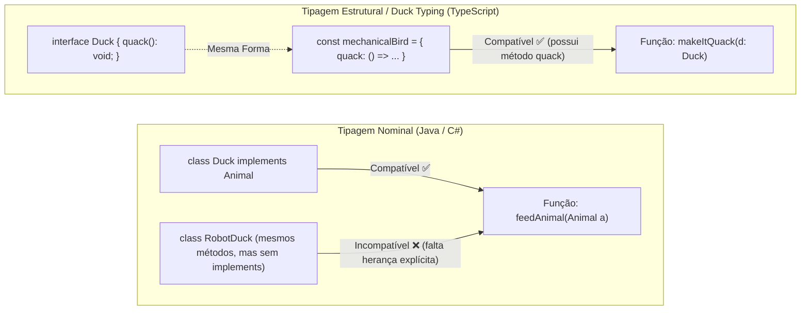

# 22. Type vs Interface e Duck Typing

No [Capítulo 07](07-type-aliases.md), aprendemos a criar apelidos de tipos
utilizando a palavra-chave `type` para reaproveitar estruturas de dados e evitar
repetição. À medida que nossas aplicações crescem, lidamos com múltiplos
módulos, integrações com APIs e bibliotecas externas, tornando fundamental o uso
de **contratos formais de dados**.

No ecossistema TypeScript, existem duas ferramentas principais para definir a
forma (_shape_) de um objeto: **`type` (Type Alias)** e **`interface`**.

Neste capítulo, você compreenderá as diferenças fundamentais entre `type` e
`interface`, aprenderá a estender contratos e dominará o conceito mais
revolucionário do sistema de tipos do TypeScript: a **Tipagem Estrutural (_Duck
Typing_)**.

## `interface`: Definindo Contratos de Dados

Uma **`interface`** é uma estrutura sintática do TypeScript dedicada a definir a
forma de objetos. Ela atua como um **contrato formal**: qualquer objeto que
afirme seguir a interface deve implementar rigorosamente as propriedades e
métodos nela descritos.

```typescript
// Declaração de uma interface de usuário
interface User {
  readonly id: string; // Imutável após criação
  name: string;
  email: string;
  age?: number; // Opcional (number | undefined)
}

// Objeto que atende ao contrato:
const userAlice: User = {
  id: "usr_01",
  name: "Alice",
  email: "alice@example.com",
};

// ❌ Tentativa de alterar propriedade somente leitura:
// userAlice.id = "usr_99"; // Erro: Cannot assign to 'id' because it is a read-only property.
```

### Assinaturas de Métodos em Interfaces

Interfaces também podem descrever o comportamento de funções e métodos
pertencentes a um objeto:

```typescript
interface Logger {
  log(message: string): void;
  formatTimestamp?(date: Date): string; // Método opcional
}

const consoleLogger: Logger = {
  log(message: string) {
    console.log(`[LOG]: ${message}`);
  },
};

consoleLogger.log("Aplicação iniciada com sucesso.");
```

## Extensão de Contratos com `extends`

Uma das maiores vantagens das interfaces é a capacidade de compor e especializar
contratos por meio da palavra-chave **`extends`**. Isso permite criar
hierarquias limpas sem duplicar código:

```typescript
// Interface base
interface Product {
  id: string;
  title: string;
  price: number;
}

// Interface especializada (herda todos os campos de Product e adiciona novos)
interface DigitalCourse extends Product {
  instructor: string;
  durationHours: number;
  downloadUrl: string;
}

const webCourse: DigitalCourse = {
  id: "crs_web_01",
  title: "Desenvolvimento Web com TypeScript",
  price: 0,
  instructor: "FATEC",
  durationHours: 80,
  downloadUrl: "https://fatec.sp.gov.br/cursos/web",
};
```

### Múltipla Extensão de Interfaces

Uma interface pode herdar propriedades de **múltiplas interfaces** ao mesmo
tempo, bastando separá-las por vírgula:

```typescript
interface Identifiable {
  id: string;
}

interface Auditable {
  createdAt: Date;
  updatedAt: Date;
}

// Compondo um contrato robusto a partir de pequenas partes:
interface CustomerOrder extends Identifiable, Auditable {
  totalAmount: number;
  itemsCount: number;
}
```

## O Paradigma da Tipagem Estrutural (_Duck Typing_)

Se você tem experiência com linguagens orientadas a objetos clássicas como
**Java, C# ou C++**, está acostumado com a **Tipagem Nominal**. Na tipagem
nominal, dois tipos só são compatíveis se compartilharem explicitamente o mesmo
nome ou hierarquia de herança (`implements` ou `extends`).

O TypeScript opera sob um paradigma completamente diferente: a **Tipagem
Estrutural** (popularmente conhecida no meio dinâmico como **_Duck Typing_**).

> _"Se anda como um pato, nada como um pato e voa como um pato, então para todos
> os efeitos práticos, é um pato."_

Na tipagem estrutural, o TypeScript **não se importa com o nome do tipo** ou com
a declaração explícita de quem o implementou. O compilador analisa
exclusivamente se a **estrutura interna (as propriedades e seus tipos)** é
compatível.



### Demonstração Prática de Tipagem Estrutural

Observe o código a seguir. Note que o objeto `customerDto` nunca foi declarado
explicitamente com o tipo `ReceiptCustomer`:

```typescript
interface ReceiptCustomer {
  name: string;
  email: string;
}

function sendReceiptEmail(customer: ReceiptCustomer): void {
  console.log(`Enviando recibo para ${customer.name} (${customer.email})...`);
}

// Objeto vindo de um banco de dados ou formulário:
const externalUserData = {
  id: "usr_998",
  name: "Carlos Silva",
  email: "carlos@empresa.com",
  role: "customer",
  createdAt: new Date(),
};

// ✅ VÁLIDO! externalUserData tem 'name' e 'email' do tipo string.
// O TypeScript aceita o objeto porque ele atende ao contrato exigido!
sendReceiptEmail(externalUserData);
```

Mesmo que `externalUserData` contenha campos extras (`id`, `role`, `createdAt`),
ele satisfaz todos os requisitos mínimos de `ReceiptCustomer`. Portanto, a
chamada é 100% segura.

## Checagem de Propriedades Excessivas (_Excess Property Checks_)

Ao estudar a tipagem estrutural, surge uma dúvida frequente entre
desenvolvedores iniciantes: se o TypeScript aceita campos extras em variáveis,
por que o código abaixo gera erro?

```typescript
interface Config {
  host: string;
  port: number;
}

function startServer(config: Config) {
  console.log(`Iniciando servidor em ${config.host}:${config.port}`);
}

// ❌ ERRO DE COMPILAÇÃO:
startServer({
  host: "localhost",
  port: 8080,
  timeout: 5000, // Erro: Object literal may only specify known properties, and 'timeout' does not exist in type 'Config'.
});
```

### Por que isso acontece?

O TypeScript possui uma proteção especial chamada **Checagem de Propriedades
Excessivas** (_Excess Property Checking_), aplicada **exclusivamente a objetos
literais passados diretamente**:

1. **Objeto Literal Imediato (`startServer({ ... })`):** Como você está criando
   o objeto diretamente na chamada da função, passar uma propriedade que não
   existe no contrato quase certamente é um **erro de digitação (typo)** ou
   mal-entendido sobre a API. Por isso, o compilador bloqueia a operação.
2. **Objeto Atribuído a uma Variável:** Se o objeto já existe em uma variável
   (`const configData = { ... }`), ele pode ter vindo de outra fonte de dados
   maior. O compilador aplica a regra pura da tipagem estrutural e aceita a
   passagem.

```typescript
// ✅ Solução 1: Criar a variável intermediária (quando campos extras são intencionais)
const serverOptions = {
  host: "localhost",
  port: 8080,
  timeout: 5000,
};
startServer(serverOptions); // Válido!

// ✅ Solução 2: Atualizar o contrato se a propriedade realmente fizer parte da configuração
interface AdvancedConfig {
  host: string;
  port: number;
  timeout?: number; // Propriedade opcional
}
```

## `type` vs. `interface`: Qual Devo Usar?

Ambas as abordagens são extremamente poderosas e, para a modelagem básica de
objetos, produzem resultados praticamente idênticos:

```typescript
// Com Type Alias:
type PointType = {
  x: number;
  y: number;
};

// Com Interface:
interface PointInterface {
  x: number;
  y: number;
}
```

No entanto, existem diferenças arquiteturais cruciais entre elas:

### Tabela Comparativa Completa

| Recurso / Capacidade                  | `interface`                                       | `type` (Type Alias)                                |
| :------------------------------------ | :------------------------------------------------ | :------------------------------------------------- |
| **Modelagem de Objetos e Métodos**    | Sim (`interface User { ... }`)                    | Sim (`type User = { ... }`)                        |
| **Extensão de Contratos**             | Nativa com `extends`                              | Via Interseção (`&`)                               |
| **Tipos Primitivos e Apelidos**       | ❌ Não permitido                                  | ✅ Sim (`type ID = string \| number`)              |
| **Tipos de União (Unions `\|`)**      | ❌ Não permitido                                  | ✅ Sim (`type Status = "open" \| "closed"`)        |
| **Tuplas**                            | ❌ Não nativo                                     | ✅ Sim (`type Coord = [number, number]`)           |
| **Mesclagem (_Declaration Merging_)** | ✅ Sim (duas interfaces com mesmo nome se fundem) | ❌ Não (gera erro de identificador duplicado)      |
| **Mensagens de Erro e Performance**   | Geralmente mais rápidas e com nomes limpos        | Tipos complexos e anônimos podem ser mais verbosos |

### 💡 Regra Prática da Indústria

Para manter seu código limpo e padronizado:

1. **Use `interface` por padrão para modelar entidades, DTOs, objetos e
   contratos públicos** de APIs ou bibliotecas. A sintaxe com `extends` é mais
   legível e a performance de compilação do TypeScript é otimizada para
   interfaces com nome.
2. **Use `type` para Uniões (`|`), Interseções (`&`), Tipos Primitivos, Tuplas,
   Tipos Utilitários e Funções Complexas**.

<details>
<summary>🔍 <b>Aprofundamento: Declaration Merging (Mesclagem de Declarações)</b></summary>

Um comportamento exclusivo das `interfaces` no TypeScript é o **_Declaration
Merging_**. Se você declarar duas interfaces com exatamente o mesmo nome no
mesmo escopo, o compilador não acusará erro; ele **fundirá automaticamente** as
propriedades de ambas em um único contrato:

```typescript
interface CartItem {
  id: string;
  name: string;
  price: number;
}

// Em outro arquivo ou linha posterior do mesmo módulo:
interface CartItem {
  quantity: number; // Propriedade mesclada!
}

// O tipo final exigirá os quatro campos:
const item: CartItem = {
  id: "P1",
  name: "Teclado Mecânico",
  price: 250,
  quantity: 2,
};
```

#### Quando isso é útil na prática?

Esse recurso é muito utilizado ao **estender bibliotecas de terceiros ou tipos
globais do navegador**. Por exemplo, para adicionar uma variável customizada ao
objeto global `window` ou adicionar dados de autenticação ao objeto `Request` do
Express sem modificar o código original da biblioteca:

```typescript
// Estendendo a interface global Window do TypeScript:
interface Window {
  myAnalyticsToken?: string;
}

// Agora podemos acessar sem erro de compilação:
window.myAnalyticsToken = "token_fatec_xyz";
```

Como o `type` gera erro de declaração duplicada (`Duplicate identifier
'CartItem'`), ele não suporta _declaration merging_, sendo mais seguro contra
alterações acidentais de contratos já definidos.

</details>

## O Que Vem a Seguir?

Agora que você compreende a fundo como construir contratos formais com
`interface` e `type` e como o TypeScript avalia objetos por sua estrutura (_Duck
Typing_), estamos prontos para explorar a modelagem avançada de dados.

No **[Capítulo 23: Uniões Literais e Discriminated
Unions](23-unioes-literais-e-discriminated-unions.md)**, aprenderemos a combinar
tipos com operadores de união (`|`) e interseção (`&`), restringir valores com
tipos literais e construir máquinas de estado infalíveis utilizando o padrão de
**Uniões Discriminadas**.

---

<a href="21-colecoes-set-e-map.md">← Coleções Nativas: Set e Map</a>

<p align="right"><a href="23-unioes-literais-e-discriminated-unions.md">Próximo: Uniões Literais e Discriminated Unions →</a></p>
