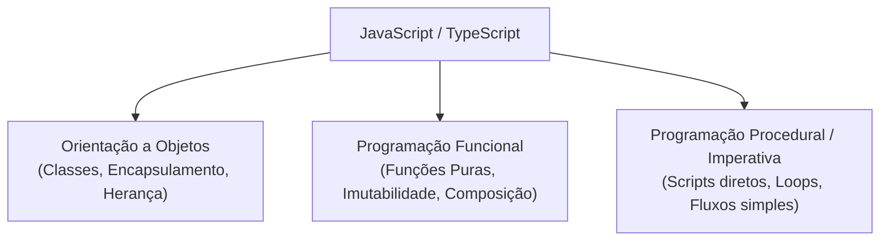

# 29. O Paradigma Orientado a Objetos na Web

Ao iniciar os estudos de TypeScript vindo de linguagens como Java, C# ou C++, é
muito comum presumir que o desenvolvimento Web moderno é estritamente orientado
a objetos e que todo o código deve ser encapsulado em classes.

No entanto, o ecossistema JavaScript e TypeScript possui uma história e uma
dinâmica únicas. Compreender **quando**, **por que** e **onde** a Orientação a
Objetos (OO) se encaixa na Web moderna é essencial para escrever código
elegante, performático e alinhado com o que o mercado realmente pratica.

Neste capítulo, vamos alinhar o modelo mental sobre OO na Web antes de
mergulharmos na sintaxe técnica de classes, modificadores de acesso e herança.

## A Natureza Multiparadigma do JavaScript e TypeScript

JavaScript não nasceu como uma linguagem puramente orientada a objetos nem
puramente funcional. Ele é uma linguagem **multiparadigma**:



Na prática do desenvolvimento Web moderno, os paradigmas convivem em perfeita
harmonia, mas com papéis bem delimitados:

- **Frontend Moderno (React, Vue, Svelte):** É fortemente inclinado ao paradigma
  **funcional e declarativo**. A interface é renderizada como o resultado de
  funções puras (`UI = f(state)`), utilizando _Hooks_, imutabilidade e métodos
  de array (`.map()`, `.filter()`, `.reduce()`).
- **Backend e Arquitetura de Domínio (NestJS, DDD, APIs corporativas):** Utiliza
  intensamente **Orientação a Objetos** para organizar regras de negócio
  complexas, injeção de dependências e entidades de banco de dados.

## A Evolução Histórica: Dos Protótipos ao Açúcar Sintático

Para entender as classes no TypeScript, precisamos olhar brevemente para o
passado do JavaScript.

### 1. O Modelo Original de Protótipos (1995–2014)

Originalmente, o JavaScript não possuía a palavra-chave `class`. A linguagem
utilizava um modelo chamado **Herança Baseada em Protótipos** (_Prototype-based
Inheritance_).

Em vez de instanciar moldes formais (classes), objetos herdavam propriedades e
métodos diretamente de outros objetos por meio de uma cadeia de delegação
(_prototype chain_).

Para criar "privacidade" e encapsulamento, desenvolvedores usavam **closures**
(funções fábrica):

```typescript
// 📜 Como encapsulávamos estado antes do ES6 (Factory Functions + Closures):
function createCounter() {
  let count = 0; // Variável privada retida pelo escopo léxico (closure)

  return {
    increment() {
      count++;
      return count;
    },
    getValue() {
      return count;
    },
  };
}

const counter = createCounter();
console.log(counter.increment()); // 1
// console.log(counter.count);    // undefined (inacessível externamente)
```

### 2. A Chegada do ECMAScript 2015 (ES6) e as Classes

Com a evolução das aplicações Web e a necessidade de padronização para equipes
acostumadas com linguagens corporativas (Java, C#, C++), o ES6 introduziu a
palavra-chave `class`.

> **Açúcar Sintático (_Syntactic Sugar_):** No JavaScript, as classes não
> criaram um novo modelo de execução. Por baixo dos panos, a instrução `class`
> continua gerando funções construtoras e vinculando métodos ao `prototype` do
> objeto. O TypeScript adiciona sobre essa estrutura uma camada poderosa de
> checagem estática de tipos.

<details>
<summary>🔍 <b>Aprofundamento: Como a Cadeia de Protótipos funciona por baixo dos panos</b></summary>

Quando você acessa `user.login()`, o runtime do JavaScript executa os seguintes
passos:

1. Procura a propriedade `login` diretamente na instância `user`.
2. Se não encontrar, sobe um degrau e procura no protótipo do objeto
   (`Object.getPrototypeOf(user)`).
3. Se não encontrar, continua subindo na cadeia até chegar em
   `Object.prototype`.
4. Se atingir o topo (`null`) sem encontrar o método, lança um erro `TypeError:
user.login is not a function`.

A sintaxe `class` modernizou a escrita desse mecanismo, tornando o código
infinitamente mais legível e padronizado:

```typescript
// Sintaxe moderna com class (açúcar sintático sobre o protótipo):
class User {
  login(): void {
    console.log("Usuário autenticado.");
  }
}
```

</details>

## Onde as Classes Brilham no Ecossistema Moderno

Longe de ser uma tecnologia obsoleta, a Orientação a Objetos é fundamental em
diversos cenários críticos do desenvolvimento Web:

### 1. Frameworks de Backend com Injeção de Dependência (ex: NestJS)

No ecossistema de servidores, classes fornecem a estrutura ideal para
gerenciamento de ciclo de vida e **Injeção de Dependências** (_Dependency
Injection_):

```typescript
// 🏛️ Exemplo de Serviço em Backend estruturado com Classes:
export class UserService {
  constructor(private readonly userRepository: UserRepository) {}

  async findActiveUsers(): Promise<User[]> {
    return this.userRepository.findAll({ active: true });
  }
}
```

### 2. Modelagem de Domínio Rica (Domain-Driven Design - DDD)

Quando uma entidade de negócio possui regras complexas e não pode transitar em
estado inválido, classes permitem encapsular dados e comportamentos garantindo a
integridade dos invariantes:

```typescript
// 🛡️ Entidade de Domínio protegendo invariantes de negócio:
export class BankAccount {
  private balance: number;

  constructor(initialBalance: number) {
    if (initialBalance < 0) {
      throw new Error("Saldo inicial não pode ser negativo.");
    }
    this.balance = initialBalance;
  }

  withdraw(amount: number): void {
    if (amount <= 0) {
      throw new Error("Valor de saque deve ser positivo.");
    }
    if (amount > this.balance) {
      throw new Error("Saldo insuficiente.");
    }
    this.balance -= amount;
  }

  getBalance(): number {
    return this.balance;
  }
}
```

### 3. Hierarquias de Erros Customizados

Estender a classe nativa `Error` é a forma padrão de criar exceções semânticas
na aplicação:

```typescript
// ⚠️ Erros customizados facilitam o tratamento no bloco catch:
export class NotFoundError extends Error {
  public readonly statusCode = 404;

  constructor(resource: string) {
    super(`${resource} não foi encontrado.`);
    this.name = "NotFoundError";
  }
}

// No manipulador de erros:
// if (error instanceof NotFoundError) { ... }
```

### 4. Clientes com Estado, Conexões e SDKs

Gerenciar conexões ativas (como WebSockets, conexões com bancos de dados ou SDKs
de terceiros) exige manter estado interno e métodos de controle de ciclo de vida
(`connect`, `disconnect`, `retry`):

```typescript
// 🔌 Cliente WebSocket gerenciando conexão ativa:
export class WebSocketClient {
  private socket: WebSocket | null = null;
  private isConnected: boolean = false;

  connect(url: string): void {
    // Inicia conexão e monitora eventos
    this.isConnected = true;
  }

  disconnect(): void {
    // Encerra conexão e limpa listeners
    this.isConnected = false;
  }
}
```

## Onde Classes Costumam Ser Evitadas

No desenvolvimento TypeScript moderno, nem tudo precisa (ou deve) ser uma
classe. Existem contextos onde estruturas mais leves são preferidas:

| Cenário                           | Abordagem Recomendada                      | Por quê?                                                                                                    |
| :-------------------------------- | :----------------------------------------- | :---------------------------------------------------------------------------------------------------------- |
| **Transferência de Dados (DTOs)** | `interface` ou `type` com objetos literais | Mais leves, sem overhead de instanciação e serializáveis nativamente para JSON com `JSON.stringify()`.      |
| **Transformadores de Dados**      | Funções utilitárias puras                  | Mais fáceis de testar em isolamento e permitem _tree shaking_ eficiente pelos empacotadores (Vite/Webpack). |
| **Componentes de Frontend**       | Componentes Funcionais + _Hooks_           | Padrão dominante no React/Vue moderno, simplificando a composição de estado e efeitos colaterais.           |

```typescript
// ❌ Evite criar classes apenas para agrupar funções sem estado interno:
class MathOperations {
  static sum(a: number, b: number): number {
    return a + b;
  }
}

// ✅ Prefira funções puras e módulos simples:
export function sum(a: number, b: number): number {
  return a + b;
}
```

## Princípio Fundamental: Composição sobre Herança

Um dos conceitos mais valiosos que você aprenderá neste módulo é o princípio de
**Composição sobre Herança** (_Composition over Inheritance_).

Em linguagens orientadas a objetos clássicas, é tentador resolver qualquer reuso
de código criando cadeias profundas de herança (`Animal` $\rightarrow$ `Mammal`
$\rightarrow$ `Dog` $\rightarrow$ `Labrador`). Na Web, esse modelo
frequentemente resulta em código rígido e difícil de refatorar.

Em TypeScript, preferimos compor comportamentos e capacidades utilizando
interfaces e pequenas funções reutilizáveis:

```typescript
// 🧱 Em vez de heranças rígidas, compomos capacidades:
interface Logger {
  log(message: string): void;
}

interface PaymentGateway {
  charge(amount: number): Promise<boolean>;
}

// O serviço de checkout COMPÕE o logger e o gateway, sem herdar de nenhum deles:
export class CheckoutService {
  constructor(
    private readonly logger: Logger,
    private readonly gateway: PaymentGateway,
  ) {}

  async processOrder(amount: number): Promise<void> {
    this.logger.log(`Iniciando cobrança de R$ ${amount}...`);
    await this.gateway.charge(amount);
  }
}
```

Essa separação torna o código desacoplado, extensível e incrivelmente simples de
testar utilizando _mocks_ e _stubs_.

## O Que Vem a Seguir?

Com o modelo mental e as decisões arquiteturais alinhadas, estamos prontos para
estudar a sintaxe e os recursos práticos de classes no TypeScript.

No **[Capítulo 30: Classes](30-classes.md)**, vamos aprender a declarar classes,
propriedades, métodos, construtores tradicionais e o elegante atalho de
parâmetros do TypeScript, além de implementar contratos formais com
`implements`.

---

<a href="28-sistema-de-modulos.md">← Sistema de Módulos</a>

<p align="right"><a href="30-classes.md">Próximo: Classes →</a></p>
