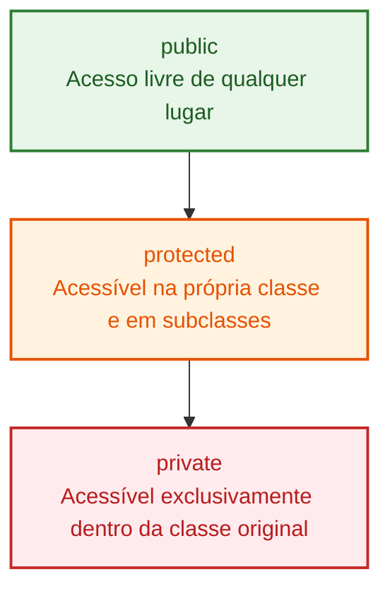

# 31. Modificadores

No capítulo anterior, aprendemos a criar classes, instanciar objetos e utilizar
construtores. No entanto, quando todas as propriedades de uma classe ficam
livres para leitura e alteração direta por qualquer parte do sistema, surge um
dos problemas mais graves da programação: a **quebra de integridade do estado**.
Além disso, a inicialização manual de cada propriedade pode gerar um código
excessivamente repetitivo.

Neste capítulo, você aprenderá a dominar os **Modificadores** do TypeScript e do
JavaScript moderno: modificadores de visibilidade (`public`, `private`,
`protected`), imutabilidade (`readonly`), membros estáticos (`static`), campos
privados nativos (`#`), métodos de acesso (_Getters_ e _Setters_) e o poderoso
atalho de **_Parameter Properties_**.

## A Dor do Estado Desprotegido

Imagine uma aplicação financeira gerenciando contas bancárias. Uma conta possui
um saldo (`balance`), um titular (`holder`) e um identificador (`id`).

Se deixarmos essas propriedades expostas sem nenhuma restrição, qualquer função
externa pode alterar os valores de maneira arbitrária, ignorando as regras de
negócio:

```typescript
// ❌ EVITE: Propriedades abertas sem proteção e sem controle de integridade
export class VulnerableBankAccount {
  id: string;
  holder: string;
  balance: number;

  constructor(id: string, holder: string, initialBalance: number) {
    this.id = id;
    this.holder = holder;
    this.balance = initialBalance;
  }

  deposit(amount: number): void {
    if (amount <= 0) {
      throw new Error("O valor de depósito deve ser positivo.");
    }
    this.balance += amount;
  }
}

const account = new VulnerableBankAccount("acc-101", "Lucas Ferreira", 500);

// Um código em outro ponto da aplicação altera diretamente o saldo:
account.balance = -999999; // 💥 O saldo ficou negativo sem passar por nenhuma validação!
account.id = "acc-999"; // 💥 O identificador imutável da conta foi adulterado!
```

No exemplo acima, a classe `VulnerableBankAccount` tem um método `deposit` com
validação, mas isso não impede que outro desenvolvedor acesse e modifique a
propriedade `balance` diretamente.

Em engenharia de software, chamamos as regras que um objeto deve sempre obedecer
de **invariantes de negócio**. O encapsulamento é a técnica de isolar o estado
interno do objeto, garantindo que suas invariantes jamais sejam violadas.

## Os Modificadores de Acesso do TypeScript

O TypeScript oferece palavras-chave para controlar a visibilidade de membros
(propriedades e métodos) de uma classe:



### 1. `public` (Padrão)

Todo membro declarado sem modificador explícito é **`public`**. Ele pode ser
lido e chamado livremente de qualquer lugar (dentro da classe, por subclasses e
por código externo).

```typescript
export class UserProfile {
  public displayName: string; // 'public' explícito

  constructor(displayName: string) {
    this.displayName = displayName;
  }
}
```

> **Convenção:** Como `public` é o padrão implícito, a maioria dos times omite a
> palavra-chave em propriedades convencionais, reservando seu uso explícito em
> _Parameter Properties_ no construtor.

### 2. `private`

Membros marcados como **`private`** só podem ser acessados e modificados dentro
do corpo da própria classe onde foram declarados. Se qualquer código externo (ou
mesmo uma classe filha) tentar acessá-los, o compilador do TypeScript acusará um
erro estático imediatamente.

```typescript
export class SecureBankAccount {
  public readonly id: string;
  public holder: string;
  private balance: number; // 🔒 Acessível somente dentro de SecureBankAccount

  constructor(id: string, holder: string, initialBalance: number) {
    this.id = id;
    this.holder = holder;
    this.balance = initialBalance >= 0 ? initialBalance : 0;
  }

  public deposit(amount: number): void {
    if (amount <= 0) {
      throw new Error("O valor de depósito deve ser positivo.");
    }
    this.balance += amount;
  }

  public getBalance(): number {
    return this.balance; // Leitura permitida por meio de um método público
  }
}

const myAccount = new SecureBankAccount("acc-202", "Mariana Rios", 1000);
myAccount.deposit(250);

console.log(myAccount.getBalance()); // 1250

// ❌ Erro de compilação do TypeScript:
// Property 'balance' is private and only accessible within class 'SecureBankAccount'.
// myAccount.balance = 50000;
```

### 3. `protected`

Membros marcados como **`protected`** não podem ser acessados por instâncias
externas, mas **são herdados e visíveis por classes filhas** (_subclasses_ que
utilizam `extends`).

Veremos herança em detalhes no próximo capítulo, mas observe a intenção de
design:

```typescript
export class DatabaseConnection {
  protected connectionString: string; // Visível para esta classe e suas especializações

  constructor(connectionString: string) {
    this.connectionString = connectionString;
  }
}

export class PostgresConnection extends DatabaseConnection {
  public connect(): string {
    // ✅ Permitido: PostgresConnection é subclasse de DatabaseConnection
    return `Conectando ao PostgreSQL via ${this.connectionString}`;
  }
}

const db = new PostgresConnection("postgres://localhost:5432/app");
// ❌ Erro de compilação:
// Property 'connectionString' is protected and only accessible within class 'DatabaseConnection' and its subclasses.
// console.log(db.connectionString);
```

### 4. O Modificador `readonly`

Assim como vimos em objetos literais e tuplas, o modificador **`readonly`** pode
ser aplicado a propriedades de classes. Uma propriedade `readonly` só pode
receber valor na sua declaração ou dentro do `constructor`.

Após a inicialização do objeto, qualquer tentativa de reatribuição gera erro no
compilador:

```typescript
export class ServerConfig {
  public readonly port: number;
  public readonly host: string;

  constructor(port: number, host: string = "localhost") {
    this.port = port;
    this.host = host;
  }

  updatePort(newPort: number): void {
    // ❌ Erro de compilação: Cannot assign to 'port' because it is a read-only property.
    // this.port = newPort;
  }
}
```

## O Atalho do TypeScript: _Parameter Properties_

Em linguagens tradicionais como Java ou no JavaScript puro, criar uma classe com
várias propriedades costuma exigir uma repetição tripla e cansativa de código:

1. Declarar a propriedade no corpo da classe.
2. Declarar o parâmetro correspondente no construtor.
3. Fazer a atribuição manual `this.prop = prop;`.

```typescript
// ❌ Verboso (forma clássica com repetição tríplice):
class Product {
  title: string;
  price: number;
  readonly sku: string;

  constructor(title: string, price: number, sku: string) {
    this.title = title;
    this.price = price;
    this.sku = sku;
  }
}
```

O TypeScript resolve esse boilerplate com o recurso **_Parameter Properties_**
(Propriedades de Parâmetro). Quando você adiciona um modificador de visibilidade
(`public`, `private`, `protected` ou `readonly`) diretamente no parâmetro do
construtor, o compilador **declara a propriedade na classe e faz a atribuição
automaticamente**:

```typescript
// ✅ Conciso e Moderno (Parameter Properties do TypeScript):
export class Product {
  constructor(
    public title: string,
    public price: number,
    public readonly sku: string,
    private internalCost: number = 0,
    public inStock: boolean = true, // Suporta valores padrão normalmente!
  ) {
    // O TypeScript gera as propriedades e faz as atribuições por baixo dos panos!
  }

  public getProfitMargin(): number {
    return this.price - this.internalCost;
  }
}

const keyboard = new Product("Teclado Mecânico", 250, "KB-990", 120);
console.log(keyboard.title); // Teclado Mecânico
console.log(keyboard.sku); // KB-990
console.log(keyboard.getProfitMargin()); // 130
```

> No desenvolvimento corporativo moderno (especialmente em frameworks como
> NestJS e Angular), **_Parameter Properties_** é a sintaxe padrão da indústria
> para injeção de dependências e modelagem de entidades.

## `private` do TypeScript vs `#` Nativo do JavaScript

Existe uma nuance fundamental que todo desenvolvedor web precisa compreender:
**o modificador `private` do TypeScript existe apenas em tempo de compilação**.

Quando o código TypeScript é compilado para JavaScript puro, todos os
modificadores (`public`, `private`, `protected`) são **apagados** (_Type
Erasure_). No JavaScript resultante, a propriedade se torna uma propriedade
pública comum!

```typescript
// Código TypeScript:
class ApiClient {
  private apiKey: string = "segredo-123";
}

// Quando compilado para JavaScript clássico:
class ApiClient {
  constructor() {
    this.apiKey = "segredo-123"; // No runtime JS, 'apiKey' é uma propriedade normal!
  }
}
```

Se alguém consumir seu código em tempo de execução via JavaScript puro ou
utilizar `Object.keys()` / `for..in`, a propriedade `apiKey` estará visível e
acessível.

### Campos Privados Nativos (`#private`)

Para resolver essa limitação no próprio motor do JavaScript, o padrão ECMAScript
introduziu os **Private Identifiers**, identificados pelo prefixo de cerquilha
(`#`).

Diferente do `private` do TypeScript, propriedades declaradas com `#` possuem
**privacidade garantida em tempo de execução (_Hard Private_)**:

```typescript
export class SecureAuthService {
  public serviceName: string;
  #tokenSecret: string; // 🔒 Campo privado nativo do ECMAScript

  constructor(serviceName: string, tokenSecret: string) {
    this.serviceName = serviceName;
    this.#tokenSecret = tokenSecret;
  }

  public authenticate(token: string): boolean {
    return token === this.#tokenSecret;
  }
}

const auth = new SecureAuthService("OAuth2", "super-jwt-secret");

console.log(auth.serviceName); // "OAuth2"

// ❌ Erro de compilação TS E erro de sintaxe em tempo de execução JS:
// Property '#tokenSecret' is not accessible outside class 'SecureAuthService' because it has a private identifier.
// console.log(auth.#tokenSecret);

// Nem a inspeção dinâmica de chaves consegue enxergar o campo:
console.log(Object.keys(auth)); // [ 'serviceName' ]
```

### Qual Abordagem Escolher?

| Critério                             | `private` (TypeScript)                                                   | `#campo` (Nativo ECMAScript)                                                |
| :----------------------------------- | :----------------------------------------------------------------------- | :-------------------------------------------------------------------------- |
| **Garantia de Privacidade**          | Apenas em tempo de compilação (estática)                                 | Em compilação e em tempo de execução (_runtime_)                            |
| **Sintaxe com Parameter Properties** | Suportado (`constructor(private total: number)`)                         | Não suportado (deve ser declarado explicitamente no corpo da classe)        |
| **Performance e Emissão**            | Gera propriedades comuns sem overhead                                    | Usa mecânica nativa de `WeakMap`/Private Brand checks no runtime            |
| **Uso Recomendado**                  | Maioria das aplicações e frameworks web (NestJS, Angular, libs internas) | Código sensível (SDKs públicos, gerenciamento de tokens, segurança crítica) |

## Métodos de Acesso: Getters e Setters

Em muitas situações, queremos permitir que o código externo leia ou altere um
valor com a conveniência de acessar uma propriedade (`objeto.preco`), mas
precisamos executar validações ou transformações por baixo dos panos.

Para isso, o TypeScript e o JavaScript moderno oferecem as palavras-chave
**`get`** e **`set`**:

```typescript
export class Temperature {
  private _celsius: number;

  constructor(initialCelsius: number) {
    this._celsius = initialCelsius;
  }

  // Getter: expõe a leitura de 'celsius' como se fosse uma propriedade
  get celsius(): number {
    return this._celsius;
  }

  // Setter: intercepta a atribuição e valida a invariante
  set celsius(value: number) {
    if (value < -273.15) {
      throw new Error(
        "A temperatura não pode ser inferior ao zero absoluto (-273.15 °C).",
      );
    }
    this._celsius = value;
  }

  // Getter computado: calcula Fahrenheit em tempo real sem duplicar estado na memória
  get fahrenheit(): number {
    return (this._celsius * 9) / 5 + 32;
  }
}

const temp = new Temperature(25);

// Leitura via Getter (sem parênteses de função):
console.log(temp.celsius); // 25
console.log(temp.fahrenheit); // 77

// Atribuição via Setter:
temp.celsius = 30;
console.log(temp.fahrenheit); // 86

// Tentativa inválida:
// temp.celsius = -300; // 💥 Lança Erro: "A temperatura não pode ser inferior ao zero absoluto"
```

### Propriedades Somente Leitura com Getters

Se você declarar um método `get` **sem** o correspondente `set`, o TypeScript
automaticamente infere que essa propriedade é somente leitura (_read-only_):

```typescript
export class OrderItem {
  constructor(
    public readonly name: string,
    public readonly unitPrice: number,
    public readonly quantity: number,
  ) {}

  // Getter sem setter correspondente:
  get subtotal(): number {
    return this.unitPrice * this.quantity;
  }
}

const item = new OrderItem("SSD NVMe 1TB", 400, 2);
console.log(item.subtotal); // 800

// ❌ Erro do compilador:
// Cannot assign to 'subtotal' because it is a read-only property.
// item.subtotal = 900;
```

## Membros Estáticos (`static`)

Até agora, todas as propriedades e métodos que vimos pertencem a uma **instância
individual** da classe (são acessados via `this` a partir do objeto criado com
`new`).

No entanto, há situações em que uma propriedade ou função pertence à **classe em
si**, e não a um objeto específico. Nesses casos, usamos a palavra-chave
**`static`**.

### Casos de Uso Clássicos para `static`

1. **Constantes e Configurações Globais do Domínio:** Valores de referência que
   são idênticos para todas as instâncias.
2. **Funções Utilitárias e de Conversão:** Métodos que operam sobre dados sem
   precisar instanciar um objeto completo.
3. **Métodos Fábrica (_Factory Methods_):** Métodos que instanciam e devolvem
   objetos pré-configurados.

```typescript
export class CurrencyFormatter {
  // 1. Propriedade estática: constante compartilhada
  public static readonly DEFAULT_LOCALE: string = "pt-BR";
  public static readonly DEFAULT_CURRENCY: string = "BRL";

  // 2. Método estático utilitário:
  public static format(
    amount: number,
    currency: string = CurrencyFormatter.DEFAULT_CURRENCY,
  ): string {
    return new Intl.NumberFormat(CurrencyFormatter.DEFAULT_LOCALE, {
      style: "currency",
      currency: currency,
    }).format(amount);
  }
}

// Chamamos diretamente a partir do nome da classe, sem usar 'new':
console.log(CurrencyFormatter.format(1500.5)); // "R$ 1.500,50"
console.log(CurrencyFormatter.DEFAULT_LOCALE); // "pt-BR"
```

### Padrão Factory Method com Construtor Privado

Um padrão de design muito poderoso e comum na Web corporativa é a combinação de
**membros estáticos** com um **construtor privado**. Ao declarar o `constructor`
como `private`, você impede que o código externo use `new MinhaClasse(...)`
diretamente, forçando a criação a passar por **Métodos de Fábrica Estáticos**
(_Static Factory Methods_).

Esse padrão traz duas grandes vantagens pedagógicas e arquiteturais:

#### 1. Múltiplos Construtores Nomeados e Expressivos

No JavaScript e TypeScript, uma classe só pode ter uma única assinatura de
implementação para seu construtor. Métodos estáticos resolvem essa limitação,
permitindo criar **vários pontos de instanciação com nomes expressivos e
parâmetros diferentes**, deixando a intenção do código cristalina:

```typescript
export class UserAccount {
  public readonly id: string;
  public readonly role: "admin" | "customer" | "guest";
  public readonly email?: string;

  // Construtor fechado para o mundo externo:
  private constructor(
    id: string,
    role: "admin" | "customer" | "guest",
    email?: string,
  ) {
    this.id = id;
    this.role = role;
    this.email = email;
  }

  // Fábrica 1: Criação de visitante anônimo (sem email)
  public static createGuest(): UserAccount {
    const guestId = `guest-${Math.random().toString(36).substring(2, 9)}`;
    return new UserAccount(guestId, "guest");
  }

  // Fábrica 2: Criação de cliente regular
  public static createCustomer(id: string, email: string): UserAccount {
    return new UserAccount(id, "customer", email.toLowerCase().trim());
  }

  // Fábrica 3: Criação de administrador com privilégios
  public static createAdmin(id: string, email: string): UserAccount {
    return new UserAccount(id, "admin", email.toLowerCase().trim());
  }
}

// O código chamador é autoexplicativo e sem ambiguidades:
const guest = UserAccount.createGuest();
const admin = UserAccount.createAdmin("usr-001", "admin@fatec.sp.gov.br");

console.log(guest.role); // "guest"
console.log(admin.role); // "admin"
```

#### 2. Retornos Flexíveis e Seguros

Quando usamos o operador `new`, a linguagem **sempre obriga** o retorno da
instância da classe. Se a inicialização falhar (por exemplo, um dado inválido),
a única forma de interromper o `new` é lançando uma exceção (`throw new Error`),
forçando o chamador a usar `try-catch`.

Já com um método de fábrica estático, **o retorno pode ser qualquer tipo**,
incluindo Uniões Discriminadas como o **Result Pattern** que estudamos no
[Capítulo 14](14-excecoes-e-tratamento-de-erros.md):

```typescript
// Tipo de resultado seguro (Result Pattern):
type Result<T, E> = { ok: true; value: T } | { ok: false; error: E };

export class EmailAddress {
  public readonly value: string;

  private constructor(value: string) {
    this.value = value;
  }

  // A fábrica estática retorna um Result em vez de estourar exceções em tempo de execução:
  public static parse(rawEmail: string): Result<EmailAddress, string> {
    const trimmed = rawEmail.trim().toLowerCase();
    const emailRegex = /^[^\s@]+@[^\s@]+\.[^\s@]+$/;

    if (!emailRegex.test(trimmed)) {
      return {
        ok: false,
        error: `O formato '${rawEmail}' não é um e-mail válido.`,
      };
    }

    return { ok: true, value: new EmailAddress(trimmed) };
  }
}

// ❌ Erro de compilação: O construtor é inacessível externamente
// const direct = new EmailAddress("teste@fatec.sp.gov.br");

// ✅ Instanciação segura com checagem fluente sem try-catch:
const result = EmailAddress.parse("aluno@fatec.sp.gov.br");

if (result.ok) {
  console.log("E-mail criado com sucesso:", result.value.value);
} else {
  console.error("Falha ao criar e-mail:", result.error);
}
```

<details>
<summary>🔍 Aprofundamento: Por que não criar Getters e Setters cegamente?</summary>

Um vício comum trazido de linguagens como Java clássico é criar uma classe onde
todos os campos são `private`, mas imediatamente gerar `get` e `set` para cada
um deles:

```typescript
// ⚠️ Design Frágil (conhecido como "Modelo Anêmico"):
class AnemicUser {
  private _age: number = 0;

  get age(): number {
    return this._age;
  }
  set age(val: number) {
    this._age = val;
  } // Apenas repassa a atribuição sem regra alguma!
}
```

Se um `setter` apenas atribui o valor diretamente sem nenhuma validação,
transformação ou invariante de negócio, ele oferece **a mesma proteção de uma
propriedade pública**, porém com mais código e menor legibilidade.

Use propriedades públicas diretas (ou `readonly`) para dados puros, e reserve
`get`/`set` para propriedades que envolvem validações, formatações ou valores
calculados dinamicamente.

</details>

## O Que Vem a Seguir?

Agora que dominamos os modificadores de acesso, propriedades de parâmetro,
membros estáticos e encapsulamento, estamos prontos para explorar como
reutilizar código e construir hierarquias polimórficas.

No **[Capítulo 32: Herança e Classes
Abstratas](32-heranca-e-classes-abstratas.md)**, aprenderemos a estender classes
com `extends` e `super()`, implementar contratos com `implements` a partir de
interfaces e estruturar moldes base utilizando classes e métodos abstratos
(`abstract`).

---

<a href="30-classes.md">← Classes</a>

<p align="right"><a href="32-heranca-e-classes-abstratas.md">Próximo: Herança e Classes Abstratas →</a></p>
