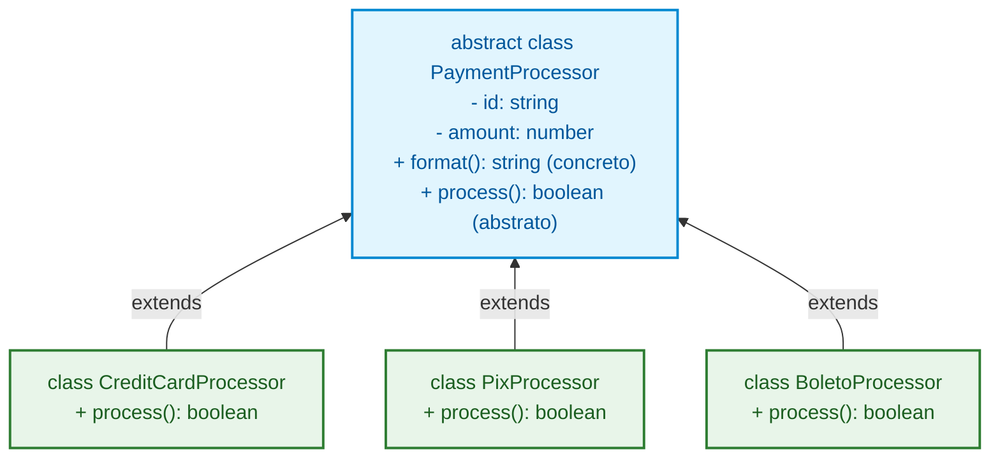

# 32. Herança e Classes Abstratas

No capítulo anterior, aprendemos a proteger o estado de nossas classes com
modificadores de acesso, campos privados, métodos estáticos e métodos de acesso
(`get`/`set`).

Entretanto, conforme o sistema cresce, é comum surgirem entidades que
compartilham regras e propriedades em comum, mas possuem comportamentos
específicos. Se duplicarmos o código em cada nova classe, criamos um pesadelo de
manutenção e perdemos a capacidade de tratar essas entidades de forma
polimórfica e intercambiável.

Neste capítulo, você aprenderá a estruturar hierarquias e contratos robustos em
TypeScript utilizando **Herança** (`extends`), chamada à superclasse (`super`),
sobrescrita segura de métodos (`override`), implementação de contratos
(`implements`) e **Classes Abstratas** (`abstract`).

## A Dor da Duplicação e a Falta de Polimorfismo

Imagine uma plataforma de comércio eletrônico que precisa processar diferentes
meios de pagamento: **Cartão de Crédito**, **Boleto Bancário** e **Pix**.

Todas as transações possuem um valor (`amountInCents`), uma data de criação e um
identificador de transação. Porém, cada uma valida e executa o processamento de
forma totalmente diferente.

Sem mecanismos de abstração e reutilização, a tendência é duplicar código ou
criar estruturas frágeis baseadas em condicionais gigantescas:

```typescript
// ❌ EVITE: Classes isoladas duplicando estado e sem contrato unificado

export class CreditCardPayment {
  constructor(
    public readonly id: string,
    public readonly amountInCents: number,
    public readonly cardNumber: string,
  ) {}

  process(): boolean {
    console.log(
      `Cobrando R$ ${this.amountInCents / 100} no cartão final ${this.cardNumber.slice(-4)}`,
    );
    return true;
  }
}

export class PixPayment {
  constructor(
    public readonly id: string,
    public readonly amountInCents: number,
    public readonly pixKey: string,
  ) {}

  process(): boolean {
    console.log(
      `Gerando QR Code Pix de R$ ${this.amountInCents / 100} para a chave ${this.pixKey}`,
    );
    return true;
  }
}

// O checkout não consegue tratar os pagamentos de forma genérica e previsível:
function executeCheckout(payment: CreditCardPayment | PixPayment): void {
  // 💥 Código engessado: a cada novo meio de pagamento (ex: Boleto, Crypto),
  // esta função precisará ser alterada e expandida manualmente!
  payment.process();
}
```

O problema desse modelo é duplo:

1. **Duplicação de Estado e Lógica Comum:** Propriedades como `id`,
   `amountInCents` e métodos utilitários de log/auditoria são copiados
   manualmente em cada classe.
2. **Ausência de um Contrato Base:** Não existe uma garantia formal de que todo
   meio de pagamento implementará um método `process()` com a mesma assinatura.

Para resolver essas dores, a Orientação a Objetos oferece duas ferramentas
fundamentais: **Herança de Implementação (`extends`)** e **Classes Abstratas
(`abstract`)**.

## Herança com `extends` e a Chamada `super()`

A palavra-chave **`extends`** permite que uma classe filha (_subclasse_) herde
todas as propriedades e métodos públicos e protegidos de uma classe pai
(_superclasse_).

### A Regra do Construtor com `super(...)`

Quando uma subclasse possui seu próprio construtor, ela **deve** chamar a função
**`super(...)`** antes de acessar `this`. A chamada `super(...)` executa o
construtor da superclasse, garantindo que o estado base seja inicializado
corretamente:

```typescript
// 1. Superclasse (Classe Base)
export class BasePayment {
  public readonly id: string;
  public readonly amountInCents: number;
  protected status: "pending" | "approved" | "rejected" = "pending";

  constructor(id: string, amountInCents: number) {
    if (amountInCents <= 0) {
      throw new Error("O valor do pagamento deve ser positivo.");
    }
    this.id = id;
    this.amountInCents = amountInCents;
  }

  public getStatus(): string {
    return this.status;
  }
}

// 2. Subclasse especializada em Pix
export class PixPayment extends BasePayment {
  public readonly pixKey: string;

  constructor(id: string, amountInCents: number, pixKey: string) {
    // ⚠️ Obrigatório: super() invoca o construtor de BasePayment
    super(id, amountInCents);
    this.pixKey = pixKey;
  }

  public generateQrCode(): string {
    // Acesso à propriedade protegida 'status' da superclasse:
    this.status = "approved";
    return `payload-pix://${this.pixKey}?amount=${this.amountInCents}`;
  }
}

const pix = new PixPayment("pay-101", 7500, "financeiro@fatec.sp.gov.br");
console.log(pix.amountInCents); // 7500 (herdado de BasePayment)
console.log(pix.generateQrCode()); // payload-pix://financeiro@fatec.sp.gov.br?amount=7500
console.log(pix.getStatus()); // "approved" (herdado de BasePayment)
```

## Sobrescrita de Métodos e a Palavra-chave `override`

Muitas vezes, o comportamento padrão fornecido pela superclasse é genérico
demais para a classe filha. Quando uma subclasse redefine a implementação de um
método herdado, chamamos isso de **Sobrescrita de Método** (_Method
Overriding_).

Existem duas abordagens comuns de sobrescrita:

- **Substituição Total:** A subclasse ignora a lógica do pai e escreve uma
  lógica 100% nova.
- **Extensão / Complementação:** A subclasse executa a lógica da superclasse com
  **`super.nomeDoMetodo()`** e acrescenta passos adicionais (como logs, métricas
  ou envio de alertas).

Observe um exemplo prático com um sistema de notificações:

```typescript
// 1. Superclasse com comportamento padrão de envio:
export class NotificationService {
  public send(recipient: string, message: string): void {
    console.log(`[DISPARO GERAL] Enviando para ${recipient}: "${message}"`);
  }
}

// 2. Subclasse que complementa o comportamento do pai usando super.send():
export class AuditedNotificationService extends NotificationService {
  public override send(recipient: string, message: string): void {
    const timestamp = new Date().toISOString();
    console.log(
      `[AUDITORIA - ${timestamp}] Iniciando disparo para ${recipient}...`,
    );

    // ✅ Executa a lógica original da superclasse:
    super.send(recipient, message);

    console.log(
      `[AUDITORIA - ${timestamp}] Disparo registrado no log com sucesso.`,
    );
  }
}

// 3. Subclasse que substitui totalmente a lógica (formato JSON):
export class JsonNotificationService extends NotificationService {
  public override send(recipient: string, message: string): void {
    // 🔄 Substitui o comportamento padrão por uma saída estruturada:
    const payload = {
      recipient,
      message,
      sentAt: new Date().toISOString(),
      channel: "json-stream",
    };
    console.log(JSON.stringify(payload));
  }
}

const audited = new AuditedNotificationService();
audited.send("alice@fatec.sp.gov.br", "Sua matrícula foi confirmada!");
// Saída:
// [AUDITORIA - 2026-09-06T...] Iniciando disparo para alice@fatec.sp.gov.br...
// [DISPARO GERAL] Enviando para alice@fatec.sp.gov.br: "Sua matrícula foi confirmada!"
// [AUDITORIA - 2026-09-06T...] Disparo registrado no log com sucesso.

const json = new JsonNotificationService();
json.send("bob@fatec.sp.gov.br", "Seu pagamento foi aprovado!");
// Saída:
// {
//   "recipient": "bob@fatec.sp.gov.br",
//   "message": "Seu pagamento foi aprovado!",
//   "sentAt": "2026-09-06T...",
//   "channel": "json-stream"
// }
```

### A Proteção do Modificador `override`

Observe que nos exemplos acima utilizamos a palavra-chave **`override`** antes
do nome do método.

O modificador `override` do TypeScript serve como um **cinto de segurança para
refatorações**:

```typescript
export class EmailNotifier extends NotificationService {
  // ✅ O compilador valida se 'send' realmente existe na classe pai
  public override send(recipient: string, message: string): void {
    console.log(`Enviando e-mail para ${recipient}: ${message}`);
  }
}
```

> **Por que usar `override`?**
>
> Imagine que, meses depois, o autor da classe base renomeie o método de `send`
> para `dispatch`.
>
> - **Sem `override`:** O método `send` da classe filha viraria silenciosamente
>   um método novo e separado. O código compilaria sem erros, mas o método
>   personalizado **nunca mais seria chamado** quando o sistema invocasse
>   `dispatch()`. Um bug catastrófico e invisível!
> - **Com `override`:** O compilador do TypeScript aponta um erro imediato:
>   _"This member cannot have an 'override' modifier because it is not declared
>   in the base class"_, obrigando o desenvolvedor a atualizar o nome na
>   subclasse.

## Contratos com `implements`: Interfaces vs Herança

No [Capítulo 22](22-interfaces.md), aprendemos a definir contratos com
`interface`. Uma classe pode se comprometer a seguir uma interface usando a
palavra-chave **`implements`**.

É crucial entender a diferença conceitual:

- **`extends` (Herança):** Compartilha **código, estado e implementação**. Uma
  classe só pode herdar de uma única superclasse (_herança simples_).
- **`implements` (Contrato):** Obriga a classe a possuir determinada **forma
  (métodos e propriedades)**, mas **não compartilha nenhuma linha de código**.
  Uma classe pode implementar **múltiplas interfaces**.

```typescript
export interface Authenticable {
  login(token: string): boolean;
}

export interface Auditable {
  getAuditLog(): string[];
}

// Uma classe pode implementar múltiplos contratos simultaneamente:
export class AdminUser implements Authenticable, Auditable {
  constructor(public readonly username: string) {}

  login(token: string): boolean {
    return token.startsWith("admin-secret-");
  }

  getAuditLog(): string[] {
    return [`Usuário ${this.username} autenticado com sucesso.`];
  }
}
```

## Classes Abstratas (`abstract`)

Muitas vezes, queremos o melhor dos dois mundos:

1. Compartilhar código e propriedades comuns (como uma classe com `extends`).
2. Forçar que as subclasses obrigatoriamente implementem certos métodos com suas
   próprias regras (como uma `interface`).

Para isso existem as **Classes Abstratas** (`abstract class`).



### Regras Fundamentais de Classes Abstratas

1. **Não podem ser instanciadas diretamente:** O compilador impede o uso de `new
ClasseAbstrata()`. Ela existe exclusivamente para servir de molde e base.
2. **Podem conter métodos concretos (com código):** Métodos que já possuem
   lógica pronta para reuso imediato.
3. **Podem conter métodos abstratos (`abstract metodo(): tipo`):** Métodos sem
   corpo `{}` que **obrigam** cada subclasse concreta a fornecer sua própria
   implementação.

### Exemplo Completo: Processador de Pagamentos Polimórfico

```typescript
// 1. Molde Abstrato: Define a estrutura e obriga a implementação de 'process'
export abstract class PaymentProcessor {
  constructor(
    public readonly transactionId: string,
    public readonly amountInCents: number,
  ) {}

  // Método concreto (lógica pronta e compartilhada):
  public getFormattedAmount(): string {
    return `R$ ${(this.amountInCents / 100).toFixed(2)}`;
  }

  // Método abstrato (SEM corpo): cada subclasse DEVE implementar
  public abstract process(): boolean;
}

// 2. Subclasse Concreta: Cartão de Crédito
export class CreditCardProcessor extends PaymentProcessor {
  constructor(
    transactionId: string,
    amountInCents: number,
    public readonly cardToken: string,
  ) {
    super(transactionId, amountInCents);
  }

  public override process(): boolean {
    console.log(
      `Processando ${this.getFormattedAmount()} no cartão via token ${this.cardToken}`,
    );
    return true;
  }
}

// 3. Subclasse Concreta: Boleto
export class BoletoProcessor extends PaymentProcessor {
  constructor(
    transactionId: string,
    amountInCents: number,
    public readonly barcode: string,
  ) {
    super(transactionId, amountInCents);
  }

  public override process(): boolean {
    console.log(
      `Emitindo boleto no valor de ${this.getFormattedAmount()} com código de barras ${this.barcode}`,
    );
    return true;
  }
}
```

### O Poder do Polimorfismo

Agora, o nosso checkout pode receber **qualquer meio de pagamento que derive de
`PaymentProcessor`**, sem se importar com os detalhes internos de cada um:

```typescript
// ✅ Código limpo, extensível e totalmente polimórfico:
function processOrderPayment(payment: PaymentProcessor): void {
  console.log(`Iniciando transação: ${payment.transactionId}`);

  const success = payment.process();

  if (success) {
    console.log(`Pagamento de ${payment.getFormattedAmount()} confirmado!`);
  }
}

const creditOrder = new CreditCardProcessor("tx-001", 15000, "tok_visa_8821");
const boletoOrder = new BoletoProcessor("tx-002", 4990, "34191.79001.01043");

processOrderPayment(creditOrder);
processOrderPayment(boletoOrder);

// ❌ Erro de compilação: Não é possível instanciar uma classe abstrata
// const invalid = new PaymentProcessor("tx-003", 1000);
```

Se amanhã precisarmos criar o `PixProcessor`, basta estender `PaymentProcessor`
e a função `processOrderPayment` continuará funcionando perfeitamente sem
nenhuma alteração! Esse é o famoso princípio do código aberto para extensão e
fechado para modificação (_Open/Closed Principle_).

## Comparativo: `interface` vs `abstract class` vs `class`

| Característica                               |                `interface`                |                      `abstract class`                       |        `class` Concreta         |
| :------------------------------------------- | :---------------------------------------: | :---------------------------------------------------------: | :-----------------------------: |
| **Gera código no JS compilado?**             |           ❌ Não (Type Erasure)           |                           ✅ Sim                            |             ✅ Sim              |
| **Pode ser instanciada com `new`?**          |                  ❌ Não                   |                           ❌ Não                            |             ✅ Sim              |
| **Pode conter lógica/métodos concretos?**    |                  ❌ Não                   |                           ✅ Sim                            |             ✅ Sim              |
| **Pode conter métodos abstratos sem corpo?** |              ✅ Sim (todos)               |                     ✅ Sim (`abstract`)                     |             ❌ Não              |
| **Suporta herança/implementação múltipla?**  |        ✅ Sim (`implements A, B`)         |               ❌ Não (apenas 1 com `extends`)               | ❌ Não (apenas 1 com `extends`) |
| **Cenário Ideal**                            | Contratos de DTOs, APIs e formas de dados | Moldes base de entidades de domínio ricas com regras comuns |  Criação direta de instâncias   |

## Reflexão Arquitetural: Herança vs Composição

Como destacamos no [Capítulo 29](29-o-paradigma-orientado-a-objetos-na-web.md),
a herança cria o acoplamento mais forte possível entre duas classes: **uma
alteração na superclasse impacta imediatamente todas as subclasses**.

```typescript
// ⚠️ Acoplamento excessivo via herança profunda:
// SuperUser extends AdminUser extends AuthenticatedUser extends BaseUser extends Entity ...
```

> **Diretriz de Design:**
>
> Use herança apenas quando houver uma verdadeira relação conceitual de **"é
> um"** (_um `CreditCardProcessor` é um `PaymentProcessor`_). Quando a relação
> for de **"tem um"** ou **"faz uso de"**, prefira **Composição** (receber uma
> dependência como parâmetro no construtor).

## O Que Vem a Seguir?

Com o domínio completo de classes, interfaces, modificadores, herança e
polimorfismo, encerramos a jornada estrutural de orientação a objetos no
TypeScript.

No **[Capítulo 33: Programação Assíncrona](33-programacao-assincrona.md)**,
chegaremos ao grande capítulo de fechamento do Módulo 01. Vamos desvendar como o
motor do JavaScript lida com operações concorrentes sem travar a interface
(_Event Loop_), o funcionamento de **Promises**, a sintaxe moderna de **`async /
await`** e operações concorrentes com `Promise.all` — a rampa de decolagem
definitiva para consumirmos APIs HTTP e construirmos aplicações reais.

---

<a href="31-modificadores.md">← Modificadores</a>

<p align="right"><a href="33-programacao-assincrona.md">Próximo: Programação Assíncrona →</a></p>
