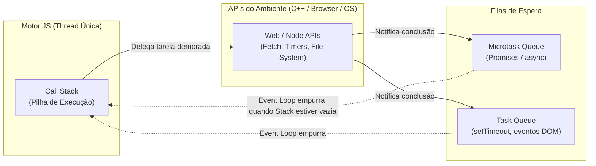
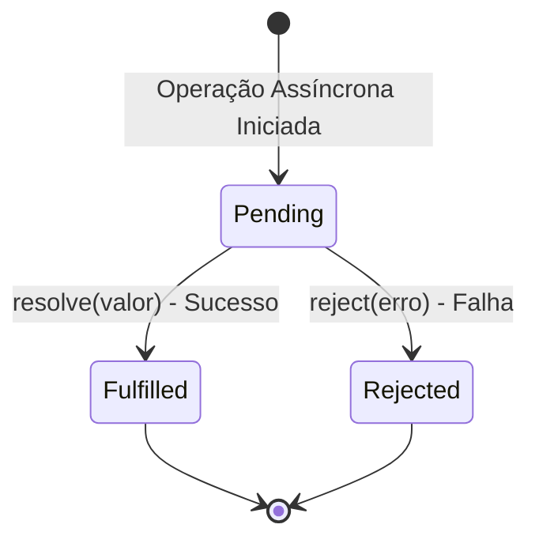

# 33. Programação Assíncrona

Chegamos ao capítulo de fechamento do **Módulo 01: TypeScript**! Ao longo de
nossa jornada, construímos uma base sólida: desde o sistema de tipos, funções e
coleções até interfaces avançadas, generics e orientação a objetos.

No entanto, o desenvolvimento Web possui uma particularidade fundamental: **a
Web é um ambiente intensamente orientado a I/O (Entrada e Saída) e comunicação
em rede**. Quase tudo o que fazemos na prática — consultar um banco de dados,
disparar uma requisição HTTP, ler um arquivo ou aguardar a resposta de uma API —
leva tempo e não ocorre de forma instantânea.

Neste capítulo, você aprenderá como o TypeScript e o JavaScript moderno lidam
com operações demoradas de forma não-bloqueante. Veremos o funcionamento do
**Event Loop**, o conceito e ciclo de vida de **`Promise<T>`**, a elegância da
sintaxe **`async / await`**, o tratamento seguro de erros e a execução
concorrente com `Promise.all`, `allSettled` e `race`.

## A Dor do Bloqueio Síncrono

O motor do JavaScript (tanto no navegador quanto no Node.js) é
**_Single-Threaded_**: ele possui **apenas uma única linha de execução principal
(Call Stack)** para processar todo o código da sua aplicação.

Se executássemos uma operação lenta (como baixar dados de um servidor que demora
2 segundos) de forma estritamente síncrona e bloqueante, a thread principal
ficaria completamente travada:

```typescript
// ❌ CONCEITO PROBLEMÁTICO: Bloqueio síncrono da thread principal
function fetchUserDataSync(userId: string): { id: string; name: string } {
  const start = Date.now();

  // Simula um bloqueio de 3 segundos travando a CPU:
  while (Date.now() - start < 3000) {
    // A CPU fica presa em loop...
  }

  return { id: userId, name: "Carlos Eduardo" };
}

console.log("1. Iniciando busca de usuário...");
const user = fetchUserDataSync("usr-100"); // 💥 Trava TUDO por 3 segundos!
console.log("2. Usuário carregado:", user.name);
console.log("3. Interface atualizada.");
```

Durante esses 3 segundos de bloqueio:

- No **Navegador**: A aba do usuário congela. Nenhum clique, rolagem de página
  ou animação funciona (_UI Freeze_).
- No **Node.js (Servidor)**: Todas as outras centenas de requisições de outros
  usuários que chegarem naquele momento ficam na fila aguardando a thread ser
  liberada.

Para evitar esse desastre de performance, a Web adota o modelo **Assíncrono e
Não-Bloqueante**.

## O Mecanismo por Baixo dos Panos: O Event Loop

Como o JavaScript consegue fazer várias coisas ao mesmo tempo se possui apenas
uma única thread?

A resposta está na divisão de trabalho entre o **motor JS** e o **ambiente de
execução (Runtime APIs)**:



1. **Call Stack:** Executa as instruções síncronas linha a linha.
2. **APIs do Ambiente (Web/Node APIs):** Quando o código encontra uma operação
   assíncrona (como `fetch` ou um timer), o motor delega a tarefa para threads
   em segundo plano do sistema operacional e continua executando o restante do
   código imediatamente!
3. **Fila de Tarefas (Task / Microtask Queue):** Quando a resposta da rede
   chega, a sua função de callback é colocada em uma fila de espera.
4. **Event Loop:** Monitora continuamente a Call Stack. Assim que a Call Stack
   fica vazia, o Event Loop pega a próxima tarefa da fila e a coloca para ser
   executada.

## O Conceito de `Promise<T>`

Uma **`Promise`** (Promessa) é um objeto que representa o resultado eventual de
uma operação assíncrona que ainda não foi concluída.

> **A Analogia do Restaurante Fast-Food:**
>
> Quando você faz um pedido no totem de um restaurante de fast-food, você recebe
> um comprovante com uma **senha** (a `Promise`).
>
> Enquanto a cozinha prepara seu lanche em segundo plano, sua senha aparece no
> telão com o status **"Em Preparo"** (`pending`). Você não precisa ficar
> travado na frente do balcão: pode sentar, mexer no celular ou conversar com
> amigos.
>
> Quando o lanche fica pronto, o status no telão muda para **"Pronto"**, chamam
> seu nome/senha e você retira sua bandeja (`fulfilled` com o valor). Se tiver
> faltado algum ingrediente, avisam que o pedido não pôde ser atendido
> (`rejected` com o motivo da falha).

### Os 3 Estados de uma Promise



- **`pending` (Pendente):** O estado inicial. A operação ainda está em execução.
- **`fulfilled` / `resolved` (Cumprida):** A operação terminou com sucesso e
  produziu um valor do tipo `T`.
- **`rejected` (Rejeitada):** A operação falhou e produziu um erro.

### Criando e Consumindo uma Promise Manualmente

Em TypeScript, tipamos uma Promise como **`Promise<T>`**, onde `T` é o tipo do
dado que ela entregará quando for cumprida com sucesso:

```typescript
// Simulando a preparação assíncrona de um pedido:
export function prepareOrder(orderId: number): Promise<string> {
  return new Promise((resolve, reject) => {
    setTimeout(() => {
      if (orderId === 42) {
        resolve("🍔 Combo Burger Duplo com Batata");
      } else {
        reject(new Error(`Pedido #${orderId} não encontrado no sistema.`));
      }
    }, 1000); // Demora 1 segundo de forma NÃO-bloqueante
  });
}
```

### O Consumo Clássico com `.then()`, `.catch()` e `.finally()`

Historicamente, as promises eram consumidas encadeando métodos com funções de
callback:

```typescript
console.log("Fazendo pedido no balcão...");

prepareOrder(42)
  .then((meal) => {
    console.log(`✅ Pedido entregue: ${meal}`);
  })
  .catch((error: unknown) => {
    if (error instanceof Error) {
      console.error(`❌ Falha: ${error.message}`);
    }
  })
  .finally(() => {
    console.log("Atendimento encerrado (sucesso ou falha).");
  });
```

Embora o encadeamento com `.then()` funcione bem para fluxos simples, encadear
múltiplas operações dependentes no passado gerava o temido **_Callback Hell_**
ou árvores de indentação difíceis de ler e depurar.

## A Sintaxe Moderna: `async` e `await`

Para tornar o código assíncrono tão legível, linear e fácil de manter quanto o
código síncrono tradicional, o JavaScript e o TypeScript introduziram as
palavras-chave **`async`** e **`await`**.

### 1. A Palavra-chave `async`

Colocar `async` antes de uma função faz com que ela **automaticamente retorne
uma `Promise<T>`**:

```typescript
// O TypeScript infere o retorno como Promise<string>:
async function getRestaurantStatus(): Promise<string> {
  return "Restaurante aberto para pedidos!"; // Encapsulado automaticamente em Promise.resolve(...)
}
```

### 2. A Palavra-chave `await`

A palavra-chave `await` só pode ser usada dentro de funções `async`. Ela **pausa
a execução da função localmente de forma não-bloqueante** até que a Promise seja
resolvida, retornando diretamente o valor extraído:

```typescript
// ✅ RECOMENDADO: Código assíncrono limpo, linear e legível
async function serveCustomer(orderId: number): Promise<void> {
  try {
    console.log("Aguardando preparo da cozinha...");

    // O 'await' pausa a função e entrega o lanche pronto diretamente:
    const meal = await prepareOrder(orderId);

    console.log(`Bandeja servida na mesa: ${meal}`);
  } catch (error: unknown) {
    // Erros da Promise são capturados normalmente pelo bloco catch:
    if (error instanceof Error) {
      console.error(`Erro no atendimento: ${error.message}`);
    }
  } finally {
    console.log("Atendimento do cliente finalizado.");
  }
}

serveCustomer(42);
```

Observe a beleza dessa sintaxe:

1. **Sem aninhamento:** Não há callbacks nem blocos `.then()` dentro de
   `.then()`.
2. **Tratamento uniforme de exceções:** Tanto erros síncronos quanto rejeições
   de Promises são capturados pelo mesmo bloco `try/catch`.

## Operações Concorrentes com `Promise`

Imagine que para montar um combo completo, a cozinha precisa preparar três itens
independentes:

1. Fritar o Hambúrguer (demora 1.0s)
2. Fritar a Porção de Batatas (demora 0.6s)
3. Encher o Copo de Refrigerante (demora 0.4s)

Se usarmos `await` em sequência, o tempo total será a soma dos três: `1.0 + 0.6 - 0.4 = 2.0s`!

```typescript
// ⚠️ Desempenho Lento (Execução Sequencial Inútil):
const burger = await prepareBurger(); // Espera 1.0s
const fries = await prepareFries(); // Espera mais 0.6s
const drink = await prepareDrink(); // Espera mais 0.4s
// Total: 2.0 segundos perdidos esperando um item por vez!
```

Como essas três operações **não dependem uma da outra**, a cozinha pode
prepará-las **ao mesmo tempo** (de forma paralela) utilizando os métodos
estáticos da classe `Promise`.

### 1. `Promise.all`: Execução Paralela com Falha Rápida (_Fail-Fast_)

Executa todas as promises simultaneamente. O tempo total será apenas o tempo do
**item mais demorado** (1.0s do hambúrguer). Se **qualquer um** dos itens falhar
(ex: acabou a batata), o `Promise.all` rejeita imediatamente:

```typescript
async function serveComboMeal(): Promise<void> {
  try {
    const start = Date.now();

    // Dispara os 3 preparos simultaneamente:
    const [burger, fries, drink] = await Promise.all([
      prepareBurger(),
      prepareFries(),
      prepareDrink(),
    ]);

    const elapsed = (Date.now() - start) / 1000;
    console.log(
      `✅ Combo completo entregue em ${elapsed.toFixed(1)}s: ${burger}, ${fries} e ${drink}!`,
    );
  } catch (error: unknown) {
    console.error("Falha ao montar o combo:", error);
  }
}

// Funções utilitárias simuladas:
async function prepareBurger(): Promise<string> {
  return "🍔 Burger";
}
async function prepareFries(): Promise<string> {
  return "🍟 Batata";
}
async function prepareDrink(): Promise<string> {
  return "🥤 Suco";
}
```

### 2. `Promise.allSettled`: Tolerância a Falhas Parciais

Se você quiser disparar várias promises e receber o resultado de **todas**,
mesmo que algumas falhem sem interromper as outras, use `Promise.allSettled`:

```typescript
const results = await Promise.allSettled([
  prepareOrder(42), // ✅ Resolve com sucesso
  prepareOrder(99), // ❌ Rejeita (número inexistente)
]);

for (const result of results) {
  if (result.status === "fulfilled") {
    console.log("Item Pronto:", result.value);
  } else {
    console.warn("Item Indisponível:", result.reason.message);
  }
}
```

### 3. `Promise.race`: A Primeira que Terminar Vence

Retorna o resultado da primeira promise que for resolvida ou rejeitada. É
amplamente utilizado para implementar **timeouts de requisição**:

```typescript
function timeout(ms: number): Promise<never> {
  return new Promise((_, reject) => {
    setTimeout(
      () => reject(new Error(`O preparo excedeu o tempo limite de ${ms}ms.`)),
      ms,
    );
  });
}

async function prepareWithTimeout(): Promise<void> {
  try {
    // Disputa entre o preparo do pedido e o timer de tolerância:
    const meal = await Promise.race([prepareOrder(42), timeout(500)]);

    console.log("Pedido entregue dentro do prazo:", meal);
  } catch (error: unknown) {
    if (error instanceof Error) {
      console.error("Erro ou Timeout:", error.message);
    }
  }
}
```

## Resumo Comparativo de Métodos Concorrentes

| Método                   | Comportamento em Sucesso                                                 | Comportamento em Falha                                     | Caso de Uso Ideal                                                           |
| :----------------------- | :----------------------------------------------------------------------- | :--------------------------------------------------------- | :-------------------------------------------------------------------------- |
| **`Promise.all`**        | Retorna array tipado com todos os valores quando **todas** resolverem    | Rejeita no momento da **primeira** falha (_Fail-Fast_)     | Cargas em lote onde todos os dados são estritamente obrigatórios            |
| **`Promise.allSettled`** | Retorna array de objetos com `{ status, value }` ou `{ status, reason }` | **Nunca rejeita**. Aguarda todas terminarem                | Relatórios, dashboards e sincronizações onde falhas parciais são aceitáveis |
| **`Promise.race`**       | Retorna o valor da **primeira** promise resolvida                        | Rejeita se a **primeira** promise a terminar for uma falha | Timeouts de rede e seleção da resposta mais rápida entre réplicas           |

<details>
<summary>🔍 Aprofundamento: Microtasks vs Macrotasks no Event Loop</summary>

O motor do JavaScript divide suas filas de execução em dois níveis de
prioridade:

1. **Microtask Queue:** Onde entram os callbacks de `Promise` (`.then`,
   `.catch`, `await`) e `queueMicrotask`.
2. **Macrotask Queue (Task Queue):** Onde entram callbacks de `setTimeout`,
   `setInterval`, `setImmediate` e eventos de I/O do DOM.

> **Regra de Ouro do Event Loop:**  
> Ao final de cada ciclo, o motor esvazia **toda a fila de Microtasks** antes de
> processar a próxima Macrotask. É por isso que um `Promise.resolve().then(...)`
> executa **antes** de um `setTimeout(..., 0)`!

</details>

---

<a href="32-heranca-e-classes-abstratas.md">← Herança e Classes Abstratas</a>
