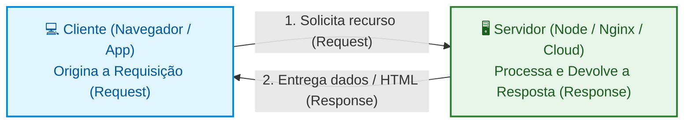
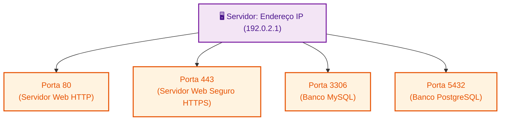
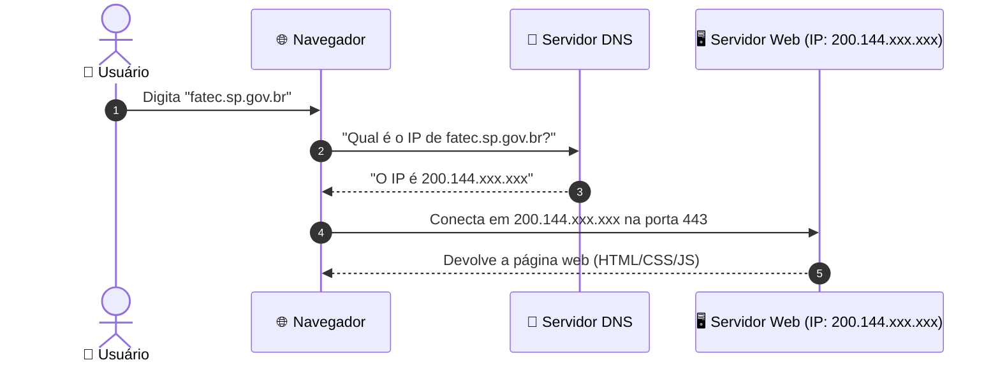
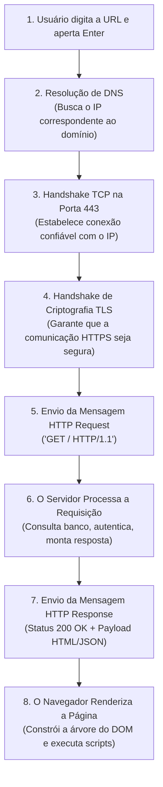

# 01. Fundamentos de Redes na Web

Nos módulos anteriores, dominamos as ferramentas de desenvolvimento e a
linguagem TypeScript. No entanto, uma aplicação web não vive isolada dentro do
computador do desenvolvedor: seu objetivo fundamental é **conectar pessoas e
sistemas através da Internet**.

Toda vez que você digita uma URL no navegador e pressiona `Enter`, uma cadeia de
eventos invisível e incrivelmente rápida é disparada. Em frações de segundo,
mensagens viajam por milhares de quilômetros de cabos submarinos e roteadores
para localizar o servidor correto, solicitar dados e devolvê-los à sua tela.

Neste capítulo, você aprenderá os fundamentos de redes que sustentam a Web
moderna. Vamos desmistificar o modelo **Cliente/Servidor**, os conceitos de
**Endereço IP** e **Portas**, a resolução de nomes com o **DNS** e como os
protocolos **TCP/IP** garantem que nenhuma informação se perca pelo caminho.

## O Que Acontece ao Digitar uma URL?

Para a maioria dos usuários, a Internet parece algo quase mágico:

```text
Usuário digita: https://fatec.sp.gov.br ──> [ Mágica da Nuvem ☁️ ] ──> Página renderizada na tela
```

No entanto, para um engenheiro de software, enxergar a rede como uma caixa-preta
é perigoso. Quando uma aplicação falha em produção, algumas das causas mais
comuns envolvem:

- Erros de resolução de domínio (DNS);
- Servidores inacessíveis ou portas bloqueadas por firewall;
- Quedas de pacotes ou latência excessiva de rede.

Compreender o caminho exato que uma requisição percorre é o primeiro passo para
construir e depurar aplicações resilientes.

## O Modelo Cliente/Servidor

A arquitetura fundamental da Web é baseada na relação **Cliente/Servidor**:



- **Cliente (_Client_):** É o agente que inicia a conversa solicitando algum
  recurso. Pode ser o navegador do usuário (Chrome, Firefox), um aplicativo
  mobile ou até mesmo um script automatizado.
- **Servidor (_Server_):** É uma máquina (ou conjunto de máquinas) conectada à
  rede, executando um software configurado para "escutar" requisições e devolver
  respostas (como arquivos HTML, imagens ou dados em formato JSON).

> **Regra de Ouro:**
>
> Na Web tradicional, a comunicação é sempre iniciada pelo **Cliente**. O
> servidor permanece passivo aguardando pedidos.

## Identificação e Endereçamento: IP e Portas

Para que dois computadores conversem na rede global, eles precisam de uma forma
única de identificação física e lógica.

> **A Analogia dos Correios:**
>
> Pense na Internet como o sistema de entregas postais:
>
> - O **Endereço IP** é o **endereço do prédio** (Rua, Número e Cidade). Ele diz
>   em qual computador do mundo a mensagem deve ser entregue.
> - A **Porta de Rede** é o **número do apartamento** dentro do prédio. Ela
>   indica para qual programa específico dentro do servidor aquela mensagem se
>   destina.



### 1. O Endereço IP (_Internet Protocol_)

Cada dispositivo conectado à Internet recebe um identificador numérico único:

- **IPv4 (Padrão Tradicional):** Formado por 4 blocos numéricos de 0 a 255
  separados por pontos (ex: `142.250.191.46`). Como a quantidade de aparelhos no
  mundo esgotou esse formato (cerca de 4,3 bilhões de endereços), a indústria
  está migrando gradualmente para o IPv6.
- **IPv6 (Padrão Moderno):** Formado por 8 grupos hexadecimais de 16 bits (ex:
  `2800:3f0:4001:816::200e`), permitindo uma quantidade praticamente infinita de
  endereços.
- **`localhost` / `127.0.0.1` (Loopback):** É o endereço especial que aponta
  para a sua **própria máquina local**. É onde rodamos nossos servidores de
  teste durante o desenvolvimento.

### 2. Portas de Rede (_Network Ports_)

Um mesmo servidor pode executar vários serviços simultaneamente (um site, um
banco de dados e um servidor de e-mails). As portas (números de 0 a 65535)
permitem que o sistema operacional direcione cada pacote de rede para o programa
correto.

|         Porta Padrão         | Serviço Típico | Descrição                                                            |
| :--------------------------: | :------------- | :------------------------------------------------------------------- |
|           **`80`**           | HTTP           | Tráfego web padrão não-criptografado (omitido na URL pelo navegador) |
|          **`443`**           | HTTPS          | Tráfego web seguro com criptografia TLS/SSL                          |
|           **`22`**           | SSH            | Acesso administrativo remoto ao terminal do servidor                 |
| **`3000` / `5173` / `8080`** | Servidores Dev | Portas de desenvolvimento local comuns (Vite, React, Node)           |

## O Sistema de Nomes de Domínio (DNS)

Nenhum ser humano gostaria de memorizar `142.250.191.46` toda vez que quisesse
fazer uma busca. Nós pensamos em palavras e marcas (`google.com`,
`fatec.sp.gov.br`).

O **DNS (_Domain Name System_)** funciona como a **lista telefônica da
Internet**: sua única função é traduzir um nome de domínio legível para um
endereço IP numérico.



> **O Papel e o Perigo do Cache de DNS:**
>
> Para evitar consultar os servidores DNS a cada nova requisição, o navegador, o
> roteador e o sistema operacional salvam os IPs resolvidos recentemente em um
> **cache local**, tornando a navegação quase instantânea.
>
> No entanto, esse mecanismo pode causar o problema de **_Stale Cache_ (Cache
> Obsoleto)**: se um site migrar de servidor ou mudar de IP, sua máquina pode
> continuar tentando se conectar ao IP antigo que ficou salvo no cache, gerando
> erros de conexão ou exibindo uma versão desatualizada. É por isso que, durante
> deploys e trocas de servidor, desenvolvedores frequentemente precisam "limpar
> o cache de DNS" (como o comando `ipconfig /flushdns` no Windows).

## Transporte Confiável: A _Stack_ TCP/IP

Depois que o navegador descobre o endereço IP de destino, como as mensagens
realmente viajam entre as duas máquinas sem se corromperem?

Na Internet, arquivos grandes não trafegam em um único bloco contínuo. Eles são
fatiados em centenas ou milhares de pedaços pequenos chamados **pacotes de dados
(_packets_)**.

A **_Stack_ TCP/IP** organiza essa transmissão em camadas:

1. **Camada de Rede (IP):** É responsável por **endereçar e rotear** cada pacote
   pelo melhor caminho da rede global (passando por roteadores e cabos de fibra
   ótica) até chegar ao computador de destino.
2. **Camada de Transporte (TCP):** É responsável pela **integridade e
   confiabilidade** da entrega.

### O Papel do TCP (_Transmission Control Protocol_)

O protocolo TCP garante três propriedades fundamentais:

1. **Conexão Prévia (_Handshake_):** Antes de trocar dados, cliente e servidor
   trocam mensagens rápidas para confirmar que ambos estão prontos e
   sincronizados (_Three-Way Handshake_).
2. **Entrega Ordenada:** Cada pacote recebe um número de sequência. Mesmo que os
   pacotes viajem por rotas diferentes e cheguem fora de ordem, o TCP remonta o
   arquivo na ordem original.
3. **Detecção de Perda e Retransmissão:** Se um pacote sumir no meio do caminho,
   o TCP detecta a ausência e solicita o reenvio automático.

| Protocolo | Característica Principal                     | Tolerância a Falhas       | Casos de Uso na Web                                       |
| :-------- | :------------------------------------------- | :------------------------ | :-------------------------------------------------------- |
| **TCP**   | Confiável, ordenado, garante entrega         | Reenvia pacotes perdidos  | Páginas Web (HTTP), APIs, arquivos, e-mails               |
| **UDP**   | Rápido, sem handshake, sem garantia de ordem | Descarta pacotes perdidos | Streaming de vídeo ao vivo, chamadas de voz, jogos online |

## O Ciclo de Vida Completo de uma Requisição Web

Juntando todas as peças que aprendemos, este é o fluxo exato que ocorre quando
você acessa qualquer página na Web:



## O Que Vem a Seguir?

Agora que entendemos como os computadores se encontram no mundo e estabelecem
uma conexão confiável via TCP/IP, é hora de entender o **idioma oficial** que
eles usam para conversar sobre essa conexão: o protocolo **HTTP**.

No **[Capítulo 02: O Protocolo HTTP e HTTPS](02-o-protocolo-http-e-https.md)**,
vamos dissecar a anatomia de uma mensagem de rede: métodos (`GET`, `POST`,
`PUT`, `DELETE`), códigos de status (`200`, `404`, `500`), cabeçalhos essenciais
(_headers_) e a camada de segurança com criptografia HTTPS.

---

<p align="right"><a href="02-o-protocolo-http-e-https.md">Próximo: O Protocolo HTTP e HTTPS →</a></p>
