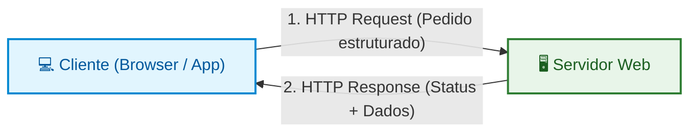
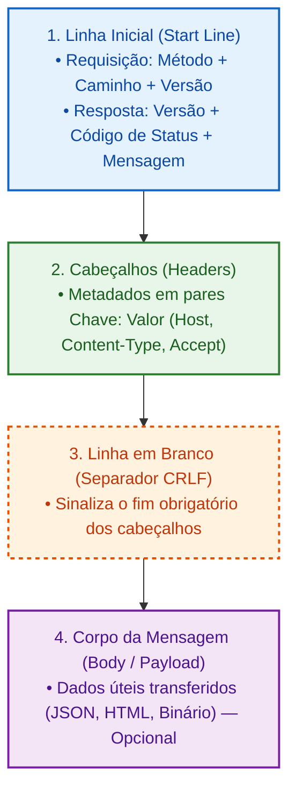
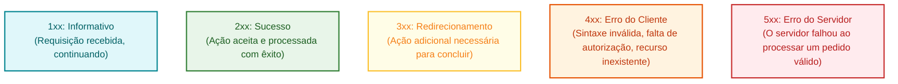
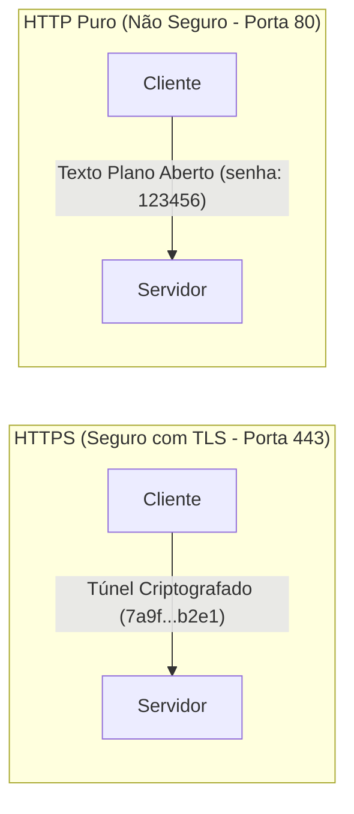
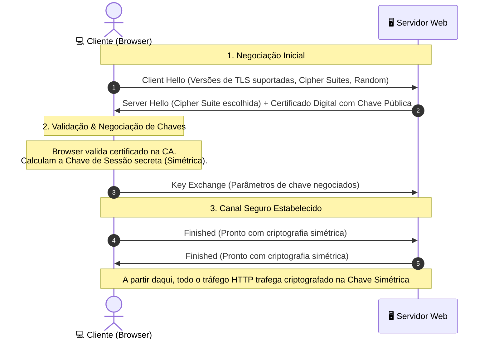

# 02. O Protocolo HTTP e HTTPS

No capítulo anterior, descobrimos como duas máquinas se localizam na Internet
através de seus endereços IP e estabelecem uma conexão de transporte estável
utilizando a _Stack_ TCP/IP.

No entanto, apenas abrir um canal de conexão não basta: é necessário que ambas
as máquinas falem o **mesmo idioma** para estruturar pedidos e interpretar
respostas. Se o cliente enviar bytes de forma aleatória, o servidor não saberá o
que fazer com eles.

É aqui que entra o **HTTP (_Hypertext Transfer Protocol_)**, o protocolo de
comunicação que move a Web. Neste capítulo, você aprenderá a anatomia de uma
mensagem HTTP, o papel de cada **Método**, as faixas semânticas de **Códigos de
Status**, os **Cabeçalhos** essenciais e como o **HTTPS** protege nossos dados
contra interceptações através da criptografia TLS.

## O Papel do HTTP na Rede

O HTTP é um protocolo que opera na **Camada de Aplicação** (acima do TCP/IP).
Ele define um formato de mensagens baseado em texto legível para permitir que
clientes solicitem recursos e servidores entreguem respostas.



Três características definem o funcionamento clássico do HTTP:

1. **Orientado a Requisição e Resposta:** O cliente envia uma mensagem
   solicitando uma ação e o servidor devolve uma resposta correspondente.
2. **_Stateless_ (Sem Estado Nativo):** Cada requisição é tratada de forma
   totalmente isolada. Por padrão, o servidor não "lembra" das requisições
   anteriores do mesmo usuário (veremos como solucionar isso no submódulo de
   Segurança & Sessão).
3. **Extensível por Cabeçalhos (_Headers_):** Permite enviar metadados sobre
   segurança, tipos de arquivo, idiomas aceitos e controle de cache sem alterar
   o corpo dos dados.

## Anatomia de uma Mensagem HTTP

Tanto as requisições quanto as respostas seguem uma estrutura padronizada em
quatro partes fundamentais:



### 1. Anatomia de uma Requisição (_HTTP Request_)

Quando seu código solicita dados para um servidor, o texto bruto trafegado na
rede tem esta forma:

```http
POST /api/v1/usuarios HTTP/1.1
Host: api.fatec.sp.gov.br
User-Agent: Mozilla/5.0 (Windows NT 10.0; Win64; x64)
Content-Type: application/json
Content-Length: 57
Accept: application/json

{
  "name": "Lucas Ferreira",
  "email": "lucas@fatec.sp.gov.br"
}
```

- **Linha de Requisição:** Contém o **Método** (`POST`), o **Caminho do
  Recurso** (`/api/v1/usuarios`) e a **Versão do Protocolo** (`HTTP/1.1`).
- **Cabeçalhos (_Headers_):** Metadados enviados como pares `Chave: Valor`.
  Informam o domínio de destino (`Host`), o tipo de dado enviado
  (`Content-Type`), o formato aceito como resposta (`Accept`) etc.
- **Linha em Branco:** Um caractere invisível de quebra de linha obrigatório que
  sinaliza o término dos cabeçalhos.
- **Corpo (_Body_):** O conteúdo útil (_payload_) que está sendo enviado (no
  exemplo, um objeto JSON).

### 2. Anatomia de uma Resposta (_HTTP Response_)

Quando o servidor processa a requisição, ele devolve uma mensagem formatada:

```http
HTTP/1.1 201 Created
Date: Mon, 07 Sep 2026 15:30:00 GMT
Server: nginx/1.24.0
Content-Type: application/json; charset=utf-8
Content-Length: 72

{
  "id": "usr-101",
  "name": "Lucas Ferreira",
  "status": "active"
}
```

- **Linha de Status:** Contém a **Versão** (`HTTP/1.1`), o **Código de Status**
  numérico (`201`) e a **Mensagem Textual** (`Created`).
- **Cabeçalhos de Resposta:** Metadados sobre a resposta gerada (`Content-Type`,
  `Date`, `Set-Cookie`, etc.).
- **Corpo (_Body_):** Os dados entregues pelo servidor (o JSON com o recurso
  criado, um documento HTML ou uma imagem binária).

## Os Métodos HTTP (Verbos)

Os métodos HTTP indicam a **ação e intenção** que o cliente deseja executar
sobre o recurso solicitado.

| Método        | Ação Pretendida                                         | Possui Body? | É Seguro? | É Idempotente? |
| :------------ | :------------------------------------------------------ | :----------: | :-------: | :------------: |
| **`GET`**     | Solicita a leitura e recuperação de um recurso          |    ❌ Não    |  ✅ Sim   |     ✅ Sim     |
| **`POST`**    | Envia dados para criação ou processamento               |    ✅ Sim    |  ❌ Não   |     ❌ Não     |
| **`PUT`**     | Substitui completamente o recurso no destino            |    ✅ Sim    |  ❌ Não   |     ✅ Sim     |
| **`PATCH`**   | Aplica modificações parciais a um recurso               |    ✅ Sim    |  ❌ Não   |     ❌ Não     |
| **`DELETE`**  | Remove o recurso especificado                           |   ❌ Raro    |  ❌ Não   |     ✅ Sim     |
| **`OPTIONS`** | Consulta as capacidades e métodos aceitos pelo servidor |    ❌ Não    |  ✅ Sim   |     ✅ Sim     |

> **Conceitos Fundamentais:**
>
> - **Método Seguro (_Safe Method_):** É aquele que apenas lê dados sem alterar
>   o estado no servidor. Fazer um milhão de requisições `GET` não deve mutar os
>   dados da aplicação.
> - **Método Idempotente (_Idempotent_):** É aquele em que executar a mesma
>   requisição uma ou múltiplas vezes consecutivas produz o **mesmo efeito
>   final** no servidor. Exemplo: Deletar o usuário `10` uma vez ou dez vezes
>   resulta no mesmo estado (o usuário não existe). Já o `POST` não é
>   idempotente, pois dez `POST` podem criar dez registros duplicados.

## Códigos de Status HTTP (_Status Codes_)

Os códigos de status são números de 3 dígitos divididos em **cinco faixas
semânticas**. O primeiro dígito define a categoria da resposta:



### Códigos Mais Utilizados na Prática

|  Código   | Nome Oficial            | Significado Prático                                                  |
| :-------: | :---------------------- | :------------------------------------------------------------------- |
| **`200`** | `OK`                    | Requisição bem-sucedida padrão (leitura ou atualização).             |
| **`201`** | `Created`               | Recurso criado com sucesso (típico de respostas a `POST`).           |
| **`204`** | `No Content`            | Sucesso, mas não há corpo para devolver (típico de `DELETE`).        |
| **`301`** | `Moved Permanently`     | A URL mudou de forma definitiva para outro endereço.                 |
| **`304`** | `Not Modified`          | O recurso não mudou desde a última busca (use a cópia em cache).     |
| **`400`** | `Bad Request`           | A requisição está malformada (erro de sintaxe ou validação).         |
| **`401`** | `Unauthorized`          | O cliente precisa se autenticar para acessar o recurso.              |
| **`403`** | `Forbidden`             | O cliente está autenticado, mas **não possui permissão** de acesso.  |
| **`404`** | `Not Found`             | O recurso solicitado não foi encontrado no servidor.                 |
| **`422`** | `Unprocessable Entity`  | A sintaxe está correta, mas há erros lógicos nos dados enviados.     |
| **`500`** | `Internal Server Error` | O servidor encontrou uma exceção não tratada ao processar o pedido.  |
| **`502`** | `Bad Gateway`           | Um servidor intermediário (proxy/gateway) recebeu resposta inválida. |
| **`503`** | `Service Unavailable`   | O servidor está sobrecarregado ou temporariamente em manutenção.     |
| **`504`** | `Gateway Timeout`       | O servidor intermediário não recebeu resposta a tempo do backend.    |

## Cabeçalhos Essenciais (_Headers_)

Os cabeçalhos funcionam como instruções de contexto para o cliente e o servidor:

### 1. Cabeçalhos de Conteúdo e Formato

- **`Content-Type`**: Indica o formato do arquivo que está sendo transportado no
  corpo da mensagem (ex: `application/json`, `text/html; charset=utf-8`,
  `multipart/form-data`).
- **`Accept`**: Informa ao servidor quais formatos o cliente é capaz de entender
  (ex: `Accept: application/json`).

### 2. Cabeçalhos de Autenticação e Segurança

- **`Authorization`**: Envia credenciais ou tokens de acesso (ex:
  `Authorization: Bearer eyJhbGciOi...`).
- **`Cookie`** e **`Set-Cookie`**: Mecanismo de envio e gravação de cookies para
  gestão de sessões.

### 3. Cabeçalhos de Infraestrutura e Roteamento

- **`Host`**: O domínio exato que está sendo solicitado (obrigatório em HTTP/1.1
  para permitir que um único servidor hospede múltiplos sites).
- **`User-Agent`**: Identifica o navegador, sistema operacional e biblioteca que
  originou o pedido.

## A Camada de Segurança: HTTP vs HTTPS

O HTTP clássico transmite todas as mensagens em **texto plano puro**. Se você
estiver conectado a uma rede Wi-Fi pública e fizer login em um site HTTP,
qualquer pessoa interceptando os pacotes da rede com ferramentas de análise
poderá ler sua senha em texto claro.



### O que é o HTTPS?

O **HTTPS (_Hypertext Transfer Protocol Secure_)** não é um protocolo separado,
mas sim o **HTTP convencional encapsulado dentro de um canal criptografado**
gerenciado pelo protocolo **TLS (_Transport Layer Security_)**.

O HTTPS garante a tríade de segurança da Web:

1. **Confidencialidade (Criptografia):** Ninguém no meio do caminho consegue ler
   o conteúdo das requisições ou respostas.
2. **Integridade:** Os pacotes não podem ser adulterados ou corrompidos por
   terceiros durante o trânsito.
3. **Autenticidade (Certificados Digitais):** Garante que você está conversando
   com o servidor legítimo da empresa, e não com um impostor. Isso é viabilizado
   por **Autoridades Certificadoras (CAs)** que emitem e assinam certificados
   digitais válidos para domínios.

<details>
<summary>🔍 <strong>Aprofundamento: Como funciona o TLS Handshake por baixo dos panos?</strong></summary>

Para estabelecer uma conexão HTTPS, o navegador e o servidor realizam uma
negociação inicial chamada **TLS Handshake** logo após a conexão TCP estar
aberta.

O grande trunfo da arquitetura do TLS é combinar **dois tipos de criptografia**:

1. **Criptografia Assimétrica (Par de Chaves Pública e Privada):** Usada
   **apenas durante o handshake** para autenticar a identidade do servidor e
   negociar os parâmetros com segurança.
2. **Criptografia Simétrica (Chave de Sessão Compartilhada):** Usada para
   criptografar **todas as requisições e respostas HTTP subsequentes**, por ser
   ordens de grandeza mais rápida e eficiente no consumo de CPU.



### O Passo a Passo Simplificado

1. **Client Hello:** O navegador se apresenta ao servidor informando quais
   versões do protocolo TLS e quais conjuntos de algoritmos criptográficos
   (_Cipher Suites_) ele suporta.
2. **Server Hello & Certificado:** O servidor escolhe o melhor algoritmo em
   comum e envia seu **Certificado Digital** (que contém a sua **Chave
   Pública**).
3. **Validação do Certificado:** O navegador consulta a cadeia de Autoridades
   Certificadoras (CAs) confiáveis do sistema operacional para confirmar que o
   certificado é autêntico, válido e pertence exatamente àquele domínio.
4. **Criação da Chave de Sessão:** Cliente e servidor utilizam troca de chaves
   (como Diffie-Hellman) para gerar uma **mesma Chave Secreta Simétrica** de
   sessão sem que ela precise trafegar aberta pela rede.
5. **Comunicação Criptografada:** Com a chave simétrica definida em ambos os
   lados, o túnel seguro está pronto. Todas as requisições e respostas HTTP
   subsequentes trafegam blindadas e em alta velocidade.

</details>

## O Que Vem a Seguir?

Agora que dominamos a estrutura do protocolo HTTP/HTTPS, seus métodos, status
codes e cabeçalhos, estamos prontos para consumir dados na prática utilizando
código TypeScript moderno no navegador.

No **[Capítulo 03: Consumo Nativo com a Fetch
API](03-fetch-api-e-consumo-nativo.md)**, vamos aprender a usar a função
`fetch()` nativa da plataforma web, tipar respostas, enviar requisições com
`POST`/`PUT`/`DELETE`, tratar erros de rede e cancelar requisições pendentes com
`AbortController`.

---

<a href="01-fundamentos-de-redes-na-web.md">← Fundamentos de Redes na Web</a>

<p align="right"><a href="03-fetch-api-e-consumo-nativo.md">Próximo: Consumo Nativo com a Fetch API →</a></p>
