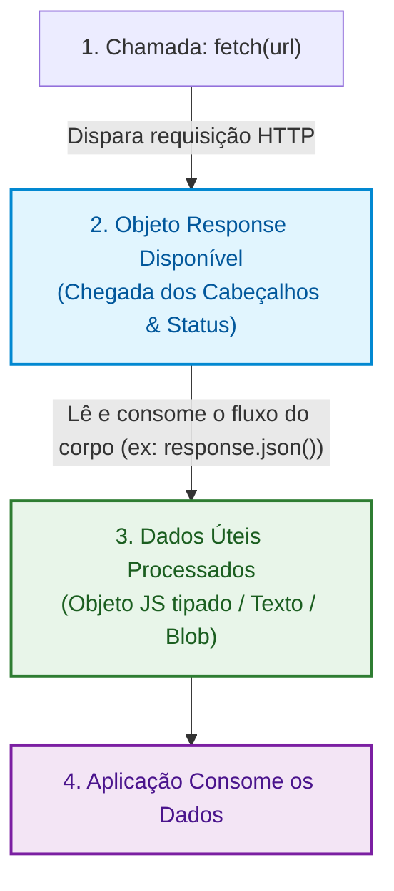
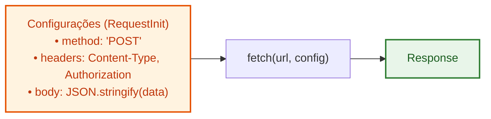

# 03. Consumo Nativo com a Fetch API

Nos capítulos anteriores, desvendamos como a Internet conecta máquinas através
de endereços IP e da _Stack_ TCP/IP, e aprendemos como estruturar mensagens no
protocolo HTTP/HTTPS utilizando métodos, códigos de status, cabeçalhos e túneis
criptografados com TLS.

Agora, chegou o momento de colocar essa teoria em prática no código.

Historicamente, realizar requisições HTTP no JavaScript do navegador exigia o
uso do prolixo e complexo objeto `XMLHttpRequest` ou a inclusão obrigatória de
bibliotecas externas como jQuery e Axios.

Hoje, os navegadores modernos e os novos ambientes de execução (Node.js 18+,
Deno e Bun) possuem uma interface nativa, padronizada e baseada em Promises para
comunicação HTTP: a **Fetch API**.

Neste capítulo, você aprenderá a dominar a função `fetch()` com TypeScript,
entender a sua execução em duas etapas, contornar a sua pegadinha mais comum de
tratamento de erros, tipar respostas e cancelar requisições com
`AbortController`.

## O Modelo Mental da Fetch API

A função `fetch()` inicia o processo de busca de um recurso na rede e devolve
uma **`Promise` que se resolve em um objeto `Response`**.

Uma característica essencial do `fetch` é que ele opera através de uma
**comunicação em duas etapas baseada em fluxos de dados (_Streams_)**:



Essa separação ocorre por uma razão de performance: assim que o servidor devolve
os **cabeçalhos e o código de status**, o primeiro `await` do `fetch()` já é
resolvido. O corpo da mensagem (_body_), que pode ser grande (como um JSON de
muitos megabytes ou uma imagem binária), é transferido aos poucos via _stream_ e
só é processado quando chamamos métodos como `.json()`, `.text()` ou `.blob()`.

## Realizando uma Requisição Básica (GET)

Para buscar dados de um recurso remoto, passamos a URL de destino como primeiro
argumento para `fetch()`.

Vamos ver a anatomia básica de uma função de busca tipada:

```typescript
// Contrato de dados esperado da API
interface UserProfile {
  id: number;
  name: string;
  email: string;
  role: "admin" | "student" | "instructor";
}

async function fetchUserProfile(userId: number): Promise<UserProfile> {
  // Etapa 1: Aguarda os cabeçalhos e status da resposta
  const response = await fetch(`https://api.fatec.sp.gov.br/users/${userId}`);

  // Etapa 2: Aguarda o download e conversão do corpo JSON
  const user = (await response.json()) as UserProfile;

  return user;
}
```

O código acima parece direto e intuitivo, mas esconde uma armadilha clássica que
pega muitos desenvolvedores desatentos.

## A Grande Pegadinha do `fetch`: Tratamento de Erros

Por considerarmos certos códigos de status como indicativos de falhas (como `404
Not Found` ou `500 Internal Server Error`), tendemos a acreditar que qualquer
resposta com um status fora da faixa de sucesso geraria um erro imediato no
código. Porém, na Fetch API, isso não acontece.

> Uma Promise retornada por `fetch()` **só é rejeitada se ocorrer uma falha de
> rede** (cabo desconectado, ausência de internet, falha de DNS ou bloqueio de
> segurança CORS). Se o servidor responder com status `404`, `401` ou `500`, a
> `Promise` **ainda será resolvida com sucesso**, pois a comunicação HTTP
> ocorreu normalmente!

### O Perigo do Código Ingênuo

Observe o que acontece quando confiamos apenas no `try/catch` padrão:

```typescript
// ❌ CÓDIGO PROBLEMÁTICO: Falhas HTTP (404/500) não caem no catch!
async function loadUserData(userId: number): Promise<void> {
  try {
    const response = await fetch(`https://api.fatec.sp.gov.br/users/${userId}`);

    // Se o usuário não existir (404), o código continua normalmente aqui!
    // response.json() tentará parsear a mensagem de erro do servidor
    const data = await response.json();

    console.log("Usuário carregado:", data);
  } catch (error) {
    // Esse catch SÓ roda se o usuário estiver offline ou a rede cair!
    console.error("Erro de conexão:", error);
  }
}
```

### A Solução Canônica: Checando `response.ok`

O objeto `Response` disponibiliza a propriedade booleana **`response.ok`**, que
retorna `true` se o código de status estiver na faixa de sucesso (**200 a 299**)
e `false` caso contrário.

```typescript
// ✅ CÓDIGO SEGURO E ROBUSTO: Valida status antes de consumir o corpo
interface UserProfile {
  id: number;
  name: string;
  email: string;
}

async function fetchUserProfile(userId: number): Promise<UserProfile> {
  const response = await fetch(`https://api.fatec.sp.gov.br/users/${userId}`);

  if (!response.ok) {
    // Interrompe o fluxo e dispara um erro com o status exato recebido
    throw new Error(
      `Erro na requisição: ${response.status} (${response.statusText})`,
    );
  }

  const data = (await response.json()) as UserProfile;
  return data;
}
```

Dessa forma, qualquer resposta fora da faixa de sucesso (como `400`, `401`,
`403`, `404` ou `500`) dispara uma exceção imediata que pode ser capturada por
quem chamou a função.

## Enviando Dados com `POST`, `PUT` e `DELETE`

Para enviar dados ou alterar recursos no servidor, passamos um segundo parâmetro
opcional para a função `fetch`: o objeto de configuração **`RequestInit`**.

Nesse objeto, configuramos o **método HTTP**, os **cabeçalhos de requisição** e
o **corpo da mensagem (_body_)**.



### 1. Criando um Recurso com `POST`

Ao enviar um payload JSON, precisamos sempre cumprir dois passos:

1. Definir o cabeçalho `'Content-Type': 'application/json'` para avisar o
   servidor sobre o formato.
2. Serializar o objeto JavaScript em texto usando `JSON.stringify()`.

```typescript
interface CreateUserDto {
  name: string;
  email: string;
}

interface UserCreatedResponse {
  id: number;
  name: string;
  email: string;
  createdAt: string;
}

async function createUser(
  payload: CreateUserDto,
): Promise<UserCreatedResponse> {
  const response = await fetch("https://api.fatec.sp.gov.br/users", {
    method: "POST",
    headers: {
      "Content-Type": "application/json",
      Accept: "application/json",
    },
    body: JSON.stringify(payload),
  });

  if (!response.ok) {
    throw new Error(`Falha ao criar usuário: status ${response.status}`);
  }

  const createdUser = (await response.json()) as UserCreatedResponse;
  return createdUser;
}
```

### 2. Removendo um Recurso com `DELETE`

Em muitas APIs, a resposta para um `DELETE` bem-sucedido retorna o status `204
No Content`, ou seja, a requisição deu certo mas não há corpo para converter em
JSON. Tentar rodar `response.json()` em um corpo vazio disparará um erro de
sintaxe.

Tratamos esse cenário verificando o status antes de tentar parsear o corpo:

```typescript
async function deleteUser(userId: number): Promise<void> {
  const response = await fetch(`https://api.fatec.sp.gov.br/users/${userId}`, {
    method: "DELETE",
  });

  if (!response.ok) {
    throw new Error(`Falha ao remover usuário: status ${response.status}`);
  }

  // Se o servidor retornar 204 No Content, não chamamos response.json()
  console.log(`Usuário ${userId} removido com sucesso.`);
}
```

## Cancelando Requisições com `AbortController`

Em aplicações web reais, há situações frequentes em que uma requisição em
andamento precisa ser **cancelada**:

- O usuário digita em um campo de busca por autocompletar e cada nova tecla
  invalida a requisição anterior.
- O usuário navega para outra página antes que os dados da página atual terminem
  de carregar.
- A requisição demora mais tempo do que o aceitável e queremos estipular um
  **timeout** de segurança.

A plataforma Web fornece a interface nativa **`AbortController`** para gerenciar
cancelamentos de operações assíncronas.

### Anatomia do `AbortController`

```typescript
// 1. Instanciamos o controlador
const controller = new AbortController();

// 2. Passamos o sinal de cancelamento (signal) para o fetch
fetch("https://api.fatec.sp.gov.br/reports/anual", {
  signal: controller.signal,
});

// 3. Em qualquer momento futuro, podemos cancelar a requisição:
controller.abort();
```

Quando `controller.abort()` é acionado, a requisição é interrompida
imediatamente no navegador e o `fetch()` rejeita a Promise com um erro do tipo
**`AbortError`**.

### Implementando Timeout de Requisição com `AbortSignal.timeout`

Nos navegadores modernos e no Node.js 18+, podemos estipular um tempo limite
máximo de forma extremamente sucinta com `AbortSignal.timeout(ms)`:

```typescript
interface SystemStatus {
  online: boolean;
  version: string;
}

async function fetchHealthCheck(): Promise<SystemStatus> {
  try {
    // Cancela automaticamente se a requisição demorar mais de 3 segundos (3000ms)
    const response = await fetch("https://api.fatec.sp.gov.br/health", {
      signal: AbortSignal.timeout(3000),
    });

    if (!response.ok) {
      throw new Error(`Status inválido: ${response.status}`);
    }

    return (await response.json()) as SystemStatus;
  } catch (error: unknown) {
    if (error instanceof Error && error.name === "TimeoutError") {
      console.error("A requisição expirou após 3 segundos de espera.");
    } else if (error instanceof Error && error.name === "AbortError") {
      console.error("A requisição foi cancelada manualmente.");
    } else {
      console.error("Erro inesperado:", error);
    }
    throw error;
  }
}
```

<details>
<summary>🔍 <strong>Aprofundamento: Envio de Arquivos e Formulários com FormData</strong></summary>

Quando precisamos fazer upload de arquivos ou enviar dados de formulários que
contenham fotos e anexos binários, o formato `application/json` não é o mais
adequado. Nesses casos, usamos a API nativa **`FormData`**.

```typescript
async function uploadAvatar(userId: number, file: File): Promise<void> {
  const formData = new FormData();
  formData.append("avatar", file);
  formData.append("userId", String(userId));

  const response = await fetch("https://api.fatec.sp.gov.br/uploads", {
    method: "POST",
    // ⚠️ REGRA DE OURO: NUNCA defina o cabeçalho 'Content-Type' manualmente ao usar FormData!
    // O navegador se encarrega de gerar o cabeçalho 'multipart/form-data'
    // com o 'boundary' delimitador exclusivo correto automaticamente.
    body: formData,
  });

  if (!response.ok) {
    throw new Error(`Falha no upload: status ${response.status}`);
  }
}
```

</details>

## O Que Vem a Seguir?

A Fetch API resolve com maestria o modelo tradicional de requisição e resposta
onde o cliente toma a iniciativa de pedir dados ao servidor.

No entanto, o que acontece quando o **servidor precisa enviar notificações
espontâneas e em tempo real para o cliente**, como em um chat online, em um feed
financeiro ou em um placar de jogo ao vivo?

No **[Capítulo 04: WebSockets e Server-Sent Events](04-websockets-e-sse.md)**,
vamos descobrir as limitações do HTTP para cenários em tempo real e como
protocolos como **WebSockets** e **SSE (_Server-Sent Events_)** resolvem a
comunicação contínua e bidirecional na Web moderna.

---

<a href="02-o-protocolo-http-e-https.md">← O Protocolo HTTP e HTTPS</a>

<p align="right"><a href="04-websockets-e-sse.md">Próximo: WebSockets e Server-Sent Events →</a></p>
