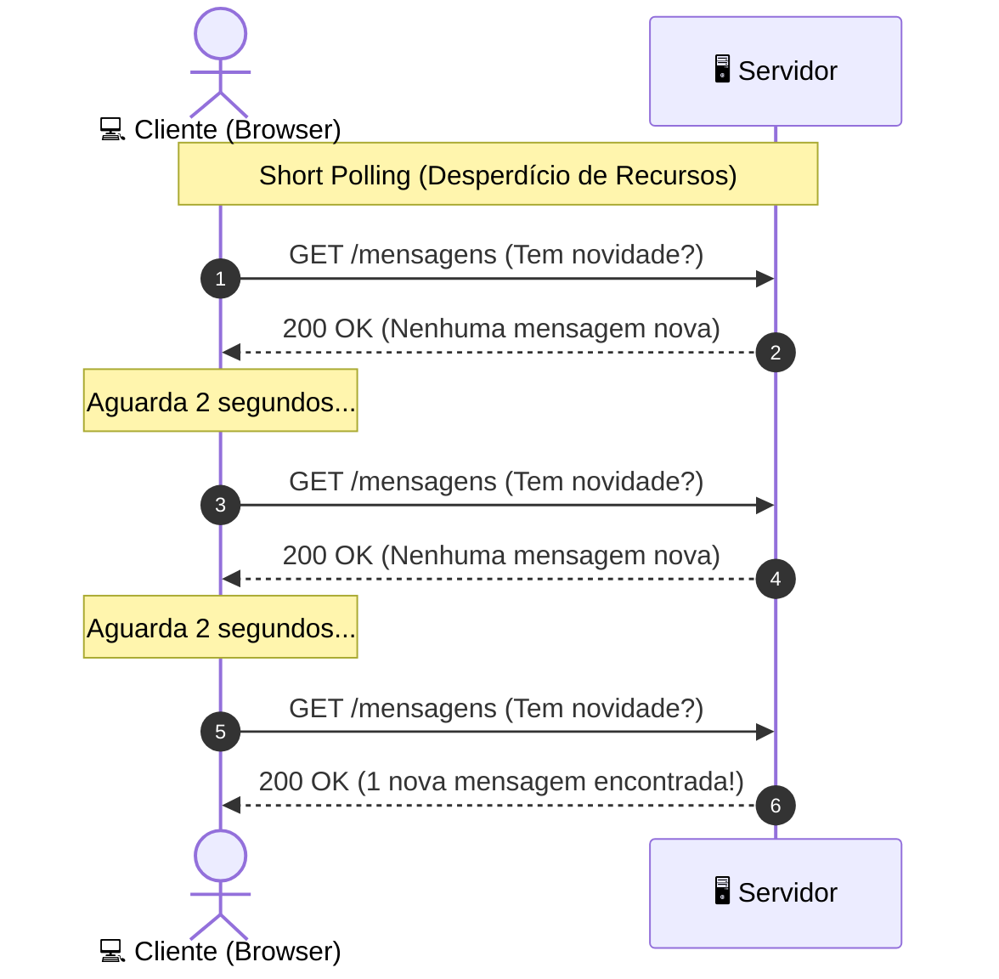
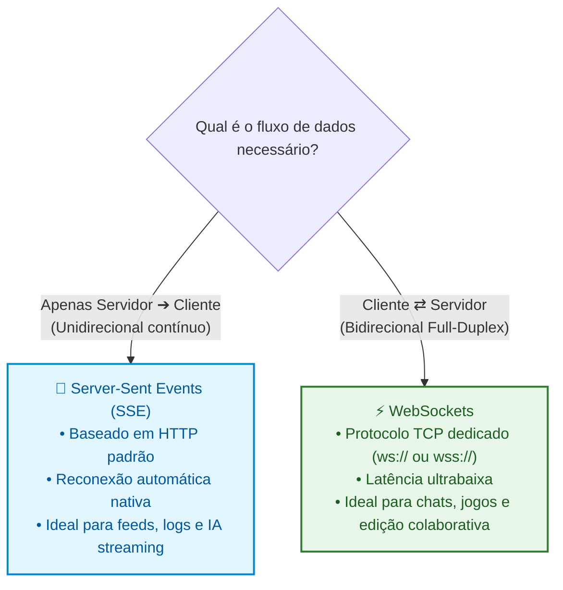
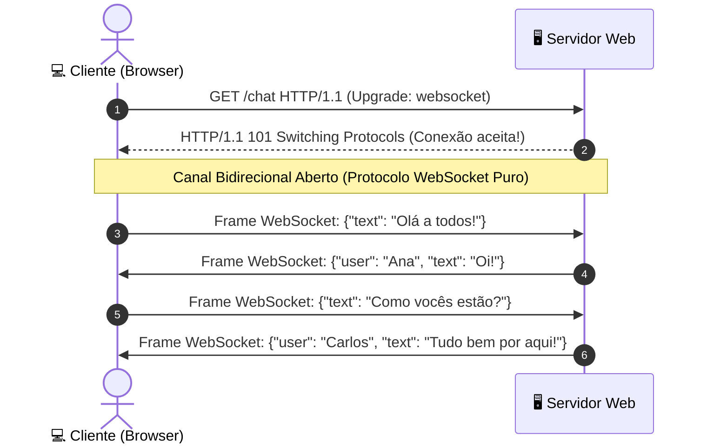

# 04. WebSockets e Server-Sent Events (SSE)

Até aqui, exploramos a Web através da lente do **HTTP clássico**: um modelo de
comunicação estritamente orientado a **requisição e resposta**, onde o cliente
toma a iniciativa de pedir um recurso e o servidor responde de forma pontual.

Esse modelo atende com perfeição à grande maioria das interações na Web. No
entanto, pense em aplicações modernas com as quais você interage todos os dias:

- Um **chat em tempo real** onde mensagens de outros usuários devem aparecer
  instantaneamente na sua tela.
- Um **documento colaborativo** (como o Google Docs) onde você vê o cursor e as
  edições de colegas em tempo real.
- Uma **transmissão de respostas de IA generativa** que chegam palavra por
  palavra (_token streaming_).
- Um **painel financeiro ou placar de jogo** com atualizações a cada segundo.

Se dependêssemos apenas do `fetch()`, como o navegador saberia que há um novo
dado disponível no servidor se o cliente não fizer uma nova requisição?

Neste capítulo, você entenderá por que o HTTP tradicional sofre em cenários de
tempo real, conhecerá a técnica legada de _Polling_ e aprenderá a utilizar as
duas tecnologias nativas da Web para dados em tempo real: **Server-Sent Events
(SSE)** e **WebSockets**.

## O Desafio do Tempo Real: Por que o HTTP Puro não Basta?

No HTTP tradicional, o servidor **não pode iniciar uma conversa**. Ele só fala
quando é perguntado.

Historicamente, antes do surgimento de padrões modernos, os desenvolvedores
recorriam ao **_Short Polling_**: o cliente executava requisições `fetch()`
repetidas em um intervalo curto (por exemplo, a cada 2 segundos) para perguntar:
_"Tem novidade? E agora? E agora?"_.



Embora simples de implementar, o _Polling_ traz problemas graves de escala:

1. **Desperdício Massivo de Banda:** Milhares de requisições e respostas
   trafegam pela rede apenas com cabeçalhos repetidos e corpos vazios.
2. **Sobrecarga no Servidor:** O backend gasta CPU e conexões de banco de dados
   processando consultas desnecessárias.
3. **Latência Inevitável:** Se uma mensagem chega no servidor 100ms após a
   última consulta, o usuário só a receberá quando o próximo intervalo do
   `setInterval` disparar.

Para resolver essas dores, a plataforma Web padronizou duas abordagens nativas:



## Server-Sent Events (SSE): O Fluxo Unidirecional

O **Server-Sent Events (SSE)** é uma tecnologia baseada em HTTP padrão que
permite ao servidor manter uma conexão aberta e **empurrar eventos de texto**
continuamente para o navegador.

O servidor responde com o cabeçalho especial `Content-Type: text/event-stream`.
A partir desse momento, a conexão não é encerrada: o servidor envia novos blocos
de texto sempre que houver novidades.

### Consumindo SSE no Navegador com a API `EventSource`

O navegador fornece a interface nativa **`EventSource`**, que simplifica
drasticamente o consumo desse fluxo e possui **reconexão automática nativa**: se
a conexão cair por instabilidade de rede, o navegador tenta se reconectar
sozinho sem que você precise escrever uma única linha extra de código.

```typescript
interface StockQuote {
  symbol: string;
  price: number;
  updatedAt: string;
}

function listenToStockUpdates(symbol: string): () => void {
  // 1. Abre a conexão contínua com o endpoint SSE
  const eventSource = new EventSource(
    `https://api.fatec.sp.gov.br/stocks/stream?symbol=${symbol}`,
  );

  // 2. Escuta mensagens padrão enviadas pelo servidor
  eventSource.onmessage = (event: MessageEvent<string>) => {
    const quote = JSON.parse(event.data) as StockQuote;
    console.log(
      `[${quote.symbol}] Nova cotação: R$ ${quote.price.toFixed(2)} às ${quote.updatedAt}`,
    );
  };

  // 3. Escuta eventos customizados nomeados pelo servidor
  eventSource.addEventListener(
    "market-alert",
    (event: MessageEvent<string>) => {
      console.warn("Alerta de mercado recebido:", event.data);
    },
  );

  // 4. Trata erros ou perda de conexão temporária
  eventSource.onerror = (error) => {
    console.error(
      "Falha no canal SSE. O navegador tentará reconectar automaticamente...",
      error,
    );
  };

  // 5. Retorna uma função de limpeza para fechar a conexão quando não for mais necessária
  return () => {
    console.log("Fechando canal SSE...");
    eventSource.close();
  };
}
```

### Principais Vantagens do SSE

- **Baseado em HTTP puro:** Atravessa firewalls corporativos, proxies e
  balanceadores de carga sem configurações especiais de rede.
- **Reconexão Automática com ID de Evento:** Se a conexão cair, o navegador
  envia o cabeçalho `Last-Event-ID` na reconexão para que o servidor retome
  exatamente de onde parou.
- **Leve e Simples:** Ideal para consumo somente de leitura (IA _streaming_,
  feeds de notícias, notificações de sistemas).

## WebSockets: O Canal Bidirecional _Full-Duplex_

Quando o cliente não apenas assiste a um fluxo, mas também precisa **enviar
dados com altíssima frequência e baixa latência** para o servidor, o SSE e o
HTTP não são suficientes.

O **WebSocket** é um protocolo de comunicação independente (padronizado pela RFC 6455) que estabelece um canal **_Full-Duplex_** (ambos os lados transmitem e
recebem mensagens simultaneamente) sobre uma única conexão TCP persistente.

### O _Handshake_ de Upgrade do WebSocket

A conexão começa como uma requisição HTTP tradicional contendo um cabeçalho
especial `Upgrade: websocket`. Se o servidor aceitar, ele responde com o status
`101 Switching Protocols`.

A partir desse instante, a conexão deixa de usar o protocolo HTTP e passa a
trafegar mensagens WebSocket puras com prefixo **`ws://`** (inseguro) ou
**`wss://`** (seguro com TLS/HTTPS).



### Implementando um Cliente WebSocket com TypeScript

O navegador oferece a classe nativa **`WebSocket`** para interagir com o canal:

```typescript
interface OutgoingChatMessage {
  type: "chat_message";
  room: string;
  content: string;
}

interface IncomingEvent {
  type: "user_joined" | "chat_message" | "user_left";
  author: string;
  content?: string;
  timestamp: string;
}

class ChatClient {
  private socket: WebSocket | null = null;

  public connect(url: string): void {
    // Abre a conexão WebSocket segura
    this.socket = new WebSocket(url);

    // Evento disparado quando o handshake é concluído com sucesso
    this.socket.onopen = () => {
      console.log("Conectado ao servidor de chat em tempo real!");
    };

    // Evento disparado a cada mensagem recebida do servidor
    this.socket.onmessage = (event: MessageEvent<string>) => {
      const message = JSON.parse(event.data) as IncomingEvent;
      this.handleIncomingMessage(message);
    };

    // Evento disparado em caso de erro na comunicação
    this.socket.onerror = (error) => {
      console.error("Erro no WebSocket:", error);
    };

    // Evento disparado quando a conexão é finalizada
    this.socket.onclose = (event: CloseEvent) => {
      console.log(
        `Conexão encerrada (Código: ${event.code}, Razão: ${event.reason ?? "N/A"})`,
      );
    };
  }

  public sendMessage(room: string, content: string): void {
    // Valida se o canal está realmente aberto antes de enviar
    if (!this.socket || this.socket.readyState !== WebSocket.OPEN) {
      throw new Error(
        "Não é possível enviar mensagem: o WebSocket não está conectado.",
      );
    }

    const payload: OutgoingChatMessage = {
      type: "chat_message",
      room,
      content,
    };

    // Envia o dado serializado como string JSON
    this.socket.send(JSON.stringify(payload));
  }

  public disconnect(): void {
    if (this.socket) {
      this.socket.close(1000, "Desconexão solicitada pelo usuário");
      this.socket = null;
    }
  }

  private handleIncomingMessage(message: IncomingEvent): void {
    switch (message.type) {
      case "chat_message":
        console.log(`💬 [${message.author}]: ${message.content}`);
        break;
      case "user_joined":
        console.log(`👋 ${message.author} entrou na sala.`);
        break;
      case "user_left":
        console.log(`🚪 ${message.author} saiu da sala.`);
        break;
    }
  }
}
```

## Tabela Comparativa: Qual Tecnologia Escolher?

| Característica          | Fetch API (HTTP/HTTPS)             | Server-Sent Events (SSE)             | WebSockets (WS/WSS)                 |
| :---------------------- | :--------------------------------- | :----------------------------------- | :---------------------------------- |
| **Direção do Fluxo**    | Unidirecional (Cliente ➔ Servidor) | Unidirecional (Servidor ➔ Front)     | **Bidirecional** (Ambos os lados)   |
| **Protocolo**           | HTTP/1.1, HTTP/2, HTTP/3           | HTTP padrão sobre TLS                | Protocolo WebSocket dedicado        |
| **Tipo de Dados**       | JSON, Texto, Binário, Multipart    | **Texto puro** (geralmente JSON)     | Texto e Binários (`ArrayBuffer`)    |
| **Reconexão Nativa**    | ❌ Não (manual via código)         | ✅ **Sim (automática pelo browser)** | ❌ Não (deve ser implementada)      |
| **Complexidade Infra**  | Mínima (suporte universal)         | Baixa (funciona em HTTP comum)       | Média/Alta (exige servidores state) |
| **Casos de Uso Ideais** | CRUDs, formulários, APIs REST      | IA _streaming_, feeds de notícias    | Chats, jogos, edição colaborativa   |

<details>
<summary>🔍 <strong>Aprofundamento: Estratégia de Reconexão e Heartbeat em WebSockets</strong></summary>

Diferente do `EventSource` (SSE), a API nativa de `WebSocket` **não se reconecta
automaticamente** quando a rede oscila ou o servidor reinicia.

Em aplicações de produção, os desenvolvedores implementam duas técnicas
fundamentais:

1. **Reconexão com _Exponential Backoff_:** Quando o evento `onclose` dispara, o
   cliente agenda uma nova tentativa de conexão esperando um tempo progressivo
   (ex: 1s, 2s, 4s, 8s até um teto de 30s) para evitar sobrecarregar o servidor
   em caso de queda geral.
2. **Heartbeat (_Ping/Pong_):** O cliente envia periodicamente uma pequena
   mensagem `{ type: "ping" }` (a cada 30 segundos) e espera uma resposta `{
type: "pong" }`. Se a resposta não chegar em alguns segundos, o cliente assume
   que a conexão está "morta silenciosamente" (comum em redes móveis 4G/5G) e
   força o fechamento para iniciar a reconexão.

</details>

## O Que Vem a Seguir?

Com este capítulo, concluímos o **Submódulo 01: Comunicação & Protocolos**.
Agora você possui uma base sólida sobre a infraestrutura da Web: desde o tráfego
de pacotes e resolução DNS até a anatomia de requisições HTTP, o consumo prático
com a Fetch API e a comunicação em tempo real com SSE e WebSockets.

No próximo submódulo, mudaremos o foco da rede para a tela do usuário.

No **[Submódulo 02: Manipulação do
DOM](../02-manipulacao-do-dom/01-a-arvore-do-dom-e-renderizacao.md)**, vamos
desvendar como o navegador transforma arquivos HTML e CSS na **Árvore do DOM**,
entender o custo computacional de renderização e aprender a interagir com
elementos da interface de forma reativa e tipada com TypeScript.

---

<a href="03-fetch-api-e-consumo-nativo.md">← Consumo Nativo com a Fetch API</a>

<p align="right"><a href="../02-manipulacao-do-dom/01-a-arvore-do-dom-e-renderizacao.md">Próximo: A Árvore do DOM e Renderização →</a></p>
