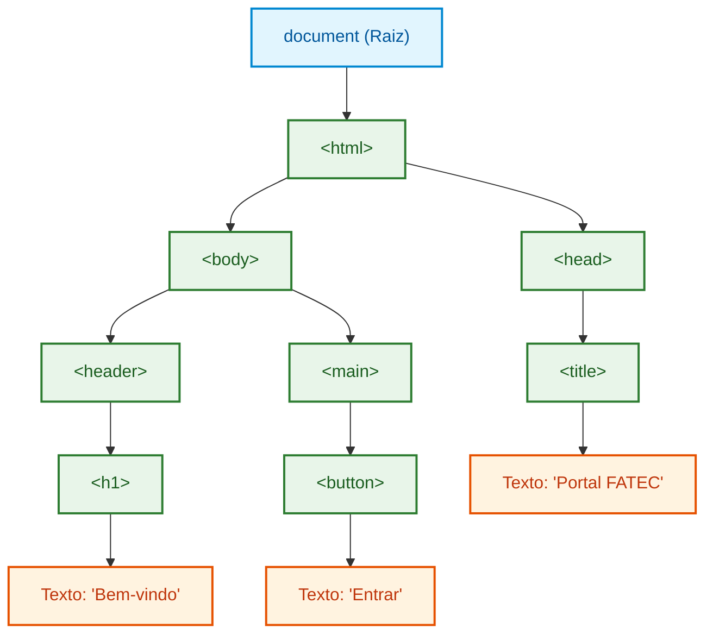
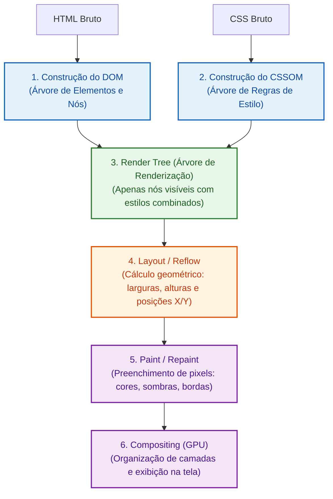
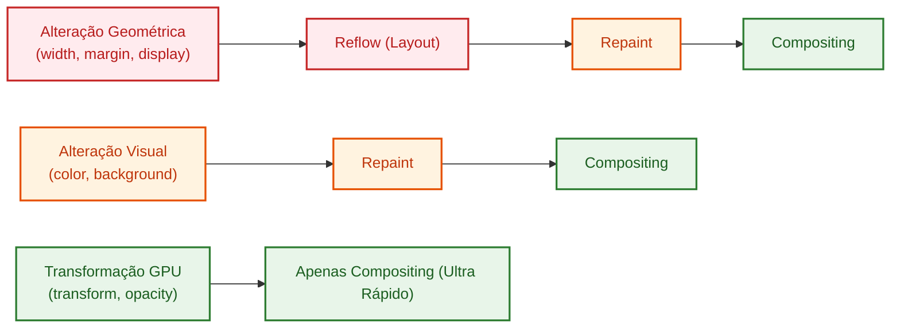

# 01. A Árvore do DOM e o Pipeline de Renderização

Quando você acessa um site, o servidor entrega ao navegador um fluxo de texto
bruto contendo código HTML e folhas de estilo CSS.

No entanto, texto plano é estático. Uma linguagem de programação como o
JavaScript não consegue anexar ouvintes de clique, ler valores digitados em um
formulário ou alternar cores de forma eficiente operando sobre uma simples
string de caracteres.

Para tornar a página interativa e dinâmica, o navegador analisa o código HTML e
constrói na memória uma estrutura viva e orientada a objetos: o **Document
Object Model (DOM)**.

Neste capítulo, você entenderá o que é a **Árvore do DOM**, como o navegador
transforma código em pixels na tela através do **Pipeline de Renderização**, e o
custo computacional por trás de operações de **_Reflow_** e **_Repaint_**.

## O Que é o DOM?

O **DOM (_Document Object Model_)** é a representação orientada a objetos em
memória do documento HTML carregado no navegador.

Ele funciona como uma **ponte viva** entre o código JavaScript e a interface
visual: cada tag HTML, atributo e trecho de texto se transforma em um **nó
(_Node_)** conectado em uma estrutura hierárquica de árvore.



No JavaScript, o ponto de entrada global para interagir com essa árvore é o
objeto **`document`**, que expõe métodos e propriedades para buscar, criar,
alterar e remover elementos em tempo real.

### A Hierarquia de Tipos de Nós

Nem tudo no DOM é um elemento visual. A especificação do DOM define uma árvore
de herança para os nós:

- **`Node`:** A interface base universal de qualquer nó da árvore.
- **`Element`:** Um nó que representa uma tag HTML genérica (como `<div>`,
  `<p>`, `<section>`).
- **`HTMLElement`:** Elementos específicos da Web com propriedades e estilos do
  navegador (como `HTMLButtonElement`, `HTMLInputElement`).
- **`Text`:** O conteúdo textual dentro de uma tag.
- **`Comment`:** Comentários HTML (`<!-- comentário -->`) que também ocupam nós
  na árvore.

## O Pipeline Crítico de Renderização

Para desenhar uma página na tela, o navegador não apenas lê o DOM, mas executa
uma sequência rigorosa de etapas conhecida como **_Critical Rendering Path_**
(Caminho Crítico de Renderização):



### O Que Acontece em Cada Etapa?

1. **DOM Tree:** O navegador faz o _parse_ do HTML e cria a árvore de elementos.
2. **CSSOM Tree (_CSS Object Model_):** O navegador processa as regras de estilo
   e calcula quais classes afetam quais seletores.
3. **_Render Tree_:** Combina o DOM com o CSSOM. Elementos que não aparecem na
   tela (como tags `<head>`, `<script>` ou elementos com `display: none`) são
   completamente descartados dessa árvore.
4. **Layout (_Reflow_):** O motor geométrico calcula o tamanho exato de cada
   caixa e suas coordenadas `(x, y)` relativas à janela (_viewport_).
5. **Paint (_Repaint_):** O navegador transforma as caixas geométricas em pixels
   reais, desenhando cores de fundo, sombras, textos e bordas.
6. **Compositing:** As diferentes camadas da página são enviadas para a GPU
   (Placa de Vídeo) para serem sobrepostas e exibidas na tela do usuário.

## O Custo da Manipulação: _Reflow_ vs _Repaint_

Quando nosso código JavaScript altera o DOM em tempo de execução, o navegador é
forçado a recalcular partes do pipeline de renderização.

Nem toda alteração tem o mesmo custo computacional:



### 1. _Reflow_ (Layout Threshing) — O Mais Pesado

Ocorre sempre que uma mudança altera a **geometria, o tamanho ou a posição** de
um elemento na página. Como o fluxo do documento é conectado, alterar o tamanho
de uma caixa pode empurrar todos os outros elementos abaixo dela, forçando o
recalculo de boa parte da árvore.

**Gatilhos comuns de Reflow:**

- Inserir ou remover nós do DOM.
- Alterar propriedades geométricas: `width`, `height`, `padding`, `margin`,
  `font-size`, `display`.
- Redimensionar a janela do navegador.
- Ler propriedades que forçam medição imediata: `element.offsetWidth`,
  `element.clientHeight`, `element.getBoundingClientRect()`, `window.scrollY`.

### 2. _Repaint_ (Pintura) — Custo Moderado

Ocorre quando a aparência visual de um elemento muda **sem alterar suas
dimensões espaciais**. O layout não precisa ser recalculado, mas o navegador
precisa repintar os pixels daquele elemento.

**Gatilhos comuns de Repaint:**

- Alterar `color`, `background-color`, `border-color`.
- Alterar `visibility: hidden` (o elemento ainda ocupa espaço, mas não é visto).
- Alterar sombras (`box-shadow`, `text-shadow`).

### 3. Apenas _Compositing_ — O Mais Eficiente

Certas propriedades modernas são processadas diretamente pela GPU sem disparar
_Reflow_ nem _Repaint_:

- **`transform`** (`translate`, `scale`, `rotate`)
- **`opacity`**

Por isso, animações fluidas a 60/120 FPS na Web moderna utilizam `transform` e
`opacity` em vez de manipular `top`, `left` ou `margin`.

## Comparativo de Impacto no Desempenho

| Propriedade Alterada                     | Dispara Reflow? | Dispara Repaint? | Custo de Performance |
| :--------------------------------------- | :-------------: | :--------------: | :------------------: |
| `element.style.width = '200px'`          |     ✅ Sim      |      ✅ Sim      |  🔴 Alto (Gargalo)   |
| `element.style.margin = '20px'`          |     ✅ Sim      |      ✅ Sim      |  🔴 Alto (Gargalo)   |
| `element.appendChild(newDiv)`            |     ✅ Sim      |      ✅ Sim      |  🔴 Alto (Gargalo)   |
| `element.style.color = '#0070f3'`        |     ❌ Não      |      ✅ Sim      |       🟡 Médio       |
| `element.style.backgroundColor = 'red'`  |     ❌ Não      |      ✅ Sim      |       🟡 Médio       |
| `element.style.transform = 'scale(1.2)'` |     ❌ Não      |      ❌ Não      |   🟢 Mínimo (GPU)    |
| `element.style.opacity = '0.5'`          |     ❌ Não      |      ❌ Não      |   🟢 Mínimo (GPU)    |

<details>
<summary>🔍 <strong>Aprofundamento: Otimização em Lote com DocumentFragment</strong></summary>

Se você precisar inserir 500 itens em uma lista, adicionar um por um dentro de
um laço de repetição causará 500 reflows consecutivos, travando a interface.

Para evitar isso, usamos a interface nativa **`DocumentFragment`**, que funciona
como um container leve em memória. Montamos todos os nós dentro do fragmento e o
inserimos no DOM real **uma única vez**:

```typescript
// ❌ CÓDIGO INEFICIENTE: 500 inserções diretas no DOM (500 Reflows)
function renderBadList(container: HTMLElement, items: string[]): void {
  for (const item of items) {
    const li = document.createElement("li");
    li.textContent = item;
    container.appendChild(li); // Força reflow a cada iteração!
  }
}

// ✅ CÓDIGO PERFORMÁTICO: Constrói em memória e anexa de uma só vez (1 Reflow)
function renderOptimizedList(container: HTMLElement, items: string[]): void {
  // Cria um fragmento virtual em memória (sem custo de renderização)
  const fragment = document.createDocumentFragment();

  for (const item of items) {
    const li = document.createElement("li");
    li.textContent = item;
    fragment.appendChild(li); // Anexa ao fragmento na memória
  }

  // Despeja todos os 500 elementos de uma única vez no DOM real
  container.appendChild(fragment);
}
```

</details>

## O Que Vem a Seguir?

Agora que você compreende a estrutura em árvore do DOM e como o navegador
processa cada alteração na tela, estamos prontos para manipular esses nós
utilizando TypeScript.

No **[Capítulo 02: Seleção e Manipulação com
TypeScript](02-selecao-e-manipulacao-com-typescript.md)**, você aprenderá a
selecionar elementos com `querySelector`, criar e injetar nós com segurança,
manipular classes e atributos, e utilizar a tipagem estrita do TypeScript para
evitar erros em tempo de execução.

---

<a href="../comunicacao-e-protocolos/04-websockets-e-sse.md">← WebSockets e
Server-Sent Events</a>

<p align="right"><a href="02-selecao-e-manipulacao-com-typescript.md">Próximo: Seleção e Manipulação com TypeScript →</a></p>
