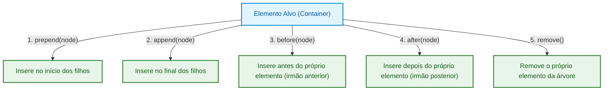

# 02. Seleção e Manipulação com TypeScript

No capítulo anterior, descobrimos que o DOM é uma representação em árvore de
objetos que vive na memória do navegador.

No JavaScript tradicional, interagir com o DOM pode ser uma fonte frequente de
erros em tempo de execução. Era muito comum receber mensagens como `Cannot read
properties of null` ao tentar acessar uma propriedade ou chamar um método de um
elemento que não foi encontrado na página, ou tentar ler uma propriedade
específica (como `.value`) em um elemento genérico que não possui esse campo.

Com o TypeScript, a manipulação do DOM ganha uma camada essencial de **segurança
de tipos**. O compilador possui definições completas de toda a hierarquia de
elementos HTML do navegador (`HTMLInputElement`, `HTMLButtonElement`,
`HTMLAnchorElement` etc.), permitindo que erros de digitação e acessos nulos
sejam identificados antes mesmo do código rodar.

Neste capítulo, você aprenderá a selecionar nós com precisão, tratar a ausência
de elementos com _Type Narrowing_, criar e injetar elementos de forma segura
contra vulnerabilidades XSS, e gerenciar classes, atributos e estilos.

## Seleção de Elementos e Inferência de Tipos

Para buscar nós na árvore do DOM, a plataforma moderna utiliza dois métodos
principais baseados em seletores CSS:

- **`document.querySelector(selector)`:** Retorna o **primeiro** elemento
  correspondente ao seletor CSS, ou `null` se nada for encontrado.
- **`document.querySelectorAll(selector)`:** Retorna uma **`NodeList`** com
  todos os elementos correspondentes encontrados.

### Como o TypeScript Infere o Tipo do Elemento?

O TypeScript possui um mapa interno de tags HTML. Quando você passa o nome de
uma tag simples, o compilador infere o tipo exato do elemento automaticamente:

```typescript
// O TypeScript infere automaticamente: HTMLButtonElement | null
const submitBtn = document.querySelector("button");

// O TypeScript infere automaticamente: HTMLInputElement | null
const emailField = document.querySelector("input");

// O TypeScript infere automaticamente: HTMLAnchorElement | null
const homeLink = document.querySelector("a");
```

No entanto, quando utilizamos seletores complexos (como classes CSS ou IDs), o
TypeScript não tem como adivinhar qual tag HTML específica possui aquela classe.
Nesses casos, ele infere o tipo genérico `Element | null`:

```typescript
// Inferido como: Element | null (não possui propriedades como .value ou .href!)
const card = document.querySelector(".user-card");
```

### Especificando Tipos com Generics e Type Narrowing

Para acessar propriedades exclusivas de um elemento específico (por exemplo,
`.value` de um input ou `.disabled` de um botão) ao usar seletores por classe ou
ID, temos duas abordagens:

#### Abordagem 1: Generics no `querySelector`

Você pode passar o tipo desejado como argumento genérico para informar ao
compilador o que você espera encontrar:

```typescript
// Tipo inferido pelo compilador: HTMLInputElement | null
const searchInput = document.querySelector<HTMLInputElement>("#search-box");

if (searchInput) {
  console.log("Termo buscado:", searchInput.value);
}
```

> **Generics não existem em tempo de execução (_runtime_)!**
>
> Ao usar `<HTMLInputElement>`, você está apenas dizendo ao compilador: _"Confie
> em mim, o elemento com esse ID é um campo de input"_. Se por engano o HTML
> contiver uma `<div id="search-box">`, o TypeScript não acusará erro durante a
> compilação, mas em execução `searchInput.value` retornará `undefined` porque
> divs não possuem a propriedade `value`.

#### Abordagem 2: Validação Defensiva com `instanceof` (Recomendada)

A forma mais robusta e segura é checar o tipo em tempo de execução com o
operador nativo **`instanceof`**. Como essa verificação roda de verdade no
JavaScript do navegador, ela elimina qualquer discrepância entre o que o
compilador imagina e o que realmente existe no DOM:

```typescript
const element = document.querySelector("#user-age");

// Valida existência E tipo real do nó na árvore
if (element instanceof HTMLInputElement) {
  // Aqui dentro, o TypeScript garante 100% que 'element' é um HTMLInputElement não-nulo
  console.log("Idade digitada:", element.valueAsNumber);
} else {
  console.warn("Elemento não encontrado ou não é um campo de input.");
}
```

## Criando e Injetando Elementos no DOM

Para construir interfaces dinâmicas, podemos criar novos nós na memória e
anexá-los à árvore existente.

### 1. Criação de Elementos com `document.createElement`

O método `document.createElement('tag')` retorna instantaneamente o tipo exato
do elemento criado:

```typescript
const cardContainer = document.createElement("article"); // HTMLArticleElement (HTMLElement)
const title = document.createElement("h2"); // HTMLHeadingElement
const actionBtn = document.createElement("button"); // HTMLButtonElement
```

### 2. Inserindo Conteúdo: `textContent` vs `innerHTML`

Ao definir o texto de um elemento, a escolha da propriedade é crucial para a
segurança da aplicação:

- **`textContent` (Seguro ✅):** Trata todo o valor estritamente como texto puro.
  Se o texto contiver `<script>` ou tags maliciosas, elas serão exibidas como
  texto literal, sem serem interpretadas como código HTML pelo navegador.
- **`innerHTML` (Perigoso ⚠️):** Interpreta o texto como HTML. Se você injetar
  dados digitados por usuários diretamente no `innerHTML`, sua aplicação estará
  vulnerável a ataques de **XSS (_Cross-Site Scripting_)**.

```typescript
const userInput = ``;

const safeDiv = document.createElement("div");
safeDiv.textContent = userInput; // ✅ Seguro: Renderiza o texto puro na tela

const unsafeDiv = document.createElement("div");
unsafeDiv.innerHTML = userInput; // ❌ VULNERÁVEL: Executa o script malicioso!
```

### 3. Métodos Modernos de Inserção e Remoção

A API moderna do DOM disponibiliza métodos fluidos para manipular a posição dos
nós:



Exemplo prático de montagem de um card de usuário:

```typescript
interface UserData {
  name: string;
  role: string;
}

function createUserCard(user: UserData): HTMLElement {
  const card = document.createElement("article"); // <article></article>
  card.classList.add("user-card"); // <article class="user-card"></article>

  const nameHeading = document.createElement("h3"); // <h3></h3>
  nameHeading.textContent = user.name; // <h3>User Name</h3>

  const roleBadge = document.createElement("span"); // <span></span>
  roleBadge.classList.add("badge"); // <span class="badge"></span>
  roleBadge.textContent = user.role; // <span class="badge">User Role</span>

  const deleteBtn = document.createElement("button"); // <button></button>
  deleteBtn.textContent = "Excluir"; // <button>Excluir</button>
  deleteBtn.addEventListener("click", () => {
    // Remove o card inteiro do DOM
    card.remove();
  });

  // Anexa múltiplos filhos de uma única vez
  card.append(nameHeading, roleBadge, deleteBtn);

  /*
   * Resultado no DOM:
   *
   * <article class="user-card">
   *   <h3>User Name</h3>
   *   <span class="badge">User Role</span>
   *   <button>Excluir</button>
   * </article>
   */

  return card;
}
```

## Manipulando Classes, Atributos e Estilos

### 1. Gerenciando Classes com `classList`

A propriedade `classList` fornece uma API completa para adicionar, remover e
alternar classes CSS sem precisar manipular strings manuais de `className`:

```typescript
const modal = document.querySelector<HTMLElement>(".modal");

if (modal) {
  modal.classList.add("is-active", "fade-in"); // Adiciona uma ou mais classes
  modal.classList.remove("hidden"); // Remove classes
  modal.classList.toggle("dark-theme"); // Adiciona se não tiver, remove se tiver

  const isVisible = modal.classList.contains("is-active"); // Retorna boolean
  console.log("Modal visível?", isVisible);
}
```

### 2. Manipulando Atributos e `dataset` (`data-*`)

Para atributos HTML padrão e atributos customizados de dados (`data-*`):

```typescript
const link = document.createElement("a");

// Atributos HTML padrão
link.setAttribute("href", "https://fatec.sp.gov.br");
link.setAttribute("target", "_blank");
link.setAttribute("rel", "noopener noreferrer");

// Atributos customizados com dataset (data-user-id="42")
link.dataset.userId = "42";
link.dataset.userRole = "admin";

console.log(link.dataset.userId); // "42" (sempre retorna string ou undefined)

/*
 * Resultado no DOM:
 *
 * <a href="https://fatec.sp.gov.br" target="_blank" rel="noopener noreferrer"
 *    data-user-id="42" data-user-role="admin">
 * </a>
 */
```

### 3. Estilos Inline com `style`

A propriedade `style` permite aplicar estilos inline diretamente no elemento. No
TypeScript, as propriedades CSS são nomeadas em **camelCase**:

```typescript
const notification = document.createElement("div");

// Propriedades CSS em camelCase com tipagem estrita
notification.style.backgroundColor = "#2e7d32";
notification.style.color = "#ffffff";
notification.style.padding = "16px";
notification.style.borderRadius = "8px";
notification.style.display = "flex";

/*
 * Resultado no DOM:
 *
 * <div style="background-color: #2e7d32; color: #ffffff; padding: 16px; border-radius: 8px; display: flex;"></div>
 */
```

> Em aplicações profissionais, prefira alternar classes CSS (`classList.add`) em
> vez de aplicar muitos estilos inline diretamente com `element.style`. Isso
> mantém a separação de responsabilidades (CSS cuida do visual, TypeScript cuida
> do estado) e melhora a manutenibilidade.

<details>
<summary>🔍 <strong>Aprofundamento: NodeList vs HTMLCollection e Listas Vivas</strong></summary>

Ao selecionar múltiplos elementos, o navegador pode retornar dois tipos de
coleções diferentes:

1. **`NodeList` (retornado por `querySelectorAll`):** É uma **lista estática
   (_snapshot_)**. Se novos elementos forem adicionados ao DOM após a busca, a
   `NodeList` existente **não é atualizada**. Possui suporte nativo ao método
   `.forEach()`.
2. **`HTMLCollection` (retornado por métodos antigos como
   `getElementsByTagName`):** É uma **lista viva (_live collection_)**. Se um
   elemento correspondente for adicionado ou removido no DOM, a coleção se
   atualiza instantaneamente na memória.

Para usar métodos funcionais de array (`map`, `filter`, `find`) sobre essas
coleções, convertemos a lista para um array real com o operador Spread (`...`)
ou `Array.from()`:

```typescript
// Seleciona todos os botões da página como NodeList<HTMLButtonElement>
const buttons =
  document.querySelectorAll<HTMLButtonElement>("button.action-btn");

// Converte para um Array nativo tipado de HTMLButtonElement[]
const buttonArray = Array.from(buttons);

// Agora podemos usar todos os métodos funcionais que aprendemos no Módulo 01:
const disabledButtons = buttonArray.filter((btn) => btn.disabled);
```

</details>

## O Que Vem a Seguir?

Agora que você domina a seleção, criação e estilização de nós com segurança de
tipos no TypeScript, o próximo passo essencial é reagir às **ações do usuário**
na página.

No **[Capítulo 03: Sistema de Eventos e
Propagação](03-sistema-de-eventos-e-propagacao.md)**, vamos mergulhar no ciclo
de vida dos eventos do navegador, entender as fases de **_Capturing_** e
**_Bubbling_**, dominar a técnica de **_Event Delegation_** e manipular eventos
de formulários, teclado e cliques com TypeScript.

---

<a href="01-a-arvore-do-dom-e-renderizacao.md">← A Árvore do DOM e o Pipeline de
Renderização</a>

<p align="right"><a href="03-sistema-de-eventos-e-propagacao.md">Próximo: Sistema de Eventos e Propagação →</a></p>
