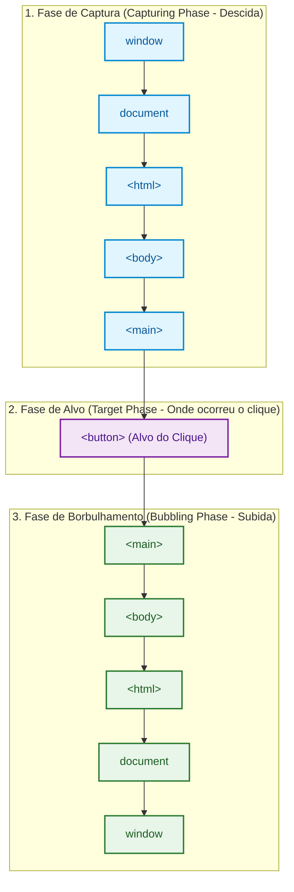
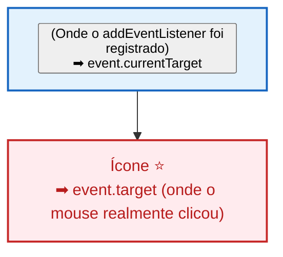
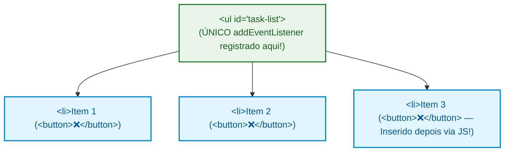

# 03. Sistema de Eventos e Propagação

A Web é uma plataforma fundamentalmente **orientada a eventos**. Cada ação do
usuário na tela — um clique em um botão, uma tecla pressionada, a submissão de
um formulário ou a rolagem da página — gera um **evento** que o navegador
dispara na árvore do DOM.

Para quem está começando, parece que um clique em um botão afeta exclusivamente
aquele elemento isolado. No entanto, por baixo dos panos, o navegador executa um
complexo e estruturado **ciclo de propagação** que viaja por toda a hierarquia
de nós da página.

Neste capítulo, você aprenderá as três fases da propagação de eventos
(**_Capturing_**, **_Target_** e **_Bubbling_**), a diferença crucial entre
**`event.target`** e **`event.currentTarget`**, como interromper comportamentos
nativos com **`preventDefault()`** e **`stopPropagation()`**, e como aplicar o
poderoso padrão de **Delegação de Eventos (_Event Delegation_)** com TypeScript.

## O Ciclo de Vida dos Eventos: As Três Fases

Quando um usuário clica em um elemento profundo da árvore (como um `<button>`
dentro de um `<main>`), o evento não "surge" do nada naquele botão. Ele realiza
uma viagem completa de ida e volta pelo DOM:



### O Que Ocorre em Cada Fase?

1. **Fase de Captura (_Capturing Phase_):** O evento nasce no topo da hierarquia
   (`window`) e **desce** nó por nó até chegar ao pai direto do elemento que foi
   clicado.
2. **Fase de Alvo (_Target Phase_):** O evento atinge o elemento exato onde a
   interação física ocorreu (`event.target`).
3. **Fase de Borbulhamento (_Bubbling Phase_):** O evento **sobe** de volta pela
   árvore (como uma bolha de ar na água), disparando os ouvintes de todos os
   elementos ancestrais até retornar a `window`.

Por padrão, quando registramos um ouvinte com `addEventListener("click",
callback)`, o navegador o executa durante a **Fase de Borbulhamento**
(_Bubbling_).

## Ouvintes de Evento Tipados no TypeScript

O método `addEventListener` possui sobrecargas ricas no TypeScript que inferem
automaticamente a classe do evento de acordo com a string do evento registrada:

```typescript
const submitButton = document.querySelector<HTMLButtonElement>("#btn-submit");
const emailInput = document.querySelector<HTMLInputElement>("#txt-email");

if (submitButton) {
  // O TypeScript infere 'event' automaticamente como MouseEvent
  submitButton.addEventListener("click", (event) => {
    console.log(
      `Clique nas coordenadas: X=${event.clientX}, Y=${event.clientY}`,
    );
  });
}

if (emailInput) {
  // O TypeScript infere 'event' automaticamente como KeyboardEvent
  emailInput.addEventListener("keydown", (event) => {
    if (event.key === "Enter") {
      console.log("Usuário pressionou Enter!");
    }
  });
}
```

## `event.target` vs `event.currentTarget`: A Grande Confusão

Um dos erros mais sutis no desenvolvimento frontend ocorre ao confundir
`event.target` com `event.currentTarget`.



- **`event.currentTarget`:** É o elemento no qual o `addEventListener` foi
  **anexado** e está executando a função no momento.
- **`event.target`:** É o elemento **mais profundo** que disparou a ação inicial
  do mouse (o ponto exato do clique).

### O Cenário Real do Problema

Imagine um botão que contém um ícone em `<span>` ou `<i>`:

```html
<button id="btn-save">
  <span class="icon">💾</span>
  Salvar Alterações
</button>
```

```typescript
const saveButton = document.querySelector<HTMLButtonElement>("#btn-save");

saveButton?.addEventListener("click", (event) => {
  // ⚠️ Se o usuário clicar em cima do ícone 💾:
  // event.target será o <span> (que NÃO tem a propriedade disabled!)
  // event.currentTarget será o <button> (o elemento onde o ouvinte foi colocado)

  const targetElement = event.target as HTMLElement;
  console.log("Elemento clicado:", targetElement.tagName); // "SPAN"

  // Para desabilitar o botão com segurança, usamos SEMPRE currentTarget:
  const button = event.currentTarget as HTMLButtonElement;
  button.disabled = true;
});
```

## Controlando o Fluxo: `preventDefault()` e `stopPropagation()`

O objeto de evento nos fornece métodos para interceptar o fluxo natural do
navegador:

### 1. `event.preventDefault()` (Cancela a Ação Padrão)

Certos elementos HTML possuem comportamentos nativos predefinidos pelo
navegador:

- Clicar em um `<button type="submit">` dentro de um formulário tenta enviar os
  dados e recarregar a página inteira.
- Clicar em um link `<a href="...">` navega para outra URL.
- Clicar com o botão direito abre o menu de contexto nativo.

O método **`preventDefault()`** impede que o navegador execute essa ação padrão,
mantendo a página intacta para que nosso código JavaScript cuide de tudo:

```typescript
const form = document.querySelector<HTMLFormElement>("#form-cadastro");

form?.addEventListener("submit", (event) => {
  // 1. Impede o recarregamento automático da página
  event.preventDefault();

  // 2. Extrai os dados do formulário com segurança
  const formData = new FormData(form);
  const userName = formData.get("name");

  console.log("Formulário interceptado! Enviando via Fetch:", userName);
});
```

### 2. `event.stopPropagation()` (Interrompe o Borbulhamento)

O método **`stopPropagation()`** impede que o evento continue sua viagem de
borbulhamento para os elementos pais.

```typescript
const modalBackdrop = document.querySelector<HTMLDivElement>(".modal-backdrop");
const modalContent = document.querySelector<HTMLDivElement>(".modal-content");

// Clicar fora (no fundo escuro) fecha o modal
modalBackdrop?.addEventListener("click", () => {
  console.log("Fechando modal...");
});

// Clicar dentro do conteúdo NÃO deve fechar o modal
modalContent?.addEventListener("click", (event) => {
  // Impede que o clique dentro da caixa suba para o backdrop
  event.stopPropagation();
  console.log("Clicou dentro da caixa de diálogo.");
});
```

## Padrão de Arquitetura: Delegação de Eventos (_Event Delegation_)

Imagine que você está construindo uma lista dinâmica de tarefas ou um carrinho
de compras onde itens são adicionados e removidos constantemente.

### A Dor do Código Ingênuo

Se você tiver 200 itens na lista e anexar um `addEventListener` em cada botão de
excluir:

1. Você gastará 200 ouvintes na memória do navegador.
2. **O maior problema:** Quando um novo item for adicionado dinamicamente via
   `createElement`, o botão dele **não terá o ouvinte**, a menos que você se
   lembre de registrá-lo manualmente a cada inserção.

### A Solução Elegante com Delegação

Graças ao **borbulhamento (_Bubbling_)**, podemos registrar **um único ouvinte
no container pai** (`<ul>`, `<section>` ou `<table>`) e interceptar os eventos
que sobem até ele.

A forma exata de identificar qual elemento disparou a ação fica a critério do
que for mais confortável e fizer sentido na sua arquitetura: você pode buscar
ancestrais com o método **`closest()`**, filtrar por classes CSS específicas
(como `.list-item`) ou ler atributos customizados com **`dataset`** (como
`data-action="delete"` e `data-item-id="101"`).



### Estrutura HTML de Exemplo

```html
<ul id="task-list">
  <li class="list-item">
    <span>Estudar TypeScript</span>
    <button data-action="delete" data-item-id="101">❌</button>
  </li>
  <li class="list-item">
    <span>Revisar DOM</span>
    <button data-action="delete" data-item-id="102">❌</button>
  </li>
</ul>
```

### Implementação Prática com TypeScript

Abaixo, vemos uma abordagem bastante robusta e flexível combinando `closest()`
com a leitura de atributos `data-*`:

```typescript
const taskList = document.querySelector<HTMLUListElement>("#task-list");

taskList?.addEventListener("click", (event) => {
  const target = event.target as HTMLElement;

  // 1. Identifica se o clique ocorreu dentro de um botão com data-action
  const actionBtn = target.closest<HTMLButtonElement>("button[data-action]");
  if (!actionBtn) {
    return;
  }

  // 2. Lê a ação desejada e o ID do item
  const { action, itemId } = actionBtn.dataset;

  if (action === "delete" && itemId) {
    console.log(`Excluindo item com ID: ${itemId}`);

    // 3. Localiza o elemento pai com a classe .list-item e o remove do DOM
    const listItem = actionBtn.closest<HTMLLIElement>(".list-item");
    listItem?.remove();
  }
});
```

**Vantagens da Delegação de Eventos:**

- **Altíssimo desempenho de memória:** 1 ouvinte no pai gerencia milhares de
  filhos.
- **Elementos dinâmicos funcionam automaticamente:** Qualquer novo `<li>`
  adicionado no futuro já estará coberto pelo ouvinte sem código extra.

<details>
<summary>🔍 <strong>Aprofundamento: Remoção de Ouvintes e a Opção { once: true }</strong></summary>

Quando registramos um ouvinte com uma função anônima inline, **não conseguimos
removê-lo** posteriormente, pois `removeEventListener` exige uma referência
idêntica de função na memória:

```typescript
// ❌ IMPOSSÍVEL DE REMOVER: A arrow function é uma nova instância na memória
button.addEventListener("click", () => console.log("Clicou"));
button.removeEventListener("click", () => console.log("Clicou")); // NÃO FUNCIONA!

// ✅ FORMA CORRETA: Passando a referência nomeada da função
function handleClick(event: MouseEvent): void {
  console.log("Executando uma vez...");
  button.removeEventListener("click", handleClick);
}
button.addEventListener("click", handleClick);
```

#### A Opção Moderna `{ once: true }`

Para executar um evento apenas uma única vez e descartá-lo automaticamente da
memória sem precisar chamar `removeEventListener`, podemos passar um objeto de
opções:

```typescript
button.addEventListener(
  "click",
  () => {
    console.log("Este log será disparado apenas no primeiro clique!");
  },
  { once: true }, // O navegador remove o ouvinte sozinho após o primeiro disparo
);
```

</details>

## O Que Vem a Seguir?

Agora você já domina a seleção, criação e estilização de nós, bem como a
resposta eficiente a eventos e interações do usuário.

No entanto, à medida que interfaces web crescem, surge uma nova necessidade:
como criar componentes visuais reutilizáveis, com estilos encapsulados e tags
customizadas sem depender de bibliotecas pesadas?

No **[Capítulo 04: Introdução aos Web
Components](04-introducao-aos-web-components.md)**, vamos desvendar a tríade de
componentização nativa da plataforma Web: **Custom Elements**, **Shadow DOM** e
tags `<template>` / `<slot>`.

---

<a href="02-selecao-e-manipulacao-com-typescript.md">← Seleção e Manipulação com
TypeScript</a>

<p align="right"><a href="04-introducao-aos-web-components.md">Próximo: Introdução aos Web Components →</a></p>
