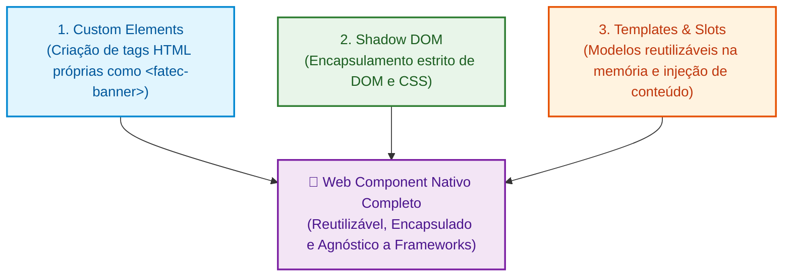

# 04. Introdução aos Web Components

Nos capítulos anteriores, aprendemos a selecionar elementos, manipular suas
propriedades e classes, e responder a eventos na árvore do DOM.

No entanto, à medida que uma aplicação web cresce, surge um grande desafio
arquitetural: como criar blocos de interface **reutilizáveis, modulares e
independentes** sem que estilos CSS vazem e quebrem outras partes da página, e
sem precisar duplicar manualmente estruturas HTML complexas em cada tela?

Muitos desenvolvedores acreditam que a componentização na Web é um recurso que
nasceu exclusivamente com frameworks e bibliotecas como React, Vue ou Angular.
Na realidade, os navegadores modernos possuem uma especificação nativa e
padronizada pelo W3C para criar componentes diretamente na plataforma: os **Web
Components**.

Neste capítulo introdutório, você terá uma visão panorâmica da Tríade dos Web
Components, verá um exemplo completo e funcional integrando essas tecnologias e
entenderá por que essa especificação é tão valiosa no mercado moderno.

## A Dor da Aplicação Sem Componentes

Imagine que você precise exibir um card de aviso estilizado em cinco páginas
diferentes de um portal universitário. Sem componentização nativa:

1. **Duplicação de HTML:** Você precisa copiar e colar o mesmo bloco de `<div>`,
   `<h3>`, `<p>` e botões em todos os arquivos `.html`.
2. **Conflito de CSS Global:** Se você criar uma classe genérica como `.card` ou
   `.btn`, qualquer outra folha de estilos do projeto poderá sobrepor suas cores
   e margens.
3. **Manutenção Frágil:** Se a estrutura do card precisar mudar, você terá que
   localizar e editar manualmente cada ocorrência duplicada no projeto.

Os Web Components resolvem esses três problemas na raiz da própria plataforma
Web.

## A Tríade dos Web Components

A especificação de Web Components não é uma tecnologia única e isolada, mas sim
a união harmoniosa de **três padrões nativos do navegador**:



1. **Custom Elements:** Uma API em JavaScript para ensinar ao navegador novas
   tags HTML personalizadas com comportamentos e ciclo de vida próprios.
2. **Shadow DOM:** Uma árvore de DOM encapsulada e isolada anexada ao elemento,
   garantindo que seus estilos CSS e seletores não vazem para a página externa
   (e vice-versa).
3. **HTML Templates (`<template>` e `<slot>`):** Modelos inertes de marcação que
   o navegador processa na memória apenas uma vez, com pontos de encaixe
   (_slots_) para receber conteúdos externos.

## O Primeiro Componente Completo: Unindo os Três Pilares

Para entender como essas três peças se encaixam perfeitamente na prática, veja a
implementação de um componente `<fatec-banner>` em TypeScript:

```typescript
// 1. TEMPLATE: Definimos a estrutura e o estilo isolado na memória
const bannerTemplate = document.createElement("template");
bannerTemplate.innerHTML = `
  <style>
    .banner {
      background: linear-gradient(135deg, #0284c7, #0369a1);
      color: #ffffff;
      padding: 16px 20px;
      border-radius: 8px;
      font-family: sans-serif;
      display: flex;
      align-items: center;
      justify-content: space-between;
      gap: 16px;
    }
    ::slotted([slot="action"]) {
      background: #ffffff;
      color: #0369a1;
      padding: 8px 16px;
      border-radius: 6px;
      text-decoration: none;
      font-weight: bold;
    }
  </style>

  <div class="banner">
    <div class="content">
      <!-- SLOTS: Pontos onde o consumidor encaixa seu texto -->
      <slot name="message">Aviso importante para os estudantes.</slot>
    </div>
    <slot name="action"></slot>
  </div>
`;

// 2. CUSTOM ELEMENT + SHADOW DOM: Criamos a classe do componente
export class FatecBanner extends HTMLElement {
  constructor() {
    super();
    // Ativa o Shadow DOM para isolar os estilos do banner
    this.attachShadow({ mode: "open" });
  }

  public connectedCallback(): void {
    if (!this.shadowRoot) return;

    // Clona o template na memória diretamente para o Shadow Root
    const content = bannerTemplate.content.cloneNode(true);
    this.shadowRoot.appendChild(content);
  }
}

// 3. REGISTRO: Registramos a nova tag no catálogo do navegador
customElements.define("fatec-banner", FatecBanner);
```

### Como Consumimos Esse Componente no HTML

Qualquer pessoa da equipe agora pode usar a nova tag `<fatec-banner>` como se
fosse uma tag nativa do HTML:

```html
<fatec-banner>
  <span slot="message"
    >🚀 Matrículas abertas para o curso de Web da FATEC!</span
  >
  <a slot="action" href="/matricula">Inscreva-se</a>
</fatec-banner>
```

**Resultado no DOM (Inspecionado no Navegador):**

<!-- prettier-ignore -->
```html
<fatec-banner>
  #shadow-root (open)
    <style>
      .banner {
        background: linear-gradient(135deg, #0284c7, #0369a1);
        color: #ffffff;
        padding: 16px 20px;
        border-radius: 8px;
        font-family: sans-serif;
        display: flex;
        align-items: center;
        justify-content: space-between;
        gap: 16px;
      }
      ::slotted([slot="action"]) {
        background: #ffffff;
        color: #0369a1;
        padding: 8px 16px;
        border-radius: 6px;
        text-decoration: none;
        font-weight: bold;
      }
    </style>
    <div class="banner">
      <div class="content">
        <slot name="message">
          <span slot="message"
            >🚀 Matrículas abertas para o curso de Web da FATEC!</span
          >
        </slot>
      </div>
      <slot name="action">
        <a slot="action" href="/matricula">Inscreva-se</a>
      </slot>
    </div>
</fatec-banner>
```

## Por Que Aprender Web Components se Temos React e Vue?

Com bibliotecas tão populares como React, Vue e Angular no mercado, surge a
pergunta natural: _por que aprender os Web Components nativos da plataforma?_

1. **Agnóstico a Frameworks (Interoperabilidade Total):** Um Web Component
   desenvolvido com a plataforma nativa pode ser consumido em um projeto React,
   uma aplicação Vue, um site em Angular, uma página em WordPress ou em um
   arquivo HTML puro com zero dependências externas.
2. **A Base dos Design Systems Corporativos:** Gigantes da tecnologia (como
   Google com _Material Web_, Adobe com _Spectrum_, Salesforce com _Lightning
   Web Components_ e a biblioteca _Shoelace_) constroem suas bibliotecas de
   componentes compartilhadas sobre Web Components para que múltiplos times
   possam utilizá-las independentemente do framework de cada projeto.
3. **Longevidade e Padrões da Web:** Frameworks e bibliotecas mudam de versão e
   paradigma constantemente. Já a especificação Web Components é um padrão
   permanente do W3C mantido por todos os navegadores modernos.
4. **Fundamento do Navegador:** Aprender o ciclo de vida, o Shadow DOM e a
   projeção de slots dá a você o modelo mental exato de como os frameworks
   funcionam por baixo dos panos.

## O Que Veremos nos Próximos Capítulos?

Agora que você tem a visão panorâmica de como os Web Components operam, vamos
explorar cada um dos pilares em detalhes e com calma nos próximos capítulos:

- **[Capítulo 05: Custom Elements e Ciclo de
  Vida](05-custom-elements-e-ciclo-de-vida.md):** Como criar tags
  personalizadas, dominar todos os métodos de ciclo de vida e garantir
  reatividade segura com TypeScript.
- **[Capítulo 06: Shadow DOM e
  Encapsulamento](06-shadow-dom-e-encapsulamento.md):** Como isolar marcações e
  estilos, inspecionar o `#shadow-root`, trabalhar com árvores aninhadas e usar
  Variáveis CSS.
- **[Capítulo 07: Templates e Slots](07-templates-e-slots.md):** Como clonar
  fragmentos inertes na memória com máxima performance e compor interfaces
  dinâmicas e flexíveis com `<slot>`.

---

<a href="03-sistema-de-eventos-e-propagacao.md">← Sistema de Eventos e
Propagação</a>

<p align="right"><a href="05-custom-elements-e-ciclo-de-vida.md">Próximo: Custom Elements e Ciclo de Vida →</a></p>
