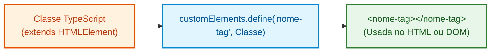
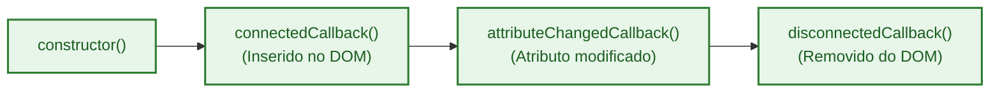

# 05. Custom Elements e Ciclo de Vida

No capítulo anterior, tivemos uma visão panorâmica da Tríade dos Web Components
e compreendemos o poder de criar blocos reutilizáveis nativos no navegador.

Neste capítulo, mergulharemos a fundo no **1º Pilar: Custom Elements**. Você
aprenderá a criar tags HTML personalizadas com comportamento dinâmico,
compreenderá cada etapa do seu ciclo de vida (_Lifecycle Callbacks_), aplicará
reatividade segura com TypeScript e descobrirá como registrar seus elementos no
sistema de tipos global do navegador.

## O Que São Custom Elements?

Historicamente, o conjunto de tags HTML era fixo: usávamos `<div>`, `<p>`,
`<button>`, `<header>` e outras tags nativas. Quando precisávamos de um
componente mais complexo (como um card de produto ou um modal), éramos obrigados
a empilhar várias `<div>`s aninhadas com classes CSS arbitrárias.

A especificação de **Custom Elements** muda esse jogo: ela permite que você
estenda a plataforma Web e crie **suas próprias tags HTML** (como `<user-card>`,
`<status-badge>`, `<app-navbar>`), ensinando ao navegador como instanciá-las e
como reagir às ações do usuário.



## A Regra de Ouro: O Hífen Obrigatório

Ao batizar sua tag customizada, existe uma regra inegociável da especificação
W3C: **o nome deve conter pelo menos um hífen (`-`)**.

```typescript
// ❌ Inválido: entrará em conflito com tags HTML nativas
customElements.define("badge", UserBadge);
customElements.define("card", UserCard);

// ✅ Válido: possui hífen e segue a especificação
customElements.define("user-badge", UserBadge);
customElements.define("fatec-card", FatecCard);
```

> **Por que o hífen é obrigatório?** Todas as tags nativas do HTML (como
> `<div>`, `<video>`, `<dialog>`) consistem em palavras simples sem hífen. O W3C
> reservou todas as palavras sem hífen para futuras expansões do próprio HTML.
> Usar o hífen garante que seu componente nunca entrará em conflito com uma tag
> oficial que venha a ser lançada no futuro.

## O Ciclo de Vida do Componente (_Lifecycle Callbacks_)

Um Custom Element não é apenas uma tag estática: ele possui um ciclo de vida
gerenciado pelo motor do navegador. O navegador aciona métodos específicos da
sua classe em momentos predefinidos:



| Método do Ciclo de Vida          | Quando é Executado?                                                                                       | O Que Fazer Aqui?                                                                                                      |
| :------------------------------- | :-------------------------------------------------------------------------------------------------------- | :--------------------------------------------------------------------------------------------------------------------- |
| **`constructor()`**              | No momento em que o elemento é instanciado em memória via `document.createElement()` ou pelo parser HTML. | Chamar `super()`, inicializar estados internos e anexar Shadow DOM. **Não manipule filhos ou atributos aqui.**         |
| **`connectedCallback()`**        | Quando o elemento é efetivamente anexado à árvore do DOM.                                                 | Criar e inserir nós filhos, registrar ouvintes de eventos e disparar buscas de dados.                                  |
| **`disconnectedCallback()`**     | Quando o elemento é removido da árvore do DOM.                                                            | Limpar timers (`setInterval`), cancelar requisições de rede (`AbortController`) e remover ouvintes globais de eventos. |
| **`attributeChangedCallback()`** | Quando um dos atributos monitorados é adicionado, alterado ou removido.                                   | Reagir a mudanças de propriedades e atualizar cirurgicamente a interface visual.                                       |

## Monitorando Atributos com `observedAttributes`

Por questões de desempenho, o navegador não dispara `attributeChangedCallback`
para todos os atributos por padrão. Você deve declarar explicitamente uma lista
estática com os nomes dos atributos que deseja observar:

```typescript
export class UserStatus extends HTMLElement {
  // 1. Lista estática de atributos monitorados
  public static get observedAttributes(): string[] {
    return ["status", "role"];
  }

  // 2. Disparado apenas quando 'status' ou 'role' mudarem
  public attributeChangedCallback(
    name: string,
    oldValue: string | null,
    newValue: string | null,
  ): void {
    if (oldValue !== newValue) {
      console.log(`Atributo ${name} mudou de "${oldValue}" para "${newValue}"`);
    }
  }
}
```

## Construindo um Componente Reativo Passo a Passo

Vamos construir um componente completo `<enrollment-status-badge>` para exibir
selos de matrícula estudantil na FATEC. Ele aceitará os atributos `theme` e
`label`, atualizando a interface em tempo real quando qualquer um deles for
modificado.

### 1. Implementação da Classe em TypeScript

```typescript
export class EnrollmentStatusBadge extends HTMLElement {
  // Referência em memória para o nó visual interno
  private badgeElement: HTMLSpanElement | null = null;

  // 1. Declaramos quais atributos devem ser observados
  public static get observedAttributes(): string[] {
    return ["theme", "label"];
  }

  // 2. Inicialização segura no constructor
  constructor() {
    super();
  }

  // 3. Executado quando a tag entra no DOM
  public connectedCallback(): void {
    // Cria a estrutura visual apenas se ela ainda não existir
    if (!this.badgeElement) {
      this.badgeElement = document.createElement("span");
      this.append(this.badgeElement);
    }

    this.render();
  }

  // 4. Limpeza executada quando a tag sai do DOM
  public disconnectedCallback(): void {
    console.log("Badge removido do DOM.");
  }

  // 5. Reage a alterações nos atributos 'theme' ou 'label'
  public attributeChangedCallback(
    name: string,
    oldValue: string | null,
    newValue: string | null,
  ): void {
    if (oldValue !== newValue && this.badgeElement) {
      this.render();
    }
  }

  // 6. Atualização cirúrgica e performática do nó
  private render(): void {
    if (!this.badgeElement) return;

    const theme = this.getAttribute("theme") ?? "primary";
    const label = this.getAttribute("label") ?? "FATEC";

    // ✅ Atualizações pontuais de propriedades sem recriar o nó
    this.badgeElement.className = `badge badge-${theme}`;
    this.badgeElement.textContent = `🎓 ${label}`;
  }
}

// 7. Registra a tag customizada no catálogo global do navegador
customElements.define("enrollment-status-badge", EnrollmentStatusBadge);
```

### 2. Por Que Evitar `innerHTML` nas Atualizações?

Ao implementar a renderização de componentes reativos, é tentador escrever:

```typescript
// ❌ Anti-pattern: destrói todos os nós filhos e força o navegador a fazer re-parse de HTML
this.innerHTML = `<span class="badge badge-${theme}">🎓 ${label}</span>`;
```

Embora funcione, o uso de `innerHTML` repetido traz dois problemas graves:

1. **Perda de Estado e Foco:** Se houvesse um `<input>` ou botão com foco dentro
   do componente, o foco seria perdido porque os nós foram destruídos.
2. **Custo de Renderização:** O parser HTML do navegador precisa reprocessar a
   string a cada mudança de caractere.

Manipulando diretamente as propriedades dos nós filhos do componente, você
consegue realizar mutações cirúrgicas, atualizando apenas o necessário
instantaneamente.

### 3. Consumindo no HTML

```html
<!-- Exibição inicial -->
<enrollment-status-badge
  id="student-badge"
  theme="success"
  label="Matrícula Ativa"
></enrollment-status-badge>
```

**Resultado no DOM:**

```html
<enrollment-status-badge
  id="student-badge"
  theme="success"
  label="Matrícula Ativa"
>
  <span class="badge badge-success">🎓 Matrícula Ativa</span>
</enrollment-status-badge>
```

### 4. Testando a Reatividade em Tempo Real com JavaScript

Se alterarmos o atributo via script ou no DevTools:

```typescript
const badge = document.querySelector("#student-badge");

if (badge) {
  // Dispara automaticamente o attributeChangedCallback e atualiza a tela
  badge.setAttribute("theme", "danger");
  badge.setAttribute("label", "Matrícula Trancada");
}
```

O navegador atualiza o `<span>` interno para:

```html
<span class="badge badge-danger">🎓 Matrícula Trancada</span>
```

<details>
<summary>🔍 <strong>Aprofundamento: Tipagem Estrita com <code>HTMLElementTagNameMap</code></strong></summary>

Quando selecionamos um elemento padrão no TypeScript:

```typescript
const input = document.querySelector("input"); // Tipo: HTMLInputElement | null
const div = document.querySelector("div"); // Tipo: HTMLDivElement | null
```

O compilador TypeScript sabe exatamente o tipo de cada elemento porque ele
possui uma interface global chamada **`HTMLElementTagNameMap`**.

Podemos estender essa interface para incluir o nosso próprio Custom Element!
Dessa forma, o TypeScript inferirá nossa classe automaticamente ao fazer buscas
no DOM:

```typescript
// Registra o tipo da tag no ecossistema global do TypeScript
declare global {
  interface HTMLElementTagNameMap {
    "enrollment-status-badge": EnrollmentStatusBadge;
  }
}

// Agora a inferência é 100% estrita e segura!
const myBadge = document.querySelector("enrollment-status-badge");
// Tipo inferido: EnrollmentStatusBadge | null (com autocomplete de todos os métodos da classe!)
```

</details>

## O Que Vem a Seguir?

Agora que você já sabe criar tags customizadas e controlar seu ciclo de vida,
surge um desafio imediato: como impedir que o CSS global da página afete o
interior do nosso componente e como evitar que nossos estilos vazem para fora?

No **[Capítulo 06: Shadow DOM e
Encapsulamento](06-shadow-dom-e-encapsulamento.md)**, vamos desvendar o segundo
pilar dos Web Components e aprender a criar árvores de DOM totalmente isoladas e
protegidas.

---

<a href="04-introducao-aos-web-components.md">← Introdução aos Web
Components</a>

<p align="right"><a href="06-shadow-dom-e-encapsulamento.md">Próximo: Shadow DOM e Encapsulamento →</a></p>
