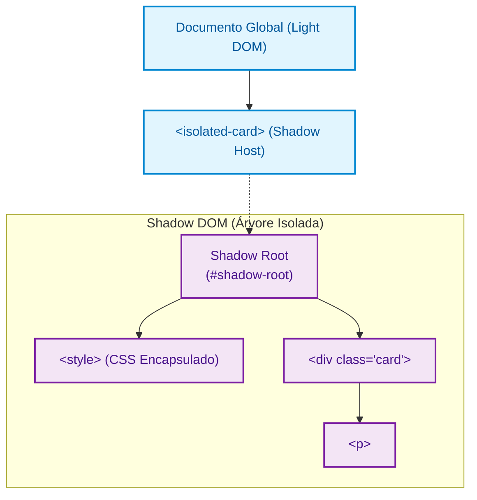

# 06. Shadow DOM e Encapsulamento

No capítulo anterior, aprendemos a criar Custom Elements e manipular seu ciclo
de vida. No entanto, no nosso primeiro exemplo, o elemento `<span>` foi inserido
diretamente na árvore global do documento (o chamado **Light DOM**).

Isso significa que, se no CSS global da página houver uma regra como `span {
color: red !important; }`, ela afetará nosso componente! Da mesma forma, se
criarmos uma classe genérica como `.badge`, corremos o risco de desconfigurar
botões e selos de outras bibliotecas usadas no mesmo site.

Para resolver esse problema de vazamento e colisão de estilos, a plataforma Web
fornece o **2º Pilar: Shadow DOM**.

## O Que É o Shadow DOM?

O **Shadow DOM** é uma especificação da Web que permite anexar uma **árvore de
DOM oculta e totalmente isolada** a um elemento.

Dentro dessa árvore isolada, todo o HTML, CSS e seletores de script vivem em um
escopo fechado, criando uma barreira de proteção de duas vias: nada de fora vaza
para dentro, e nada de dentro vaza para fora.



### Vocabulário Essencial

- **Shadow Host:** O elemento HTML regular da página que hospeda a árvore oculta
  (no nosso caso, a tag `<isolated-card>`).
- **Shadow Root:** A raiz da árvore isolada (representada no DevTools por
  `#shadow-root`).
- **Shadow Tree:** Todos os elementos e estilos que residem abaixo da Shadow
  Root.

## Ativando o Shadow Root no Componente

Para criar e anexar uma Shadow Root ao nosso Custom Element, chamamos o método
**`this.attachShadow()`** dentro do construtor:

```typescript
export class IsolatedCard extends HTMLElement {
  constructor() {
    super();

    // 1. Anexa a raiz de Shadow DOM ao elemento hospedeiro
    this.attachShadow({ mode: "open" });
  }

  public connectedCallback(): void {
    if (!this.shadowRoot) return;

    // 2. Estilo isolado que vive exclusivamente dentro deste componente
    const style = document.createElement("style");
    style.textContent = `
      .card {
        background-color: #1e293b;
        color: #f8fafc;
        padding: 16px;
        border-radius: 8px;
        font-family: sans-serif;
      }
    `;

    // 3. Conteúdo visual protegido dentro da Shadow Tree
    const card = document.createElement("div");
    card.classList.add("card");
    card.textContent = "Conteúdo 100% blindado pelo Shadow DOM.";

    // 4. Inserimos os nós diretamente no Shadow Root
    this.shadowRoot.append(style, card);
  }
}

customElements.define("isolated-card", IsolatedCard);
```

> **A Regra da Raiz Única:** Cada elemento hospedeiro (_host_) pode possuir **no
> máximo uma única raiz de Shadow Root**. Se você tentar invocar
> `attachShadow()` uma segunda vez no mesmo elemento, o navegador lançará uma
> exceção `DOMException`.

Ao chamar `attachShadow({ mode: "open" })`, o navegador permite que códigos
externos acessem a árvore interna via propriedade `element.shadowRoot`.

Se você usar `{ mode: "closed" }`, a propriedade `element.shadowRoot` retornará
`null` para códigos externos. Na prática moderna, **99% dos componentes utilizam
`mode: "open"`**, pois o modo closed não oferece segurança criptográfica real e
dificulta testes automatizados e acessibilidade.

## Inspecionando o Shadow DOM no DevTools

Ao consumir a tag em um documento HTML:

```html
<isolated-card></isolated-card>
```

Se abrirmos o painel **Elements / Inspecionar Elemento** do navegador, veremos:

<!-- prettier-ignore -->
```html
<isolated-card>
  #shadow-root (open)
    <style>
      .card {
        background-color: #1e293b;
        color: #f8fafc;
        padding: 16px;
        border-radius: 8px;
        font-family: sans-serif;
      }
    </style>
    <div class="card">Conteúdo 100% blindado pelo Shadow DOM.</div>
</isolated-card>
```

A linha `#shadow-root (open)` é a demarcação explícita da fronteira da Shadow
Tree: todos os elementos identados abaixo dela pertencem ao escopo protegido do
componente.

## O Isolamento Bidirecional de CSS e Seletores

O Shadow DOM estabelece uma proteção de duas vias:

1. **Proteção de Fora para Dentro:** Se a página hospedeira tiver uma regra
   genérica como `.card { background-color: red !important; }`, ela **não vai
   afetar** a `<div class="card">` interna do nosso componente.
2. **Proteção de Dentro para Fora:** Da mesma forma, o seletor `.card` definido
   dentro do componente **não afetará nenhum outro elemento externo** da página
   que porventura também utilize a classe `.card`.
3. **Isolamento de JavaScript:** O método global
   `document.querySelector(".card")` executado na página retornará `null`,
   impedindo manipulações acidentais na árvore interna.

## Árvores de Shadow DOM Aninhadas (Componente Dentro de Componente)

Em projetos reais, é comum que um componente complexo instancie outros
componentes filhos internamente.

Quando isso acontece, o navegador cria **árvores aninhadas**, mantendo o
isolamento rigoroso em cada camada:

<!-- prettier-ignore -->
```html
<user-profile-card>
  #shadow-root (open)
    <div class="card-container">
      <h2>Perfil do Estudante</h2>

      <!-- Componente filho que também possui seu próprio Shadow DOM -->
      <status-badge>
        #shadow-root (open)
          <span class="badge badge-success">Matriculado</span>
      </status-badge>
    </div>
</user-profile-card>
```

Nesse cenário:

- **Isolamento de Estilos em Camadas:** O CSS do `<user-profile-card>` não afeta
  o `<status-badge>`, e o CSS do badge não vaza para o card pai. Cada Shadow
  Root protege exclusivamente o seu próprio domínio.
- **Seleção Encapsulada via JS:** Executar
  `this.shadowRoot.querySelector(".badge")` dentro do componente pai retornará
  `null`. O pai enxerga apenas a tag `<status-badge>`, respeitando a privacidade
  dos nós filhos.
- **Retargeting de Eventos:** Se o usuário clicar no `<span>` dentro do badge, o
  evento borbulha para cima. Para o pai (`<user-profile-card>`), o
  `event.target` será o `<status-badge>`; e para a página global, o
  `event.target` será o `<user-profile-card>`. As fronteiras internas permanecem
  invisíveis para o mundo externo.

## Estilizando o Próprio Elemento Hospedeiro com `:host`

Dentro do `<style>` do Shadow DOM, podemos usar o seletor especial **`:host`**
para aplicar estilos à própria tag customizada (o _Shadow Host_):

```css
/* Estiliza o próprio <isolated-card> */
:host {
  display: block;
  margin-bottom: 24px;
}

/* Aplica estilos condicionais quando o host possui uma classe específica */
:host(.theme-dark) {
  border: 2px solid #38bdf8;
}

/* Aplica estilos quando o host possui um atributo booleano */
:host([disabled]) {
  opacity: 0.5;
  pointer-events: none;
}
```

## Customização Controlada com Variáveis CSS

Se o Shadow DOM bloqueia todos os seletores CSS externos, como permitimos que
quem usa nosso componente altere cores ou fontes de forma controlada?

A resposta oficial da plataforma Web são as **CSS Custom Properties (Variáveis
CSS)**! As variáveis CSS conseguem atravessar a barreira do Shadow DOM:

```typescript
// Dentro do componente:
const style = document.createElement("style");
style.textContent = `
  .card {
    /* Usa a variável externa se fornecida; caso contrário, usa o valor padrão #1e293b */
    background-color: var(--card-bg, #1e293b);
    color: var(--card-color, #f8fafc);
    padding: 16px;
    border-radius: 8px;
  }
`;
```

Na página externa, o desenvolvedor pode personalizar o tema facilmente sem
quebrar o encapsulamento:

```css
/* Customiza o tema do componente a partir do CSS global da página */
isolated-card {
  --card-bg: #065f46;
  --card-color: #ecfdf5;
}
```

## O Que Vem a Seguir?

Com o Shadow DOM, garantimos isolamento visual e estrutural completo para os
nossos componentes. No entanto, criar elementos nó por nó via
`document.createElement()` e `append()` dentro de classes torna o código verboso
e repetitivo. Além disso, como permitimos que quem usa o componente injete
conteúdos dinâmicos dentro da nossa estrutura?

No **[Capítulo 07: Templates e Slots](07-templates-e-slots.md)**, vamos fechar a
Tríade dos Web Components aprendendo a usar fragmentos declarativos de alta
performance com `<template>` e pontos flexíveis de projeção de conteúdo com
`<slot>`.

---

<a href="05-custom-elements-e-ciclo-de-vida.md">← Custom Elements e Ciclo de
Vida</a>

<p align="right"><a href="07-templates-e-slots.md">Próximo: Templates e Slots →</a></p>
