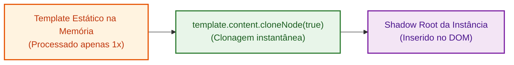

# 07. Templates e Slots

Nos capítulos anteriores, aprendemos a criar tags personalizadas com **Custom
Elements** e a blindar estilos e marcações com o **Shadow DOM**.

No entanto, criar estruturas visuais complexas nó por nó utilizando
`document.createElement` e `append` torna o código longo, difícil de ler e
tedioso de manter. Além disso, se os componentes tiverem conteúdos fixos, eles
se tornam rígidos e pouco flexíveis.

Para unir **clareza declarativa**, **reutilização flexível** e **altíssima
performance**, a plataforma Web introduziu o **3º Pilar dos Web Components: as
tags `<template>` e `<slot>`**.

## 1. HTML Templates (`<template>`): Estruturas Inertes e Reutilizáveis

A tag `<template>` é um mecanismo nativo do HTML para armazenar fragmentos de
marcação que **não são renderizados** quando o navegador carrega a página.

O navegador analisa a sintaxe do template uma única vez e mantém seu conteúdo
"adormecido" na memória na forma de um `DocumentFragment`. Enquanto o template
estiver inerte:

- Elementos visuais não aparecem na tela nem ocupam espaço no layout.
- Imagens dentro do template não disparam requisições de download pela rede.
- Scripts contidos nele não são executados.



### Declarando e Clonando um Template Programaticamente

Podemos instanciar e configurar um template diretamente no código TypeScript
criando o nó com `document.createElement("template")` e preenchendo seu conteúdo
uma única vez:

```typescript
// 1. O template é compilado e armazenado na memória UMA ÚNICA VEZ
const cardTemplate = document.createElement("template");
cardTemplate.innerHTML = `
  <style>
    .notice-card {
      border: 1px solid #cbd5e1;
      border-radius: 8px;
      padding: 16px;
      background-color: #f8fafc;
      font-family: sans-serif;
    }
    h3 {
      color: #0f172a;
      margin: 0 0 4px 0;
    }
    p {
      color: #64748b;
      margin: 0;
    }
  </style>

  <div class="notice-card">
    <h3>Aviso da FATEC</h3>
    <p>O período de rematrícula para o próximo semestre está aberto.</p>
  </div>
`;

export class NoticeCard extends HTMLElement {
  constructor() {
    super();
    this.attachShadow({ mode: "open" });
  }

  public connectedCallback(): void {
    if (!this.shadowRoot) return;

    // 2. Clona o fragmento inerte da memória para dentro do Shadow DOM
    const clone = cardTemplate.content.cloneNode(true);
    this.shadowRoot.appendChild(clone);
  }
}

customElements.define("notice-card", NoticeCard);
```

### Uso no HTML e Resultado no DOM

Consumimos a tag normalmente no arquivo HTML:

```html
<notice-card></notice-card>
```

**Resultado no DOM (Inspecionado no Navegador):**

<!-- prettier-ignore -->
```html
<notice-card>
  #shadow-root (open)
    <style>
      .notice-card {
        border: 1px solid #cbd5e1;
        border-radius: 8px;
        padding: 16px;
        background-color: #f8fafc;
        font-family: sans-serif;
      }
      h3 {
        color: #0f172a;
        margin: 0 0 4px 0;
      }
      p {
        color: #64748b;
        margin: 0;
      }
    </style>
    <div class="notice-card">
      <h3>Aviso da FATEC</h3>
      <p>O período de rematrícula para o próximo semestre está aberto.</p>
    </div>
</notice-card>
```

> **Por que `cloneNode(true)` é a melhor prática?** Ao invés de o navegador ter
> que interpretar repetidamente uma string de HTML e CSS toda vez que uma nova
> instância do componente for inserida no DOM (como ocorreria com `innerHTML`),
> o método `cloneNode(true)` duplica em memória a árvore de nós já compilada,
> gerando ganhos substanciais de performance.

## 2. Projeção de Conteúdo com `<slot>`: Flexibilidade e Composição

O componente `<notice-card>` resolve perfeitamente a estrutura e a performance,
mas seu conteúdo é completamente **estático**: todas as instâncias exibirão
sempre o mesmo título e a mesma mensagem.

Para criar componentes verdadeiramente reutilizáveis (como cards de perfil,
modais, painéis de abas e botões customizados), precisamos permitir que quem
consome o componente injete seu próprio conteúdo HTML personalizado dentro da
moldura que definimos.

Essa técnica é chamada de **Projeção de Conteúdo** (ou _transclusion_), e na Web
é implementada através da tag **`<slot>`**.

### A Ideia Central: Consumo e Projeção

Imagine que criamos um componente `<user-profile-card>`. No HTML da nossa
aplicação, declaramos a tag e passamos os fragmentos que queremos exibir:

```html
<user-profile-card>
  <span slot="username">Ana Clara</span>
  <span slot="role">Desenvolvedora Frontend</span>
  <p>Estudante do curso de Desenvolvimento Web na FATEC.</p>
</user-profile-card>
```

**Resultado no DOM (Árvore Composta com Slots Projetados):**

<!-- prettier-ignore -->
```html
<user-profile-card>
  #shadow-root (open)
    <article class="profile-card">
      <header class="header">
        <div class="username">
          <slot name="username">
            <!-- Conteúdo projetado dentro do slot "username" -->
            <span slot="username">Ana Clara</span>
          </slot>
        </div>
        <div class="role">
          <slot name="role">
            <!-- Conteúdo projetado dentro do slot "role" -->
            <span slot="role">Desenvolvedora Frontend</span>
          </slot>
        </div>
      </header>

      <section class="bio">
        <slot>
          <!-- Conteúdo projetado dentro do slot padrão -->
          <p>Estudante do curso de Desenvolvimento Web na FATEC.</p>
        </slot>
      </section>
    </article>
</user-profile-card>
```

O navegador projeta cada nó passado no HTML diretamente no ponto de encaixe
(`<slot>`) correspondente dentro da Shadow Tree!

### Tipos de Slots e Conteúdo de Fallback

Dentro do `<template>`, inserimos tags `<slot>` nos pontos onde desejamos
receber conteúdos externos:

1. **Slots Nomeados (`<slot name="...">`):** Recebem elementos específicos que
   tenham o atributo `slot="nome"` correspondente.
2. **Slot Padrão (Sem Nome `<slot></slot>`):** Captura todo o conteúdo fornecido
   pelo consumidor que não possua o atributo `slot`.

O texto ou elementos colocados dentro de `<slot>Texto Padrão</slot>` serão
exibidos automaticamente caso o consumidor não forneça nenhum conteúdo para
aquele slot. No exemplo acima, se o consumidor não fornecer nenhum conteúdo para
o slot "username", o texto "Nome Indefinido" será exibido.

### Implementação Completa com TypeScript

Veja como implementamos o template com slots e a classe do
`<user-profile-card>`:

```typescript
const profileTemplate = document.createElement("template");
profileTemplate.innerHTML = `
  <style>
    :host {
      display: block;
      margin-bottom: 16px;
    }
    .profile-card {
      border: 1px solid #cbd5e1;
      border-radius: 12px;
      padding: 20px;
      background: #ffffff;
      font-family: sans-serif;
      box-shadow: 0 4px 6px -1px rgb(0 0 0 / 0.1);
    }
    .header {
      display: flex;
      align-items: center;
      gap: 12px;
    }
    .username {
      font-weight: bold;
      font-size: 1.1rem;
      color: #0f172a;
    }
    .role {
      font-size: 0.85rem;
      color: #64748b;
    }
    .bio {
      margin-top: 12px;
      color: #334155;
      line-height: 1.5;
    }
  </style>

  <article class="profile-card">
    <header class="header">
      <div class="username">
        <!-- 1. Slot nomeado com valor padrão de fallback -->
        <slot name="username">Nome Indefinido</slot>
      </div>
      <div class="role">
        <!-- 2. Slot nomeado com valor padrão de fallback -->
        <slot name="role">Membro da Comunidade</slot>
      </div>
    </header>

    <section class="bio">
      <!-- 3. Slot padrão para qualquer conteúdo restante -->
      <slot></slot>
    </section>
  </article>
`;

export class UserProfileCard extends HTMLElement {
  constructor() {
    super();
    this.attachShadow({ mode: "open" });
  }

  public connectedCallback(): void {
    if (!this.shadowRoot) return;

    // Clona o template na memória diretamente para o Shadow DOM
    const templateContent = profileTemplate.content.cloneNode(true);
    this.shadowRoot.appendChild(templateContent);
  }
}

customElements.define("user-profile-card", UserProfileCard);
```

### Consumindo o Componente no HTML

Agora podemos utilizar a tag `<user-profile-card>` declarativamente em qualquer
página HTML:

```html
<!-- Exemplo 1: Fornecendo todos os slots -->
<user-profile-card>
  <span slot="username">Carlos Silva</span>
  <span slot="role">Professor</span>
  <p>Docente na FATEC nas disciplinas de Desenvolvimento Web.</p>
</user-profile-card>

<!-- Exemplo 2: Omitindo slots para acionar os fallbacks padrão -->
<user-profile-card>
  <p>Apenas o texto da biografia foi fornecido.</p>
</user-profile-card>
```

**Resultado no DOM (Inspecionado no Navegador):**

<!-- prettier-ignore -->
```html
<!-- Exemplo 1 (Com todos os slots preenchidos): -->
<user-profile-card>
  #shadow-root (open)
    <article class="profile-card">
      <header class="header">
        <div class="username">
          <slot name="username">
            <!-- Conteúdo projetado dentro do slot "username" -->
            <span slot="username">Carlos Silva</span>
          </slot>
        </div>
        <div class="role">
          <slot name="role">
            <!-- Conteúdo projetado dentro do slot "role" -->
            <span slot="role">Professor</span>
          </slot>
        </div>
      </header>
      <section class="bio">
        <slot>
          <!-- Conteúdo projetado dentro do slot padrão -->
          <p>Docente na FATEC nas disciplinas de Desenvolvimento Web.</p>
        </slot>
      </section>
    </article>
</user-profile-card>

<!-- Exemplo 2 (Com fallbacks automáticos nos slots ausentes): -->
<user-profile-card>
  #shadow-root (open)
    <article class="profile-card">
      <header class="header">
        <div class="username">
          <slot name="username">Nome Indefinido</slot>
        </div>
        <div class="role">
          <slot name="role">Membro da Comunidade</slot>
        </div>
      </header>
      <section class="bio">
        <slot>
          <!-- Conteúdo projetado dentro do slot padrão -->
          <p>Apenas o texto da biografia foi fornecido.</p>
        </slot>
      </section>
    </article>
</user-profile-card>
```

<details>
<summary>🔍 <strong>Aprofundamento: Estilizando elementos projetados com o pseudo-elemento <code>::slotted()</code></strong></summary>

Dentro do `<style>` do Shadow DOM, você pode aplicar estilos diretamente aos
elementos que foram projetados em um slot usando o pseudo-elemento
`::slotted()`:

```css
/* Estiliza apenas elementos <p> que foram encaixados dentro do slot padrão */
::slotted(p) {
  font-style: italic;
}

/* Estiliza elementos que caíram no slot com nome 'username' */
::slotted([slot="username"]) {
  text-transform: uppercase;
}
```

> **Importante:** `::slotted()` só consegue estilizar nós de primeiro nível que
> caíram no slot; ele não alcança nós descendentes mais profundos.

</details>

## O Que Vem a Seguir?

Com este capítulo, concluímos o submódulo de **Manipulação do DOM**. Agora você
possui uma base sólida sobre como a interface da Web opera: desde a árvore de
nós e o custo de renderização até a seleção estrita com TypeScript, a propagação
de eventos e a construção de Web Components completos e encapsulados.

---

<a href="06-shadow-dom-e-encapsulamento.md">← Shadow DOM e Encapsulamento</a>
