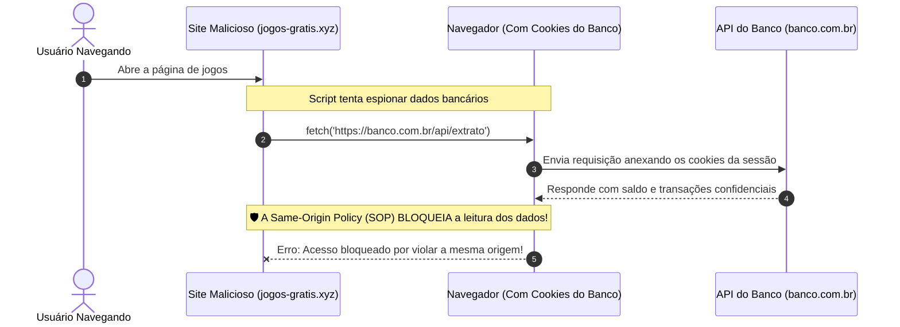
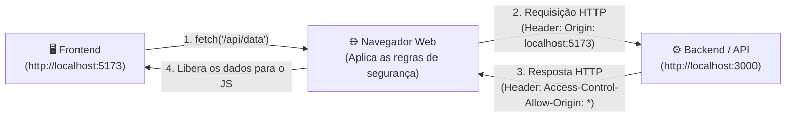
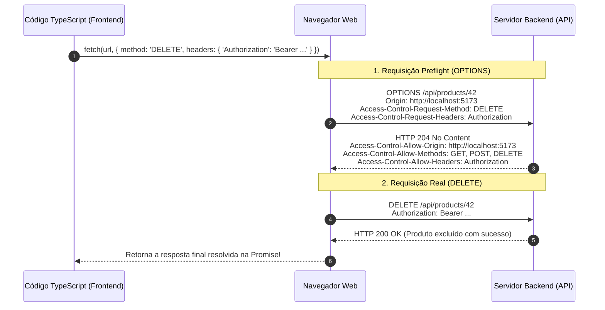

# 01. Same-Origin Policy e CORS

Quase todo desenvolvedor web se depara, mais cedo ou mais tarde, com o erro mais
famoso e temido do desenvolvimento frontend: você cria uma aplicação no Vite
rodando em `http://localhost:5173`, tenta fazer um `fetch()` para a sua API em
`http://localhost:3000` e, de repente, o console do navegador se enche de
alertas vermelhos:

> _Access to fetch at 'http://localhost:3000/api/users' from origin
> 'http://localhost:5173' has been blocked by CORS policy: No
> 'Access-Control-Allow-Origin' header is present on the requested resource._

Ao ver essa mensagem, a primeira reação de quem está começando é acreditar que a
rede quebrou, que o servidor caiu ou que há um erro na sintaxe do TypeScript.

No entanto, o bloqueio por **CORS** não é um defeito. Ele é o efeito direto de
um dos mecanismos de defesa mais vitais de toda a arquitetura da Web: a
**Same-Origin Policy (SOP)**.

Neste capítulo, você entenderá o que é a Política de Mesma Origem, o que define
uma "Origem" na Web, como o mecanismo de **CORS** (_Cross-Origin Resource
Sharing_) funciona por baixo dos panos, o que são as requisições de _Preflight_
(`OPTIONS`) e como solucionar esses bloqueios com segurança na indústria.

## A Dor: O Que Aconteceria Sem a Same-Origin Policy (SOP)?

Para compreender por que o navegador bloqueia requisições entre origens
diferentes, imagine um cenário sem nenhuma proteção de segurança:

1. Você acessa a página do seu banco (`https://banco.com.br`) e faz login. O
   navegador armazena seus cookies de autenticação da sessão.
2. Com a aba do banco ainda aberta em segundo plano, você abre uma nova aba e
   visita um site malicioso (`https://jogos-gratis.xyz`).
3. O código JavaScript do site de jogos executa silenciosamente em segundo
   plano: `fetch("https://banco.com.br/api/extrato")`.



Se o navegador permitisse que o script do `jogos-gratis.xyz` lesse a resposta do
banco, **qualquer site na Internet poderia roubar seus dados bancários, e-mails
privados, fotos e mensagens pessoais** simplesmente pelo fato de você estar
autenticado neles.

Para impedir esse desastre, todos os navegadores implementam a **Same-Origin
Policy (SOP)**: por padrão, **um script executado em uma origem só tem permissão
para ler recursos e dados da mesma origem**.

## O Conceito: O Que Define uma "Origem" (Origin)?

Na arquitetura da Web, uma **Origem** é definida pela combinação estrita de três
elementos: **Protocolo (Scheme) + Domínio (Host) + Porta (Port)**.

```text
  https://  api.fatec.sp.gov.br  :443  /usuarios
  └──────┘  └─────────────────┘  └───┘ └────────┘
  Protocolo       Domínio        Porta   Caminho (Não afeta a origem)
```

> **Regra de Ouro:** Se **qualquer um** desses três itens (protocolo, domínio ou
> porta) for diferente entre duas URLs, o navegador considera que são **origens
> distintas** (_Cross-Origin_).

### Comparativo Prático de Origens

Tomando como referência base a URL: `https://fatec.sp.gov.br:443/portal`:

| URL Comparada                                      | Mesma Origem? | Razão                                                                      |
| :------------------------------------------------- | :-----------: | :------------------------------------------------------------------------- |
| `https://fatec.sp.gov.br:443/cursos`               |  **Sim ✅**   | Protocolo, domínio e porta idênticos (apenas o caminho mudou).             |
| `http://fatec.sp.gov.br:80/portal`                 |  **Não ❌**   | Protocolo diferente (`http` vs `https`) e porta diferente (`80` vs `443`). |
| `https://api.fatec.sp.gov.br:443/portal`           |  **Não ❌**   | Domínio/Subdomínio diferente (`api.fatec` vs `fatec`).                     |
| `https://fatec.sp.gov.br:8080/portal`              |  **Não ❌**   | Porta diferente (`8080` vs `443`).                                         |
| `http://localhost:5173` vs `http://localhost:3000` |  **Não ❌**   | Portas diferentes (`5173` vs `3000`).                                      |

## A Solução Controlada: O Que é o CORS?

Embora a Same-Origin Policy seja indispensável para a segurança, as aplicações
modernas frequentemente precisam se comunicar com serviços distribuídos. É muito
comum ter:

- O frontend em uma origem: `https://app.fatec.sp.gov.br` (ou
  `http://localhost:5173`);
- O backend em outra origem: `https://api.fatec.sp.gov.br` (ou
  `http://localhost:3000`).

Para viabilizar essa comunicação legítima de forma segura, foi criado o padrão
**CORS (_Cross-Origin Resource Sharing_ — Compartilhamento de Recursos entre
Origens)**.

O CORS é um mecanismo baseado em **cabeçalhos HTTP** que permite ao servidor
declarar explicitamente ao navegador: _"Eu autorizo que a aplicação rodando na
origem X leia minhas respostas"_.



> **Ponto Fundamental:** O CORS é uma restrição aplicada **pelo navegador do
> cliente**, e não pelo servidor. Se você fizer uma requisição para a mesma API
> através do terminal (`curl`), do Postman ou de outro servidor backend, a
> requisição funcionará normalmente sem barreiras de CORS, pois esses ambientes
> não possuem a camada de proteção do navegador.

## O Ciclo de Execução: Requisições Simples vs. Preflight (`OPTIONS`)

O navegador classifica requisições _Cross-Origin_ em duas categorias:

### 1. Requisições Simples (_Simple Requests_)

São requisições que utilizam métodos tradicionais da Web antiga (`GET`, `POST`
ou `HEAD`) com cabeçalhos padrão (`text/plain`,
`application/x-www-form-urlencoded` ou `multipart/form-data`).

Nesse caso, o navegador envia a requisição diretamente ao servidor, anexando o
cabeçalho:

```http
Origin: http://localhost:5173
```

Se o servidor responder contendo o cabeçalho de liberação
`Access-Control-Allow-Origin`, o navegador entrega os dados ao JavaScript. Caso
contrário, ele bloqueia a leitura.

### 2. Requisições Pré-verificadas com Preflight (`OPTIONS`)

Se a sua requisição contiver qualquer característica moderna, como:

- Envio de dados no formato **`Content-Type: application/json`**;
- Métodos HTTP além do básico, como **`PUT`**, **`DELETE`** ou **`PATCH`**;
- Cabeçalhos de autenticação customizados, como **`Authorization: Bearer
<token>`**;

O navegador **não dispara a requisição real de imediato**. Antes de qualquer
coisa, ele envia uma requisição preliminar invisível usando o método HTTP
**`OPTIONS`**, conhecida como **Preflight** (_Voo Prévio_):



## Catálogo de Cabeçalhos HTTP do CORS

O diálogo entre navegador e servidor ocorre através de cabeçalhos padronizados:

### Cabeçalhos Enviados pelo Navegador (Cliente)

| Cabeçalho                        | Descrição                                                                                                                    |
| :------------------------------- | :--------------------------------------------------------------------------------------------------------------------------- |
| `Origin`                         | Informa a origem de onde a página que disparou o `fetch()` está sendo executada (ex: `Origin: https://app.fatec.sp.gov.br`). |
| `Access-Control-Request-Method`  | Enviado no preflight `OPTIONS` informando qual método HTTP a requisição real pretende utilizar (ex: `DELETE`).               |
| `Access-Control-Request-Headers` | Enviado no preflight informando quais cabeçalhos customizados a requisição real enviará (ex: `Authorization, Content-Type`). |

### Cabeçalhos Respondidos pelo Servidor (Backend)

| Cabeçalho                          | Descrição                                                                                                            | Exemplo                                        |
| :--------------------------------- | :------------------------------------------------------------------------------------------------------------------- | :--------------------------------------------- |
| `Access-Control-Allow-Origin`      | Declara quais origens estão autorizadas a ler as respostas da API.                                                   | `https://app.fatec.sp.gov.br` ou `*` (público) |
| `Access-Control-Allow-Methods`     | Lista os métodos HTTP aceitos para requisições cross-origin.                                                         | `GET, POST, PUT, DELETE, OPTIONS`              |
| `Access-Control-Allow-Headers`     | Lista os cabeçalhos que o cliente tem permissão de enviar.                                                           | `Content-Type, Authorization`                  |
| `Access-Control-Allow-Credentials` | Permite que o navegador exponha a resposta quando a requisição inclui cookies ou credenciais (`true`).               | `true`                                         |
| `Access-Control-Max-Age`           | Tempo em segundos que o navegador pode manter o resultado do preflight em cache antes de disparar um novo `OPTIONS`. | `86400` (24 horas)                             |

## Boas Práticas: Como Resolver Bloqueios de CORS

Quando você se deparar com erros de CORS, tenha em mente a abordagem correta:

### ❌ O que NÃO fazer

- **Não tente adicionar `mode: "no-cors"` no `fetch()` esperando ler a
  resposta:** O modo `no-cors` transforma a resposta em um objeto opaco e
  inacessível, impedindo que seu código JavaScript leia o JSON ou os dados
  retornados.
- **Não tente definir o cabeçalho `Access-Control-Allow-Origin` no `fetch()`
  pelo frontend:** Esse cabeçalho pertence exclusivamente à resposta do servidor
  backend. Enviá-lo na requisição do cliente não tem nenhum efeito de
  autorização.
- **Não use extensões de navegador para desativar a segurança:** Extensões que
  desabilitam o CORS apenas mascaram o problema na sua máquina local e abrem
  vulnerabilidades graves no seu navegador. Sua aplicação continuará quebrada
  para todos os outros usuários no mundo real.

### ✅ O que DEVE ser feito

- **Configurar os cabeçalhos de CORS no servidor backend:** A solução definitiva
  e correta é instruir a API a responder com os cabeçalhos
  `Access-Control-Allow-*` adequados (utilizando middlewares como `cors()` no
  Express/Node, a anotação `@CrossOrigin` no Spring Boot ou `app.enableCors()`
  no NestJS).
- **Configurar um Proxy Reverso durante o desenvolvimento:** Se você estiver
  construindo o frontend localmente e a API pertencer a outro serviço ou porta,
  configure o servidor de desenvolvimento do seu bundler (como o Vite) para
  repassar as chamadas, fazendo com que o navegador as enxergue como mesma
  origem.

<details>
<summary>🔍 <strong>Solução para Desenvolvimento Local: Configurando o Proxy do Vite</strong></summary>

Durante o desenvolvimento local, se você não tiver controle sobre o código da
API backend ou quiser evitar requisições de preflight desnecessárias, você pode
configurar um **Reverse Proxy** no arquivo `vite.config.ts`:

```typescript
import { defineConfig } from "vite";

export default defineConfig({
  server: {
    proxy: {
      // Qualquer chamada no frontend para '/api' será redirecionada pelo servidor do Vite para a porta 3000
      "/api": {
        target: "http://localhost:3000",
        changeOrigin: true,
      },
    },
  },
});
```

Agora, no seu código TypeScript frontend, em vez de chamar a URL absoluta
`http://localhost:3000/api/users`, você chama a URL relativa `/api/users`:

```typescript
// O navegador envia para http://localhost:5173/api/users (mesma origem!)
// O servidor do Vite repassa a requisição para a porta 3000 sem passar pelo bloqueio do navegador.
const response = await fetch("/api/users");
const users = await response.json();
```

</details>

---

<p align="right"><a href="02-metodos-de-persistencia-de-sessao.md">Próximo: Métodos de Persistência de Sessão →</a></p>
