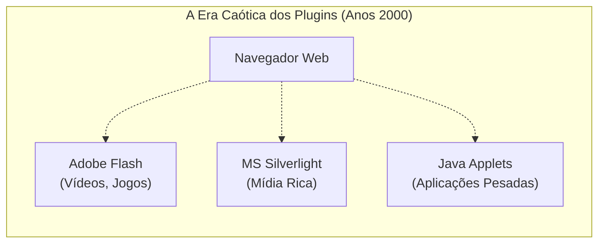
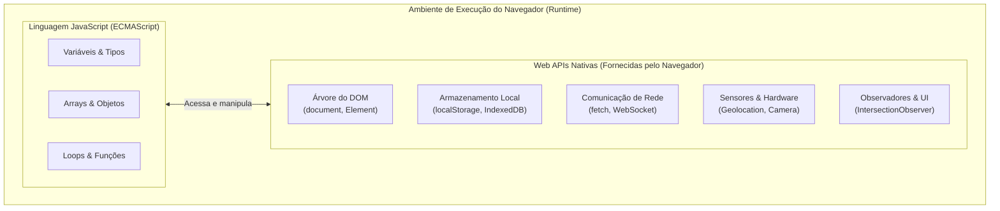

# 01. O Que São Web APIs

Quando começamos a programar em JavaScript ou TypeScript, é muito comum termos a
impressão de que tudo o que usamos faz parte da própria linguagem. Afinal,
quando chamamos uma função de alerta, medimos o tempo com um cronômetro ou
buscamos dados de um servidor com `fetch()`, estamos escrevendo código em um
mesmo arquivo `.ts` ou `.js`.

No entanto, há uma fronteira sutil e fundamental que todo desenvolvedor web
precisa compreender: **o JavaScript por si só é apenas uma linguagem de
programação com regras sintáticas e estruturas de dados básicas**. Ele não sabe
o que é uma tela, não sabe onde o usuário está no mapa e não consegue interagir
com a bateria ou o disco do dispositivo.

Quem concede todos esses "superpoderes" ao seu código é o ambiente em que ele é
executado: o **navegador web**.

Neste capítulo, você compreenderá o que são as **Web APIs**, como elas se
diferenciam da especificação da linguagem JavaScript, por que elas substituíram
a antiga era dos plugins proprietários e como utilizá-las com segurança e
tipagem no TypeScript.

## A Dor Histórica: O JavaScript em uma Ilha e a Era dos Plugins

Para entender a importância das Web APIs modernas, vale a pena olhar para como a
Web funcionava anos atrás.

Por questões elementares de segurança, o motor que executa JavaScript no
navegador roda dentro de uma caixa de areia rígida (_sandbox_). Ele é impedido
de acessar diretamente o hardware ou o sistema operacional da máquina do usuário
para evitar que qualquer site malicioso formate o computador ou roube arquivos
pessoais.

No início dos anos 2000, essa segurança rígida trazia uma grande limitação: o
navegador era apenas um visualizador de páginas estáticas e documentos de texto.
Se uma empresa quisesse criar uma aplicação rica com reprodução de vídeo, áudio,
jogos, animações fluidas ou armazenamento local, o JavaScript nativo da época
simplesmente **não tinha ferramentas para isso**.

A solução encontrada pelo mercado na época foi o uso de **plugins proprietários
instalados à parte no navegador**:



Embora tenham permitido o nascimento dos primeiros jogos e reprodutores de mídia
na web, os plugins trouxeram problemas graves:

1. **Vulnerabilidades Críticas de Segurança:** Plugins proprietários tinham
   acesso profundo ao sistema e se tornaram o alvo favorito de vírus e ataques.
2. **Consumo Excessivo de Recursos:** Travamentos frequentes do navegador e alto
   consumo de bateria em laptops e celulares.
3. **Incompatibilidade Mobile:** Quando os smartphones surgiram, os navegadores
   móveis deixaram de suportar plugins como o Flash, quebrando milhares de
   sites.

A solução definitiva foi transformar o próprio navegador em uma plataforma rica
e padronizada. Em vez de depender de softwares de terceiros, os navegadores
passaram a fornecer **interfaces nativas padronizadas**: as **Web APIs**.

## O Conceito: ECMAScript vs. Web APIs

Para navegar com clareza pelo ecossistema Web, precisamos separar duas peças
distintas:

1. **ECMAScript (O Núcleo da Linguagem):** É a especificação padrão do
   JavaScript. Define tipos primitivos (`string`, `number`, `boolean`),
   estruturas de dados (`Array`, `Object`, `Map`, `Set`), estruturas de controle
   (`if`, `for`, `switch`), classes e sintaxe de funções (`async/await`, _arrow
   functions_).
2. **Web APIs (Os Recursos do Navegador):** São interfaces e métodos embutidos
   pelo navegador no ambiente de execução. Elas expõem recursos do software do
   navegador e do hardware do dispositivo através de objetos globais no
   JavaScript.



Quando você escreve `const nome = "Ana"` ou usa `array.filter()`, você está
usando a linguagem pura. Quando você escreve `localStorage.setItem()`,
`navigator.geolocation.getCurrentPosition()` ou `document.querySelector()`, você
está chamando uma **Web API** fornecida pelo navegador.

## Como o TypeScript Lida com as Web APIs

No desenvolvimento com TypeScript, como o compilador sabe que identificadores
globais como `document`, `window`, `navigator` ou `localStorage` existem, se
eles não foram declarados no seu arquivo?

O compilador do TypeScript inclui internamente arquivos de declaração de tipos
para a plataforma Web (conhecidos como `lib.dom.d.ts`). Quando o seu projeto
configura a biblioteca `"DOM"` no arquivo `tsconfig.json`, o TypeScript carrega
automaticamente a tipagem estrita de todas as Web APIs padronizadas da
indústria:

```json
{
  "compilerOptions": {
    "target": "ES2022",
    "module": "ESNext",
    "lib": ["ES2022", "DOM", "DOM.Iterable"],
    "strict": true
  }
}
```

Dessa forma, ao digitar `navigator.` ou `window.`, o seu editor de código (como
o VS Code) fornece autocompletar instantâneo, dicas de parâmetros e avisos se
você passar um tipo incorreto para os métodos nativos.

## Boas Práticas: Detecção Defensiva de Recursos (_Feature Detection_)

Apesar dos esforços de padronização, nem todos os navegadores implementam todas
as Web APIs no mesmo instante, e certas funcionalidades avançadas podem não
estar disponíveis em navegadores legados ou em contextos específicos de
segurança.

Além disso, com a popularização de ferramentas que executam código no servidor
(como no Node.js ou em _Server-Side Rendering_), objetos exclusivos do navegador
como `window` ou `navigator` não existem durante a renderização no backend.

Por isso, nunca devemos assumir cegamente que uma Web API está presente sem
antes verificar sua existência:

```typescript
// ❌ EVITE: Supor que a API existe em qualquer ambiente ou navegador
function captureLocationUnsafe(): void {
  // Se o navegador for muito antigo ou o código rodar no Node.js,
  // esta linha lançará um erro fatal de 'TypeError: Cannot read properties of undefined'
  navigator.geolocation.getCurrentPosition((position) => {
    console.log("Latitude:", position.coords.latitude);
  });
}
```

```typescript
// ✅ RECOMENDADO: Detecção defensiva de suporte com o operador 'in'
function captureLocationSafely(): void {
  // 1. Garante que o código está executando no navegador
  if (typeof window === "undefined" || typeof navigator === "undefined") {
    console.warn("Ambiente sem suporte a recursos de janela do navegador.");
    return;
  }

  // 2. Verifica se a API específica está presente no objeto host
  if (!("geolocation" in navigator)) {
    console.warn("Seu navegador não possui suporte à Geolocation API.");
    return;
  }

  // 3. Uso seguro: o TypeScript reconhece a presença do recurso
  navigator.geolocation.getCurrentPosition(
    (position) => {
      console.log("Latitude:", position.coords.latitude);
      console.log("Longitude:", position.coords.longitude);
    },
    (error) => {
      console.error("Erro ao obter localização:", error.message);
    },
  );
}
```

## O Mapa do Nosso Catálogo de Web APIs

Existem centenas de Web APIs disponíveis na plataforma web contemporânea. Para
facilitar seu aprendizado prático, este submódulo está organizado em formato de
**catálogo temático independente**.

A partir do próximo capítulo, você poderá consultar e explorar detalhadamente as
principais APIs utilizadas no dia a dia da indústria:

| Categoria                     | API / Tópico                      | O que ela permite fazer?                                                                                   |
| :---------------------------- | :-------------------------------- | :--------------------------------------------------------------------------------------------------------- |
| **Armazenamento de Dados**    | `localStorage` & `sessionStorage` | Salvar preferências, rascunhos e tokens simples de forma síncrona no navegador.                            |
| **Banco de Dados no Cliente** | `IndexedDB`                       | Armazenar grandes volumes de dados estruturados, coleções e arquivos offline.                              |
| **Sensores do Dispositivo**   | `Geolocation API`                 | Obter coordenadas geográficas (latitude/longitude) do usuário com consentimento.                           |
| **Performance e Layout**      | `IntersectionObserver API`        | Detectar quando elementos entram na tela para _Lazy Loading_ e rolagem infinita sem travar a renderização. |
| **Interação com o Sistema**   | `Permissions API`                 | Consultar e monitorar o estado de consentimento de recursos protegidos sem prompts invasivos.              |
| **Alertas do Sistema**        | `Notification API`                | Exibir notificações visuais e sonoras nativas na área de trabalho e central do sistema operacional.        |

<details>
<summary>🔍 <strong>Aprofundamento: Como as Web APIs são padronizadas (W3C e WHATWG)?</strong></summary>

Para garantir que um código escrito no Google Chrome funcione exatamente da
mesma forma no Mozilla Firefox, Apple Safari ou Microsoft Edge, as Web APIs não
são criadas unilateralmente por uma única empresa.

Elas são discutidas e padronizadas por dois grandes consórcios internacionais:

- **WHATWG (_Web Hypertext Application Technology Working Group_):** Formado
  pelos principais desenvolvedores de navegadores (Apple, Google, Mozilla e
  Microsoft), mantém as especificações ativas (_Living Standards_) do HTML, do
  DOM e da Fetch API.
- **W3C (_World Wide Web Consortium_):** Organização internacional fundada por
  Tim Berners-Lee que desenvolve padrões abertos e recomendações de
  acessibilidade, arquitetura e segurança para a Web.

Sempre que tiver dúvidas sobre o nível de suporte de uma Web API em diferentes
versões de navegadores, você pode consultar o portal oficial da comunidade:
[caniuse.com](https://caniuse.com) e a documentação de referência no [MDN Web
Docs](https://developer.mozilla.org).

</details>

## O Que Vem a Seguir?

Agora que você compreende o papel das Web APIs como pontes entre a lógica da sua
aplicação e os recursos nativos do navegador, vamos explorar o primeiro grupo de
ferramentas essenciais para qualquer aplicação web: **a persistência de dados no
lado do cliente**.

No próximo capítulo, você aprenderá a dominar o **`localStorage` e o
`sessionStorage`**, compreendendo seus ciclos de vida, seus limites práticos e
como serializar objetos complexos com TypeScript.

---

<p align="right"><a href="local-storage-e-session-storage.md">Próximo: LocalStorage e SessionStorage →</a></p>
