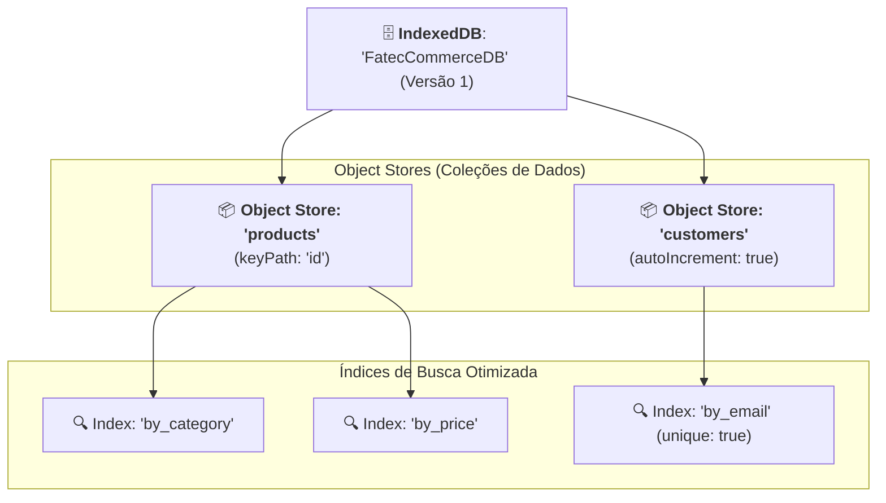

# IndexedDB

O **IndexedDB** é um sistema de banco de dados **NoSQL transacional e
assíncrono** embutido nativamente no navegador web.

Enquanto a Web Storage API (`localStorage` / `sessionStorage`) é voltada para
pequenas configurações em formato de texto simples, o IndexedDB foi projetado
para aplicações que precisam armazenar **grandes volumes de dados
estruturados**, coleções complexas de objetos, registros com índices de busca e
arquivos binários pesados (como imagens em `Blob` ou áudio).

Neste capítulo do catálogo, você aprenderá a arquitetura central do IndexedDB,
como estruturar bancos e armazéns de dados, e como realizar operações CRUD
completas com TypeScript.

## Principais Características

- **Armazenamento de Objetos Nativos:** Permite salvar diretamente objetos
  JavaScript, arrays, datas e tipos binários (`Blob`, `File`, `ArrayBuffer`) sem
  a necessidade de convertê-los previamente para texto com `JSON.stringify()`.
- **Grande Capacidade de Armazenamento:** Pode armazenar desde centenas de
  megabytes até múltiplos gigabytes (geralmente limitado apenas pelo espaço
  livre no disco do usuário e políticas de quota do navegador).
- **Totalmente Assíncrono:** Todas as operações ocorrem fora da _Main Thread_
  através de eventos ou Promises, garantindo que consultas pesadas nunca travem
  as animações ou a digitação na interface do usuário.
- **Transacional:** Toda leitura ou escrita ocorre dentro de uma transação com
  propriedades ACID, garantindo que erros durante operações em lote revertam o
  estado para evitar corrupção de dados.
- **Suporte a Índices de Busca:** Permite criar índices sobre qualquer
  propriedade dos objetos para realizar consultas e filtros de alta performance.

## Arquitetura e Modelo Mental

A organização de dados no IndexedDB é estruturada em uma hierarquia de três
níveis:



1. **Database (Banco de Dados):** O contêiner principal associado à origem do
   site. Possui um nome e um número de versão inteiro (ex: `1`, `2`, `3`).
2. **Object Store (Armazém de Objetos):** O equivalente a uma "tabela" em bancos
   relacionais ou uma "coleção" no MongoDB. Armazena registros individuais
   compostos por pares de chave e valor.
3. **Chave Primária (_Key Path_ ou _Key Generator_):** Identifica univocamente
   cada registro. Pode ser extraída de um campo do próprio objeto (ex: `keyPath:
"id"`) ou gerada incrementalmente pelo banco (`autoIncrement: true`).
4. **Índice (_Index_):** Uma estrutura secundária que mapeia uma propriedade
   específica dos objetos para permitir buscas rápidas sem precisar percorrer
   toda a coleção.

## Abrindo Conexões e Gerenciando Esquemas

O acesso ao IndexedDB se inicia chamando a função `indexedDB.open()`.

A criação de **Object Stores** e **Índices** só pode ser realizada dentro do
evento especial **`onupgradeneeded`**, que é disparado quando o banco é criado
pela primeira vez ou quando a versão informada na conexão for maior que a versão
gravada no navegador:

```typescript
interface Product {
  id: string;
  name: string;
  category: string;
  price: number;
}

function openDatabase(): Promise<IDBDatabase> {
  return new Promise((resolve, reject) => {
    // Abre o banco 'FatecCommerceDB' na versão 1
    const request = indexedDB.open("FatecCommerceDB", 1);

    // Disparado apenas na criação inicial ou ao incrementar a versão
    request.onupgradeneeded = (event: IDBVersionChangeEvent) => {
      const db = request.result;

      // Cria a Object Store 'products' com a propriedade 'id' como chave primária
      if (!db.objectStoreNames.contains("products")) {
        const productStore = db.createObjectStore("products", {
          keyPath: "id",
        });

        // Cria índices secundários para buscas rápidas por categoria e preço
        productStore.createIndex("by_category", "category", { unique: false });
        productStore.createIndex("by_price", "price", { unique: false });
      }
    };

    request.onsuccess = () => resolve(request.result);
    request.onerror = () => reject(request.error);
  });
}
```

## Operações CRUD com Transações

No IndexedDB, qualquer leitura ou modificação deve pertencer explicitamente a
uma **Transação** (`IDBTransaction`).

Existem dois modos principais de transação:

- `"readonly"`: Apenas leitura (permite que múltiplas transações leiam o banco
  simultaneamente com alto desempenho).
- `"readwrite"`: Leitura e escrita (bloqueia o Object Store para garantir
  integridade durante as alterações).

### 1. Inserindo Registros (`add` e `put`)

O método `add()` insere um novo item e falha se a chave primária já existir. O
método `put()` funciona como um _upsert_ (insere se não existir, ou sobrescreve
se já existir):

```typescript
async function saveProduct(product: Product): Promise<void> {
  const db = await openDatabase();

  return new Promise((resolve, reject) => {
    // 1. Inicia a transação no modo de escrita
    const transaction = db.transaction(["products"], "readwrite");
    const store = transaction.objectStore("products");

    // 2. Executa a gravação do objeto
    const request = store.put(product);

    request.onsuccess = () => resolve();
    request.onerror = () => reject(request.error);
  });
}
```

### 2. Consultando por Chave Primária (`get` e `getAll`)

```typescript
// Busca um produto individual pelo seu ID único
async function getProductById(id: string): Promise<Product | undefined> {
  const db = await openDatabase();

  return new Promise((resolve, reject) => {
    const transaction = db.transaction(["products"], "readonly");
    const store = transaction.objectStore("products");

    const request = store.get(id);

    request.onsuccess = () => resolve(request.result as Product | undefined);
    request.onerror = () => reject(request.error);
  });
}

// Recupera todos os produtos cadastrados de uma vez
async function getAllProducts(): Promise<Product[]> {
  const db = await openDatabase();

  return new Promise((resolve, reject) => {
    const transaction = db.transaction(["products"], "readonly");
    const store = transaction.objectStore("products");

    const request = store.getAll();

    request.onsuccess = () => resolve(request.result as Product[]);
    request.onerror = () => reject(request.error);
  });
}
```

### 3. Consultando através de Índices

Em vez de carregar todos os registros e filtrá-los manualmente com
`array.filter()`, você pode consultar diretamente através de um índice criado
previamente:

```typescript
async function getProductsByCategory(category: string): Promise<Product[]> {
  const db = await openDatabase();

  return new Promise((resolve, reject) => {
    const transaction = db.transaction(["products"], "readonly");
    const store = transaction.objectStore("products");

    // Acessa o índice criado na configuração do schema
    const index = store.index("by_category");
    const request = index.getAll(category);

    request.onsuccess = () => resolve(request.result as Product[]);
    request.onerror = () => reject(request.error);
  });
}
```

### 4. Removendo Registros (`delete`)

```typescript
async function deleteProduct(id: string): Promise<void> {
  const db = await openDatabase();

  return new Promise((resolve, reject) => {
    const transaction = db.transaction(["products"], "readwrite");
    const store = transaction.objectStore("products");

    const request = store.delete(id);

    request.onsuccess = () => resolve();
    request.onerror = () => reject(request.error);
  });
}
```

## Exemplo Completo de Consumo com Async/Await

Com as funções encapsuladas em Promises tipadas, o consumo no restante da sua
aplicação TypeScript se torna limpo e direto:

```typescript
async function runDemo(): Promise<void> {
  try {
    // 1. Cadastrando produtos no banco local
    await saveProduct({
      id: "prod_101",
      name: "Teclado Mecânico RGB",
      category: "Periféricos",
      price: 250.0,
    });

    await saveProduct({
      id: "prod_102",
      name: "Mouse Gamer 16000 DPI",
      category: "Periféricos",
      price: 180.0,
    });

    // 2. Buscando produtos filtrados por índice
    const peripherals = await getProductsByCategory("Periféricos");
    console.log(`Encontrados ${peripherals.length} periféricos.`);

    // 3. Atualizando um produto existente
    await saveProduct({
      id: "prod_101",
      name: "Teclado Mecânico RGB Pro",
      category: "Periféricos",
      price: 290.0,
    });

    // 4. Removendo um produto
    await deleteProduct("prod_102");
  } catch (error) {
    console.error("Falha na operação com o IndexedDB:", error);
  }
}
```

## Comparativo: `localStorage` vs. `IndexedDB`

| Critério                | `localStorage`                              | `IndexedDB`                                             |
| :---------------------- | :------------------------------------------ | :------------------------------------------------------ |
| **Modelo de Dados**     | Chave-valor simples (apenas strings).       | Banco NoSQL orientado a objetos, documentos e binários. |
| **Capacidade**          | ~5MB por origem.                            | Centenas de MBs a múltiplos GBs (baseado no disco).     |
| **Execução**            | **Síncrona** (bloqueia a thread principal). | **Assíncrona** (não bloqueia a renderização).           |
| **Índices & Consultas** | Não suporta índices ou buscas estruturadas. | Suporta múltiplos índices por propriedades.             |
| **Transações**          | Não possui suporte a transações.            | Transações completas (`readonly`, `readwrite`).         |
| **Complexidade de Uso** | Extremamente simples e direta.              | Moderada (baseada em eventos e transações).             |

<details>
<summary>🔍 <strong>Aprofundamento: Inspecionando o IndexedDB no DevTools e Bibliotecas Auxiliares</strong></summary>

### 1. Inspecionando Dados no DevTools

Você pode inspecionar visualmente todos os bancos, Object Stores, índices e
registros diretamente no navegador:

1. Abra o DevTools (`F12`).
2. Vá até a aba **Application** (Chrome/Edge) ou **Armazenamento** (Firefox).
3. Na seção lateral **IndexedDB**, clique no nome do seu banco
   (`FatecCommerceDB`) e selecione a Object Store desejada.
4. Você poderá visualizar a listagem completa de itens, filtrar por índices e
   até excluir registros manualmente.

### 2. A Biblioteca `idb`

Em projetos do mundo real com grande quantidade de modelos de dados, a
comunidade frequentemente utiliza bibliotecas de abstração leves que convertem a
API baseada em eventos do IndexedDB diretamente para Promises nativas, como a
popular biblioteca **`idb`** (desenvolvida por Jake Archibald e mantida pelo
time do Chrome).

</details>

---

<a href="01-o-que-sao-web-apis.md">← O Que São Web APIs</a>
