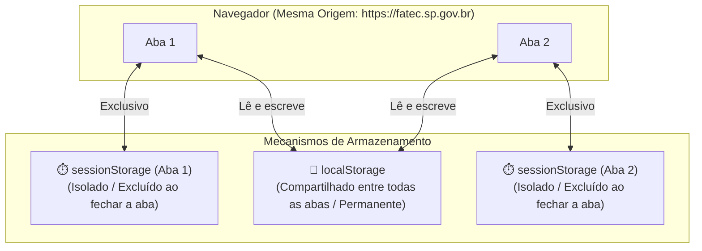

# LocalStorage e SessionStorage

A **Web Storage API** fornece mecanismos simples e padronizados para que as
aplicações web possam armazenar dados no formato **chave-valor** diretamente no
navegador do usuário.

Essa capacidade é fundamental para persistir informações de interface — como a
escolha do tema visual (claro/escuro), rascunhos de formulários, itens em um
carrinho de compras temporário ou preferências de visualização — sem a
necessidade de disparar requisições HTTP para o servidor a cada alteração.

Neste capítulo do catálogo, você aprenderá como utilizar o **`localStorage`** e
o **`sessionStorage`**, entenderá as diferenças de ciclo de vida entre eles e
verá como persistir objetos complexos com segurança e tipagem no TypeScript.

## A Interface `Storage`

Tanto o `localStorage` quanto o `sessionStorage` implementam a mesma interface
nativa chamada **`Storage`**. Isso significa que ambos compartilham exatamente
os mesmos métodos e propriedades para manipulação de dados:

| Método / Propriedade | Assinatura TypeScript                       | Descrição                                                                 |
| :------------------- | :------------------------------------------ | :------------------------------------------------------------------------ |
| `setItem()`          | `setItem(key: string, value: string): void` | Armazena um par chave-valor. Se a chave já existir, o valor é atualizado. |
| `getItem()`          | `getItem(key: string): string \| null`      | Retorna o valor associado à chave, ou `null` se a chave não existir.      |
| `removeItem()`       | `removeItem(key: string): void`             | Remove a chave informada e seu respectivo valor do armazenamento.         |
| `clear()`            | `clear(): void`                             | Limpa e apaga todas as chaves armazenadas pela origem atual.              |
| `key()`              | `key(index: number): string \| null`        | Retorna o nome da chave na posição indicada pelo índice numérico.         |
| `length`             | `readonly length: number`                   | Propriedade que retorna a quantidade total de itens armazenados.          |

### Operações Básicas

```typescript
// 1. Gravando valores simples (apenas strings)
localStorage.setItem("theme", "dark");
localStorage.setItem("language", "pt-BR");

// 2. Lendo um valor existente
const currentTheme = localStorage.getItem("theme");
console.log(currentTheme); // "dark"

// 3. Tentando ler uma chave inexistente (retorna null)
const nonExistent = localStorage.getItem("user_token");
console.log(nonExistent); // null

// 4. Removendo um item específico
localStorage.removeItem("language");

// 5. Verificando o total de itens e limpando tudo
console.log(localStorage.length); // 1
localStorage.clear();
console.log(localStorage.length); // 0
```

## `localStorage` vs. `sessionStorage`

Embora compartilhem os mesmos métodos, os dois mecanismos diferem no **tempo de
persistência (ciclo de vida)** e no **escopo de compartilhamento entre abas**:



### Tabela Comparativa

| Característica                   | `localStorage`                                                                                         | `sessionStorage`                                                                                             |
| :------------------------------- | :----------------------------------------------------------------------------------------------------- | :----------------------------------------------------------------------------------------------------------- |
| **Persistência dos Dados**       | Permanente. Permanece gravado mesmo após fechar a aba, fechar o navegador ou reiniciar a máquina.      | Temporária. Os dados são apagados automaticamente quando a aba daquele site é fechada.                       |
| **Escopo / Isolamento**          | Compartilhado entre todas as abas e janelas abertas na **mesma origem** (protocolo + domínio + porta). | Isolado exclusivamente na aba atual. Duas abas abertas no mesmo site possuem `sessionStorage` independentes. |
| **Comportamento no Reload (F5)** | Mantém todos os dados intactos.                                                                        | Mantém todos os dados intactos durante a navegação/recarregamento na mesma aba.                              |
| **Capacidade de Armazenamento**  | Aproximadamente **5MB a 10MB** por origem (dependendo do navegador).                                   | Aproximadamente **5MB** por aba.                                                                             |
| **Sincronicidade**               | **Síncrono** (executa diretamente na _Main Thread_).                                                   | **Síncrono** (executa diretamente na _Main Thread_).                                                         |

### Quando usar cada um?

- **Use `localStorage` para:** Preferências visuais do usuário (modo escuro,
  tamanho de fonte), aceite de termos de cookies, dados de cache leve ou filtros
  favoritos.
- **Use `sessionStorage` para:** Dados temporários de um fluxo em etapas (como o
  preenchimento de um formulário de cadastro com várias páginas), dados de uma
  sessão de pagamento em andamento ou histórico de navegação interna daquela
  aba.

## Armazenando Dados Estruturados com JSON

A interface `Storage` armazena **estritamente dados do tipo `string`**. Se você
tentar passar um objeto literal diretamente para o `setItem()`, o JavaScript
converterá o objeto para texto chamando o seu método `.toString()`, resultando
no valor indesejado `"[object Object]"`:

```typescript
const userSettings = {
  theme: "dark",
  notifications: true,
  itemsPerPage: 20,
};

// ❌ NÃO FAÇA ISSO: O objeto será gravado como a string "[object Object]"
// localStorage.setItem("settings", userSettings as any);

// ✅ FORMA CORRETA: Serializar com JSON.stringify() antes de salvar
localStorage.setItem("settings", JSON.stringify(userSettings));

// ✅ FORMA CORRETA: Desserializar com JSON.parse() ao ler
const savedRaw = localStorage.getItem("settings");

if (savedRaw !== null) {
  const parsedSettings = JSON.parse(savedRaw);
  console.log(parsedSettings.theme); // "dark"
}
```

## Criando um Utilitário Tipado no TypeScript

No dia a dia com TypeScript, podemos criar funções utilitárias genéricas que
abstraem a serialização e garantem **segurança de tipo (_Type Safety_)** e
**valores padrão (_fallbacks_)** caso a chave não exista ou o JSON esteja
corrompido:

```typescript
/**
 * Recupera um item tipado do LocalStorage com suporte a fallback padrão.
 */
export function getStorageItem<T>(key: string, defaultValue: T): T {
  try {
    const item = localStorage.getItem(key);

    if (item === null) {
      return defaultValue;
    }

    return JSON.parse(item) as T;
  } catch (error) {
    console.error(`Erro ao analisar a chave '${key}' do localStorage:`, error);
    return defaultValue;
  }
}

/**
 * Salva um item tipado no LocalStorage com serialização automática.
 */
export function setStorageItem<T>(key: string, value: T): void {
  try {
    const serialized = JSON.stringify(value);
    localStorage.setItem(key, serialized);
  } catch (error) {
    console.error(`Erro ao salvar a chave '${key}' no localStorage:`, error);
  }
}
```

### Exemplo de Uso Prático

```typescript
interface UserPreferences {
  theme: "light" | "dark";
  language: "pt-BR" | "en-US";
  fontSize: number;
}

const defaultPreferences: UserPreferences = {
  theme: "light",
  language: "pt-BR",
  fontSize: 16,
};

// Gravando preferências de forma tipada
setStorageItem<UserPreferences>("user_prefs", {
  theme: "dark",
  language: "pt-BR",
  fontSize: 18,
});

// Lendo preferências: o TypeScript infere o tipo UserPreferences automaticamente
const currentPrefs = getStorageItem<UserPreferences>(
  "user_prefs",
  defaultPreferences,
);

console.log(`Tema ativo: ${currentPrefs.theme}`); // TypeScript autocompleta .theme, .language, etc.
```

## Sincronização em Tempo Real Entre Abas (O Evento `storage`)

Uma funcionalidade poderosa do `localStorage` é a capacidade de **comunicar
alterações entre diferentes abas abertas da mesma aplicação**.

Quando um valor é adicionado, alterado ou removido no `localStorage` em uma aba,
o navegador dispara automaticamente um evento chamado **`storage`** na janela
(`window`) de **todas as outras abas abertas** daquele mesmo site:

```typescript
// Este listener é colocado no código da sua aplicação:
window.addEventListener("storage", (event: StorageEvent) => {
  console.log("Alteração detectada em outra aba!");
  console.log("Chave modificada:", event.key);
  console.log("Valor antigo:", event.oldValue);
  console.log("Novo valor:", event.newValue);
  console.log("URL de origem:", event.url);

  // Exemplo: se o tema mudou em outra aba, atualiza a interface da aba atual
  if (event.key === "theme" && event.newValue) {
    document.documentElement.setAttribute("data-theme", event.newValue);
  }
});
```

> **Atenção:** O evento `storage` **não é disparado na própria aba que executou
> a alteração**, apenas nas demais abas abertas da mesma origem.

## Limitações e Boas Práticas

Ao utilizar `localStorage` ou `sessionStorage`, tenha em mente as seguintes
diretrizes:

1. **Operações Síncronas:** A leitura e escrita na Web Storage API bloqueia a
   thread principal do navegador. Evite salvar estruturas de dados muito grandes
   (centenas de kilobytes ou megabytes) para não causar travamentos perceptíveis
   na interface. Para grandes volumes, use a **IndexedDB API**.
2. **Limite de Quota (~5MB):** Se a sua aplicação tentar salvar mais dados do
   que a cota permitida pelo navegador, o método `setItem()` lançará uma exceção
   do tipo `QuotaExceededError`.
3. **Segurança e Dados Sensíveis:** O armazenamento local é acessível por
   qualquer script que rode na mesma página. Por isso, **nunca armazene senhas,
   informações de cartão de crédito ou dados altamente sensíveis sem proteção**,
   pois eles podem ser lidos caso a aplicação sofra um ataque de XSS
   (_Cross-Site Scripting_).

<details>
<summary>🔍 <strong>Inspecionando o Storage no DevTools do Navegador</strong></summary>

Você pode visualizar, editar e apagar manualmente qualquer chave armazenada no
`localStorage` e no `sessionStorage` utilizando as ferramentas de desenvolvedor
do navegador:

1. Abra o navegador e pressione `F12` (ou `Ctrl + Shift + I` / `Cmd + Option +
I`).
2. Acesse a aba **Application** (no Chrome/Edge) ou **Armazenamento / Storage**
   (no Firefox).
3. No menu lateral esquerdo, expanda a seção **Storage** e selecione **Local
   Storage** ou **Session Storage**.
4. Você verá uma tabela com todas as chaves e valores gravados pela origem
   atual, podendo adicionar novas chaves ou deletar registros para testar sua
   aplicação.

</details>

---

<a href="01-o-que-sao-web-apis.md">← O Que São Web APIs</a>
