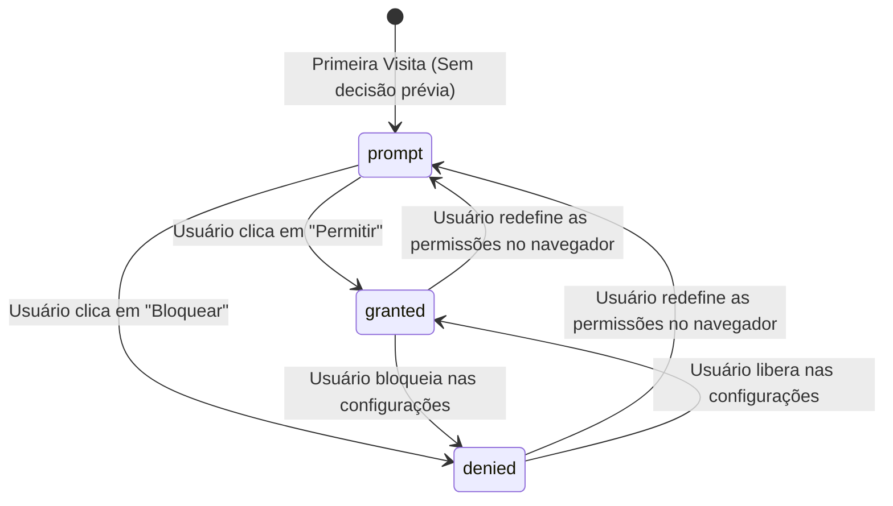

# Permissions API

A **Permissions API** fornece uma interface padronizada e unificada para que as
aplicações web possam **consultar e monitorar o estado de consentimento** do
usuário em relação a recursos protegidos e sensíveis do dispositivo.

Em vez de tentar acessar um recurso às cegas — arriscando lançar exceções de
erro ou forçar o navegador a disparar caixas de diálogo inesperadas na tela —, a
Permissions API permite que a aplicação descubra previamente se um recurso está
autorizado, bloqueado ou pendente de decisão.

Essa capacidade é fundamental para desenhar interfaces amigáveis: você pode
exibir um botão explicativo convidando o usuário a ativar a localização apenas
se ela ainda não tiver sido solicitada, ou exibir uma mensagem de instrução caso
o recurso tenha sido bloqueado nas configurações do navegador.

Neste capítulo do catálogo, você aprenderá a consultar o estado de permissões
com `navigator.permissions.query()`, compreenderá a máquina de estados de
consentimento e verá como escutar alterações de permissão em tempo real com
TypeScript.

## A Máquina de Estados de Consentimento (`PermissionState`)

No modelo de segurança da Web moderna, o acesso a recursos protegidos transita
por três estados possíveis:



| Estado (`PermissionState`) | Significado                                                | Comportamento da Aplicação                                                                                                                        |
| :------------------------- | :--------------------------------------------------------- | :------------------------------------------------------------------------------------------------------------------------------------------------ |
| **`"prompt"`**             | O usuário ainda não tomou uma decisão para a origem atual. | Ao solicitar o recurso (ex: chamar `getCurrentPosition()`), o navegador exibirá o diálogo nativo de autorização.                                  |
| **`"granted"`**            | O usuário já concedeu permissão explícita para este site.  | O recurso pode ser acessado imediatamente sem exibir novos diálogos ou travas visuais.                                                            |
| **`"denied"`**             | O usuário bloqueou expressamente o acesso a este recurso.  | O navegador rejeita o acesso automaticamente sem exibir novas perguntas. A interface deve informar ao usuário como desbloquear nas configurações. |

## Consultando Permissões com `permissions.query()`

A consulta de status é realizada através do método
`navigator.permissions.query()`, passando um objeto descritor contendo o nome da
permissão desejada:

```typescript
const permissionStatus = await navigator.permissions.query({
  name: "geolocation",
});

console.log(`Estado atual da permissão: ${permissionStatus.state}`);
```

### Recursos Padronizados Consultáveis

A Permissions API unifica o acesso a múltiplos recursos da plataforma Web
através da propriedade `name`:

| Nome da Permissão      | Recurso Associado                                        | API Relacionada               |
| :--------------------- | :------------------------------------------------------- | :---------------------------- |
| `'geolocation'`        | Acesso às coordenadas físicas do dispositivo.            | Geolocation API               |
| `'notifications'`      | Exibição de alertas e notificações na área de trabalho.  | Notification API              |
| `'camera'`             | Acesso ao sinal de vídeo das câmeras do dispositivo.     | Media Capture and Streams API |
| `'microphone'`         | Acesso à captura de áudio dos microfones.                | Media Capture and Streams API |
| `'clipboard-read'`     | Leitura de dados da área de transferência (Ctrl+V).      | Clipboard API                 |
| `'clipboard-write'`    | Gravação de dados na área de transferência (Ctrl+C).     | Clipboard API                 |
| `'screen-wake-lock'`   | Manter a tela do dispositivo ligada sem apagar.          | Screen Wake Lock API          |
| `'persistent-storage'` | Armazenamento local protegido contra limpeza automática. | StorageManager API            |

## Monitoramento Reativo de Mudanças (O Evento `change`)

Uma das características mais poderosas da Permissions API é que o objeto
retornado **`PermissionStatus`** é um emissor de eventos.

Se o usuário alterar as permissões do site nas configurações do navegador (ou
clicar no ícone de configurações ao lado da barra de endereço URL) enquanto a
página ainda estiver aberta, o evento **`change`** será disparado
automaticamente:

```typescript
async function watchGeolocationPermission(): Promise<void> {
  const status = await navigator.permissions.query({ name: "geolocation" });

  console.log(`Estado inicial: ${status.state}`);

  // Escuta alterações de permissão em tempo real
  status.addEventListener("change", () => {
    console.log(`O usuário alterou a permissão para: ${status.state}`);

    if (status.state === "granted") {
      console.log("Localização liberada! Atualizando mapa...");
    } else if (status.state === "denied") {
      console.warn("Localização revogada pelo usuário.");
    }
  });
}
```

## Aplicação Prática com TypeScript

### 1. Função Utilitária de Consulta Segura

Podemos encapsular a consulta em um utilitário com checagem defensiva de
suporte:

```typescript
export type SupportedPermission =
  | "geolocation"
  | "notifications"
  | "camera"
  | "microphone"
  | "clipboard-read"
  | "clipboard-write";

/**
 * Consulta o estado de uma permissão no navegador com tratamento defensivo.
 */
export async function checkPermission(
  permissionName: SupportedPermission,
): Promise<PermissionState | "unsupported"> {
  // 1. Verifica se o navegador possui suporte à Permissions API
  if (typeof navigator === "undefined" || !("permissions" in navigator)) {
    return "unsupported";
  }

  try {
    const status = await navigator.permissions.query({
      name: permissionName as PermissionName,
    });
    return status.state;
  } catch (error) {
    console.warn(
      `Permissão '${permissionName}' não é reconhecida por este navegador:`,
      error,
    );
    return "unsupported";
  }
}
```

### 2. Adaptando Componentes de Interface com Base no Estado

Com a Permissions API, podemos estruturar a interface do usuário de forma
inteligente antes mesmo de interagir com o recurso:

```typescript
async function renderNotificationWidget(
  buttonElement: HTMLButtonElement,
  messageElement: HTMLElement,
): Promise<void> {
  const permissionState = await checkPermission("notifications");

  switch (permissionState) {
    case "granted":
      buttonElement.style.display = "none";
      messageElement.textContent = "Notificações ativadas para este site.";
      break;

    case "prompt":
      buttonElement.style.display = "inline-block";
      buttonElement.textContent = "Ativar Notificações";
      buttonElement.onclick = async () => {
        // Dispara a solicitação real apenas quando o usuário clicar no botão
        const result = await Notification.requestPermission();
        if (result === "granted") {
          renderNotificationWidget(buttonElement, messageElement);
        }
      };
      break;

    case "denied":
      buttonElement.style.display = "none";
      messageElement.textContent =
        "Notificações bloqueadas. Habilite nas configurações do navegador para receber avisos.";
      break;

    case "unsupported":
      buttonElement.style.display = "none";
      messageElement.textContent =
        "Seu navegador não possui suporte a notificações.";
      break;
  }
}
```

<details>
<summary>🔍 <strong>Inspecionando e Gerenciando Permissões no Navegador</strong></summary>

Como desenvolvedor ou usuário, você pode verificar e redefinir o estado de
qualquer permissão a qualquer momento:

1. Na barra de endereços do navegador (Chrome, Edge, Firefox ou Safari), clique
   no **ícone de cadeado / controles do site** localizado imediatamente à
   esquerda da URL.
2. Você verá a lista de todas as permissões associadas à origem atual
   (Localização, Notificações, Câmera, etc.).
3. Você pode alternar manualmente entre **Permitir**, **Bloquear** ou **Padrão
   (Perguntar)** e observar como o evento `change` da sua aplicação reage
   instantaneamente sem precisar recarregar a página.

</details>

---

<a href="01-o-que-sao-web-apis.md">← O Que São Web APIs</a>
