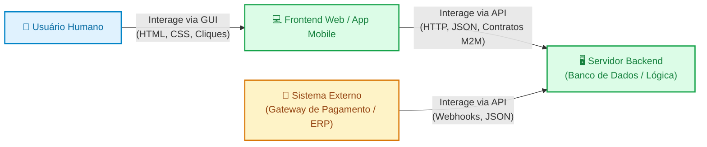
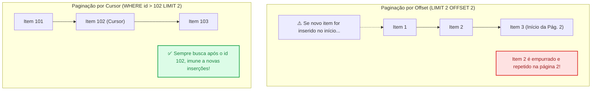

# 01. O Que São APIs e Boas Práticas de Design

No ecossistema do desenvolvimento web moderno, uma aplicação de backend
raramente existe apenas para renderizar telas visuais em HTML para humanos. Seu
papel mais frequente e estratégico é atuar como um provedor de dados e serviços
para outros sistemas: aplicativos mobile, painéis interativos em frontend (como
React ou Vue), ou integrações entre empresas (gateways de pagamento, serviços de
logística e emissores de notas fiscais).

Isso nos leva a uma questão fundamental de engenharia de software: **como outros
sistemas conversam com a nossa aplicação?**

Se você está construindo um aplicativo mobile, um painel em React ou integrando
um sistema de cobrança com operadoras de cartão de crédito, essas aplicações não
leem telas visuais com CSS nem digitam em formulários como um ser humano. Elas
precisam de um canal de diálogo padronizado e previsível.

Neste capítulo, você aprenderá o que é uma **API** sob a ótica da comunicação
entre sistemas (_Machine-to-Machine_). Compreenderá o papel vital dos
**contratos estáveis** e dominará as boas práticas universais que toda API
profissional deve implementar antes de adotar qualquer estilo arquitetural
específico: **estratégias de paginação**, **filtros e buscas**, **versionamento
de rotas** e **padronização de envelopes de resposta e erro**.

## A Dor: A Falta de Contratos e a Anarquia dos Dados

Imagine uma equipe que decide disponibilizar dados de clientes para um novo
aplicativo mobile sem definir um contrato estrito de API e sem adotar padrões
básicos de tráfego de dados.

A implementação ingênua frequentemente comete quatro erros clássicos de
arquitetura:

```php
// ❌ CÓDIGO PROBLEMÁTICO: Falta de contrato, sobrecarga de memória e erros inconsistentes
final class LegacyCustomerController
{
    public function handle(HttpRequest $request): HttpResponse
    {
        // 1. Ausência de paginação: busca TODOS os 80.000 clientes da base de uma vez
        $customers = Database::query("SELECT * FROM customers"); // Estouro de memória (RAM)

        // 2. Erro sem padronização: se a busca falhar, devolve texto puro com status 200
        if ($customers === false) {
            return new HttpResponse(
                statusCode: 200, // Status de sucesso mascarando um erro de infraestrutura
                headers: ['Content-Type' => 'text/plain'],
                body: "Erro no banco de dados. Tente novamente mais tarde."
            );
        }

        // 3. Estrutura mutável: campos renomeados arbitrariamente sem aviso
        // O app mobile antigo esperava 'fullName', mas o backend passou a mandar 'client_name'
        $formatted = array_map(function ($row) {
            return [
                'client_name' => $row['name'], // Quebra clientes antigos em produção!
                'document' => $row['cpf_cnpj'],
                'created' => $row['created_at']
            ];
        }, $customers);

        return HttpResponse::json($formatted);
    }
}
```

O impacto desse código em produção é devastador:

1. **Esgotamento de Memória (_Out of Memory_):** Quando a tabela atingir 50.000
   ou 100.000 registros, o comando `SELECT *` consumirá centenas de megabytes de
   memória RAM do servidor. O processo travará e a resposta gerará um payload de
   30 MB que consumirá todo o plano de dados móveis do usuário final.
2. **Quebra de Retrocompatibilidade (_Breaking Changes_):** Em sistemas web
   tradicionais, mudar uma tela afeta apenas quem der F5 no navegador. No mundo
   das APIs, aplicativos mobile já instalados em milhares de celulares continuam
   rodando versões compiladas há meses. Renomear uma propriedade de `fullName`
   para `client_name` fará o app travar (_crash_) nas mãos dos clientes.
3. **Erros Mascarados (_False Positives_):** Retornar mensagens de erro dentro
   de um status `200 OK` impede que bibliotecas clientes (como Axios ou Fetch)
   disparem seus mecanismos automáticos de tratamento de falhas e retentativas.
4. **Acoplamento Extremo:** O cliente precisa "adivinhar" se a resposta é uma
   lista, um objeto de erro ou texto puro, tornando o código do frontend repleto
   de condicionais defensivas frágeis.

Para solucionar essas dores, a engenharia de software trata uma API como um
**contrato formal de interface**.

## O Conceito: O Que É uma API na Prática?

A sigla **API** significa _Application Programming Interface_ (Interface de
Programação de Aplicações).

Assim como uma **GUI** (_Graphical User Interface_) é uma interface projetada
para que um **ser humano** interaja com o sistema através de botões, cores e
tipografia, uma **API** é uma interface projetada para que **outro programa de
computador** interaja com o sistema através de comandos, estruturas de dados e
regras bem definidas:



No ecossistema de APIs de backend, a premissa de ouro é a **previsibilidade**:

- Clientes e servidores são desenvolvidos por equipes independentes;
- Podem ser escritos em linguagens totalmente diferentes (ex: Frontend em
  TypeScript, Backend em PHP, App Mobile em Kotlin ou Swift);
- Sofrem deploys em momentos distintos.

Portanto, o contrato da API é o único elo de confiança entre esses sistemas.

## Práticas Universais de Design de APIs

Independentemente de você escolher REST, GraphQL ou gRPC no futuro, existem
quatro pilares de design que governam qualquer API de alta qualidade na Web:

### 1. Estratégias de Paginação de Coleções

Grandes volumes de dados jamais devem ser despejados de uma só vez na rede.
Existem duas abordagens consagradas para fatiar resultados:

#### A. Paginação por Deslocamento (Offset-based Pagination)

É a abordagem mais comum e intuitiva. O cliente envia dois parâmetros na URL: a
página desejada (`page`) ou o número de registros a pular (`offset`),
acompanhado da quantidade de registros por página (`limit` ou `per_page`):

```text
GET /api/v1/products?page=2&limit=20
```

Internamente, o banco de dados executa:

```sql
SELECT * FROM products ORDER BY id ASC LIMIT 20 OFFSET 20;
```

- **Vantagens:** Extremamente simples de entender; permite que o usuário salte
  diretamente para qualquer página específica (ex: ir direto para a página 8).
- **Desvantagens:**
  - **Problema de Desempenho:** Para calcular `OFFSET 100000`, o banco precisa
    varrer e descartar 100.000 linhas na memória antes de devolver os 20
    registros solicitados.
  - **Fenômeno do Deslocamento de Dados (_Data Drift_):** Se um novo produto for
    inserido na primeira página enquanto o usuário navega da página 1 para a
    página 2, todos os registros são empurrados uma posição para baixo. O
    usuário verá o último item da página 1 repetido no topo da página 2!

#### B. Paginação por Cursor (Cursor-based / Keyset Pagination)

Em vez de contar posições a partir do início da tabela, a paginação por cursor
utiliza um **marcador estável** (geralmente o ID ou o timestamp indexado do
último item visto) para solicitar os registros seguintes:

```text
GET /api/v1/products?limit=20&after=eyJpZCI6MTQyfQ==
```

O cliente recebe um token opaco (`after`) que decodifica para `{ "id": 142 }`. O
banco executa uma consulta direta indexada:

```sql
SELECT * FROM products WHERE id > 142 ORDER BY id ASC LIMIT 20;
```



- **Vantagens:** Desempenho de busca constante $O(1)$ utilizando índices; imune
  ao _Data Drift_ (ideal para feeds infinitos como redes sociais, timelines e
  logs em tempo real).
- **Desvantagens:**
  - **Maior Complexidade de Implementação:** Exige selecionar criteriosamente
    uma coluna sequencial e única (ou chave composta como `data + id`), criar
    índices dedicados no banco de dados e gerenciar a codificação/decodificação
    dos tokens de cursor na aplicação;
  - **Inflexibilidade de Navegação:** Não permite que o usuário salte para
    páginas arbitrárias (como "ir direto para a página 5"); a navegação torna-se
    estritamente sequencial (próximo / anterior).

| Critério de Comparação                     | Paginação por Deslocamento (_Offset_)                                         | Paginação por Marcador (_Cursor_)                                           |
| :----------------------------------------- | :---------------------------------------------------------------------------- | :-------------------------------------------------------------------------- |
| **Mecanismo Central**                      | Pula $N$ registros (`OFFSET 50`)                                              | Filtra a partir do último identificador (`id > 50`)                         |
| **Complexidade de Implementação**          | **Baixa** (nativa no SQL com `LIMIT`/`OFFSET` e comum em qualquer ORM)        | **Média/Alta** (requer índices dedicados, tokens opacos e lógica de cursor) |
| **Desempenho com Milhões de Linhas**       | Degrada linearmente ($O(N)$ no banco)                                         | Mantém desempenho constante ($O(1)$ indexado)                               |
| **Resistência a Inserções (_Data Drift_)** | Vulnerável (registros duplicados ou pulados)                                  | **Totalmente imune** (navegação consistente)                                |
| **Salto para Páginas Arbitrárias**         | **Permite** (ex: clicar no link "Página 14")                                  | Não permite (apenas anterior / próxima)                                     |
| **Casos de Uso Ideais**                    | Tabelas administrativas, relatórios, grids com navegação por número de página | Feeds sociais, timelines, fluxos de chat, logs e coleções massivas          |

### 2. Filtros, Busca e Ordenação na Query String

Para permitir que o cliente personalize a visualização sem poluir os caminhos da
URL, utilizamos a **Query String** (parâmetros após o `?`):

```text
GET /api/v1/orders?status=shipped&customer_id=94&sort=-created_at&fields=id,total,status
```

As convenções mais consagradas pela indústria incluem:

- **Filtros Exatos:** `status=shipped` ou `category=electronics`.
- **Busca Textual Abrangente:** Use o parâmetro semântico `q` (ex:
  `?q=teclado+mecanico`).
- **Ordenação Flexível:** O prefixo `-` ou `desc` sinaliza ordem decrescente
  (ex: `sort=-created_at` ou `sort=price&order=desc`).
- **Seleção Específica de Campos (_Sparse Fieldsets_):** Parâmetro
  `fields=id,total` instrui o backend a serializar apenas as propriedades
  requisitadas, economizando tráfego de rede e tempo de serialização JSON.

#### Como Representar Arrays e Listas na Query String

A especificação do protocolo HTTP (RFC 3986) define como formatar uma URL, mas
**não padronizou uma forma oficial de enviar coleções ou arrays via Query
String**. Como consequência, a indústria consolidou três abordagens principais,
e cabe ao engenheiro de backend documentar e escolher a convenção adotada:

| Padrão Adotado                        | Exemplo na URL                      | Onde é Mais Comum                                                         | Ponto de Atenção                                                                                                         |
| :------------------------------------ | :---------------------------------- | :------------------------------------------------------------------------ | :----------------------------------------------------------------------------------------------------------------------- |
| **1. Colchetes Explícitos (`key[]`)** | `?status[]=active&status[]=pending` | PHP (`$_GET`), Ruby on Rails, biblioteca `qs` do Node.js                  | Sintaxe muito clara; o parser já entrega um array nativo automaticamente.                                                |
| **2. Repetição Pura de Chaves**       | `?status=active&status=pending`     | Spring (Java), FastAPI (Python), ASP.NET Core, `URLSearchParams.getAll()` | No PHP e em parsers ingênuos, a segunda chave pode sobrescrever a primeira se o parser esperar apenas valores escalares. |
| **3. Valores Separados por Vírgula**  | `?status=active,pending`            | Padrão JSON:API, Stripe, GitHub, AWS APIs                                 | URLs muito mais limpas e compactas; exige apenas um `explode(',', $param)` ou `split(',')` no backend.                   |

```text
// Comparação visual das três abordagens para buscar pedidos com múltiplos status:

1. Colchetes:   GET /api/v1/orders?status[]=shipped&status[]=delivered
2. Repetição:   GET /api/v1/orders?status=shipped&status=delivered
3. Delimitador: GET /api/v1/orders?status=shipped,delivered
```

> **Dica de Design:** A abordagem por **valores separados por vírgula**
> (`status=shipped,delivered`) tornou-se a favorita de grandes plataformas pela
> legibilidade da URL e facilidade de manipulação. Caso algum valor possa conter
> vírgulas no seu domínio (ex.: nomes ou descrições), prefira os **colchetes
> explícitos** (`status[]`).

### 3. Estratégias de Versionamento de APIs

A regra primordial da engenharia de APIs corporativas é: **Você nunca pode
quebrar clientes que já estão em produção**.

Quando uma mudança drástica for inevitável (como remover um campo vital ou
alterar tipos de dados), a API deve ser **versionada**. Há três estratégias
consagradas:

| Estratégia                 | Exemplo                                   | Vantagens                                                                   | Desvantagens                                                                                    |
| :------------------------- | :---------------------------------------- | :-------------------------------------------------------------------------- | :---------------------------------------------------------------------------------------------- |
| **1. URI Path**            | `/api/v1/orders`<br>`/api/v2/orders`      | Extremamente explícito, fácil de depurar e testar diretamente no navegador. | Polui a URI com metadados de versão; exige duplicação de rotas.                                 |
| **2. Custom Header**       | `X-API-Version: 2`                        | Mantém as URIs limpas e perpétuas para o recurso.                           | Difícil de testar sem ferramentas dedicadas (como cURL ou Postman); não cacheável trivialmente. |
| **3. Content Negotiation** | `Accept: application/vnd.empresa.v2+json` | Segue o padrão mais rigoroso do protocolo HTTP.                             | Complexo de configurar e documentar para desenvolvedores iniciantes.                            |

> **Recomendação da Indústria:** Para a vasta maioria das aplicações web e
> móveis, o **versionamento por URI Path (`/v1/`, `/v2/`)** é o mais adotado
> mundialmente (utilizado pelo Stripe, GitHub e Twitter) por seu equilíbrio
> imbatível entre legibilidade, simplicidade e facilidade de roteamento.

<details>
<summary>🔍 Aprofundamento: Ciclo de Vida e Descontinuação de Versões (O Cabeçalho Sunset - RFC 8594)</summary>

Lançar uma nova versão da API (ex.: `/api/v2/`) não significa desligar a versão
anterior (`/api/v1/`) imediatamente. Clientes móveis ou sistemas legados de
parceiros podem levar meses ou anos para atualizar.

Para comunicar aos consumidores que uma versão da API será descontinuada sem
gerar surpresas, a indústria adota as seguintes práticas:

1. **Janela de Convivência (_Deprecation Window_):** Manter a versão antiga
   operacional por um período pré-acordado (geralmente de 6 a 12 meses),
   garantindo apenas correções críticas de segurança.
2. **O Cabeçalho HTTP `Sunset` (RFC 8594):** O servidor inclui na resposta um
   cabeçalho oficial informando a data e a hora exatas em que aquele endpoint
   será desativado definitivamente:

   ```text
   Sunset: Wed, 11 Nov 2026 00:00:00 GMT
   Link: <https://api.empresa.com/docs/v2-migration>; rel="sunset"
   ```

3. **Métricas de Abandono:** O backend monitora o volume de requisições que
   ainda atingem a rota antiga. Somente quando o tráfego atinge níveis residuais
   (ou após o prazo final de migração) a rota é desligada, passando a responder
   com `410 Gone`.

</details>

### 4. Padronização de Envelopes de Resposta e Erros

Uma API previsível adota estruturas consistentes tanto para o sucesso quanto
para a falha.

#### A. Envelope de Sucesso para Coleções

Ao listar registros paginados, separe o array de dados reais (`data`) dos
metadados de navegação (`meta`):

```json
{
  "data": [
    { "id": 101, "title": "Monitor UltraWide", "price": 1450.0 },
    { "id": 102, "title": "Teclado Mecânico", "price": 380.0 }
  ],
  "meta": {
    "page": 1,
    "limit": 20,
    "totalRecords": 85,
    "totalPages": 5,
    "hasNextPage": true,
    "hasPreviousPage": false
  }
}
```

#### B. Padronização de Erros (RFC 7807 / RFC 9457)

Em vez de criar formatos de erro arbitrários a cada projeto (`{"erro": "x"}` ou
`{"mensagem": "y"}`), a IETF padronizou a especificação **RFC 9457 (_Problem
Details for HTTP APIs_)**. O formato define um contrato semântico universal em
JSON com o cabeçalho `Content-Type: application/problem+json`:

```json
{
  "type": "https://api.empresa.com/errors/insufficient-funds",
  "title": "Saldo Insuficiente",
  "status": 422,
  "detail": "A sua conta possui saldo de R$ 50,00, que é inferior ao valor da cobrança de R$ 120,00.",
  "instance": "/api/v1/transfers/tr-892182",
  "invalidParams": [
    { "field": "amount", "reason": "Valor excede o limite disponível" }
  ]
}
```

> **Regra de Ouro (Princípio da Robustez ou Lei de Postel):**
>
> _"Seja conservador no que você envia, seja liberal no que você aceita."_
>
> No design de APIs, isso significa: seu servidor deve validar rigorosamente os
> tipos e valores que recebe, mas deve ser tolerante a clientes que enviem
> campos adicionais irrelevantes. Ao mesmo tempo, o servidor deve ser
> estritamente fiel ao contrato prometido nas respostas, **nunca removendo
> propriedades ou alterando seus tipos em versões estáveis da API**.

<details>
<summary>🔍 Aprofundamento: A Especificação RFC 9457 (Problem Details)</summary>

Durante muitos anos, cada empresa inventou seu próprio formato para informar
erros de API:

- O Twitter retornava `{"errors": [{"code": 34, "message": "Sorry"}]}`.
- O Facebook retornava `{"error": {"message": "...", "type":
"OAuthException"}}`.
- Outras APIs retornavam strings soltas ou formatos XML.

A **RFC 7807** (atualizada pela **RFC 9457**) foi criada pelo grupo de
engenharia da Internet (IETF) para resolver essa fragmentação internacional.
Seus 5 membros padrão são:

1. **`type` (URI):** Um identificador URI que aponta para uma página de
   documentação explicando o tipo da falha em linguagem humana.
2. **`title` (string):** Um resumo curto e genérico do erro (ex: `"Recurso Não
Encontrado"` ou `"Saldo Insuficiente"`). Não deve mudar entre diferentes
   instâncias do mesmo erro.
3. **`status` (int):** O mesmo código de status HTTP numérico transmitido na
   linha de cabeçalho da resposta (ex: `404`, `422`).
4. **`detail` (string):** Uma explicação detalhada, amigável e legível por
   humanos sobre a ocorrência específica desse erro.
5. **`instance` (URI):** Um identificador que localiza a chamada específica do
   cliente (geralmente a URI da rota ou um ID de rastreamento de log para
   suporte técnico).

Adotar a RFC 9457 transforma a sua API em um serviço padronizado de nível
internacional.

</details>

---

<p align="right"><a href="02-apis-rest-e-design-semantico.md">Próximo: APIs REST e Design Semântico →</a></p>
