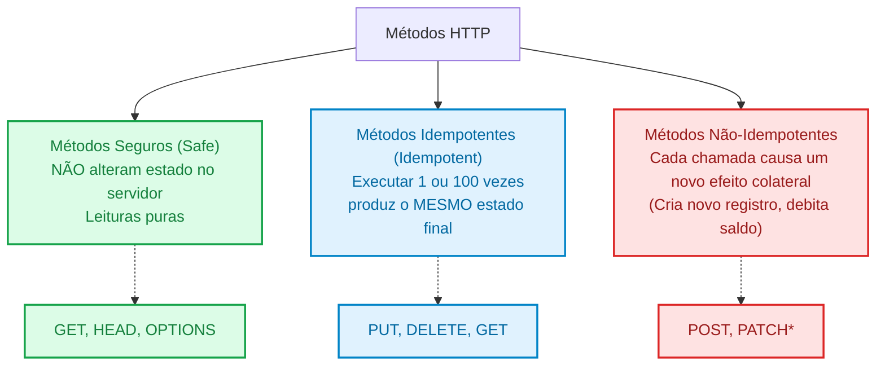
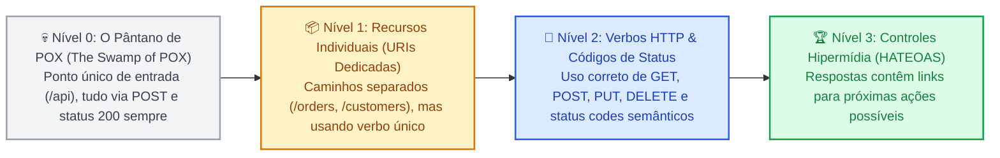

# 02. APIs REST e Design Semântico

No capítulo anterior, compreendemos o papel das APIs na comunicação entre
sistemas e exploramos práticas universais de engenharia de software: contratos
estáveis, paginação, filtros e versionamento.

Agora, precisamos responder à pergunta central que dita a elegância e a
usabilidade de qualquer serviço web: **como devemos batizar nossos endpoints e
mapear as ações que os clientes podem executar?**

Historicamente, muitas aplicações construíram suas integrações criando rotas
desordenadas e inventando verbos aleatórios na URL (como `/salvarUsuario`,
`/delete_order?id=5` ou `/atualizarPreco`). Esse estilo caótico gera endpoints
imprevisíveis, dificulta o cache da rede e causa falhas graves de integridade.

Neste capítulo, você dominará o **REST** (_Representational State Transfer_), o
estilo arquitetural que governa a Web moderna. Você aprenderá a modelar **URIs
orientadas a recursos**, a utilizar a **semântica rigorosa dos verbos e códigos
de status HTTP**, a dominar os conceitos vitais de **idempotência e segurança de
métodos**, e a navegar pelos quatro degraus do **Modelo de Maturidade de
Richardson**.

## A Dor: A Anarquia das Rotas de Procedimento (RPC Ingênuo)

Antes da consolidação dos padrões REST, os desenvolvedores tratavam a Web como
uma mera camada de transporte para disparar funções remotas (estilo conhecido
como _Remote Procedure Call_ ou RPC).

Veja um exemplo clássico de API caótica construída sem semântica HTTP:

```php
// ❌ CÓDIGO PROBLEMÁTICO: Anarquia de verbos na URI, abuso de métodos e mascaramento de erros
// Rotas definidas na aplicação:
// GET  /excluirPedido.php?id=928
// POST /api/salvar_novo_produto
// POST /api/alterar_status_usuario

final class BadOrderController
{
    // Rota: GET /excluirPedido.php?id=928
    public function deleteOrder(HttpRequest $request): HttpResponse
    {
        $id = $request->queryParams['id'] ?? null;

        // PERIGO CRÍTICO: Mutações destrutivas executadas via GET!
        Database::execute("DELETE FROM orders WHERE id = ?", [$id]);

        // Retorna status 200 com mensagem no corpo mesmo para erros ou deleções
        return HttpResponse::json([
            'sucesso' => true,
            'mensagem' => 'Pedido apagado com sucesso!'
        ], 200);
    }
}
```

Essa abordagem acarreta problemas graves em ambientes de produção:

1. **Destruição Acidental por Crawlers de Busca:** O método `GET` foi concebido
   para ser **estritamente seguro** (somente leitura). Se você criar uma rota de
   exclusão via `GET`, um simples robô de indexação do Google, um antivírus
   corporativo ou a ferramenta de pré-carregamento de links do navegador do
   usuário clicará no link e **apagará registros do banco de dados
   automaticamente**!
2. **Explosão de Nomes Imprevisíveis:** Se cada desenvolvedor da equipe inventar
   uma URL para cada ação (`/cadastrarUser`, `/insert_customer`, `/new_client`),
   a documentação se torna um labirinto impossível de adivinhar. O cliente
   precisa consultar o manual para cada operação elementar.
3. **Incapacidade de Aproveitar a Infraestrutura da Web:** Proxies reversos,
   redes de distribuição de conteúdo (CDNs) e navegadores possuem suporte nativo
   a cache para métodos `GET`. Quando uma API usa `POST` para consultas e `GET`
   para alterações, toda a infraestrutura de cache e segurança da Internet deixa
   de funcionar.

O estilo REST foi proposto justamente para substituir essa anarquia por uma
convenção universal e intuitiva.

## O Conceito: A Filosofia da Arquitetura REST

Em 2000, o cientista da computação **Roy Fielding** (um dos principais autores
da especificação original do HTTP) apresentou o conceito de **REST**
(_Representational State Transfer_) em sua tese de doutorado.

A grande sacada de Fielding foi simples, porém revolucionária:  
_A Web já possui um protocolo de comunicação extraordinariamente rico e
distribuído (o HTTP). Em vez de inventar um protocolo proprietário dentro do
payload JSON, por que não utilizar a semântica nativa que o próprio HTTP já
oferece?_

No padrão REST:

- As **URIs** identificam **Recursos** (Substantivos: _o que_ está sendo
  manipulado);
- Os **Métodos HTTP** identificam as **Ações** (Verbos: _o que fazer_ com o
  recurso);
- Os **Headers HTTP** negociam **Formatos e Políticas** (Metadados: tipos de
  dados, cache e autenticação);
- Os **Status Codes HTTP** comunicam o **Desfecho** (Resultados padronizados
  universalmente).


### 1. Modelagem de Recursos e URIs Semânticas

Um **Recurso** é qualquer conceito ou entidade de negócio que você deseja expor
para manipulação (um usuário, um produto, um pedido, uma fatura).

Para projetar URIs limpas e idiomáticas, siga estas três regras de ouro:

1. **Use Substantivos no Plural:** Recursos representam coleções de entidades.
   Nunca use verbos na URL.
   - ❌ `/getUser`, `/salvarProduto`, `/deleteOrder`
   - ✅ `/users`, `/products`, `/orders`
2. **Identifique Recursos Individuais por ID no Caminho:**
   - Obter coleção: `GET /api/v1/products`
   - Obter item específico: `GET /api/v1/products/84`
3. **Modele Relacionamentos por Aninhamento (_Nesting_):**
   - Pedidos pertencentes a um cliente: `GET /api/v1/customers/12/orders`
   - Um item específico do pedido: `GET /api/v1/customers/12/orders/501/items/3`

> **Atenção Prática de Design:** Evite aninhamentos com mais de dois níveis de
> profundidade (como `/lojas/1/setores/2/corredores/3/prateleiras/4/produtos`).
> Se a URI ficar profunda demais, desacople o recurso tornando-o uma rota de
> primeiro nível: `GET /api/v1/shelf-products?shelf_id=4`.

### 2. A Semântica dos Verbos HTTP

O protocolo HTTP define métodos com papéis operacionais bem estabelecidos. Em
uma API REST bem projetada, cada verbo cumpre uma função estrita:

| Método HTTP  | Propósito Semântico                                                           | Exemplo de Uso             | Status Code Típico           |
| :----------- | :---------------------------------------------------------------------------- | :------------------------- | :--------------------------- |
| **`GET`**    | Recupera a representação atual de um recurso ou coleção.                      | `GET /api/v1/orders/10`    | `200 OK`                     |
| **`POST`**   | Cria um novo recurso subordinado dentro de uma coleção.                       | `POST /api/v1/orders`      | `201 Created`                |
| **`PUT`**    | **Substitui integralmente** o recurso existente (ou o cria com ID fornecido). | `PUT /api/v1/users/42`     | `200 OK` ou `204 No Content` |
| **`PATCH`**  | Aplica **modificações parciais** em atributos específicos do recurso.         | `PATCH /api/v1/users/42`   | `200 OK`                     |
| **`DELETE`** | Remove o recurso especificado do sistema.                                     | `DELETE /api/v1/orders/10` | `204 No Content`             |

> **Convenção Semântica vs Realidade de Mercado (PUT vs PATCH):**
>
> Na teoria estrita da especificação HTTP:
>
> - **`PUT`** significa **substituição total** (se você enviar apenas `{"name":
"Ana"}`, os demais campos omitidos devem ser apagados ou redefinidos para
>   `null`).
> - **`PATCH`** significa **atualização parcial** (altera apenas o campo
>   enviado, preservando os demais).
>
> **No entanto, isso é uma convenção arquitetural, não uma trava técnica do
> protocolo.** No mercado de trabalho, você encontrará com frequência APIs
> legadas ou simplificadas que utilizam o verbo `PUT` para atualizações
> parciais. Isso ocorre porque o método `PATCH` foi padronizado muito tempo
> depois (em 2010 pela RFC 5789), quando milhares de sistemas já haviam adotado
> o `PUT` para qualquer tipo de alteração.
>
> Como bom engenheiro, prefira adotar a convenção semântica recomendada (`PATCH`
> para modificações pontuais), mas esteja preparado para ler e manter sistemas
> que usam `PUT` com essa finalidade.

### 3. Idempotência vs Segurança de Métodos

Dois dos conceitos mais importantes e frequentemente cobrados em engenharia de
backend e arquitetura de software são a **Segurança** e a **Idempotência**:



#### A. Métodos Seguros (_Safe Methods_)

Um método é dito **seguro** quando sua execução tem caráter exclusivamente de
leitura e **não altera o estado dos dados no servidor**.

- Fazer uma chamada `GET /products` não consome estoque nem debita cartões. Se o
  cliente cair ou a conexão oscilar, repetir a chamada é 100% seguro.
- Métodos seguros: `GET`, `HEAD`, `OPTIONS`.

#### B. Métodos Idempotentes (_Idempotent Methods_)

Um método é dito **idempotente** quando o efeito colateral no servidor produzido
por **uma única requisição** é exatamente o mesmo produzido por **múltiplas
requisições idênticas consecutivas**.

Imagine a analogia de um interruptor de luz:

- **Operação Não-Idempotente (Botão de Alternar):** Cada clique muda o estado
  (Luz acende $\rightarrow$ Apaga $\rightarrow$ Acende). Esse é o comportamento
  do `POST`. Se o usuário clicar no botão "Pagar" três vezes com `POST`, serão
  geradas 3 cobranças diferentes no cartão!
- **Operação Idempotente (Botão Definir para 'LIGADO'):** Se você pressionar o
  botão de ligar 1 vez, a luz acende. Se pressionar mais 50 vezes, a luz
  continua no mesmo estado: ligada. Esse é o comportamento do `PUT` e do
  `DELETE`.

|    Verbo     | É Seguro? (_Safe_) | É Idempotente? (_Idempotent_) | Justificativa Arquitetural                                                                                                       |
| :----------: | :----------------: | :---------------------------: | :------------------------------------------------------------------------------------------------------------------------------- |
|  **`GET`**   |      **Sim**       |            **Sim**            | Apenas lê dados. Fazer 10 leituras devolve o mesmo dado e não altera o banco.                                                    |
|  **`POST`**  |        Não         |            **Não**            | Cada requisição cria um novo registro subordinado com um novo ID.                                                                |
|  **`PUT`**   |        Não         |            **Sim**            | Substitui o recurso pelo payload integral. Sobrescrever com os mesmos dados 5 vezes deixa o recurso no mesmo estado.             |
| **`PATCH`**  |        Não         |  _Geralmente Não / Depende_   | Pode conter operações atômicas acumulativas (ex: `{"balance": "+10"}`). Se for apenas atribuição estática, pode ser idempotente. |
| **`DELETE`** |        Não         |            **Sim**            | A primeira chamada remove o recurso. As chamadas seguintes continuam garantindo que o recurso não existe mais.                   |

### 4. O Modelo de Maturidade de Richardson (RMM)

Para ajudar a indústria a entender o quão verdadeiramente "RESTful" uma API é, o
arquiteto **Leonard Richardson** dividiu o design de APIs em **quatro níveis
progressivos de maturidade**:



#### Nível 0: O Pântano de POX (_Plain Old XML / JSON_)

É o nível mais primitivo. Existe apenas uma única URL (ex: `POST /api/service`)
e todo o comando é empacotado dentro do corpo da mensagem. É a abordagem
clássica de protocolos legados como SOAP e XML-RPC. O HTTP é usado apenas como
um "túnel cego".

#### Nível 1: Recursos Individuais

A API passa a ter URIs distintas para cada entidade (`/api/v1/orders`,
`/api/v1/customers/10`), mas ainda não utiliza os verbos HTTP corretamente —
frequentemente disparando tudo como `POST` ou `GET`.

#### Nível 2: Verbos HTTP e Códigos de Status

A API utiliza os verbos nativos (`GET`, `POST`, `PUT`, `DELETE`) para expressar
operações sobre os recursos e devolve códigos de status HTTP apropriados (`201
Created`, `404 Not Found`, `409 Conflict`).

> **Realidade de Mercado:** Mais de 90% das APIs comerciais bem-sucedidas do
> mundo operam plenamente no **Nível 2**.

#### Nível 3: Controles Hipermídia (HATEOAS)

A sigla significa _Hypermedia As The Engine Of Application State_. Além de
retornar os dados do recurso, o servidor devolve **links que informam ao cliente
quais são as próximas ações possíveis** naquele momento da regra de negócio
(como links para cancelar, pagar ou consultar o rastreamento).

## Implementação Conceitual: Uma API RESTful em Ação

Veja como podemos implementar um controlador de pedidos expressando a semântica
REST pura em código conceitual e tipado:

```php
<?php

declare(strict_types=1);

// ✅ ARQUITETURA LIMPA: Controller semântico RESTful com status codes e headers adequados

final class OrderRestController
{
    /**
     * GET /api/v1/orders/{id}
     * Recupera a representação do pedido. Seguro e idempotente.
     */
    public function show(int $id): HttpResponse
    {
        $order = Database::findOrderById($id);

        if ($order === null) {
            return HttpResponse::json([
                'title' => 'Recurso Não Encontrado',
                'detail' => "O pedido com ID {$id} não existe em nossa base."
            ], 404);
        }

        return HttpResponse::json($order, 200);
    }

    /**
     * POST /api/v1/orders
     * Cria um novo recurso subordinado. Não seguro e não idempotente.
     */
    public function store(HttpRequest $request): HttpResponse
    {
        $payload = $request->json();

        // Validação da regra de entrada
        if (!isset($payload['customerId'], $payload['totalAmount'])) {
            return HttpResponse::json([
                'title' => 'Dados Inválidos',
                'detail' => 'Os campos customerId e totalAmount são obrigatórios.'
            ], 422);
        }

        $newOrderId = Database::insertOrder($payload);

        // Padrão REST: Retorna 201 Created + Header Location apontando para o recurso recém-criado
        return new HttpResponse(
            statusCode: 201,
            headers: [
                'Content-Type' => 'application/json; charset=utf-8',
                'Location' => "/api/v1/orders/{$newOrderId}"
            ],
            body: json_encode([
                'id' => $newOrderId,
                'status' => 'PENDING',
                'totalAmount' => $payload['totalAmount']
            ], JSON_THROW_ON_ERROR)
        );
    }

    /**
     * PATCH /api/v1/orders/{id}
     * Atualização parcial de campos específicos.
     */
    public function updateStatus(int $id, HttpRequest $request): HttpResponse
    {
        $payload = $request->json();

        if (!isset($payload['status'])) {
            return HttpResponse::json(['detail' => 'Campo status é obrigatório.'], 400);
        }

        $updated = Database::patchOrderStatus($id, $payload['status']);

        return HttpResponse::json($updated, 200);
    }

    /**
     * DELETE /api/v1/orders/{id}
     * Remove o recurso. Idempotente: rodar 1 ou 5 vezes garante que o recurso não existe mais.
     */
    public function destroy(int $id): HttpResponse
    {
        Database::deleteOrder($id);

        // Padrão REST: 204 No Content não devolve corpo
        return new HttpResponse(
            statusCode: 204,
            headers: [],
            body: ''
        );
    }
}
```

> **Regra de Ouro do Design REST:**
>
> **URIs são substantivos; métodos HTTP são verbos.**  
> Se você precisar ler sua rota em voz alta, a combinação do método HTTP com o
> caminho deve soar como uma frase em linguagem natural:
>
> - `POST /orders` $\rightarrow$ _"Criar um pedido"_
> - `GET /orders/12` $\rightarrow$ _"Obter o pedido 12"_
> - `DELETE /orders/12` $\rightarrow$ _"Apagar o pedido 12"_
>
> Se a sua rota tiver um verbo no caminho (como `POST /orders/createOrder`),
> você está duplicando a semântica e violando os princípios fundamentais da Web.

<details>
<summary>🔍 Aprofundamento: HATEOAS na Prática e Por Que Poucas Empresas Atingem o Nível 3</summary>

O Nível 3 do Modelo de Richardson preconiza o uso de controles hipermídia. Uma
resposta de pedido com HATEOAS é estruturada da seguinte forma:

```json
{
  "id": 9812,
  "status": "AWAITING_PAYMENT",
  "total": 350.0,
  "_links": {
    "self": { "href": "/api/v1/orders/9812", "method": "GET" },
    "payment": { "href": "/api/v1/orders/9812/payments", "method": "POST" },
    "cancel": { "href": "/api/v1/orders/9812/cancellation", "method": "DELETE" }
  }
}
```

Se o pedido for pago, uma nova consulta ao mesmo endpoint deixará de exibir o
link `"cancel"` e passará a exibir o link `"tracking"` (rastreamento dos
correios). O cliente não precisa codificar regras como `if (status ===
'AWAITING_PAYMENT') { exibeBotaoCancelar(); }`, pois o próprio servidor governa
a navegação através dos links hipermídia.

**Por que poucas empresas utilizam HATEOAS em larga escala?**

1. **Custo de Implementação:** Clientes modernos (como aplicações React, Vue ou
   apps Flutter) dependem de tipagem estática e interfaces fortes. Tratar links
   de navegação gerados dinamicamente em tempo de execução adiciona uma camada
   de complexidade nem sempre justificável.
2. **Overhead de Rede:** Em coleções com milhares de itens, anexar metadados de
   links em cada linha aumenta o tamanho do payload JSON em até 40%.

Por esses motivos, o **Nível 2 de Richardson** permanece como o padrão de ouro
de produtividade e pragmatismo na indústria mundial.

</details>

## O Que Vem a Seguir?

Compreender o estilo arquitetural REST e dominar o design semântico de recursos,
verbos HTTP e códigos de status é a competência mais demandada na criação de
serviços web comerciais.

No entanto, o REST com JSON textual não é uma bala de prata. À medida que os
sistemas escalam para centenas de microsserviços internos ou aplicações móveis
complexas, outros modelos se destacam.

No **[Capítulo 03: Paradigmas Alternativos: SOAP, GraphQL e
gRPC](03-paradigmas-alternativos-soap-graphql-e-grpc.md)**, vamos analisar as
forças e limitações de três alternativas consagradas: o legado formal do
**SOAP**, a flexibilidade orientada a consultas do **GraphQL** e a altíssima
performance binária do **gRPC**!

---

<a href="01-o-que-sao-apis-e-boas-praticas-de-design.md">← O Que São APIs e Boas
Práticas de Design</a>

<p align="right"><a href="03-paradigmas-alternativos-soap-graphql-e-grpc.md">Próximo: Paradigmas Alternativos: SOAP, GraphQL e gRPC →</a></p>
