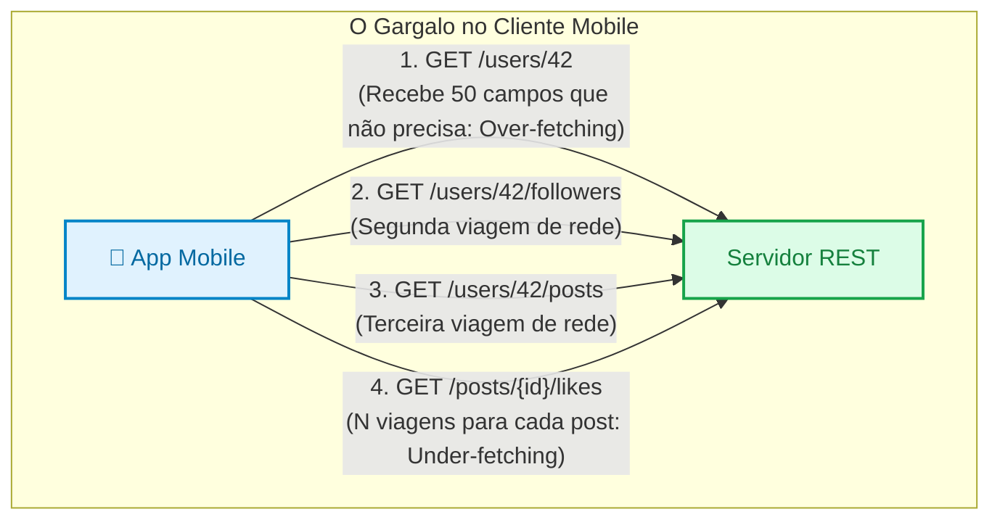

# 03. Paradigmas Alternativos: SOAP, GraphQL e gRPC

Nos capítulos anteriores, exploramos as boas práticas universais de design de
APIs e mergulhamos no estilo arquitetural **REST**, que é o alicerce da
esmagadora maioria dos serviços web públicos no mundo.

No entanto, em engenharia de software **não existe solução única para todos os
problemas**. À medida que a tecnologia evoluiu, diferentes cenários de negócio
expuseram limitações no modelo REST tradicional:

- Aplicações móveis com conexões lentas sofrendo para buscar dados em múltiplos
  endpoints;
- Redes de centenas de microsserviços internos que exigem latência mínima e
  altíssimo rendimento de rede;
- Sistemas bancários corporativos que exigem contratos estritos de segurança e
  assinaturas digitais herdadas dos anos 2000.

Neste capítulo, você conhecerá os três principais paradigmas alternativos ao
REST: o legado corporativo do **SOAP**, a flexibilidade orientada a consultas do
**GraphQL** e a altíssima performance binária do **gRPC**. Você entenderá as
forças, limitações e cenários reais de aplicação de cada um através de uma
matriz comparativa de decisão.

## A Dor: Onde o REST Começa a Encontrar Limites?

Embora o REST seja simples e excelente para operações CRUD convencionais sobre
recursos, dois cenários modernos revelam gargalos na sua arquitetura:

### 1. O Dilema do Frontend Moderno (Over-fetching e Under-fetching)

Considere a tela inicial de um aplicativo móvel (como o perfil de um usuário no
Instagram ou Twitter). A tela precisa exibir:

- O nome e a foto do autor;
- A contagem de seguidores;
- Os 3 últimos posts com o título e a quantidade de curtidas de cada um.

Em uma arquitetura REST pura centrada em recursos, o aplicativo é forçado a
enfrentar dois dilemas:



- **Over-fetching (Excesso de Dados):** O endpoint `GET /users/42` devolve 50
  atributos (endereço, CPF, histórico de login, preferências de e-mail), quando
  o app precisava apenas do nome e do avatar. Toda essa banda de dados móveis é
  desperdiçada.
- **Under-fetching e o Problema N+1 de Rede:** Como nenhum endpoint individual
  devolve tudo o que a tela precisa, o celular precisa disparar **múltiplas
  requisições em cascata** para montar uma única tela visual. Em redes 3G/4G com
  alta latência, a interface fica lenta e engasgada.

### 2. O Gargalo de Performance em Microsserviços Internos

Quando um sistema corporativo é decomposto em 10 microsserviços que conversam
entre si no mesmo data center, o REST sobre HTTP/1.1 com JSON textual passa a
cobrar um preço alto:

- **Serialização Pesada:** Transformar objetos em strings JSON e depois fazer o
  parsing de volta consome ciclos preciosos de CPU em alta escala.
- **Payloads Textuais Volumosos:** JSON transmite repetidamente os nomes das
  chaves (`"customer_identification_number": ...`), consumindo largura de banda
  interna desnecessária.
- **Falta de Streaming Bidirecional:** O ciclo tradicional de
  requisição/resposta é ineficiente para fluxos de dados contínuos em tempo
  real.

Para responder a essas dores distintas, a indústria concebeu alternativas
especializadas.

## 1. SOAP: O Legado Corporativo Baseado em XML

O **SOAP** (_Simple Object Access Protocol_) nasceu no final dos anos 1990 e
tornou-se o padrão absoluto dos serviços web corporativos durante a década de 2000.

Diferente do REST (que é um estilo arquitetural flexível), o SOAP é um
**protocolo formal e rígido** baseado em XML:

- Todas as mensagens trafegam empacotadas dentro de um **Envelope SOAP**
  padronizado (`Envelope`, `Header` de autenticação e `Body` com a operação);
- O contrato da API é estritamente definido por um arquivo descritor chamado
  **WSDL** (_Web Services Description Language_), que dita cada método,
  parâmetro e tipo de dado suportado;
- Utiliza padrões corporativos avançados conhecidos como a família **WS-\***
  (como _WS-Security_ para assinatura e criptografia de mensagens ponta a
  ponta).

```xml
<!-- Exemplo de requisição SOAP (Envelope XML) -->
<soapenv:Envelope xmlns:soapenv="http://schemas.xmlsoap.org/soap/envelope/" xmlns:ord="http://empresa.com/orders">
   <soapenv:Header>
      <wsse:Security xmlns:wsse="http://docs.oasis-open.org/wss/2004/01/oasis-200401-wss-wssecurity-secext-1.0.xsd">
         <wsse:UsernameToken>
            <wsse:Username>sistema_pagamento</wsse:Username>
         </wsse:UsernameToken>
      </wsse:Security>
   </soapenv:Header>
   <soapenv:Body>
      <ord:ConsultarSaldoConta>
         <ord:NumeroConta>98214-5</ord:NumeroConta>
      </ord:ConsultarSaldoConta>
   </soapenv:Body>
</soapenv:Envelope>
```

### Por que o SOAP perdeu espaço na Web moderna?

O XML é excessivamente verboso, pesado e difícil de manipular manualmente no
navegador JavaScript. Configurar clientes SOAP exigia ferramentas pesadas de
compilação de código a partir de WSDLs complexos.

> **Onde o SOAP ainda vive?**
>
> O SOAP ainda é amplamente utilizado em **bancos**, **seguradoras**, **gateways
> financeiros tradicionais** e **sistemas governamentais** (como os webservices
> de emissão de Nota Fiscal Eletrônica - NF-e no Brasil), onde a formalidade
> jurídica do contrato WSDL e as assinaturas digitais do WS-Security são
> requisitos obrigatórios de conformidade.

## 2. GraphQL: A Linguagem de Consulta Flexível

Criado pelo Facebook em 2012 e disponibilizado como código aberto em 2015, o
**GraphQL** foi desenvolvido especificamente para resolver as dores de
_over-fetching_ e _under-fetching_ em interfaces modernas e aplicativos móveis.

A premissa do GraphQL é inverter a dinâmica do REST: _Em vez de o servidor
decidir o formato fixo de cada resposta, o cliente envia uma consulta declarando
**exatamente quais campos e relacionamentos ele quer receber**._

### A Mecânica do GraphQL

1. **Endpoint Único:** Em vez de dezenas de URIs (`/users`, `/posts`,
   `/comments`), a API expõe tipicamente um **único endpoint** HTTP (geralmente
   `POST /graphql`).
2. **Schema Fortemente Tipado:** O servidor define um esquema com os tipos e
   suas relações:

   ```graphql
   type Author {
     id: ID!
     name: String!
     avatarUrl: String
   }

   type Post {
     id: ID!
     title: String!
     likesCount: Int!
     author: Author!
   }

   type Query {
     recentPosts(limit: Int): [Post!]!
   }
   ```

3. **Consulta Customizada pelo Cliente:** O cliente envia no corpo da requisição
   a estrutura exata do que precisa:

   ```graphql
   # Requisição enviada pelo app mobile
   query {
     recentPosts(limit: 2) {
       title
       likesCount
       author {
         name
         avatarUrl
       }
     }
   }
   ```

4. **Resposta Perfeitamente Espelhada (JSON):** O servidor responde com o JSON
   contendo estritamente os campos solicitados, sem nenhum dado sobrando ou
   faltando:

   ```json
   {
     "data": {
       "recentPosts": [
         {
           "title": "Introdução ao GraphQL",
           "likesCount": 142,
           "author": {
             "name": "Prof. Ana Silva",
             "avatarUrl": "https://img.empresa.com/ana.png"
           }
         }
       ]
     }
   }
   ```

Em uma **única viagem de rede** (_round-trip_), o app obteve posts, contagem de
likes e dados do autor, sem excessos de dados.

### Desafios e Limitações do GraphQL

- **Complexidade de Cache:** Como todas as consultas são enviadas via `POST`
  para a mesma URL (`/graphql`), proxies reversos e CDNs tradicionais não
  conseguem cachear respostas facilmente como fariam com um simples `GET /products/10`.
- **Risco de Sobrecarga do Banco de Dados:** Um cliente mal-intencionado ou
  descuidadoso pode enviar consultas com aninhamento infinito (`post -> author -> posts -> author -> posts...`),
  exigindo que o backend implemente proteções de profundidade de consulta
  (_Query Depth Limiting_).

<details>
<summary>🔍 Aprofundamento: O Dilema do Cache HTTP no GraphQL</summary>

O protocolo HTTP foi desenhado com o conceito de que requisições `GET` são
idempotentes e seguras, podendo ser cacheadas por qualquer roteador, CDN ou
navegador intermediário usando o cabeçalho `Cache-Control`.

No GraphQL, como a query enviada pelo cliente pode ser um texto longo e complexo
com dezenas de linhas, a maioria dos clientes envia as buscas via **`POST
/graphql`**.

No entanto, de acordo com as especificações da Web, **métodos POST não são
cacheados por padrão por infraestruturas de rede**. Se 10.000 usuários pedirem
os mesmos dados de uma postagem popular, todas as 10.000 chamadas atingirão o
servidor backend.

Para contornar essa limitação, o ecossistema GraphQL criou soluções de contorno
como:

1. **Persisted Queries:** O cliente envia consultas comuns pré-registradas via
   `GET /graphql?hash=xyz123`, permitindo que CDNs as cacheiem.
2. **Caches de Aplicação no Cliente:** Bibliotecas como Apollo Client ou Relay
   gerenciam um cache normalizado em memória dentro do próprio aplicativo
   frontend.
3. **O Futuro com o Método HTTP `QUERY`:** Para resolver essa contradição
   estrutural da Web, o IETF HTTP Working Group está padronizando um novo método
   nativo: o **`QUERY`**. A proposta é oferecer um método com semântica **segura
   e idempotente** (como o `GET`), mas que **permite corpo de requisição** (para
   enviar consultas GraphQL ou filtros densos) e é **elegível a cache em proxies
   e CDNs**. Quando amplamente suportado por servidores e navegadores, o `QUERY`
   eliminará a necessidade de recorrer ao `POST` para simples consultas ricas.

</details>

## 3. gRPC: Altíssima Performance para Microsserviços

O **gRPC** (_Google Remote Procedure Call_) foi desenvolvido pelo Google e
lançado em 2015 para suprir as demandas de comunicação interna entre
microsserviços de altíssima escala.

Ele combina três pilares de engenharia:

1. **Protocol Buffers (Protobuf):** Mecanismo de serialização binária compacto e
   fortemente tipado, muito menor e mais rápido de codificar/decodificar que
   JSON ou XML.
2. **HTTP/2 como Transporte Nativo:** Aproveita a multiplexação de conexões
   (várias chamadas simultâneas no mesmo canal TCP) e suporte a streaming
   bidirecional em tempo real.
3. **Geração Automática de Código:** A partir de um arquivo de contrato
   `.proto`, o compilador `protoc` gera classes clientes e servidoras totalmente
   tipadas em dezenas de linguagens (Go, Java, Python, Node.js, C#, PHP, Rust).

```proto
// Exemplo de contrato gRPC (order_service.proto)
syntax = "proto3";

package ecommerce;

service OrderService {
  // Chamada de procedimento remoto pura
  rpc CreateOrder (CreateOrderRequest) returns (OrderResponse);
}

message CreateOrderRequest {
  int64 customer_id = 1;
  double total_amount = 2;
  repeated string item_codes = 3;
}

message OrderResponse {
  int64 order_id = 1;
  string status = 2;
  int64 created_at = 3;
}
```

Ao invés de transmitir texto legível, o gRPC serializa os dados em uma cadeia
minúscula de bytes binários:

```text
JSON Textual: {"customer_id": 9812, "total_amount": 150.5}  --> ~55 bytes
Protobuf Binário: [08 b4 4c 11 00 00 00 00 00 d0 62 40]      --> ~12 bytes (78% menor!)
```

### Onde o gRPC Brilha?

- **Comunicação Service-to-Service (Backend-to-Backend):** Quando centenas de
  microsserviços precisam trocar milhões de mensagens por segundo com latência
  de milissegundos.
- **Sistemas de Streaming Contínuo:** Como cotações de bolsas de valores,
  telemetria de sensores IoT e chats de áudio/vídeo.

### Limitações do gRPC

- **Não Amigável para Navegadores Tradicionais:** Navegadores web não possuem
  controle direto de baixo nível sobre frames HTTP/2 arbitrários, exigindo
  proxies intermediários (como _Envoy_ com _gRPC-Web_) para permitir que
  clientes frontend conversem com serviços gRPC.
- **Formato Não Legível por Humanos:** Depurar chamadas inspecionando bytes
  brutos na rede é inviável sem ferramentas especializadas (como BloomRPC ou
  Postman gRPC).

<details>
<summary>🔍 Aprofundamento: Como o Protobuf Consegue Ser Tão Menor que o JSON?</summary>

No formato JSON, os nomes das chaves precisam ser transmitidos repetidamente
como texto literal: `{"userId": 105, "isActive": true}`

O parser precisa ler os caracteres `'u'`, `'s'`, `'e'`, `'r'`, `'I'`, `'d'` e
converter a palavra `"true"` para um booleano em tempo de execução.

No **Protocol Buffers**, os nomes dos campos **nunca trafegam na rede**. O
arquivo `.proto` define números identificadores de campo (chamados de _Field
Tags_):

```proto
message User {
  int32 user_id = 1;   // Tag 1
  bool is_active = 2;  // Tag 2
}
```

Na transmissão de rede, o gRPC envia apenas o número da tag empacotado em bits
com o valor binário puro. O cliente que possui o mesmo arquivo `.proto` sabe
instantaneamente que o valor associado à tag `1` é a propriedade `user_id`. Isso
reduz drasticamente o tamanho das mensagens e elimina o trabalho de conversão
textual na CPU.

</details>

## Matriz de Decisão Arquitetural: Quando Usar Cada Paradigma?

A tabela abaixo sintetiza os pontos fortes, pontos fracos e os cenários ideais
para cada um dos quatro paradigmas:

| Critério de Avaliação       | REST (JSON)                        | GraphQL                          | gRPC (Protobuf)               | SOAP (XML)                           |
| :-------------------------- | :--------------------------------- | :------------------------------- | :---------------------------- | :----------------------------------- |
| **Formato dos Dados**       | JSON (Texto legível)               | JSON (Texto legível)             | Binário compactado            | XML (Texto verboso)                  |
| **Transporte Principal**    | HTTP/1.1 e HTTP/2                  | HTTP/1.1 e HTTP/2                | **HTTP/2 estrito**            | HTTP, SMTP, JMS                      |
| **Definição de Contrato**   | OpenAPI / Swagger                  | Schema GraphQL                   | Arquivos `.proto`             | Arquivos `.wsdl`                     |
| **Modelo Conceitual**       | Orientado a **Recursos**           | Orientado a **Grafo / Consulta** | Orientado a **Funções (RPC)** | Orientado a **Documento / Mensagem** |
| **Facilidade de Depuração** | **Altíssima** (cURL, navegador)    | **Alta** (GraphQL Playground)    | Baixa (exige decodificador)   | Média (legível, mas verboso)         |
| **Suporte a Cache HTTP**    | **Excelente** (nativo em CDNs)     | Complexo (requer cache de app)   | Não aplicável para CDNs       | Muito limitado                       |
| **Ponto Mais Forte**        | Universalidade e simplicidade      | Flexibilidade total para UI      | **Desempenho e throughput**   | Formalidade e segurança WS-\*        |
| **Ponto Mais Fraco**        | Over-fetching / Under-fetching     | Complexidade de backend e cache  | Não roda direto em browsers   | Peso do XML e lentidão               |
| **Cenário Ideal de Uso**    | APIs públicas, CRUDs e portais web | Apps mobile, SPAs complexas      | Microsserviços internos e IoT | Bancos e webservices fiscais         |

> **Regra de Ouro da Arquitetura de APIs:**
>
> **Não tente usar um único paradigma para todo o seu ecossistema.**
>
> As maiores empresas de tecnologia do planeta combinam diferentes estilos de
> acordo com a fronteira da aplicação:
>
> - Usam **GraphQL ou REST** na borda externa (conversa com navegadores e
>   aplicativos móveis de usuários finais);
> - Usam **gRPC** no núcleo interno do data center (conversa ultra-rápida entre
>   microsserviços de backend);
> - Usam **SOAP** quando precisam se integrar com instituições bancárias
>   tradicionais ou governamentais.

---

<a href="02-apis-rest-e-design-semantico.md">← APIs REST e Design Semântico</a>
