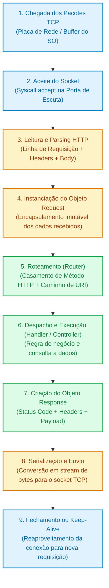
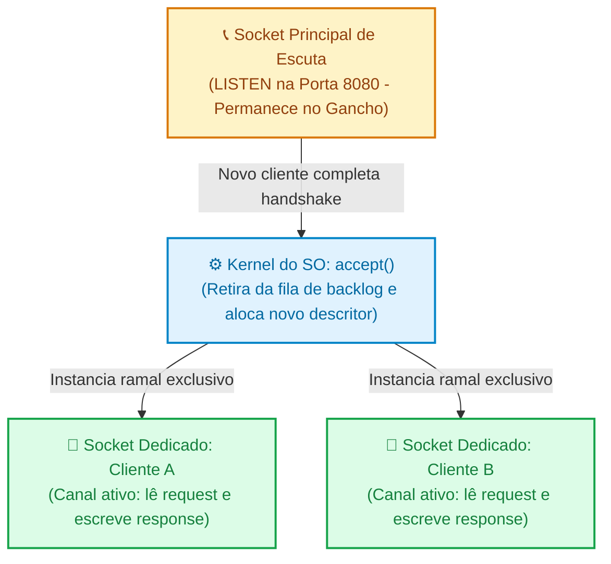

# 01. O Ciclo de Vida de uma Requisição no Servidor

Na introdução deste curso, compreendemos o modelo fundamental
**Cliente-Servidor**: uma ponta (o cliente) solicita dados ou ações, e a outra
ponta (o servidor) processa a demanda e devolve uma resposta. No submódulo
dedicado a **Protocolos**, são explorados os detalhes de como as mensagens
trafegam pela rede via TCP/IP e a anatomia do protocolo HTTP. Além disso, quem
acompanhou a trilha de **PHP** pôde ver como superglobais (`$_GET`, `$_POST`,
`$_SERVER`) refletem diretamente os dados brutos injetados pelo servidor web.

No entanto, independentemente da ordem em que você explora esses tópicos ou da
linguagem que escolhe utilizar, do outro lado da conexão existe uma máquina
aguardando chamadas: o **servidor**. Para muitos iniciantes, o que acontece
dentro do servidor entre o instante em que uma requisição atinge a placa de rede
e o momento em que a resposta é devolvida parece mágica. Arquivos parecem "rodar
sozinhos" e respostas parecem ser disparadas por telepatia.

Neste capítulo, vamos abrir a caixa-preta do backend de forma **estritamente
agnóstica a linguagens e frameworks**. Você entenderá a jornada completa de uma
requisição no servidor: desde a recepção de bytes brutos em um socket do sistema
operacional, passando pelo parsing do texto HTTP, o roteamento e a execução de
código, até a serialização e entrega da resposta.

## A Falácia da Caixa-Preta no Servidor

Quando engenheiros de software aprendem backend usando diretamente abstrações de
alto nível ou scripts desestruturados, é comum desenvolverem uma visão ingênua
do ambiente de execução.

Imagine tentar lidar com o recebimento de dados sem compreender o fluxo ordenado
de ciclo de vida, tratando a entrada da rede como variáveis globais soltas e
misturando leitura de dados, lógica e envio de saída em qualquer ordem:

```php
// ❌ CÓDIGO FRÁGIL: Manipulação caótica sem separação de ciclo de vida
// O script tenta enviar corpo antes de definir status, lê dados brutos de forma desordenada
// e não possui garantias de formatação ou tratamento de encerramento de conexão.

$rawPayload = file_get_contents('php://input');

if (empty($rawPayload)) {
    echo "Erro: corpo vazio!"; // Imprime no buffer de saída prematuramente
    http_response_code(400);   // Headers enviados após o corpo em alguns servidores geram warnings
    exit;
}

// Dependência direta de superglobais sem abstração ou validação de método HTTP
$userData = json_decode($rawPayload, true);

echo json_encode(["status" => "ok", "userId" => $userData["id"]]);
// A conexão permanece aberta ou encerra de forma imprevisível dependendo do servidor web
```

Essa abordagem acarreta sérios problemas de engenharia:

1. **Headers vs Body Out of Order:** Protocolos baseados em texto como HTTP
   exigem que a linha de status e todos os cabeçalhos sejam transmitidos
   **antes** do primeiro byte do corpo. Tentar enviar dados antes de configurar
   cabeçalhos corrompe a mensagem.
2. **Parsing Parcial e Trava de Conexões:** Se uma requisição declara um corpo
   de 10 MB e a conexão cai após 2 KB, como o servidor lida com o buffer
   incompleto?
3. **Falta de Previsibilidade de Erros:** Se uma exceção não tratada for
   disparada no meio do processamento após parte da resposta já ter sido
   enviada, o cliente receberá um payload truncado e um status code
   inconsistente.
4. **Acoplamento ao Ambiente:** O código fica preso a peculiaridades do runtime
   em vez de operar sobre um contrato puro de `Entrada (Request) ->
Processamento -> Saída (Response)`.

Para construir sistemas robustos e entender como qualquer framework moderno
opera por baixo dos panos, precisamos compreender as etapas atômicas que todo
servidor backend executa.

## A Mecânica Interna: Da Placa de Rede ao Handler

Toda aplicação web de backend, seja ela escrita em PHP, Node.js, Go, Java,
Python ou Rust, obedece a uma sequência rígida de fases para processar cada
chamada HTTP.



Vamos dissecar cada uma dessas etapas.

### 1. Escuta em Porta e Aceite de Conexão (Sockets)

Antes de qualquer requisição chegar, o servidor precisa se preparar. É
fundamental distinguir dois momentos bem diferentes: a **inicialização única**
(boot do servidor) e o **loop de atendimento contínuo** (para cada cliente).

Para fixar a função de cada chamada de sistema (_system call_) do kernel,
imagine a instalação de uma linha telefônica de atendimento ao cliente em uma
empresa:

#### A. Inicialização (Executada apenas UMA vez no boot)

Quando você inicia uma aplicação backend (como ao rodar um servidor web ou um
processo standalone), ele executa três chamadas no kernel:

1. **`socket()` (Comprar o aparelho telefônico):** Cria o **ponto de
   extremidade** (_endpoint_) de comunicação no sistema operacional. O kernel
   aloca uma estrutura de rede e devolve um identificador (_file descriptor_),
   mas ele ainda não possui endereço, não está conectado à rede externa e não
   pode trocar dados. Ainda **não existe canal de comunicação**.
2. **`bind()` (Contratar o número da linha):** Associa esse socket a uma
   identidade na rede: um endereço IP e uma porta específicos (por exemplo,
   `0.0.0.0:8080`). Agora o aparelho possui um "número" que o mundo exterior
   pode discar.
3. **`listen()` (Ligar a campainha e aguardar no gancho):** Converte o socket em
   **passivo**. Isso sinaliza ao sistema operacional: _"A partir de agora, este
   processo não fará ligações para fora; ele está aguardando chamadas de
   clientes"_. A porta entra oficialmente no estado `LISTEN`.

> **Importante:** O servidor **não** repete `listen()` a cada requisição. O
> socket de escuta permanece aberto e passivo durante toda a vida útil do
> processo do servidor.

#### B. O Loop de Atendimento (Executado para cada nova conexão)

Com a central telefônica operando em modo de espera, o sistema operacional
gerencia as chamadas que chegam:

1. **A discagem e o toque:** Quando um cliente executa o _Three-Way Handshake_
   TCP, é como se a linha começasse a tocar. O kernel conclui o aperto de mão em
   segundo plano e armazena a chamada estabelecida em uma fila de espera
   (_backlog_).
2. **Atender com `accept()`:** O servidor — seja através de um loop contínuo
   (`while (true)`), de processos trabalhadores (_workers_) ou de um _Event
   Loop_ orientado a eventos — invoca a syscall **`accept()`** para "tirar o
   fone do gancho".
3. **O ramal dedicado:** A chamada `accept()` retira a conexão da fila e **cria
   um NOVO socket exclusivo** para conversar com aquele cliente (como se a
   central transferisse a chamada para um ramal particular).

É apenas neste instante que o **canal de comunicação ativo** se materializa: uma
via bidirecional e exclusiva entre o cliente e o socket recém-criado pelo
servidor.



O socket de escuta principal continua livre no gancho na porta `8080`, pronto
para receber o próximo cliente, enquanto o novo socket dedicado é encaminhado
para o restante do ciclo de vida: a leitura e o parsing da mensagem HTTP.

### 2. Leitura do Stream e Parsing HTTP

O socket TCP entrega apenas uma sequência contínua de bytes brutos. O servidor
não recebe "um objeto estruturado", mas sim uma cadeia de caracteres em formato
ASCII/UTF-8.

O mecanismo de **Parsing** do servidor lê esses bytes e os divide de acordo com
a especificação RFC do HTTP:

```text
POST /api/v1/orders HTTP/1.1\r\n           <-- 1. Request Line (Método, URI, Versão)
Host: api.minhaempresa.com\r\n             <-- 2. Headers (Chave: Valor)
Content-Type: application/json\r\n
Content-Length: 42\r\n
Authorization: Bearer xyz123\r\n
\r\n                                       <-- Linha em branco delimitadora (\r\n\r\n)
{"productId": 981, "quantity": 2}\n        <-- 3. Body (Tamanho exato definido em Content-Length)
```

O parser executa validações essenciais de conformidade:

- Se a linha inicial não contiver um método válido e um caminho, rejeita com
  `400 Bad Request`.
- Se o cabeçalho `Host` estiver ausente em requisições HTTP/1.1, rejeita
  imediatamente.
- Se houver corpo, ele utiliza o cabeçalho `Content-Length` ou a flag
  `Transfer-Encoding: chunked` para saber exatamente quantos bytes deve aguardar
  no buffer antes de considerar o corpo concluído.

### 3. Encapsulamento no Objeto Request

Após o parsing bem-sucedido, o servidor instancia uma estrutura de dados ou
objeto frequentemente chamado de **`Request`**.

Em vez de seu código lidar com texto bruto ou variáveis globais espalhadas, o
objeto `Request` centraliza de forma estruturada:

- **Método HTTP:** `GET`, `POST`, `PUT`, `DELETE`, etc.
- **URI e Caminho Limpo:** Ex: `/api/v1/orders`.
- **Parâmetros de Consulta (_Query Params_):** Valores após o `?` na URL.
- **Cabeçalhos Normalizados:** Acesso insensível a maiúsculas/minúsculas
  (`get("authorization")`).
- **Corpo (_Body_):** Dados em formato bruto ou já decodificados de
  JSON/Formulário.
- **Metadados de Rede:** IP de origem do cliente, porta remota, status do
  TLS/HTTPS.

### 4. Roteamento (Routing)

Com o objeto `Request` em mãos, o backend precisa responder à pergunta central:
**qual função ou classe é responsável por atender a este pedido?**

Esse é o papel do **Roteador (_Router_)**. O roteador mantém uma tabela de
despacho associando tuplas de `(Método HTTP, Padrão de Caminho)` ao seu
respectivo tratador (_Handler_ ou _Controller_):

```text
POST   /api/v1/orders        ──> OrderController::createOrder
GET    /api/v1/orders        ──> OrderController::listOrders
GET    /api/v1/orders/{id}   ──> OrderController::getOrderById
```

Se o caminho solicitado não coincidir com nenhuma rota cadastrada, o ciclo é
interrompido com uma resposta padronizada de status `404 Not Found`. Se o
caminho existir mas o método HTTP for diferente (por exemplo, um `DELETE` em uma
rota que só aceita `GET`), o servidor responde com `405 Method Not Allowed`.

### 5. Execução do Handler / Controller

Ao localizar a rota correta, o roteador despacha o objeto `Request` para a
função ou classe manipuladora. É aqui que o código de domínio da sua aplicação
executa:

- Validação das regras de entrada;
- Verificação de autenticação e permissões;
- Consulta ou persistência em bancos de dados;
- Cálculos e lógica de negócio.

A regra fundamental desta etapa é que **o handler deve sempre retornar uma
resposta** — seja o resultado de uma operação bem-sucedida ou a descrição
controlada de um erro.

### 6. Instanciação e Serialização do Objeto Response

O manipulador constrói um objeto **`Response`**. Esse objeto reúne os três
componentes vitais que devem retornar ao cliente:

1. **Status Code e Status Text:** Ex: `201 Created` ou `422 Unprocessable
Content`.
2. **Cabeçalhos de Resposta (_Response Headers_):** Instruções vitais como
   `Content-Type: application/json; charset=utf-8`, políticas de cache
   (`Cache-Control`) e cookies (`Set-Cookie`).
3. **Corpo da Resposta (_Payload_):** A string JSON, HTML ou binário que o
   cliente espera receber.

O servidor converte esse objeto `Response` em um fluxo ordenado de bytes de
acordo com o padrão HTTP e escreve no socket TCP:

```text
HTTP/1.1 201 Created\r\n
Content-Type: application/json; charset=utf-8\r\n
Content-Length: 53\r\n
Connection: keep-alive\r\n
\r\n
{"id":5521,"status":"confirmed","createdAt":1727000000}
```

### 7. Finalização e Gestão da Conexão (Keep-Alive vs Close)

Após transmitir todos os bytes do corpo, o ciclo de vida da requisição HTTP é
encerrado. Porém, a conexão TCP subjacente pode seguir dois destinos:

- **`Connection: close`:** O servidor emite uma chamada `close()` no socket,
  finalizando a conexão TCP.
- **`Connection: keep-alive`:** O servidor mantém o socket TCP aberto e volta
  para o estado de escuta de novos bytes daquele mesmo cliente, poupando o custo
  de um novo handshake de rede para as próximas requisições.

> **Regra de Ouro:**
>
> Toda requisição recebida em um servidor web **exige uma resposta inequívoca**.
> Se o seu código disparar uma exceção não capturada ou entrar em um loop
> infinito, o cliente (navegador ou app) ficará aguardando até que um _timeout_
> ocorra. Tratar erros na borda e garantir a emissão de um status `5xx`
> estruturado é uma responsabilidade primordial do backend.

<details>
<summary>🔍 Aprofundamento: O Que Acontece no Cabeçalho `Connection: keep-alive`?</summary>

No início da Web (HTTP/1.0), para baixar uma página HTML com 10 imagens, o
navegador precisava abrir e fechar 11 conexões TCP sequenciais. Como cada
conexão TCP exige um _Three-Way Handshake_ (3 viagens de pacote de ida e volta)
e uma negociação de certificados TLS (mais 2 a 4 viagens), a navegação era
extremamente lenta.

Com o advento do **HTTP/1.1**, a diretiva `Connection: keep-alive` tornou-se o
padrão. Quando o servidor e o cliente a negociam:

1. O cliente envia uma requisição.
2. O servidor processa e devolve a resposta, incluindo o cabeçalho
   `Content-Length` (para que o cliente saiba exatamente quando o corpo
   terminou).
3. **Nenhum dos dois envia o pacote FIN para derrubar a conexão.**
4. O mesmo canal TCP permanece aberto e ocioso no pool de conexões, pronto para
   que a próxima requisição seja enviada de forma imediata, com latência de
   conexão zero.

O servidor define um limite de tolerância (como `Keep-Alive: timeout=5,
max=100`), fechando o canal apenas se o cliente passar mais de 5 segundos sem
enviar dados ou após atender a 100 requisições consecutivas.

</details>

<details>
<summary>🔍 Aprofundamento: Modelos de Concorrência no Servidor (Shared-Nothing vs Event-Loop)</summary>

Nem todos os servidores backend gerenciam o ciclo de vida de suas requisições da
mesma forma na memória:

1. **Modelo _Process-per-Request / Shared-Nothing_ (Tradicional do PHP com
   FPM/Apache):**
   - Para cada requisição HTTP que chega, um processo ou thread isolada é
     alocada para executar o script do início ao fim.
   - Quando a resposta é enviada, **toda a memória utilizada pelo script é
     liberada**. Nenhuma variável global, conexão estática ou estado de objeto
     vaza de uma requisição para a seguinte.
   - _Vantagem:_ Robustez extrema contra vazamentos de memória (_memory leaks_).
   - _Desvantagem:_ Custo de inicialização do framework a cada chamada
     (amenizado por caches como OPcache).

2. **Modelo _Resident Server / Event-Loop_ (Típico de Node.js, Go, Swoole,
   RoadRunner e Python com ASGI):**
   - O processo do servidor sobe uma única vez e permanece ativo na memória por
     tempo indeterminado.
   - Um loop de eventos (_Event Loop_) atende múltiplos sockets simultaneamente
     de forma assíncrona.
   - _Vantagem:_ Altíssimo throughput e tempo de resposta quase instantâneo,
     pois o código da aplicação já está compilado e aquecido na RAM.
   - _Atenção do Engenheiro:_ Qualquer variável gravada em escopo global ou
     propriedade estática de classe continuará existindo entre uma requisição e
     outra, exigindo disciplina para não vazar dados confidenciais de um usuário
     para outro.

</details>

---

<p align="right"><a href="02-middlewares-e-pipeline-de-execucao.md">Próximo: Middlewares e Pipeline de Execução →</a></p>
