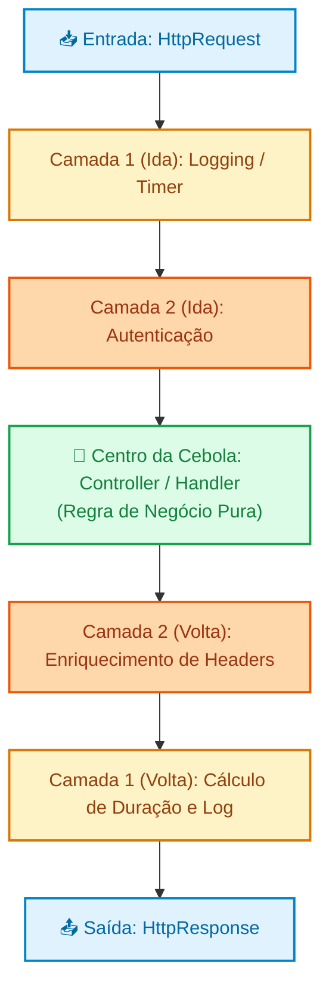
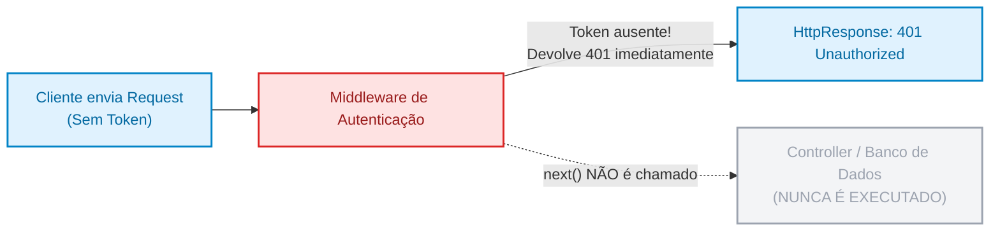

# 02. Middlewares e Pipeline de Execução

No capítulo anterior, dissecamos a jornada completa de uma requisição no
servidor: desde a escuta passiva no socket TCP até a serialização e entrega do
objeto `Response`. Vimos que, no centro desse fluxo, o roteador localiza um
manipulador (_Handler_) para executar as regras de negócio de um recurso
específico.

No entanto, à medida que uma aplicação real cresce, surgem diversas demandas que
**não pertencem à regra de negócio de um endpoint específico**, mas que precisam
acontecer em praticamente **todas as requisições**:

- Verificar se o token de autenticação é válido;
- Medir o tempo de execução e registrar logs de auditoria;
- Configurar cabeçalhos de segurança e políticas de CORS;
- Capturar exceções imprevistas para que o servidor nunca devolva uma tela de
  erro em branco.

Neste capítulo, você aprenderá o padrão arquitetural de **Pipeline** e a
mecânica dos **Middlewares**. Veremos como a indústria resolveu a duplicação de
comportamentos transversais através do modelo em camadas concêntricas (a
"Cebola"), como funciona a delegação com a função `next()` e como o mecanismo de
**curto-circuito** protege o núcleo da sua aplicação.

## A Dor: O Boilerplate e a Dispersão de Código

Imagine que você está desenvolvendo uma API de e-commerce com 40 rotas
diferentes (produtos, pedidos, pagamentos, usuários). Para garantir que apenas
usuários logados acessem rotas protegidas e que tenhamos métricas de desempenho
de cada chamada, a abordagem ingênua seria repetir essas checagens no início e
no fim de cada função de controller:

```php
// ❌ CÓDIGO PROBLEMÁTICO: Acoplamento de tarefas transversais na regra de negócio
final class OrderController
{
    public function createOrder(HttpRequest $request): HttpResponse
    {
        $startTime = microtime(true);

        // 1. Auditoria / Logging manual
        error_log("[INFO] Requisição recebida em /api/orders às " . date('Y-m-d H:i:s'));

        // 2. Autenticação manual repetida em dezenas de controllers
        $authHeader = $request->getHeader('authorization');
        if ($authHeader === null || !str_starts_with($authHeader, 'Bearer ')) {
            return HttpResponse::json(['error' => 'Não autorizado'], 401);
        }

        $token = substr($authHeader, 7);
        if ($token !== 'token-valido-123') {
            return HttpResponse::json(['error' => 'Token inválido ou expirado'], 401);
        }

        // 3. Regra de negócio real do endpoint (o que realmente importa)
        $orderData = $request->json();
        $orderId = 9821; // Simulando criação no banco

        $response = HttpResponse::json(['orderId' => $orderId, 'status' => 'CREATED'], 201);

        // 4. Métrica de tempo repetida no encerramento de cada método
        $durationMs = (microtime(true) - $startTime) * 1000;
        error_log("[METRICS] Processamento de /api/orders concluído em {$durationMs}ms");

        return $response;
    }
}
```

Essa abordagem acarreta sérios riscos de manutenção e segurança:

1. **Violação do Princípio da Responsabilidade Única (SRP):** O controller de
   pedidos precisa conhecer regras de criptografia de tokens, formatos de
   logging e métricas de sistema em vez de focar apenas na criação do pedido.
2. **Duplicação Massiva de Código (_Boilerplate_):** Se a API tiver 40 rotas, as
   mesmas 15 linhas de validação e log serão copiadas e coladas 40 vezes.
3. **Brechas Catastróficas de Segurança:** Se um novo desenvolvedor criar a rota
   `deleteUser` e se esquecer de copiar o bloco de verificação do token, aquele
   endpoint ficará instantaneamente exposto ao público na Internet.
4. **Impossibilidade de Evolução:** Se a equipe decidir trocar o formato do
   token de autenticação ou mudar a ferramenta de métricas, será necessário
   alterar dezenas de arquivos manualmente.

A solução da engenharia de software para esse problema é desacoplar as
responsabilidades transversais em uma cadeia ordenada de interceptadores: o
**Pipeline de Middlewares**.

## O Conceito: A Arquitetura em Cebola (The Onion Model)

A palavra _Middleware_ significa literalmente "o que está no meio". Um
middleware é um componente de software que se posiciona estrategicamente entre a
entrada da requisição (`Request`) e a execução do seu código de domínio final
(`Handler`), podendo também inspecionar ou modificar a resposta (`Response`) em
seu retorno.

A metáfora mais consagrada para entender o funcionamento de um pipeline de
middlewares é a **Cebola (_Onion Model_)**:



### O Fluxo Bidirecional: A Ida e a Volta

Observe a beleza dessa estrutura: a requisição precisa atravessar todas as
camadas externas até atingir o miolo da aplicação. Em seguida, a resposta gerada
faz o caminho inverso, atravessando as mesmas camadas de dentro para fora.

Isso significa que cada middleware tem **dois momentos de atuação**:

1. **Fase de Pré-processamento (Na Ida):** Executa código _antes_ de passar a
   bola para a próxima camada. Aqui ele pode inspecionar headers, rejeitar
   acessos indevidos, transformar dados da requisição ou iniciar contadores.
2. **A Chamada `next()`:** O middleware invoca a função ou objeto que representa
   o próximo elo da corrente, pausando sua própria execução enquanto as camadas
   internas trabalham.
3. **Fase de Pós-processamento (Na Volta):** Assim que o próximo elo devolve o
   objeto `Response`, o middleware retoma a execução. Aqui ele pode anexar novos
   cabeçalhos na resposta (ex.: `X-Response-Time`), compactar o corpo (Gzip),
   logar o status retornado ou tratar eventuais erros disparados pelas camadas
   mais internas.

### Curto-Circuito (Short-Circuiting): A Barreira Protetora

O maior poder de um middleware reside na sua capacidade de **interromper a
cadeia imediatamente**, sem consultar as camadas seguintes. Isso é chamado de
**Curto-Circuito (_Short-Circuiting_)**.



Se o cliente tentar acessar uma rota privada sem enviar o cabeçalho
`Authorization`, o middleware de autenticação simplesmente **não chama o
`next()`**. Ele cria uma instância de `HttpResponse` com status `401
Unauthorized` e a retorna imediatamente.

Dessa forma, o controller jamais é instanciado, o banco de dados não recebe
queries desnecessárias e a infraestrutura do servidor é poupada de processamento
inútil.

## Implementação Conceitual de um Pipeline de Middlewares

Para compreender como essa engrenagem funciona por dentro sem a "mágica" de
bibliotecas prontas, vamos modelar um pipeline puro orientado a objetos com
tipagem estrita no PHP 8.

### 1. O Contrato do Middleware

O coração do padrão é a definição de um contrato claro. Um middleware deve
receber a requisição atual e uma referência para o próximo manipulador da fila:

```php
<?php

declare(strict_types=1);

interface MiddlewareInterface
{
    /**
     * Processa uma requisição e devolve uma resposta.
     * Deve invocar $next($request) para continuar o pipeline ou retornar diretamente para curto-circuitar.
     *
     * @param callable(HttpRequest): HttpResponse $next
     */
    public function process(HttpRequest $request, callable $next): HttpResponse;
}
```

### 2. Implementando Middlewares Concretos

Vamos criar três middlewares representativos do dia a dia da indústria:

#### A. Middleware de Captura Global de Erros (Camada Mais Externa)

Este middleware envolve toda a execução em um bloco `try/catch`. Se qualquer
middleware interno ou o controller lançar uma exceção, ele captura a falha e
devolve um JSON `500` limpo e padronizado:

```php
final class ErrorHandlerMiddleware implements MiddlewareInterface
{
    public function process(HttpRequest $request, callable $next): HttpResponse
    {
        try {
            // Delega para o restante da fila
            return $next($request);
        } catch (Throwable $exception) {
            // Se qualquer elo interno quebrar, garantimos uma resposta HTTP válida
            return HttpResponse::json([
                'error' => 'Internal Server Error',
                'message' => 'Ocorreu um erro interno inesperado.',
                'code' => 500
            ], 500);
        }
    }
}
```

#### B. Middleware de Log e Tempo de Resposta (Métricas)

Demonstra com perfeição a ida e a volta: anota o timestamp inicial, espera a
resposta ser produzida por `next()` e calcula o tempo total:

```php
final class PerformanceLogMiddleware implements MiddlewareInterface
{
    public function process(HttpRequest $request, callable $next): HttpResponse
    {
        // --- FASE DE IDA (Pré-processamento) ---
        $start = hrtime(true); // Nanosegundos de alta precisão

        // Delega para o próximo da fila e aguarda o retorno da resposta
        $response = $next($request);

        // --- FASE DE VOLTA (Pós-processamento) ---
        $durationMs = (hrtime(true) - $start) / 1_000_000;

        // Injeta cabeçalho informativo na resposta antes de devolver
        $enrichedHeaders = array_merge($response->headers, [
            'X-Response-Time' => sprintf('%.2fms', $durationMs)
        ]);

        return new HttpResponse(
            statusCode: $response->statusCode,
            headers: $enrichedHeaders,
            body: $response->body
        );
    }
}
```

#### C. Middleware de Autenticação (Curto-Circuito)

Inspeciona as credenciais e decide se autoriza o prosseguimento da requisição:

```php
final class AuthMiddleware implements MiddlewareInterface
{
    public function process(HttpRequest $request, callable $next): HttpResponse
    {
        $authHeader = $request->getHeader('authorization');

        // Validação defensiva na borda
        if ($authHeader === null || !str_starts_with($authHeader, 'Bearer ')) {
            // CURTO-CIRCUITO: Interrompe o fluxo e responde com 401 sem chamar $next
            return HttpResponse::json([
                'error' => 'Unauthorized',
                'message' => 'Token de autenticação ausente ou inválido.'
            ], 401);
        }

        $token = substr($authHeader, 7);

        if ($token !== 'secret-fatec-token') {
            return HttpResponse::json([
                'error' => 'Unauthorized',
                'message' => 'Token expirado ou sem privilégios.'
            ], 401);
        }

        // Token válido: segue para a próxima camada
        return $next($request);
    }
}
```

### 3. A Estrutura do Pipeline de Execução

Como o pipeline encadeia essa lista de middlewares para criar o efeito de
cebola? Podemos utilizar uma composição recursiva ou a função funcional
`array_reduce`:

```php
final class Pipeline
{
    /**
     * @var list<MiddlewareInterface>
     */
    private array $middlewares = [];

    public function pipe(MiddlewareInterface $middleware): self
    {
        $this->middlewares[] = $middleware;
        return $this;
    }

    /**
     * Executa a cadeia de middlewares culminando no handler de destino.
     *
     * @param callable(HttpRequest): HttpResponse $destinationHandler
     */
    public function execute(HttpRequest $request, callable $destinationHandler): HttpResponse
    {
        // Montamos o pipeline de dentro para fora (da última camada para a primeira)
        $pipeline = array_reduce(
            array_reverse($this->middlewares),
            function (callable $next, MiddlewareInterface $middleware): callable {
                return function (HttpRequest $req) use ($middleware, $next): HttpResponse {
                    return $middleware->process($req, $next);
                };
            },
            $destinationHandler
        );

        return $pipeline($request);
    }
}
```

### 4. O Sistema em Ação

Veja como o controller de domínio agora fica completamente limpo de qualquer
preocupação com autenticação, logs ou tratamento de falhas:

```php
// ✅ RECOMENDADO: Controller enxuto, focado exclusivamente no domínio
$orderController = function (HttpRequest $request): HttpResponse {
    $body = $request->json();

    return HttpResponse::json([
        'orderId' => 7712,
        'productId' => $body['productId'] ?? 0,
        'status' => 'APPROVED'
    ], 201);
};

// Configuração do Pipeline no Kernel da Aplicação
$pipeline = new Pipeline();

$pipeline
    ->pipe(new ErrorHandlerMiddleware())     // Camada 1: Por fora de tudo, captura qualquer erro
    ->pipe(new PerformanceLogMiddleware())   // Camada 2: Mede tempo total das camadas internas
    ->pipe(new AuthMiddleware());            // Camada 3: Protege o acesso ao controller

// Cenário A: Requisição válida com token correto
$validRequest = new HttpRequest(
    method: 'POST',
    path: '/api/orders',
    headers: [
        'authorization' => 'Bearer secret-fatec-token',
        'content-type' => 'application/json'
    ],
    queryParams: [],
    body: '{"productId": 42}'
);

$response = $pipeline->execute($validRequest, $orderController);

echo "Status: {$response->statusCode}\n";
echo "Header X-Response-Time: " . ($response->headers['X-Response-Time'] ?? 'N/A') . "\n";
echo "Body: {$response->body}\n";

// Cenário B: Requisição sem token (Curto-circuito em ação!)
$invalidRequest = new HttpRequest(
    method: 'POST',
    path: '/api/orders',
    headers: ['content-type' => 'application/json'],
    queryParams: [],
    body: '{"productId": 42}'
);

$blockedResponse = $pipeline->execute($invalidRequest, $orderController);

echo "\nRequisição sem token -> Status: {$blockedResponse->statusCode}\n";
echo "Body: {$blockedResponse->body}\n";
```

## Casos de Uso Típicos de Middlewares na Indústria

No ecossistema de APIs corporativas, middlewares são os blocos fundamentais para
garantir robustez operacional. A tabela a seguir sintetiza os tipos mais
recorrentes:

| Tipo de Middleware | Responsabilidade Principal                                                                | Momento Crítico de Atuação |           Possui Curto-Circuito?            |
| :----------------- | :---------------------------------------------------------------------------------------- | :------------------------- | :-----------------------------------------: |
| **Error Handling** | Captura global de exceções não tratadas e formatação de erro `500` em JSON.               | Volta (captura no retorno) |            Não (recupera falhas)            |
| **Authentication** | Valida tokens (JWT/Bearer), assinaturas de API Keys ou sessões.                           | Ida (pré-processamento)    |        **Sim** (`401 Unauthorized`)         |
| **Authorization**  | Valida se o usuário autenticado possui as permissões/cargos exigidos pela rota.           | Ida (após autenticação)    |          **Sim** (`403 Forbidden`)          |
| **Rate Limiting**  | Limita a quantidade de chamadas por IP/cliente em uma janela de tempo.                    | Ida (análise do cliente)   |      **Sim** (`429 Too Many Requests`)      |
| **CORS**           | Injeta cabeçalhos `Access-Control-Allow-*` e atende requisições de preflight (`OPTIONS`). | Ida e Volta                |     **Sim** (preflight `OPTIONS` `204`)     |
| **Body Parsing**   | Converte texto cru (`application/json`, formulários) em estruturas nativas.               | Ida (transformação)        | **Sim** (`400 Bad Request` se JSON quebrar) |
| **Compression**    | Aplica compactação (Gzip/Brotli) no payload de resposta para economizar banda.            | Volta (pós-processamento)  |                     Não                     |

> **Regra de Ouro: A Ordem dos Middlewares Importa Crucialmente!**
>
> Em um pipeline, os middlewares são executados estritamente na ordem em que
> foram registrados. Se você registrar o middleware de **Autorização** (que
> checa se o usuário é Administrador) **antes** do middleware de
> **Autenticação** (que descobre quem é o usuário logado), a aplicação tentará
> validar os privilégios de um usuário ainda desconhecido!
>
> Da mesma forma, o middleware de **Tratamento Global de Erros** deve ser sempre
> o **primeiro a ser registrado** (a casca mais externa da cebola), pois somente
> assim ele conseguirá "envolver" todos os demais middlewares em seu bloco
> `try/catch`.

<details>
<summary>🔍 Aprofundamento: A Padronização da Indústria (PSR-15 no PHP e Express no Node.js)</summary>

O padrão de middlewares é tão universal que as diferentes comunidades criaram
especificações formais para permitir que middlewares escritos por autores
diferentes funcionem em qualquer framework:

1. **No ecossistema PHP (PSR-15 - HTTP Server Handlers):**
   - O grupo _PHP-FIG_ padronizou as interfaces `MiddlewareInterface` e
     `RequestHandlerInterface` baseadas na PSR-7 (`ServerRequestInterface` e
     `ResponseInterface`).
   - Um middleware de rate limiting escrito para PSR-15 pode ser utilizado sem
     alteração no Laravel, Slim Framework, Mezzio ou Symfony.

2. **No ecossistema JavaScript / TypeScript (Connect, Express, Koa e Fastify):**
   - No Express/Connect, a assinatura tradicional consagrou o trio `(req, res,
next) => void`.
   - No Koa e Fastify modernos, a abordagem utiliza funções assíncronas com
     `async (ctx, next) => { await next(); }`, permitindo que o
     pós-processamento na volta seja feito naturalmente após o `await next()`.

Independentemente da sintaxe ou da linguagem, o modelo conceitual da cebola
permanece exatamente o mesmo.

</details>

<details>
<summary>🔍 Aprofundamento: Middlewares Globais vs Middlewares de Rota</summary>

Nem todo middleware precisa rodar em 100% das requisições de uma aplicação. A
arquitetura de software divide os middlewares em duas categorias principais:

1. **Middlewares Globais:**
   - Registrados no nível do Kernel da aplicação.
   - Executam para **qualquer** chamada HTTP, independentemente da rota (ex.:
     CORS, Tratamento Global de Erros, Logging de Tráfego, Compressão).

2. **Middlewares de Rota / Grupo de Rotas:**
   - Anexados apenas a caminhos específicos no momento do roteamento.
   - Exemplo: A rota pública `POST /api/login` roda apenas com os middlewares
     globais. Já o grupo de rotas `/api/admin/*` recebe o middleware adicional
     `EnsureUserIsAdmin`.

Essa separação garante eficiência máxima, evitando que rotas públicas gastem
processamento com verificações desnecessárias de tokens.

</details>

---

<a href="01-o-ciclo-de-vida-de-uma-requisicao-no-servidor.md">← O Ciclo de Vida
de uma Requisição no Servidor</a>
