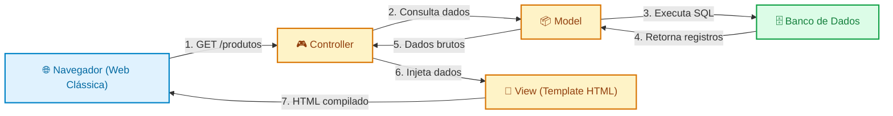
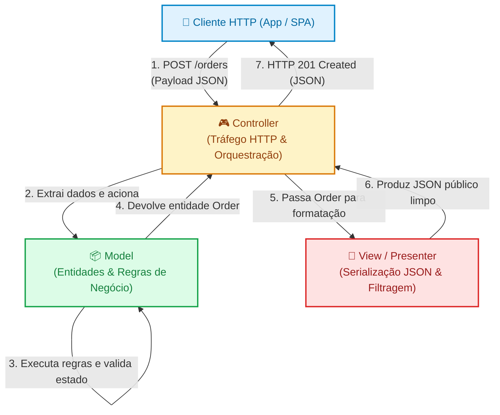
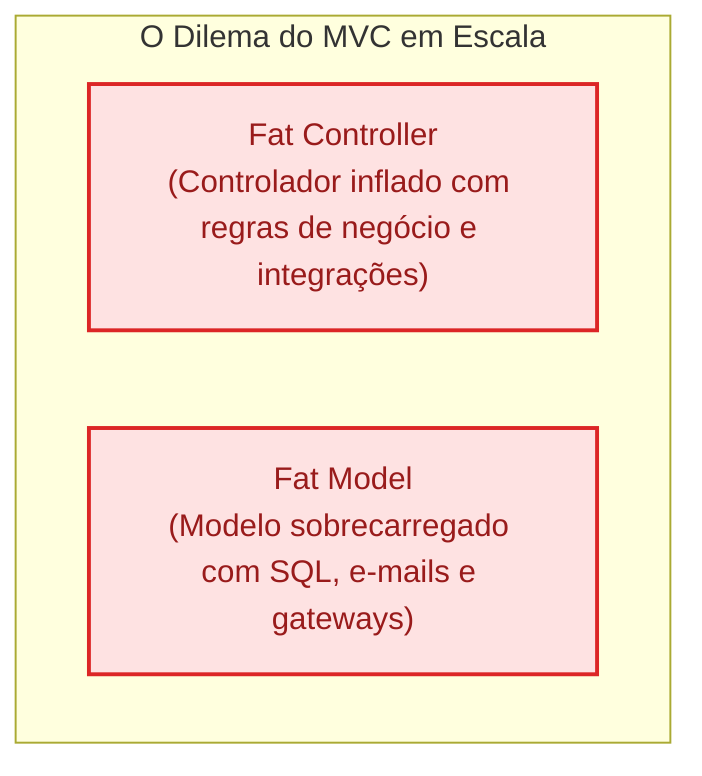

# 01. O Padrão MVC no Contexto de APIs

Quando começamos a construir nossos primeiros servidores web, é natural e
tentador escrever tudo em um único lugar: a rota recebe os dados, valida se os
campos estão preenchidos, calcula regras de negócio, executa comandos no banco
de dados e monta a resposta diretamente no mesmo bloco de código.

No entanto, à medida que a aplicação cresce de um protótipo com duas rotas para
um sistema comercial com dezenas de operações, essa abordagem se torna
insustentável. Neste capítulo, você entenderá a importância da **Separação de
Preocupações** (_Separation of Concerns_), a trajetória histórica do padrão
**MVC** (_Model - View - Controller_) e como a camada de **View** se transformou
na era das APIs modernas.

## A Dor: O Caos do "Código Espaguete" (Fat Handler)

Imagine um endpoint responsável por criar um pedido de compra em uma loja
virtual. O código abaixo ilustra uma prática muito comum em iniciantes:
concentrar toda a lógica dentro da função da rota.

```typescript
// ❌ Código Espaguete: todas as responsabilidades misturadas na rota
app.post("/orders", async (req: Request, res: Response) => {
  const { customerId, items, couponCode } = req.body;

  // 1. Validação de entrada
  if (!customerId || !Array.isArray(items) || items.length === 0) {
    return res.status(400).json({ error: "Invalid payload" });
  }

  // 2. Consulta direta ao banco de dados
  const customer = await database.query(
    "SELECT * FROM customers WHERE id = ?",
    [customerId],
  );
  if (!customer) {
    return res.status(404).json({ error: "Customer not found" });
  }

  // 3. Regra de negócio: cálculo de totais e aplicação de cupom
  let total = 0;
  for (const item of items) {
    const product = await database.query(
      "SELECT price, stock FROM products WHERE id = ?",
      [item.productId],
    );
    if (product.stock < item.quantity) {
      return res.status(409).json({ error: `Out of stock: ${item.productId}` });
    }
    total += product.price * item.quantity;
  }

  if (couponCode === "FATEC10") {
    total *= 0.9; // 10% de desconto
  }

  // 4. Persistência da compra
  const orderId = await database.query("INSERT INTO orders ...", [
    customerId,
    total,
  ]);

  // 5. Formatação direta da resposta HTTP
  return res.status(201).json({
    message: "Order created successfully",
    order: { id: orderId, finalAmount: total, status: "PENDING" },
  });
});
```

Esse padrão de código traz problemas severos para a manutenção:

- **Impossível de Testar Isoladamente:** Para testar se o cupom de 10% calcula o
  valor correto, você é obrigado a simular uma requisição HTTP completa e ter um
  banco de dados conectado.
- **Zero Reutilização:** Se amanhã surgir uma rotina em lote (_background job_)
  ou um comando de linha de comando (CLI) que também precise criar pedidos, você
  terá que copiar e colar dezenas de linhas de código.
- **Acoplamento Extremo:** Qualquer mudança simples no banco de dados exige
  alterar arquivos de rota web.

Para combater esse problema, a engenharia de software adota o princípio de
**Separação de Preocupações** (_Separation of Concerns - SoC_): cada parte do
código deve cuidar de apenas uma faceta do sistema.

## Contextualização Histórica: A Era de Ouro do MVC na Web

O padrão **MVC** (_Model - View - Controller_) é um dos padrões de arquitetura
mais famosos da computação. Ele foi originalmente concebido no final dos anos
1970 por Trygve Reenskaug para interfaces gráficas de desktop na linguagem
Smalltalk.

No entanto, sua verdadeira consagração em escala global aconteceu nos anos 2000,
com a ascensão de frameworks web como **Ruby on Rails**, **Django** (Python),
**ASP.NET MVC** (C#), **Spring MVC** (Java) e **Laravel** (PHP).

Durante mais de uma década, o MVC foi a espinha dorsal de quase todas as
aplicações corporativas da internet. O fluxo clássico funcionava assim:

1. **Controller:** Recebia a requisição HTTP enviada pelo navegador (um clique
   em um link ou envio de formulário HTML);
2. **Model:** Carregava os dados da entidade no banco de dados e executava as
   regras de negócio;
3. **View:** Um arquivo de template no servidor (com extensões como `.erb`,
   `.blade.php`, `.jsp` ou `.html`) combinava o HTML com os dados do Model e
   gerava uma página web completa enviada de volta ao navegador.



Nesse modelo tradicional, a **View era visual**: sua única missão era produzir
tags HTML, estilos CSS e layouts para renderização na tela do usuário.

### E a View? Como o MVC se Adaptou à Era das APIs

A partir de 2010, o ecossistema web passou por uma revolução silenciosa:

- Os navegadores tornaram-se mais potentes com JavaScript moderno;
- Surgiram as aplicações de página única (**SPAs**) com React, Vue e Angular;
- O uso de smartphones explodiu, exigindo aplicativos móveis nativos (iOS e
  Android).

Com essa mudança, o servidor de backend **deixou de ser responsável por desenhar
interfaces visuais**. A responsabilidade de renderizar HTML e gerenciar telas
foi completamente transferida para o cliente (_frontend_).

Diante dessa nova realidade, muitos desenvolvedores se perguntaram: _“Se o
backend não gera mais HTML, o padrão MVC morreu? Onde foi parar a View?”_

A resposta é que **o MVC não morreu; ele se reinventou**.

Em uma API moderna, a **View** deixa de ser um arquivo HTML com templates e
passa a ser a **camada de representação e serialização de dados**:

- A View de uma API é o código responsável por transformar objetos internos do
  domínio em estruturas de saída padronizadas (geralmente **JSON** ou **XML**);
- Ela filtra informações sensíveis (como hashes de senhas e tokens internos que
  nunca devem sair do servidor);
- Ela formata tipos de dados (datas em padrão ISO 8601, valores monetários com
  duas casas decimais, links hipermídia).

> **Analogia Prática: O Restaurante**
>
> - **O Cliente:** É o consumidor externo (o navegador ou aplicativo mobile que
>   faz o pedido).
> - **O Controller (Garçom):** Recebe o pedido da mesa, anota as preferências e
>   leva para a cozinha. Quando o prato fica pronto, entrega na mesa com os
>   talheres corretos.
> - **O Model (Cozinha):** Onde os ingredientes (dados) são preparados e as
>   regras da receita (regras de negócio) são estritamente executadas.
> - **A View (Empratamento):** A forma como a comida é disposta no prato para
>   ser servida. Na web clássica, era um banquete com toalha de mesa e enfeites
>   (HTML/CSS). Em uma API, é uma embalagem industrial limpa, etiquetada e
>   padronizada (JSON).

## Anatomia do MVC no Contexto de APIs

Ao aplicar MVC em uma API RESTful, as três responsabilidades são distribuídas da
seguinte forma:



### 1. O Controller (Controlador)

O Controller é a **porta de entrada da requisição**. Ele conhece o protocolo
HTTP, mas **não conhece regras de negócio profundas**.

Suas atribuições exclusivas são:

- Extrair parâmetros de rota, query strings e o corpo JSON da requisição;
- Chamar o Model apropriado para executar a operação;
- Definir o código de status HTTP correto (`200 OK`, `201 Created`, `400 Bad
Request`);
- Enviar a resposta formatada de volta.

### 2. O Model (Modelo)

O Model é o **coração do sistema**. Ele representa as entidades da aplicação e
suas regras de integridade.

Suas atribuições são:

- Garantir que as regras de negócio sejam respeitadas (ex.: um pedido não pode
  ser fechado com valor negativo; estoque insuficiente impede a venda);
- Representar o estado atual dos dados;
- Interagir com mecanismos de persistência de dados.

### 3. A View / Presenter (Visão de API)

Em APIs, essa camada frequentemente recebe o nome de **View**, **Presenter**,
**Serializer** ou **Resource**:

Suas atribuições são:

- Ocultar dados sensíveis (`password_hash`, `internal_notes`);
- Moldar o formato final do JSON esperado pelo contrato da API;
- Adicionar metadados de paginação ou links de hipermídia (HATEOAS).

## O Padrão em Código: Refatorando o Exemplo

Vamos transformar aquele endpoint problemático em uma estrutura organizada
seguindo o padrão MVC.

### 1. O Model: Entidade e Regras de Negócio

O Model encapsula os dados e as regras de cálculo do pedido, totalmente isolado
do protocolo HTTP:

```typescript
// ✅ Model: Focado apenas em regras de negócio e integridade de dados
export interface OrderItem {
  productId: string;
  quantity: number;
  unitPrice: number;
}

export class OrderModel {
  public id?: string;
  public customerId: string;
  public items: OrderItem[];
  public discountAmount: number = 0;
  public status: "PENDING" | "PAID" | "CANCELLED" = "PENDING";

  constructor(customerId: string, items: OrderItem[]) {
    if (!customerId) throw new Error("Customer is required");
    if (!items || items.length === 0)
      throw new Error("Order must contain at least one item");

    this.customerId = customerId;
    this.items = items;
  }

  // Regra de negócio pura: cálculo do valor total
  public calculateSubtotal(): number {
    return this.items.reduce(
      (acc, item) => acc + item.unitPrice * item.quantity,
      0,
    );
  }

  // Regra de negócio pura: validação e aplicação de cupom
  public applyCoupon(code?: string): void {
    if (code === "FATEC10") {
      this.discountAmount = this.calculateSubtotal() * 0.1;
    }
  }

  public calculateTotal(): number {
    return this.calculateSubtotal() - this.discountAmount;
  }
}
```

### 2. A View: Formatação e Serialização de Dados

A View é responsável por moldar o JSON entregue ao cliente:

```typescript
// ✅ View: Define a casca pública do recurso entregue via JSON
export class OrderView {
  public static render(order: OrderModel) {
    return {
      orderId: order.id,
      customerId: order.customerId,
      financialSummary: {
        subtotal: Number(order.calculateSubtotal().toFixed(2)),
        discount: Number(order.discountAmount.toFixed(2)),
        total: Number(order.calculateTotal().toFixed(2)),
      },
      itemCount: order.items.length,
      status: order.status,
    };
  }
}
```

### 3. O Controller: Orquestração e Resposta HTTP

O Controller recebe a requisição HTTP, aciona o Model e delega para a View:

```typescript
// ✅ Controller: Fala HTTP, orquestra o fluxo e responde ao cliente
export class OrderController {
  public async create(req: Request, res: Response): Promise<Response> {
    try {
      const { customerId, items, couponCode } = req.body;

      // 1. Instancia o modelo aplicando as invariantes
      const order = new OrderModel(customerId, items);
      order.applyCoupon(couponCode);

      // 2. Persiste (simulado)
      order.id = "ord_987654";

      // 3. Serializa através da View e responde com status semântico
      const responseBody = OrderView.render(order);
      return res.status(201).json(responseBody);
    } catch (error: any) {
      // Traduz erros de domínio em códigos de status HTTP apropriados
      return res.status(400).json({ error: error.message });
    }
  }
}
```

## Onde o MVC Puro Encontra Seus Limites?

Embora o MVC organize muito melhor o código que uma rota inline única, sistemas
corporativos de médio e grande porte rapidamente enfrentam novos dilemas:

### 1. O Problema do "Fat Controller"

Quando uma operação envolve regras mais complexas — como debitar o cartão de
crédito em um gateway externo, enviar um e-mail de confirmação e registrar uma
auditoria de segurança — onde colocar esse código?

Se colocarmos no **Controller**, ele volta a ficar gigantesco e repleto de
lógica complexa, violando o princípio de manter o Controller magro.

### 2. O Problema do "Fat Model"

Se, por outro lado, empurrarmos toda a lógica para o **Model**, ele passa a
fazer coisas que violam sua natureza: além de representar os dados do pedido, o
Model passa a saber como disparar e-mails, como abrir conexões SQL e como chamar
APIs externas.



Para resolver esse dilema e permitir que aplicações escalem sem virar um
labirinto, a indústria refinou a arquitetura dividindo as responsabilidades do
Model em camadas mais especializadas. É exatamente isso que estudaremos no
próximo capítulo: a **Arquitetura em Camadas** com _Controllers_, _Services_ e
_Repositories_.

<details>
<summary>🔍 Aprofundamento: A Diferença entre View, Serializer, DTO e Presenter</summary>

No ecossistema de APIs, diferentes comunidades e linguagens usam termos variados
para a camada de representação:

- **View / Template:** Termo herdado da web clássica. Em frameworks como Laravel
  ou Django REST Framework, costuma ser o componente que entrega o payload
  final.
- **Serializer / Resource:** Usado para designar classes que recebem modelos de
  dados ou registros de banco de dados e os transformam em JSON filtrado.
- **Presenter:** Padrão comum em arquiteturas limpas que prepara os dados
  especificamente para consumo de quem fez a chamada.
- **DTO (Data Transfer Object):** Um objeto simples, sem lógica, usado puramente
  para carregar dados entre processos ou camadas. Estudaremos DTOs a fundo no
  Capítulo 03 deste submódulo.

Embora tenham sutilezas conceituais, todos compartilham a mesma missão na era
das APIs: **isolar o formato interno do banco de dados do formato público
exposto na rede**.

</details>

## O Que Vem a Seguir?

Compreendemos a importância da Separação de Preocupações, a trajetória histórica
do padrão MVC e como a camada de View se adaptou para atuar como formatadora e
serializadora de dados na era das APIs modernas.

No entanto, também identificamos os limites do MVC puro: o risco de criar _Fat
Controllers_ ou sobrecarregar modelos com regras de infraestrutura e
persistência.

No **[Capítulo 02: Arquitetura em Camadas: Controllers, Services e
Repositories](02-arquitetura-em-camadas-controllers-services-repositories.md)**,
vamos avançar para o padrão arquitetural predominante em backends corporativos,
dividindo a aplicação em três camadas com responsabilidades cirúrgicas e fluxo
unidirecional!

---

<p align="right"><a href="02-arquitetura-em-camadas-controllers-services-repositories.md">Próximo: Arquitetura em Camadas: Controllers, Services e Repositories →</a></p>
