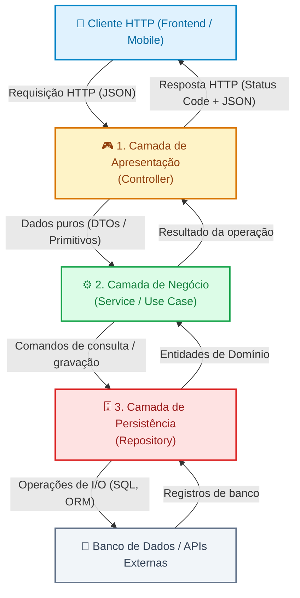
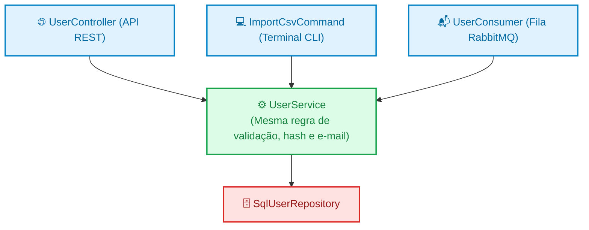

# 02. Arquitetura em Camadas: Controllers, Services e Repositories

No capítulo anterior, vimos como o padrão MVC ajudou a organizar as primeiras
gerações de aplicações web e como sua camada de View se reinventou em APIs na
forma de serialização JSON. No entanto, também descobrimos um limite crítico do
MVC tradicional: o dilema entre o **Fat Controller** (controladores cheios de
regras de negócio) e o **Fat Model** (modelos sobrecarregados com banco de
dados, e-mails e chamadas externas).

Quando uma aplicação comercial cresce, misturar regras de negócio com o
protocolo HTTP ou com queries de banco de dados torna o sistema difícil de
testar, impossível de manter e propenso a falhas em cascata.

Neste capítulo, você conhecerá o padrão arquitetural mais difundido na
construção de backends modernos: a **Arquitetura em Três Camadas** organizada em
**Controllers**, **Services** e **Repositories**.

## A Dor: O Acoplamento que Impede Testes e Evolução

Considere uma regra de negócio real de um sistema:  
_“Para cadastrar um novo usuário, o e-mail deve ser único, a senha deve ser
criptografada com algoritmo seguro e, após a gravação, um e-mail de boas-vindas
deve ser disparado.”_

Se implementarmos essa lógica diretamente em um Controller ou dentro de um
handler de rota:

```typescript
// ❌ Acoplamento Perigoso: regras de negócio misturadas com HTTP e persistência direta
export class UserController {
  public async register(req: Request, res: Response) {
    const { name, email, password } = req.body;

    // 1. Acoplamento com biblioteca de banco na borda HTTP
    const existing = await database.query(
      "SELECT id FROM users WHERE email = ?",
      [email],
    );
    if (existing.length > 0) {
      return res.status(409).json({ error: "Email already registered" });
    }

    // 2. Regra de negócio executada dentro do Controller
    const passwordHash = await hashAlgorithm.hash(password, 10);

    // 3. Persistência direta
    const userId = await database.query(
      "INSERT INTO users (name, email, password_hash) VALUES (?, ?, ?)",
      [name, email, passwordHash],
    );

    // 4. Integração externa com servidor de e-mail misturada na rota
    await emailProvider.send(
      email,
      "Bem-vindo!",
      "Sua conta foi criada com sucesso.",
    );

    return res.status(201).json({ id: userId, name, email });
  }
}
```

Essa implementação gera três dores severas:

1. **Pesadelo para Testar:** Se quisermos testar a regra _"não permitir e-mails
   duplicados"_, somos obrigados a levantar um servidor HTTP de teste, disparar
   uma requisição de rede e ter um banco de dados SQL real em execução. Além
   disso, o teste disparará um e-mail real para a internet a cada execução.
2. **Dependência Rígida de Infraestrutura:** Se a equipe decidir trocar o banco
   de dados relacional (PostgreSQL) por um banco de documentos (MongoDB) ou
   adotar um ORM moderno, os arquivos de rota e controladores terão que ser
   reescritos do zero.
3. **Zero Reaproveitamento de Regras:** Se precisarmos cadastrar usuários a
   partir de uma fila assíncrona (RabbitMQ/Kafka) ou por uma rotina de
   importação em lote via linha de comando (CLI), teremos que duplicar toda a
   lógica de criptografia e disparo de e-mails, pois ela está amarrada aos
   objetos `req` e `res` do protocolo HTTP.

## A Solução: Arquitetura em Camadas (Layered Architecture)

A **Arquitetura em Camadas** resolve esse problema estabelecendo uma fronteira
rígida entre as preocupações do sistema. Cada camada possui uma missão exclusiva
e comunica-se apenas com suas camadas vizinhas em um **fluxo unidirecional**:



Vamos dissecar a anatomia e as responsabilidades de cada uma dessas três
camadas.

## 1. A Camada de Apresentação: O Controller

O **Controller** é a borda do sistema que dialoga com o mundo externo. Ele é a
única camada da aplicação que sabe o que é o protocolo HTTP.

### O que o Controller FAZ:

- Lê e valida superficialmente os parâmetros da requisição (parâmetros de rota,
  query string e corpo JSON);
- Converte os dados brutos recebidos na requisição em tipos ou DTOs que o
  Service possa entender;
- Chama o método apropriado do Service correspondente;
- Interpreta o resultado do Service e devolve a resposta HTTP adequada com o
  cabeçalho, status code semântico (`200 OK`, `201 Created`) e o payload JSON
  formatado;
- Captura exceções e traduz erros em códigos HTTP correspondentes (`400 Bad
Request`, `404 Not Found`, `409 Conflict`).

### O que o Controller NUNCA DEVE FAZER:

- Conter regras de negócio (cálculos matemáticos, descontos, regras de
  elegibilidade);
- Conectar no banco de dados ou escrever queries SQL;
- Chamar diretamente gateways de pagamento, APIs de terceiros ou serviços de
  e-mail.

```typescript
// ✅ Controller: Focado estritamente no fluxo HTTP
export class UserController {
  constructor(private readonly userService: UserService) {}

  public async register(req: Request, res: Response): Promise<Response> {
    try {
      const { name, email, password } = req.body;

      // 1. Extrai e delega para a camada de serviço
      const user = await this.userService.registerUser({
        name,
        email,
        password,
      });

      // 2. Responde com semântica HTTP correta
      return res.status(201).json(user);
    } catch (error: any) {
      if (error instanceof EmailAlreadyInUseError) {
        return res.status(409).json({ error: error.message });
      }
      return res.status(500).json({ error: "Internal server error" });
    }
  }
}
```

## 2. A Camada de Negócio: O Service

O **Service** (também chamado de _Caso de Uso_ ou _Use Case_) é o **coração
pulsante da aplicação**. É nele que vive o diferencial de negócio da sua
empresa.

A característica mais marcante de um Service bem projetado é que ele é **100%
agnóstico de HTTP**. Ele não tem a menor ideia do que é um objeto `req`, `res`,
um cookie ou um status code `201`.

### O que o Service FAZ:

- Executa validações de regras de negócio (ex.: verificar unicidade, idade
  mínima, saldos disponíveis);
- Orquestra o fluxo de dados entre diferentes repositórios e serviços
  auxiliares;
- Executa operações de criptografia, cálculos financeiros e validação de
  invariantes de domínio;
- Dispara notificações e eventos de domínio;
- Lança exceções ou erros de domínio quando uma regra for violada.

### O que o Service NUNCA DEVE FAZER:

- Manipular objetos da requisição web (como `req.headers` ou `res.cookie`);
- Executar comandos diretos de banco de dados (`SELECT * FROM...`);
- Retornar status codes HTTP.

```typescript
// ✅ Service: Regras de negócio puras, sem nenhuma referência a HTTP
export interface CreateUserDTO {
  name: string;
  email: string;
  password: string;
}

export class UserService {
  constructor(
    private readonly userRepository: UserRepository,
    private readonly passwordHasher: PasswordHasher,
    private readonly mailProvider: MailProvider,
  ) {}

  public async registerUser(data: CreateUserDTO): Promise<UserPublicProfile> {
    // 1. Aplicação da regra de negócio: e-mail deve ser único
    const userAlreadyExists = await this.userRepository.findByEmail(data.email);
    if (userAlreadyExists) {
      throw new EmailAlreadyInUseError("Email already in use");
    }

    // 2. Criptografia segura da senha
    const hashedPassword = await this.passwordHasher.hash(data.password);

    // 3. Persistência delegada ao Repositório
    const createdUser = await this.userRepository.save({
      name: data.name,
      email: data.email,
      passwordHash: hashedPassword,
    });

    // 4. Efeito colateral: envio de boas-vindas
    await this.mailProvider.sendWelcomeEmail(
      createdUser.email,
      createdUser.name,
    );

    return {
      id: createdUser.id,
      name: createdUser.name,
      email: createdUser.email,
    };
  }
}
```

## 3. A Camada de Persistência: O Repository

O **Repository** é a camada responsável por isolar todo e qualquer detalhe sobre
onde e como os dados são guardados e recuperados.

Para o restante do sistema, o Repositório se comporta como se fosse uma coleção
de objetos em memória (`List`, `Map` ou `Array`), escondendo por trás de seus
métodos a complexidade de conexões de rede, comandos SQL e tabelas relacionais.

### O que o Repository FAZ:

- Conecta-se a bancos de dados relacionais (PostgreSQL, MySQL), bancos NoSQL
  (MongoDB, DynamoDB) ou caches em memória (Redis);
- Executa queries SQL brutas ou métodos de ORMs/Query Builders (como Prisma,
  TypeORM, Sequelize, Hibernate ou Entity Framework);
- Mapeia registros brutos do banco de dados (linhas de tabelas ou documentos) em
  entidades de domínio do sistema.

### O que o Repository NUNCA DEVE FAZER:

- Validar regras de negócio da aplicação (como decidir se um desconto pode ser
  concedido);
- Lidar com o protocolo HTTP;
- Disparar e-mails ou chamadas para serviços externos.

```typescript
// ✅ Repository: Contrato e implementação focados estritamente em persistência
export interface UserData {
  id?: string;
  name: string;
  email: string;
  passwordHash: string;
}

export interface UserRepository {
  findByEmail(email: string): Promise<UserData | null>;
  save(user: UserData): Promise<UserData>;
}

// Implementação concreta usando um cliente de banco SQL genérico
export class SqlUserRepository implements UserRepository {
  constructor(private readonly dbConnection: DatabaseConnection) {}

  public async findByEmail(email: string): Promise<UserData | null> {
    const rows = await this.dbConnection.query(
      "SELECT id, name, email, password_hash FROM users WHERE email = ? LIMIT 1",
      [email],
    );

    if (rows.length === 0) return null;

    return {
      id: rows[0].id,
      name: rows[0].name,
      email: rows[0].email,
      passwordHash: rows[0].password_hash,
    };
  }

  public async save(user: UserData): Promise<UserData> {
    const result = await this.dbConnection.query(
      "INSERT INTO users (name, email, password_hash) VALUES (?, ?, ?) RETURNING id",
      [user.name, user.email, user.passwordHash],
    );

    return { ...user, id: result[0].id };
  }
}
```

<details>
<summary>🔍 Aprofundamento: O Padrão Active Record vs Data Mapper</summary>

Na história do desenvolvimento backend, duas abordagens competiram sobre onde
deve morar o código de persistência:

1. **Active Record (Foco em Agilidade):**  
   A própria classe da entidade de negócio herda métodos de persistência:  
   `user = new User(); user.name = "Ana"; await user.save();`
   - **Vantagem:** Muito rápido para protótipos e CRUDs simples. Popularizado
     pelo Ruby on Rails, Django ORM e Laravel Eloquent.
   - **Desvantagem:** Viola o princípio de responsabilidade única. A entidade de
     negócio fica fortemente acoplada à estrutura das tabelas do banco de dados.

2. **Data Mapper / Repository (Foco em Desacoplamento Corporativo):**  
   A entidade de negócio é pura memória e não sabe como se salvar. Uma classe
   separada (o `Repository`) é encarregada de mapeá-la e gravá-la:  
   `user = new User("Ana"); await userRepository.save(user);`
   - **Vantagem:** Isolamento absoluto entre a regra de negócio e o banco de
     dados. Permite que o domínio evolua independentemente da modelagem
     relacional.
   - **Desvantagem:** Exige mais classes e abstrações no início do projeto.

Para sistemas corporativos de médio e grande porte, o padrão **Data Mapper /
Repository** tornou-se a escolha predominante da indústria.

</details>

## Por Que Essa Separação É Tão Poderosa?

Adotar a tríade Controller-Service-Repository exige escrever mais arquivos e
interfaces no início do projeto, mas traz retornos gigantescos no ciclo de vida
da aplicação:

### 1. Testabilidade com Mocks (Sem Subir Banco de Dados)

Como o `UserService` depende de uma interface de repositório (`UserRepository`),
podemos criar um repositório simulado em memória em menos de dez linhas de
código para testar as regras de negócio:

```typescript
// ✅ Repositório Falso em Memória para Testes Unitários
class InMemoryUserRepository implements UserRepository {
  private users: UserData[] = [];

  public async findByEmail(email: string): Promise<UserData | null> {
    return this.users.find((u) => u.email === email) || null;
  }

  public async save(user: UserData): Promise<UserData> {
    const newUser = { ...user, id: `user_${this.users.length + 1}` };
    this.users.push(newUser);
    return newUser;
  }
}

// Teste unitário veloz: roda em 5 milissegundos sem precisar de Docker ou banco SQL!
test("should not allow registering an existing email", async () => {
  const repo = new InMemoryUserRepository();
  const hasher = new FakeHasher();
  const mailer = new FakeMailer();
  const service = new UserService(repo, hasher, mailer);

  // Primeiro cadastro: sucesso
  await service.registerUser({
    name: "Ana",
    email: "ana@fatec.sp.gov.br",
    password: "123",
  });

  // Segundo cadastro com mesmo e-mail: deve lançar erro
  await expect(
    service.registerUser({
      name: "Ana Outra",
      email: "ana@fatec.sp.gov.br",
      password: "456",
    }),
  ).rejects.toThrow(EmailAlreadyInUseError);
});
```

### 2. Reutilização Multicanal da Mesma Regra de Negócio

Se amanhã a FATEC precisar importar 5.000 alunos a partir de uma planilha CSV
usando um script CLI, você **não precisa duplicar nenhuma lógica**:



O `UserService` é neutro: quem chama pode ser um endpoint REST, um comando de
terminal ou um worker assíncrono.

## O Que Vem a Seguir?

Agora que você domina a separação em três camadas — Controller, Service e
Repository —, a sua aplicação ganha testabilidade imediata, desacoplamento de
banco de dados e capacidade de reutilização multicanal.

No entanto, uma pergunta fundamental de segurança e arquitetura ainda permanece
aberta:  
_Como garantir que dados malformados ou propriedades indevidas enviadas pelo
cliente não vazem para as regras de negócio e para o banco de dados?_

No **[Capítulo 03: DTOs e Transferência de
Dados](03-dtos-e-transferencia-de-dados.md)**, vamos explorar o papel dos **Data
Transfer Objects (DTOs)**, a validação rigorosa na borda da aplicação e a
blindagem definitiva das suas entidades de domínio!

---

<a href="01-o-padrao-mvc-no-contexto-de-apis.md">← O Padrão MVC no Contexto de
APIs</a>

<p align="right"><a href="03-dtos-e-transferencia-de-dados.md">Próximo: DTOs e Transferência de Dados →</a></p>
