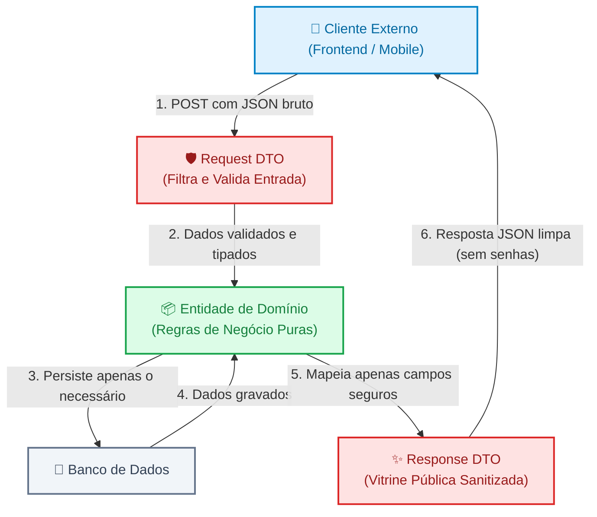

# 03. DTOs e Transferência de Dados

Nos capítulos anteriores, organizamos o backend em uma arquitetura clara de três
camadas: o **Controller** recebe o tráfego HTTP, o **Service** processa as
regras de negócio e o **Repository** persiste as informações no banco de dados.

Contudo, ao conectar essas camadas ao mundo externo através da rede, surge uma
pergunta crítica de segurança e integridade de dados:  
_Qual formato de dados deve transitar entre o cliente que consome a API e o
núcleo interno da nossa aplicação?_

Se permitirmos que os dados brutos enviados pelo usuário sejam gravados
diretamente no banco, ou se devolvermos nossas tabelas e modelos internos
diretamente no JSON de resposta, abriremos brechas graves de segurança e
acoplaremos nosso sistema a detalhes de infraestrutura.

Neste capítulo, você aprenderá a resolver esse problema através do padrão
**DTO** (_Data Transfer Object_), compreendendo como ele atua como um escudo de
proteção e contrato estável entre a rede e o seu domínio de negócio.

## A Dor: Os Perigos de Não Ter uma Fronteira de Dados

Para entender a real necessidade de um DTO, imagine um endpoint simples de
cadastro de clientes em um e-commerce:

```typescript
// ❌ Código Vulnerável: O payload da requisição é repassado diretamente para a entidade
export class UserController {
  public async register(req: Request, res: Response) {
    // 1. Recebe qualquer propriedade enviada no corpo da requisição
    const userData = req.body;

    // 2. Salva diretamente no banco de dados sem filtro
    const newUser = await database.users.create({
      data: userData,
    });

    // 3. Devolve a entidade inteira do banco de dados na resposta HTTP
    return res.status(201).json(newUser);
  }
}
```

Aparentemente simples e conciso, esse código esconde duas das falhas mais comuns
e perigosas em aplicações web:

### 1. A Vulnerabilidade de Mass Assignment (Over-Posting)

O desenvolvedor espera que o cliente envie apenas `{ "name": "Carlos", "email":
"carlos@email.com", "password": "123" }`.

No entanto, um invasor que inspecione as requisições pode enviar um JSON
malicioso com campos que não deveriam ser manipuláveis pelo público:

```json
{
  "name": "Carlos Invasor",
  "email": "carlos@email.com",
  "password": "123",
  "role": "ADMIN",
  "accountBalance": 1000000.0,
  "isEmailVerified": true
}
```

Se a aplicação repassar o corpo da requisição diretamente para o banco de dados,
o invasor ganhará **privilégios de administrador** e **saldo infinito**,
simplesmente porque o sistema aceitou cegamente todas as chaves enviadas. Esse
vetor de ataque é conhecido como **Mass Assignment** (ou _Over-posting_).

<details>
<summary>🔍 Aprofundamento Histórico: O Incidente de Mass Assignment do GitHub (2012)</summary>

Em março de 2012, o desenvolvedor de segurança Egor Homakov descobriu uma
vulnerabilidade clássica de **Mass Assignment** na aplicação do próprio GitHub.

O formulário de atualização de perfil do usuário permitia atualizar a chave
pública SSH da conta. O GitHub utilizava o framework Ruby on Rails com o padrão
Active Record. Na época, era comum no Rails receber parâmetros da requisição e
passá-los diretamente para a instrução de atualização do modelo:

`current_user.update_attributes(params[:user])`

Homakov percebeu que, além da chave pública, ele podia injetar a propriedade
`public_key[user_id]=admin`. Com isso, ele associou a sua própria chave SSH à
conta de um usuário administrador do projeto Ruby on Rails dentro do GitHub.

Para demonstrar a gravidade da falha sem causar danos, ele abriu um commit
diretamente na branch principal do repositório oficial do Ruby on Rails. O caso
ganhou repercussão global e forçou frameworks web do mundo inteiro a adotarem
mecanismos de permissão estrita de atributos (_Strong Parameters_ / DTOs
obrigatórios).

</details>

### 2. O Vazamento de Dados Internos (Domain Model Leak)

Na ponta da resposta, quando o endpoint faz `res.json(newUser)`, ele devolve a
linha inteira da tabela do banco de dados para a internet.

Isso vaza dados confidenciais diretamente no payload do cliente:

- `password_hash` (o hash criptográfico da senha do usuário);
- `password_salt` (o fator de aleatoriedade do hash);
- `failed_login_attempts` (contador de segurança interno);
- `internal_notes` (anotações de auditoria ou risco de crédito da empresa).

Além do risco grave de segurança e conformidade (LGPD/GDPR), expor o modelo de
banco de dados cria um **acoplamento rígido**: se você decidir renomear uma
coluna no banco (`user_name` para `full_name`), quebrará instantaneamente todos
os aplicativos móveis e sistemas externos que consomem a API.

## A Solução: O Que É um DTO (Data Transfer Object)?

O padrão **DTO** foi formalizado pelo arquiteto de software Martin Fowler. Sua
definição é simples e poderosa:

> Um **DTO** é um objeto anêmico (ou seja, sem lógica de negócio ou
> comportamentos complexos) cujo único propósito é **transportar dados entre
> processos, camadas ou sistemas**.

Na arquitetura de APIs modernas, o DTO funciona como uma **aduana de
fronteira**: ele inspeciona tudo o que entra e seleciona rigorosamente tudo o
que sai.



Em uma API, trabalhamos tipicamente com duas variações complementares de DTOs:

1. **Request DTO (Input DTO):** Define o contrato de **entrada**. Especifica
   estritamente quais propriedades a API aceita, quais são obrigatórias, seus
   tipos e formatos. Qualquer campo extra enviado no JSON é sumariamente
   ignorado ou rejeitado.
2. **Response DTO (Output DTO):** Define o contrato de **saída**. Especifica
   apenas as informações que o cliente tem o direito de enxergar, ocultando
   senhas, segredos e identificadores internos.

## Validação na Borda e o Princípio Fail-Fast

Além de impedir que propriedades indevidas alcancem o banco de dados, o Request
DTO desempenha outro papel fundamental: a **validação estrutural de entrada**.

Em engenharia de software, aplicamos o princípio do **Fail-Fast** (_falhe
rápido_): se uma requisição chega com um e-mail sem formato válido, uma senha
com menos de 8 caracteres ou um valor negativo onde se esperava um número
positivo, o sistema deve rejeitar a chamada **imediatamente na borda (no
Controller/DTO)**.

Isso poupa processamento valioso da camada de negócios (Service) e evita que
queries inúteis atinjam o banco de dados. Quando a validação falha, a API
responde no mesmo instante com status `400 Bad Request` ou `422 Unprocessable
Entity` com uma mensagem descritiva do erro.

## O Padrão em Código: Blindando a Aplicação

Vamos reescrever o fluxo de criação de usuários aplicando DTOs de entrada e
saída com tipagem estrita em TypeScript.

### 1. O Contrato de Entrada: Request DTO

O Request DTO define a lista estrita de atributos permitidos na criação da
conta:

```typescript
// ✅ Request DTO: Contrato estrito de entrada
export interface CreateUserRequestDTO {
  name: string;
  email: string;
  password: string;
}

// Função ou classe de validação estrutural na borda
export class CreateUserValidator {
  public static validate(payload: any): CreateUserRequestDTO {
    const { name, email, password } = payload;

    if (!name || typeof name !== "string" || name.trim().length < 3) {
      throw new Error("Validation Error: Name must have at least 3 characters");
    }

    if (!email || typeof email !== "string" || !email.includes("@")) {
      throw new Error("Validation Error: Invalid email format");
    }

    if (!password || typeof password !== "string" || password.length < 8) {
      throw new Error(
        "Validation Error: Password must have at least 8 characters",
      );
    }

    // Retorna APENAS os campos explicitamente permitidos (ignora isAdmin, role, balance, etc.)
    return {
      name: name.trim(),
      email: email.toLowerCase().trim(),
      password,
    };
  }
}
```

### 2. A Entidade de Domínio (Interna)

A entidade interna armazena o hash criptográfico e metadados de auditoria. Ela
nunca é exposta diretamente para a internet:

```typescript
// Entidade interna rica: usada pelo Service e persistida pelo Repository
export interface UserEntity {
  id: string;
  name: string;
  email: string;
  passwordHash: string;
  role: "USER" | "ADMIN";
  createdAt: Date;
  updatedAt: Date;
}
```

### 3. O Contrato de Saída: Response DTO

O Response DTO define a vitrine pública que o cliente receberá de volta:

```typescript
// ✅ Response DTO: Define os dados públicos entregues no JSON
export interface UserResponseDTO {
  id: string;
  name: string;
  email: string;
  createdAt: string; // Formatado em ISO 8601
}

export class UserMapper {
  // Converte uma entidade de banco em um DTO seguro para o cliente
  public static toResponseDTO(entity: UserEntity): UserResponseDTO {
    return {
      id: entity.id,
      name: entity.name,
      email: entity.email,
      createdAt: entity.createdAt.toISOString(),
      // Observe que passwordHash, role interna e updatedAt NÃO foram incluídos!
    };
  }
}
```

### 4. O Controller Orquestrando com Segurança

No Controller, integramos o validador do Request DTO e o mapeador do Response
DTO:

```typescript
// ✅ Controller Blindado: Entrada e saída estritamente intermediadas por DTOs
export class UserController {
  constructor(private readonly userService: UserService) {}

  public async register(req: Request, res: Response): Promise<Response> {
    try {
      // 1. Validação na borda: sanitiza e descarta qualquer propriedade indevida
      const validatedDTO = CreateUserValidator.validate(req.body);

      // 2. Executa a regra de negócio com dados puros e seguros
      const createdUserEntity = await this.userService.register(validatedDTO);

      // 3. Mapeia para o Response DTO antes de devolver o JSON
      const responseDTO = UserMapper.toResponseDTO(createdUserEntity);

      return res.status(201).json(responseDTO);
    } catch (error: any) {
      return res.status(400).json({ error: error.message });
    }
  }
}
```

## Mapeamento entre DTOs e Entidades: Manual vs Automático

Uma dúvida recorrente em equipes de desenvolvimento é:  
_“Devo mapear os campos manualmente (como fizemos com `UserMapper`) ou utilizar
bibliotecas automáticas de mapeamento (AutoMappers)?”_

A indústria divide-se em duas abordagens:

| Abordagem                             | Vantagens                                                                                            | Desvantagens                                                                                     |
| :------------------------------------ | :--------------------------------------------------------------------------------------------------- | :----------------------------------------------------------------------------------------------- |
| **Mapeamento Explícito (Manual)**     | - Segurança total em tempo de compilação<br>- Refatoração assistida pela IDE<br>- Performance máxima | - Exige escrever código de transformação entre DTO e Entidade                                    |
| **Mappers Automáticos (Bibliotecas)** | - Menos código repetitivo para entidades idênticas                                                   | - Risco de vazamento acidental se as propriedades tiverem o mesmo nome<br>- Overhead de reflexão |

Em projetos modernos desenvolvidos em TypeScript, C# ou Java, o **mapeamento
explícito** (ou o uso de construtores dedicados) é fortemente encorajado por ser
autodocumentado, performático e imune a acidentes onde um novo campo da entidade
vaza involuntariamente para a rede.

## O Que Vem a Seguir?

Neste capítulo, você compreendeu como os **DTOs** estabelecem contratos estáveis
entre o mundo exterior e o seu domínio, evitando vulnerabilidades críticas como
_Mass Assignment_, prevenindo o vazamento de dados internos e garantindo
validação rápida na borda da aplicação.

Com a Tríade de Camadas (Controller, Service, Repository) e a blindagem de dados
(DTOs) consolidadas, surge o próximo grande desafio de engenharia:  
_Como instanciar e conectar todas essas camadas e serviços sem criar
dependências rígidas ou espalhar operadores `new` por todo o projeto?_

No **[Capítulo 04: Inversão de Controle e Injeção de
Dependências](04-inversao-de-controle-e-injecao-de-dependencias.md)**, vamos
desvendar um dos conceitos mais importantes e elegantes da arquitetura de
software moderna: o princípio **DIP** do SOLID, **IoC**, **DI manual** e o
funcionamento de **Containers de Injeção** tanto no backend quanto no frontend!

---

<a href="02-arquitetura-em-camadas-controllers-services-repositories.md">←
Arquitetura em Camadas: Controllers, Services e Repositories</a>

<p align="right"><a href="04-inversao-de-controle-e-injecao-de-dependencias.md">Próximo: Inversão de Controle e Injeção de Dependências →</a></p>
