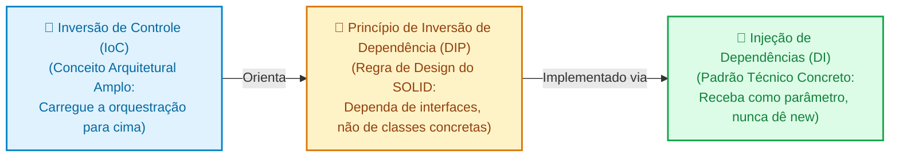
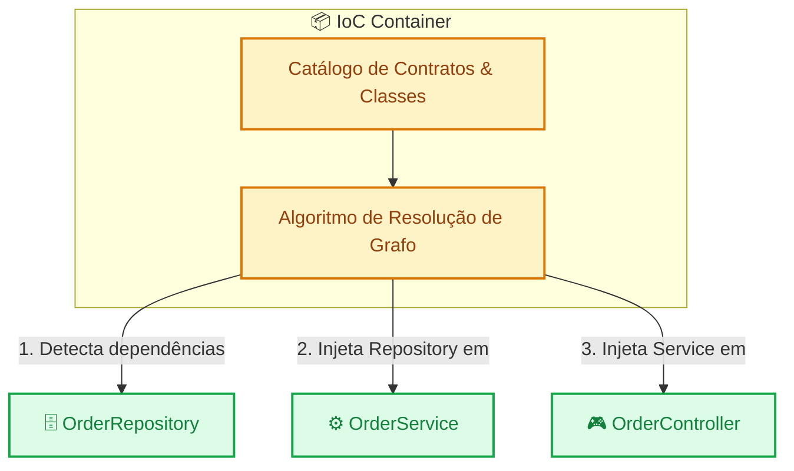

# 04. Inversão de Controle e Injeção de Dependências

Nos capítulos anteriores, aprendemos a organizar nossos sistemas em camadas
especializadas (**Controllers**, **Services** e **Repositories**) e a blindar o
trânsito de informações através de **DTOs**.

No entanto, à medida que criamos mais classes, interfaces e módulos, surge um
dilema prático de engenharia: _Quem é responsável por instanciar essas classes?
Como conectar o Controller ao Service, e o Service ao Repository, sem
transformar o código em um emaranhado de dependências rígidas?_

Se cada classe do seu sistema instanciar suas próprias ferramentas usando o
operador `new`, você criará um castelo de cartas: uma única alteração no
construtor de uma classe quebrará dezenas de outros arquivos, e criar testes
automatizados com simulações (_mocks_) será quase impossível.

Neste capítulo, você desmistificará três conceitos fundamentais da engenharia de
software moderna — **IoC** (_Inversion of Control_), **DIP** (_Dependency
Inversion Principle_) e **DI** (_Dependency Injection_) —, entendendo como eles
operam tanto em servidores backend quanto no ecossistema frontend moderno.

## A Dor: O Operador `new` Espalhado pelo Projeto

Imagine que você está desenvolvendo o fluxo de cobrança de pedidos em uma API. O
código abaixo ilustra o que acontece quando uma classe instancia diretamente
tudo o que precisa para funcionar:

```typescript
// ❌ Acoplamento Rígido: Cada classe instancia suas próprias dependências concretas
export class OrderService {
  private repository: SqlOrderRepository;
  private paymentGateway: CieloPaymentGateway;
  private mailSender: SmtpMailSender;

  constructor() {
    // A classe assume a responsabilidade de fabricar todas as suas ferramentas
    this.repository = new SqlOrderRepository("postgres://localhost:5432/db");
    this.paymentGateway = new CieloPaymentGateway("API_KEY_123");
    this.mailSender = new SmtpMailSender("smtp.empresa.com", 587);
  }

  public async processOrder(orderId: string): Promise<void> {
    const order = await this.repository.findById(orderId);
    await this.paymentGateway.charge(order.totalAmount);
    await this.mailSender.sendConfirmation(order.customerEmail);
  }
}
```

Essa abordagem introduz problemas severos de manutenção e arquitetura:

1. **Impossível de Testar de Forma Isolada:** Se você quiser escrever um teste
   unitário para validar a lógica do método `processOrder`, a execução tentará
   conectar no banco PostgreSQL local, baterá no gateway da Cielo e disparará um
   e-mail SMTP real pela rede.
2. **Efeito Dominó de Refatoração:** Se o construtor de `SqlOrderRepository`
   passar a exigir um parâmetro adicional (por exemplo, um gerenciador de pool
   de conexões), **todas as classes do projeto que dão `new
SqlOrderRepository()`** terão que ser modificadas manualmente.
3. **Violação do Princípio da Responsabilidade Única (SRP):** Além de executar a
   regra de processamento do pedido, o `OrderService` agora precisa saber
   endereços de banco de dados, chaves de API e portas de servidores de e-mail.

Para resolver esse problema, a engenharia de software recorre ao **Princípio de
Hollywood**:

> _"Não nos ligue, nós ligamos para você"_ (_Don't call us, we'll call you_).
>
> A classe não deve correr atrás de suas dependências; alguém de fora deve
> entregá-las prontas para ela.

## Desmistificando a Sopa de Letrinhas: IoC vs DIP vs DI

Na literatura de computação, três siglas frequentemente se misturam e causam
confusão. Elas não são a mesma coisa, mas trabalham juntas em níveis diferentes
de abstração:



### 1. Inversão de Controle (IoC): Carregando a Responsabilidade para Cima

A **Inversão de Controle** é a filosofia mestra. Em vez de uma classe de negócio
ou repositório puxar a responsabilidade de orquestrar infraestrutura, abrir
conexões e decidir quando executar recursos auxiliares, ela deve se preocupar
**estritamente com o seu próprio fluxo específico**.

A responsabilidade de decidir _quando_ e _como_ conectar e coordenar as
ferramentas é empurrada "para cima" na hierarquia da aplicação, até alcançar a
camada mais externa que inicializa o sistema.

### 2. Princípio de Inversão de Dependência (DIP): O Contrato Abstrato

O **DIP** (a letra "D" dos princípios SOLID) dita a regra de design: _módulos de
alto nível não devem depender de módulos de baixo nível; ambos devem depender de
abstrações (interfaces)_.

Como já exploramos nos módulos de linguagens (TypeScript e PHP), programar para
**interfaces** em vez de **classes concretas** blinda o código contra mudanças
de infraestrutura:

```typescript
// ❌ Acoplado à classe concreta: Se quisermos trocar o Postgres por Mongo ou usar um mock, este código rejeita!
export class OrderService {
  constructor(private repo: SqlOrderRepository) {}
}

// ✅ Desacoplado via Interface (DIP): Depende apenas de um contrato abstrato
export interface OrderRepository {
  findById(id: string): Promise<Order>;
}

export class OrderService {
  // Aceita qualquer classe que cumpra o contrato (SqlOrderRepository, MongoOrderRepository, MockOrderRepository)
  constructor(private repo: OrderRepository) {}
}
```

### 3. Injeção de Dependência (DI): A Entrega das Peças

Se a IoC é a filosofia de orquestração e o DIP é a exigência do contrato, a
**Injeção de Dependência (DI)** é o mecanismo técnico: **não instanciar a classe
internamente, mas sim recebê-la pronta de fora (geralmente como parâmetro no
construtor)**.

```typescript
// ❌ Sem DI: A classe assume a responsabilidade de fabricar a dependência com `new`
export class OrderService {
  private repo = new SqlOrderRepository(); // Acoplamento rígido interno
}

// ✅ Com DI: A classe recebe a dependência pronta de quem a chamou
export class OrderService {
  constructor(private readonly repo: OrderRepository) {} // Injetada pelo construtor!
}
```

Ao adotar essa prática, a responsabilidade de dar `new` vai sendo repassada de
camada em camada:

- O **Repository** precisa da conexão com o banco;
- O **Service** precisa do Repository;
- O **Controller** precisa do Service;
- A responsabilidade de instanciar cada uma dessas peças vai subindo até
  alcançar a raiz da aplicação!

## Do Artesanal ao Automático: DI Manual vs Containers IoC

Agora que empurramos a responsabilidade de instanciar todas as classes até o
topo da aplicação, resta a pergunta prática: **onde e como essas dependências
são instanciadas e conectadas?**

### 1. DI Manual (Pure DI / Composition Root)

Em aplicações pequenas e médias, não é obrigatório utilizar bibliotecas
complexas ou mágicas de framework. Você pode instanciar as dependências
manualmente no ponto de entrada da aplicação, em um local chamado **Composition
Root** (geralmente no arquivo `main.ts` ou `server.ts`):

```typescript
// main.ts (Composition Root: onde todo o grafo da aplicação é montado)
import { DatabaseConnection } from "./infra/DatabaseConnection";
import { SqlOrderRepository } from "./repositories/SqlOrderRepository";
import { StripePaymentGateway } from "./services/StripePaymentGateway";
import { SesMailSender } from "./services/SesMailSender";
import { OrderService } from "./domain/OrderService";
import { OrderController } from "./controllers/OrderController";

// 1. Instancia a infraestrutura de baixo nível
const dbConnection = new DatabaseConnection("postgres://...");

// 2. Instancia os repositórios injetando a conexão
const orderRepository = new SqlOrderRepository(dbConnection);

// 3. Instancia os serviços externos
const paymentGateway = new StripePaymentGateway("sk_live_xyz");
const mailSender = new SesMailSender();

// 4. Instancia as regras de negócio injetando os serviços
const orderService = new OrderService(
  orderRepository,
  paymentGateway,
  mailSender,
);

// 5. Instancia o controlador injetando as regras de negócio
const orderController = new OrderController(orderService);

// 6. Inicia o servidor HTTP escutando rotas
app.post("/orders/:id/process", (req, res) => orderController.handle(req, res));
```

Esse padrão chama-se **Pure DI** (ou _Injeção Pura_). Suas vantagens são
transparência absoluta, zero dependências externas e rastreabilidade total: você
consegue navegar em todo o grafo da aplicação apenas segurando `Ctrl` e clicando
nas variáveis.

### 2. Containers de Injeção de Dependências (IoC Containers)

Quando uma aplicação cresce para centenas de classes, serviços e repositórios,
montar esse quebra-cabeça manualmente no `main.ts` torna-se trabalhoso.

Para resolver isso, surgiram os **Containers de Injeção de Dependência** (como
os encontrados no **NestJS**, **Spring Boot**, **ASP.NET Core** ou em
bibliotecas como **TSyringe** e **InversifyJS**).

O Container funciona como um catálogo central inteligente:

1. **Registro:** Você registra as classes e suas interfaces no container;
2. **Resolução:** Quando você pede uma instância do `OrderController`, o
   container inspeciona os parâmetros do construtor, descobre que ele precisa de
   `OrderService`, descobre que o service precisa de `OrderRepository`,
   instancia todas as peças na ordem correta e entrega o objeto pronto para uso.



### Ciclos de Vida (Lifecycles / Scopes) no Container

Ao registrar dependências em um container, você define como e quando novas
instâncias serão criadas:

- **Singleton (Padrão):** Uma única instância da classe é criada durante todo o
  tempo de vida da aplicação e compartilhada por todas as partes do sistema.
  Ideal para serviços sem estado (_stateless_), repositórios e conexões de banco
  de dados.
- **Transient (Transitório):** Uma nova instância da classe é criada a cada vez
  que ela for injetada em qualquer lugar.
- **Scoped / Request (Por Requisição):** Uma instância é criada exclusivamente
  para aquela requisição HTTP específica e destruída quando a resposta é
  enviada. Muito comum para armazenar dados do usuário autenticado ou transações
  de banco de dados isoladas.

## Injeção de Dependências Além do Backend: O Frontend Moderno

Um erro muito comum de quem estuda arquitetura é pensar que Inversão de Controle
e Injeção de Dependência são conceitos exclusivos de servidores ou linguagens
orientadas a objetos como Java e C#.

No ecossistema de **frontend moderno**, os mesmos princípios são amplamente
utilizados para resolver o problema clássico de **Prop Drilling** (ter que
passar uma propriedade manualmente por 10 componentes intermediários até chegar
no filho que precisa dela):

### 1. React (Context API como Container de Injeção)

Imagine que um botão de pagamento precisa acionar um serviço de cobrança. Se o
componente importar a implementação real da API diretamente, ele fica fortemente
acoplado e não poderá ser testado com dados falsos:

```tsx
// 1. Definimos o contrato abstrato do serviço (DIP)
export interface PaymentService {
  processPayment(amount: number): Promise<boolean>;
}

// 2. Criamos o Contexto, que atua como o ponto de injeção de dependência
export const PaymentContext = createContext<PaymentService | null>(null);

// 3. O componente de UI recebe o serviço de fora via Hook (Injeção de Dependência!)
export function CheckoutButton({ amount }: { amount: number }) {
  const paymentService = useContext(PaymentContext);

  if (!paymentService) {
    throw new Error("PaymentService must be provided via PaymentContext");
  }

  return (
    <button onClick={() => paymentService.processPayment(amount)}>
      Finalizar Compra
    </button>
  );
}

// 4. O Provider atua como o Container de DI, escolhendo qual implementação injetar:
// Em Produção: injeta o serviço real com chaves da Stripe
<PaymentContext.Provider value={new StripePaymentService("pk_live_123")}>
  <CheckoutButton amount={99.9} />
</PaymentContext.Provider>

// Em Testes de UI ou Storybook: injeta um mock que não gasta dinheiro real
<PaymentContext.Provider value={new FakePaymentService()}>
  <CheckoutButton amount={99.9} />
</PaymentContext.Provider>
```

Dessa forma, o componente visual `CheckoutButton` não tem a menor ideia de como
a cobrança é feita: ele apenas consome o contrato entregue pelo `Provider` mais
próximo na árvore!

### 2. Angular (Sistema Nativo de DI Hierárquico)

O Angular foi desenhado desde o primeiro dia com um container de Injeção de
Dependência completo embutido no próprio framework (com funcionamento muito
similar ao NestJS e Spring Boot):

```typescript
// 1. Registramos a classe de serviço no container de DI com escopo Singleton
@Injectable({
  providedIn: "root", // Disponível globalmente em toda a aplicação
})
export class ProductService {
  public async getProducts(): Promise<Product[]> {
    return fetch("/api/products").then((res) => res.json());
  }
}

// 2. O componente visual declara a dependência diretamente no construtor
@Component({
  selector: "app-product-list",
  template: `
    <ul>
      <li *ngFor="let p of products">{{ p.name }} - R$ {{ p.price }}</li>
    </ul>
  `,
})
export class ProductListComponent implements OnInit {
  public products: Product[] = [];

  // O Angular detecta o tipo 'ProductService' e entrega a instância automaticamente!
  constructor(private readonly productService: ProductService) {}

  public async ngOnInit(): Promise<void> {
    this.products = await this.productService.getProducts();
  }
}
```

O desenvolvedor nunca escreve `new ProductService()`. O Angular gerencia o ciclo
de vida, instancia o serviço e o entrega pronto no construtor do componente.

### 3. Vue (`provide` / `inject`)

No Vue (especialmente na _Composition API_), o par **`provide`** e **`inject`**
permite que um componente ancestral atue como o provedor de serviços para
qualquer descendente na árvore, sem poluir os componentes intermediários com
propriedades desnecessárias:

```typescript
// No componente raiz ou intermediário (ParentComponent.vue):
import { provide } from "vue";
import { AuthService } from "./services/AuthService";

export default {
  setup() {
    // 1. "Provide": Registra e disponibiliza o serviço para toda a subárvore
    const authService = new AuthService();
    provide("authService", authService);
  },
};

// Em qualquer componente filho em qualquer profundidade (UserAvatar.vue):
import { inject } from "vue";
import { AuthService } from "./services/AuthService";

export default {
  setup() {
    // 2. "Inject": Injeta a dependência sem precisar de props intermediárias!
    const authService = inject<AuthService>("authService");

    return {
      userName: authService?.currentUser.name,
    };
  },
};
```

<details>
<summary>🔍 Aprofundamento: Como os Frameworks TypeScript Descobrem os Tipos sem Você Dizer? (reflect-metadata)</summary>

Se você já usou NestJS ou TSyringe, deve ter notado algo que parece mágica:

```typescript
@Injectable()
export class OrderController {
  constructor(private service: OrderService) {} // O Nest sabe sozinho que deve injetar OrderService!
}
```

Como o framework sabe qual classe injetar se o TypeScript é transpilado para
JavaScript puro e todos os tipos desaparecem em tempo de execução?

A resposta é uma funcionalidade chamada **Metaprogramação com Decorators e
Metadados** (habilitada através da biblioteca `reflect-metadata` e das flags
`experimentalDecorators` e `emitDecoratorMetadata` no `tsconfig.json`).

Quando essas opções estão ativadas, o compilador do TypeScript emite nos
bastidores uma instrução especial no arquivo `.js` gerado:

```javascript
// Código JS gerado pelo compilador:
Reflect.metadata("design:paramtypes", [OrderService]);
```

Em tempo de execução, o container do NestJS usa a API de reflexão para ler essa
informação gravada e descobre: _“O primeiro parâmetro do construtor de
`OrderController` é do tipo `OrderService`”_. Com isso, ele busca o
`OrderService` no catálogo interno e o entrega pronto!

</details>

## O Que Vem a Seguir?

Neste capítulo, você dominou a tríade de ouro do desacoplamento: a filosofia da
**Inversão de Controle (IoC)**, a regra de design do **DIP** (depender de
abstrações) e a técnica prática da **Injeção de Dependências (DI)**, tanto no
backend quanto em arquiteturas de componentes no frontend.

Agora que aprendemos a estruturar o fluxo de dados no servidor e conectar todas
as peças de forma elegante, resta explorar os padrões arquiteturais dedicados à
**interface com o usuário e gerenciamento de estado**.

No **[Capítulo 05: Padrões de Apresentação e Reatividade:
MVVM](05-padroes-de-apresentacao-e-reatividade-mvvm.md)**, vamos mergulhar na
arquitetura que deu origem aos frameworks frontend modernos (Vue, React,
Knockout e Angular), entendendo como o padrão **Model-View-ViewModel**, o
_two-way data binding_ e a reatividade redefiniram a experiência do usuário na
Web!

---

<a href="03-dtos-e-transferencia-de-dados.md">← DTOs e Transferência de
Dados</a>

<p align="right"><a href="05-padroes-de-apresentacao-e-reatividade-mvvm.md">Próximo: Padrões de Apresentação e Reatividade: MVVM →</a></p>
