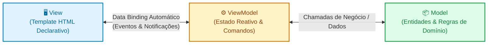

# 05. Padrões de Apresentação e Reatividade: MVVM

Nos capítulos anteriores, exploramos padrões que governam a estrutura interna
das aplicações: a separação em camadas (**Controllers**, **Services**,
**Repositories**), a blindagem de fronteiras com **DTOs** e o desacoplamento de
instâncias através de **Inversão de Controle e Injeção de Dependências**.

No entanto, quando olhamos para a ponta final da experiência do usuário — a
interface visual no navegador —, deparamo-nos com outro desafio de engenharia:  
_Como manter os elementos visuais da tela sincronizados com os dados da memória
sem afundar o código em centenas de seletores de DOM e ouvintes de eventos
manuais?_

Neste capítulo, você conhecerá o padrão **MVVM** (_Model - View - ViewModel_), a
revolução do **Data Binding** (ligação de dados) e como os conceitos de
**Reatividade** transformaram o desenvolvimento de interfaces gráficas na Web
moderna.

## A Dor: O Caos da Manipulação Imperativa do DOM

Antes da popularização de frameworks modernos, a construção de interfaces
dinâmicas dependia exclusivamente da manipulação manual e imperativa do DOM
(utilizando JavaScript puro ou bibliotecas como o jQuery).

Considere um contador de compras simples com um campo de quantidade, preço
unitário, exibição de total e um botão de aplicar desconto:

```typescript
// ❌ Manipulação Imperativa do DOM: Sincronização manual propensa a desincronia
const quantityInput = document.querySelector("#quantity") as HTMLInputElement;
const unitPriceSpan = document.querySelector("#unit-price") as HTMLSpanElement;
const totalAmountSpan = document.querySelector(
  "#total-amount",
) as HTMLSpanElement;
const discountButton = document.querySelector(
  "#apply-discount",
) as HTMLButtonElement;

let quantity = 1;
const unitPrice = 50.0;
let discount = 0;

// O desenvolvedor precisa caçar elementos manualmente e atualizar um a um:
function updateUI() {
  const subtotal = quantity * unitPrice;
  const total = subtotal - discount;

  quantityInput.value = String(quantity);
  totalAmountSpan.innerText = `R$ ${total.toFixed(2)}`;

  if (total <= 0) {
    totalAmountSpan.classList.add("text-free");
  } else {
    totalAmountSpan.classList.remove("text-free");
  }
}

quantityInput.addEventListener("input", (e) => {
  quantity = Number((e.target as HTMLInputElement).value);
  updateUI(); // Se esquecer de chamar aqui, a tela fica desatualizada!
});

discountButton.addEventListener("click", () => {
  discount = 15.0;
  updateUI();
});
```

Embora funcione para um exemplo de poucas linhas, essa abordagem gera três dores
críticas à medida que o sistema cresce:

1. **Fragilidade Extrema:** Se outro desenvolvedor alterar o `id` ou a classe de
   um elemento no HTML, o código JavaScript quebra silenciosamente em tempo de
   execução.
2. **O Pesadelo da Desincronia:** Se os dados do pedido forem atualizados em
   segundo plano (por exemplo, via WebSocket ou uma resposta de API), o
   desenvolvedor é obrigado a lembrar de todos os nós do DOM que precisam ser
   re-renderizados. Se esquecer de um único `span`, a interface exibirá dados
   inconsistentes para o usuário.
3. **Impossível de Testar a Lógica Visual Isoladamente:** Para testar se o
   cálculo do total com desconto está correto, você precisa simular cliques no
   navegador ou usar emuladores pesados de DOM, pois a regra matemática está
   misturada com leitura de inputs e manipulação de classes CSS.

## A Solução: O Padrão MVVM (Model - View - ViewModel)

O padrão **MVVM** foi concebido por arquitetos da Microsoft em 2005
(inicialmente para aplicações de desktop ricas em WPF e Silverlight). Mais
tarde, ele foi adaptado para a Web pela biblioteca **Knockout.js** e refinado em
escala global por frameworks modernos como **Vue.js**, **Angular**, **Svelte** e
pelas bases declarativas do **React**.

A premissa do MVVM é revolucionária: _O código JavaScript nunca deve manipular o
DOM diretamente. Em vez disso, a interface se vincula de forma declarativa e
automática ao estado da aplicação._



### Anatomia dos Três Componentes

1. **Model (Modelo):**
   - É o domínio puro da aplicação: dados brutos de produtos, usuários ou
     pedidos, além de chamadas a APIs HTTP ou bancos de dados locais.
   - É **100% agnóstico de interface visual**: ele não sabe se existe um botão
     na tela, qual é a cor do texto ou se a aplicação roda em um navegador ou no
     terminal.

2. **View (Visão):**
   - É a casca visual da aplicação: o template HTML enriquecido com diretivas ou
     marcações declarativas (como `v-model` no Vue, `[(ngModel)]` no Angular ou
     JSX com propriedades de estado no React).
   - Ela **não possui código de manipulação direta de nós**: não há
     `getElementById`, `appendChild` ou `innerHTML`. Ela apenas declara:  
     _“Exiba aqui o valor da propriedade `total` e, quando o usuário clicar
     neste botão, execute o comando `applyDiscount()`”_.

3. **ViewModel (Modelo de Visão):**
   - É o coração do padrão: um intermediário inteligente que expõe os dados do
     Model já mastigados e formatados para consumo da tela.
   - O ViewModel mantém o **estado reativo** da tela (se um formulário está
     válido, o valor digitado no input, mensagens de carregamento) e expõe
     **comandos/ações** que a View pode acionar.
   - O segredo do ViewModel: ele **não tem referência direta a elementos visuais
     do navegador**. Ele desconhece tags HTML e não faz chamadas a APIs de DOM,
     o que permite testá-lo com testes unitários puros em milissegundos!

## O Que É Data Binding (Ligação de Dados)?

O **Data Binding** é o "fio condutor invisível" que mantém a **View** e o
**ViewModel** em sincronia contínua sem que você precise escrever código manual
de atualização.

Ele divide-se em dois tipos fundamentais:

```mermaid
flowchart TD
    classDef view fill:#e0f2fe,stroke:#0284c7,stroke-width:2px,color:#0369a1;
    classDef vm fill:#fef3c7,stroke:#d97706,stroke-width:2px,color:#92400e;

    subgraph ONEWAY ["1. One-Way Data Binding (Unidirecional)"]
        VM1["ViewModel (total: R$ 85,00)"]:::vm -->|"Atualiza automaticamente"| V1["View: <span>R$ 85,00</span>"]:::view
    end

    subgraph TWOWAY ["2. Two-Way Data Binding (Bidirecional)"]
        VM2["ViewModel (searchQuery)"]:::vm <-->|"Digitação no input atualiza a variável\nAlteração na variável atualiza o input"| V2["View: <input [(ngModel)] />"]:::view
    end
```



- **One-Way Binding (Ligação Unidirecional):** Os dados fluem do ViewModel para
  a View. Quando uma variável muda no JavaScript, o elemento de texto no HTML
  atualiza sozinho.
- **Two-Way Binding (Ligação Bidirecional):** Há uma via de mão dupla. Se o
  usuário digita uma nova palavra em um campo `<input>`, a propriedade do
  ViewModel é atualizada instantaneamente no mesmo milissegundo. Se o ViewModel
  alterar o valor da variável programaticamente, o texto dentro do `<input>` é
  atualizado na hora na tela.

## Como a Reatividade Funciona por Baixo dos Panos?

Para que o Data Binding funcione, os frameworks modernos implementam um
**sistema de reatividade**.

Mas como o framework sabe exatamente que um dado mudou para atualizar apenas o
pedacinho correspondente da tela?

No JavaScript moderno (adotado pelo Vue 3, MobX e frameworks recentes), o
segredo chama-se **`Proxy`**:


Ao envolver o objeto de estado em um `Proxy`, o motor reativo intercepta toda
leitura (_getter_) para rastrear quem depende daquele dado, e toda escrita
(_setter_) para avisar a View de que ela precisa se repintar:

```typescript
// Demonstração simplificada de como a reatividade com Proxy funciona
function createReactiveState<T extends object>(
  initialData: T,
  onChange: () => void,
): T {
  return new Proxy(initialData, {
    set(target, property, value) {
      Reflect.set(target, property, value);
      onChange(); // Avisa automaticamente o motor visual para atualizar o DOM!
      return true;
    },
  });
}
```

O desenvolvedor simplesmente escreve `state.quantity = 5;` como uma variável
normal do JavaScript, e o framework cuida de toda a mágica de sincronização!

## O Padrão em Código: Refatorando o Contador

Vamos reescrever aquele exemplo caótico em uma arquitetura limpa seguindo o
padrão MVVM.

### 1. O Model (Dados Puros e Negócio)

```typescript
// ✅ Model: Entidade do produto, sem saber nada sobre HTML
export interface CartItemModel {
  id: string;
  name: string;
  unitPrice: number;
}
```

### 2. O ViewModel (Estado Reativo e Ações)

O ViewModel gerencia o estado da tela e a lógica de cálculo, totalmente isolado
do navegador:

```typescript
// ✅ ViewModel: Mantém o estado da tela e a lógica de apresentação
export class CartViewModel {
  public quantity: number = 1;
  public discount: number = 0;

  constructor(private readonly item: CartItemModel) {}

  // Propriedades calculadas (Getters formatados para a View)
  public get unitPriceFormatted(): string {
    return `R$ ${this.item.unitPrice.toFixed(2)}`;
  }

  public get totalAmount(): number {
    const subtotal = this.quantity * this.item.unitPrice;
    return Math.max(0, subtotal - this.discount);
  }

  public get totalAmountFormatted(): string {
    return `R$ ${this.totalAmount.toFixed(2)}`;
  }

  public get isFree(): boolean {
    return this.totalAmount === 0;
  }

  // Comandos / Ações disparadas por interações do usuário
  public applyCoupon(discountValue: number): void {
    this.discount = discountValue;
  }

  public setQuantity(newQuantity: number): void {
    if (newQuantity >= 1) {
      this.quantity = newQuantity;
    }
  }
}
```

Observe que esta classe pode ser testada em **2 milissegundos com Jest ou
Vitest** sem precisar carregar um navegador ou emulador de DOM!

### 3. A View (Template Declarativo)

No ecossistema moderno, a View é escrita em um template declarativo (como neste
exemplo em sintaxe Vue/Angular):

```html
<!-- ✅ View: puramente declarativa via Data Binding -->
<div class="cart-card">
  <h2>{{ item.name }}</h2>
  <p>Preço: {{ vm.unitPriceFormatted }}</p>

  <!-- Two-Way Data Binding: Digitação sincroniza automaticamente com o ViewModel -->
  <label>Quantidade:</label>
  <input type="number" [(ngModel)]="vm.quantity" min="1" />

  <!-- One-Way Data Binding com classes condicionais -->
  <p [class.text-free]="vm.isFree">
    Total a pagar: <strong>{{ vm.totalAmountFormatted }}</strong>
  </p>

  <!-- Ligação de Evento para o Comando do ViewModel -->
  <button (click)="vm.applyCoupon(15)">Aplicar Cupom de R$ 15</button>
</div>
```

Zero linhas de `querySelector`. Zero chamadas a `addEventListener`. O código
fica legível, previsível e sustentável.

## Comparativo Direto: MVC vs MVVM

Para consolidar os padrões de apresentação estudados neste submódulo, a tabela
abaixo sintetiza as diferenças fundamentais entre o **MVC** e o **MVVM**:

| Critério de Comparação   | Padrão MVC (Model-View-Controller)                                                      | Padrão MVVM (Model-View-ViewModel)                                    |
| :----------------------- | :-------------------------------------------------------------------------------------- | :-------------------------------------------------------------------- |
| **Origem Principal**     | Aplicações desktop (Smalltalk) e Web clássica (Rails, Laravel)                          | Interfaces ricas desktop (WPF) e Web SPA moderna (Vue, Angular)       |
| **Papel da View**        | Passiva: recebe dados do Controller e renderiza a saída                                 | Ativa e Declarativa: vincula-se ao ViewModel através de Data Binding  |
| **O Intermediário**      | **Controller:** Recebe a requisição/evento, chama o Model e decide qual View renderizar | **ViewModel:** Expõe estado reativo e comandos; não conhece a View    |
| **Mecanismo de Conexão** | Chamada explícita de métodos ou injeção de dados                                        | **Data Binding automático** e observadores reativos                   |
| **Manipulação de DOM**   | Frequente em backends SSR ou scripts JS imperativos clássicos                           | **Totalmente abstraída** pelo compilador e motor reativo do framework |
| **Cenário Ideal**        | APIs REST, páginas server-rendered tradicionais                                         | SPAs ricas, dashboards interativos, apps mobile reativos              |

<details>
<summary>🔍 Aprofundamento: A Evolução da Reatividade Moderna — Os Signals (Sinais)</summary>

Nos últimos anos, o ecossistema de frontend tem migrado para um modelo de
reatividade ainda mais veloz e refinado que os observadores tradicionais: os
**Signals** (ou _Sinais_).

Adotados por frameworks como **SolidJS**, **Angular (Signals)**, **Preact** e
incorporados nas propostas do comitê TC39 para o próprio JavaScript nativo, os
Signals resolvem um problema comum do React e de outros frameworks: a
necessidade de re-executar componentes inteiros quando uma única variável muda.

Em um sistema baseado em Signals:

```typescript
// Exemplo conceitual de Signal nativo
const count = signal(0); // Cria um valor reativo observável

// O efeito sabe exatamente qual nó do DOM lê 'count'
effect(() => {
  console.log(`O contador mudou para: ${count()}`);
});

count.set(1); // Atualiza cirurgicamente apenas o nó exato que depende dele!
```

Com Signals, não existe "Virtual DOM diffing" em árvore inteira: o framework
conecta a variável de estado reativa **diretamente ao nó de texto no DOM real**.
Quando o sinal dispara, apenas aquele pedacinho minúsculo do documento é
atualizado, entregando a performance máxima que a computação moderna permite em
interfaces gráficas.

</details>

---

<a href="04-inversao-de-controle-e-injecao-de-dependencias.md">← Inversão de
Controle e Injeção de Dependências</a>
