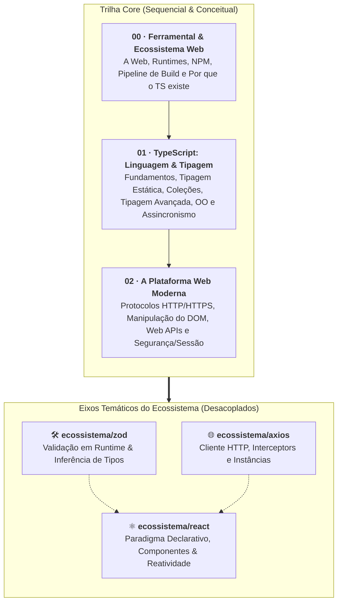

# 🌐 Desenvolvimento Web Fullstack Moderno (FATEC)

> Material didático aberto e autossuficiente para a formação em
> **Desenvolvimento Web Fullstack Moderno**, estruturado com foco em boas
> práticas da indústria, tipagem estática rigorosa com **TypeScript**, padrões
> nativos da plataforma web e bibliotecas modernas do ecossistema.

## 🎯 Sobre o Curso e Postura Pedagógica

Este repositório reúne todo o material instrucional do curso de
**Desenvolvimento Web** da **FATEC**. O conteúdo foi planejado para atender
turmas heterogêneas de graduação em tecnologia, proporcionando uma trilha de
aprendizado gradual, acolhedora e com profundidade técnica.

### 💡 Nossos Pilares Pedagógicos

1. **Didática Construtivista ("O Porquê antes do Como"):** Apresentamos sempre o
   problema e a dor real do desenvolvimento antes de introduzir novas sintaxes
   ou ferramentas.
2. **Conceito sobre a Ferramenta:** Dominamos os fundamentos da plataforma Web
   nativa (protocolo HTTP, ciclo de vida do DOM, manipulação de eventos,
   segurança e TypeScript estrito) antes de adotar bibliotecas e frameworks de
   terceiros.
3. **Código Limpo e Padrões da Indústria:** Todos os identificadores de código
   são escritos em **inglês**, acompanhados de comentários explicativos e
   narrativa em **português**, com contraste visual claro entre abordagens
   frágeis (`// ❌`) e soluções idiomáticas (`// ✅`).
4. **Material Autossuficiente:** Cada capítulo é autocontido, ilustrado com
   diagramas visuais e tabelas comparativas, com aprofundamentos técnicos
   isolados em blocos expansíveis.

## 🗺️ Mapa da Trilha de Aprendizado

## 📚 Sumário Completo do Curso

### 📦 Módulo 00: Ferramental & Ecossistema Web

A base conceitual da Web moderna: compreendendo os papéis das tecnologias
fundamentais, o funcionamento de runtimes fora do navegador e a esteira de
ferramentas de automação.

- [01. As Linguagens da Web e seus
  Papéis](00-ferramental/01-as-linguagens-da-web-e-seus-papeis.md) — A tríade
  HTML, CSS e JavaScript, separação entre Frontend e Backend, e a transição para
  APIs REST com JSON.
- [02. O Que É um Runtime
  JavaScript?](00-ferramental/02-o-que-e-um-runtime-js.md) — Motores de
  execução, o navegador como sandbox e a expansão para servidores (Node.js,
  Deno, Bun).
- [03. Gerenciadores de Pacotes e o Ecossistema
  NPM](00-ferramental/03-gerenciadores-de-pacotes.md) — Registries centrais,
  anatomia do `package.json`, `dependencies` vs `devDependencies` e o papel do
  `package-lock.json`.
- [04. O Pipeline Moderno da
  Web](00-ferramental/04-o-pipeline-moderno-da-web.md) — A linha de montagem da
  Web: Transpiladores (Babel, SWC, TSC), Minificadores, Bundlers (Vite, Webpack)
  e Linters.
- [05. O Que É o TypeScript e Por Que Ele
  Existe?](00-ferramental/05-o-que-e-typescript-e-por-que-ele-existe.md) — As
  dores da tipagem dinâmica em escala, o papel do superset tipado e por que
  tipos só existem em tempo de compilação.

---

### 📘 Módulo 01: TypeScript: Linguagem & Tipagem

Um mergulho completo e estruturado na linguagem TypeScript, desde os conceitos
fundamentais de tipos primitivos e memória até padrões avançados de orientação a
objetos e assincronismo.

#### Bloco 1: Fundamentos, Tipos & Memória

- [01. Instalação e Primeiro Programa em
  TypeScript](01-typescript/01-instalacao-e-primeiro-programa.md) — Setup com
  `tsconfig.json` e o primeiro script compilado com `tsc`.
- [02. Tipos Primitivos e
  Especiais](01-typescript/02-tipos-primitivos-e-especiais.md) — `number`,
  `string`, `boolean`, `null`, `undefined`, `any` e `unknown`.
- [03. Strings e Template
  Literals](01-typescript/03-string-e-template-literals.md) — Imutabilidade de
  texto, métodos essenciais e interpolação.
- [04. Variáveis e Inferência de Tipos](01-typescript/04-variaveis.md) — `const`
  vs `let`, o perigo histórico do `var` e inferência estática.
- [05. Objetos Literais](01-typescript/05-objetos-literais.md) — Criação de
  contratos de objetos, propriedades opcionais (`?`) e modificador `readonly`.
- [06. Tipos por Referência e
  Memória](01-typescript/06-tipos-por-referencia-e-memoria.md) — Modelo de
  memória Stack vs Heap, cópia por valor vs cópia por referência e `as const`.
- [07. Type Aliases](01-typescript/07-type-aliases.md) — Dando nomes legíveis e
  reutilizáveis a contratos de dados.
- [08. Expressões e Operadores](01-typescript/08-expressoes-e-operadores.md) —
  Igualdade estrita (`===`), coalescência nula (`??`) e encadeamento opcional
  (`?.`).
- [09. Estruturas Condicionais](01-typescript/09-estruturas-condicionais.md) —
  Tomadas de decisão com `if/else` e `switch`.
- [10. Laços de Repetição](01-typescript/10-lacos-de-repeticao.md) — Iteração
  com `for`, `while`, `do-while` e `for..of`.

#### Bloco 2: Funções, Escopo & Erros

- [11. Funções: Anatomia e
  Sintaxe](01-typescript/11-funcoes-anatomia-e-sintaxe.md) — Parâmetros tipados,
  retorno, arrow functions e guard clauses.
- [12. Funções de Primeira Classe e
  Callbacks](01-typescript/12-funcoes-de-primeira-classe.md) — Tipagem de
  funções (`(x: T) => R`) e passagem de funções como argumento.
- [13. Escopo Léxico e Sombreamento](01-typescript/13-escopo-e-sombreamento.md)
  — Escopo global, de função e de bloco, scope chain e shadowing.
- [14. Exceções e Tratamento de
  Erros](01-typescript/14-excecoes-e-tratamento-de-erros.md) — Lançamento com
  `throw`, tratamento com `try/catch/finally` e asserções seguras com
  `instanceof Error`.

#### Bloco 3: Coleções & Padrões Modernos

- [15. Arrays Tipados](01-typescript/15-arrays.md) — Listas homogêneas (`T[]`),
  indexação segura e métodos essenciais.
- [16. Tuplas](01-typescript/16-tuplas.md) — Estruturas heterogêneas de tamanho
  fixo (`[T1, T2]`) e tuplas rotuladas.
- [17. Desestruturação de Arrays e
  Objetos](01-typescript/17-desestruturacao-de-arrays-e-objetos.md) —
  Desestruturação posicional e por chave, renomeação e fallbacks.
- [18. Operadores Rest e Spread](01-typescript/18-operadores-rest-e-spread.md) —
  Agrupamento com Rest (`...`) e clonagem imutável com Spread.
- [19. Métodos Funcionais de
  Array](01-typescript/19-metodos-funcionais-de-array.md) — Transformação com
  `map`, filtragem com `filter`, agregação com `reduce`, busca e predicados.
- [20. Closures e Fábricas de
  Funções](01-typescript/20-closures-e-fabricas-de-funcoes.md) — Retenção de
  escopo na Heap, encapsulamento de estado privado e o perigo de _Stale
  Closures_.
- [21. Coleções Set e Map](01-typescript/21-colecoes-set-e-map.md) — Conjuntos
  de valores únicos (`Set`) e dicionários chave-valor tipados (`Map`).

#### Bloco 4: Tipagem Avançada & Contratos

- [22. Interfaces](01-typescript/22-interfaces.md) — Modelagem formal de
  contratos com `interface`, extensão (`extends`) e comparativo com `type`.
- [23. Tipagem Estrutural e Duck
  Typing](01-typescript/23-tipagem-estrutural-e-duck-typing.md) — O paradigma
  estrutural vs nominal e excess property checks.
- [24. Uniões Literais e Discriminated
  Unions](01-typescript/24-unioes-literais-e-discriminated-unions.md) —
  Modelagem de estados impossíveis com `|`, `&`, tipos literais e uniões
  discriminadas.
- [25. Type Narrowing e Type
  Guards](01-typescript/25-type-narrowing-e-type-guards.md) — Afunilamento com
  `typeof`, `instanceof`, `in`, predicados customizados e checagem exaustiva com
  `never`.
- [26. Generics](01-typescript/26-generics.md) — Funções, interfaces e envelopes
  de API reutilizáveis com parâmetros de tipo (`<T>`).
- [27. Tipos Utilitários](01-typescript/27-tipos-utilitarios.md) — Transformação
  de contratos com `Partial`, `Required`, `Pick`, `Omit`, `Record` e
  `ReturnType`.

#### Bloco 5: Módulos, Orientação a Objetos & Assincronismo

- [28. Sistema de Módulos Moderno](01-typescript/28-sistema-de-modulos.md) —
  Exportações nomeadas e padrão, `import type`, ESM vs CommonJS.
- [29. O Paradigma Orientado a Objetos na
  Web](01-typescript/29-o-paradigma-orientado-a-objetos-na-web.md) — O papel de
  OO no ecossistema JS/TS, protótipos vs classes e Composição sobre Herança.
- [30. Classes em TypeScript](01-typescript/30-classes.md) — Propriedades,
  métodos, construtores e o comportamento do `this`.
- [31. Modificadores de Acesso e
  Encapsulamento](01-typescript/31-modificadores.md) — `public`, `private`,
  `protected`, campos privados `#` do ECMAScript, `static` e getters/setters.
- [32. Herança e Classes
  Abstratas](01-typescript/32-heranca-e-classes-abstratas.md) — Reuso com
  `extends`, `super()`, polimorfismo e contratos com `implements` e `abstract`.
- [33. Programação Assíncrona e
  Promises](01-typescript/33-programacao-assincrona.md) — O Event Loop da Web, o
  contrato `Promise<T>`, sintaxe `async/await` e operações concorrentes
  (`Promise.all`, `allSettled`).

### 🌐 Módulo 02: A Plataforma Web Moderna

Explorando os recursos nativos dos navegadores modernos: protocolos de
comunicação, manipulação e componentização do DOM, catálogo de Web APIs e
segurança de sessão.

#### 📡 Submódulo: Comunicação & Protocolos

- [01. Fundamentos de Redes na
  Web](02-a-plataforma-web-moderna/comunicacao-e-protocolos/01-fundamentos-de-redes-na-web.md)
  — Modelo Cliente/Servidor, ciclo de requisição, DNS, IP, portas e a pilha
  TCP/IP.
- [02. O Protocolo HTTP e
  HTTPS](02-a-plataforma-web-moderna/comunicacao-e-protocolos/02-o-protocolo-http-e-https.md)
  — Métodos HTTP, códigos de status por faixa, headers essenciais e criptografia
  TLS/HTTPS.
- [03. Consumo Nativo com a Fetch
  API](02-a-plataforma-web-moderna/comunicacao-e-protocolos/03-fetch-api-e-consumo-nativo.md)
  — A função `fetch()` nativa, streams em duas etapas, checagem de `response.ok`
  e cancelamento com `AbortController`.
- [04. WebSockets e Server-Sent Events
  (SSE)](02-a-plataforma-web-moderna/comunicacao-e-protocolos/04-websockets-e-sse.md)
  — Comunicação em tempo real: HTTP Polling vs WebSockets bidirecionais vs SSE
  unidirecional do servidor.

#### 🌳 Submódulo: Manipulação do DOM & Web Components

- [01. A Árvore do DOM e o Ciclo de
  Renderização](02-a-plataforma-web-moderna/manipulacao-do-dom/01-a-arvore-do-dom-e-renderizacao.md)
  — Nós do DOM, como o navegador processa HTML/CSS e o custo de _Reflow_ e
  _Repaint_.
- [02. Seleção e Manipulação com
  TypeScript](02-a-plataforma-web-moderna/manipulacao-do-dom/02-selecao-e-manipulacao-com-typescript.md)
  — `querySelector`, criação e inserção de nós e tipagem estrita de elementos do
  DOM.
- [03. Sistema de Eventos e
  Propagação](02-a-plataforma-web-moderna/manipulacao-do-dom/03-sistema-de-eventos-e-propagacao.md)
  — Fases de captura e borbulhamento (_Bubbling_), delegação de eventos,
  `preventDefault` e `stopPropagation`.
- [04. Introdução aos Web
  Components](02-a-plataforma-web-moderna/manipulacao-do-dom/04-introducao-aos-web-components.md)
  — Componentização nativa da Web: a tríade Custom Elements, Shadow DOM e
  Templates.
- [05. Custom Elements e Ciclo de
  Vida](02-a-plataforma-web-moderna/manipulacao-do-dom/05-custom-elements-e-ciclo-de-vida.md)
  — Herança de `HTMLElement`, registro customizado e callbacks de ciclo de vida.
- [06. Shadow DOM e
  Encapsulamento](02-a-plataforma-web-moderna/manipulacao-do-dom/06-shadow-dom-e-encapsulamento.md)
  — Isolamento de CSS, demarcação de `#shadow-root` e CSS Variables.
- [07. Templates e
  Slots](02-a-plataforma-web-moderna/manipulacao-do-dom/07-templates-e-slots.md)
  — Fragmentos inertes com `<template>` e projeção de conteúdo com `<slot>`.

#### 🧩 Submódulo: Catálogo de Web APIs

- [01. O Que São Web
  APIs?](02-a-plataforma-web-moderna/web-apis/01-o-que-sao-web-apis.md) — A
  ponte entre a lógica JavaScript e as capacidades nativas do navegador e do
  hardware.
- [LocalStorage e
  SessionStorage](02-a-plataforma-web-moderna/web-apis/local-storage-e-session-storage.md)
  — Armazenamento síncrono de chave-valor, limites e diferenças de ciclo de
  vida.
- [IndexedDB](02-a-plataforma-web-moderna/web-apis/indexeddb.md) — Banco de
  dados NoSQL transacional embutido no navegador para grandes volumes de dados.
- [Geolocation API](02-a-plataforma-web-moderna/web-apis/geolocation.md) —
  Obtenção segura e tipada da localização física do dispositivo.
- [Intersection Observer
  API](02-a-plataforma-web-moderna/web-apis/intersection-observer.md) — Detecção
  performática de visibilidade para _Lazy Loading_ de imagens e _Infinite
  Scroll_.
- [Permissions API](02-a-plataforma-web-moderna/web-apis/permissions.md) —
  Consulta unificada e monitoramento de status de permissões de recursos
  sensíveis.
- [Notifications API](02-a-plataforma-web-moderna/web-apis/notifications.md) —
  Disparo de notificações nativas na área de trabalho e central de alertas do
  sistema.

#### 🛡️ Submódulo: Segurança & Sessão

- [01. Same-Origin Policy e
  CORS](02-a-plataforma-web-moderna/seguranca-e-sessao/01-same-origin-policy-e-cors.md)
  — O que define uma Origem, a defesa da Same-Origin Policy e como o CORS
  funciona com requisições de _Preflight_ (`OPTIONS`).
- [02. Métodos de Persistência de
  Sessão](02-a-plataforma-web-moderna/seguranca-e-sessao/02-metodos-de-persistencia-de-sessao.md)
  — O desafio do HTTP ser stateless: Sessões Stateful no servidor vs
  Autenticação Stateless com Tokens (JWT).
- [03. Armazenamento de Tokens e Segurança no
  Frontend](02-a-plataforma-web-moderna/seguranca-e-sessao/03-armazenamento-de-tokens-e-seguranca-no-frontend.md)
  — Onde guardar tokens: `localStorage` vs Cookies com flags (`HttpOnly`,
  `Secure`, `SameSite`), e análise prática de riscos de **XSS** vs **CSRF**.

### 🚀 Eixo Ecossistema: Bibliotecas & Ferramentas Modernas

Submódulos desacoplados que exploram as ferramentas mais utilizadas no mercado
de trabalho para complementar a plataforma web.

#### 🛠️ Zod: Validação em Runtime & Inferência de Tipos

- [01. O Problema do Runtime e Introdução ao
  Zod](ecossistema/zod/01-o-problema-do-runtime-e-introducao-ao-zod.md) — A
  falsa segurança do `as Tipo`, validação na porta de entrada e Result Pattern
  com `.safeParse()`.
- [02. Schemas Primitivos, Validações e
  Coerção](ecossistema/zod/02-schemas-primitivos-validacoes-e-coercao.md) —
  Validação de strings, números, datas, regras fluentes e coerção com
  `z.coerce`.
- [03. Objetos, Arrays e Inferência
  Estática](ecossistema/zod/03-objetos-arrays-e-inferencia-de-tipos.md) —
  Schemas estruturados, inferência automática com `z.infer` e modificadores.
- [04. Uniões, Enums e Discriminated
  Unions](ecossistema/zod/04-unions-enums-e-discriminated-unions.md) — Modelagem
  polimórfica performática com `z.discriminatedUnion`.
- [05. Refinamentos e
  Transformações](ecossistema/zod/05-refinamentos-e-transformacoes.md) —
  Sanitização de dados com `.transform()` e validações de negócio complexas com
  `.refine()`.
- [06. Tratamento de Erros e Casos
  Reais](ecossistema/zod/06-tratamento-de-erros-e-casos-reais.md) — Formatação
  de `ZodError` para interfaces com `error.flatten()` e tipagem em `fetch()`.

#### 🌐 Axios: Cliente HTTP Moderno

- [01. Introdução ao Axios vs. Fetch
  Nativo](ecossistema/axios/01-introducao-ao-axios-vs-fetch.md) — Eliminação de
  boilerplate, serialização automática de JSON e rejeição em status fora da
  faixa 2xx.
- [02. Métodos HTTP, Query Params e
  Tipagem](ecossistema/axios/02-metodos-http-query-params-e-tipagem.md) —
  Catálogo de métodos (`get`, `post`, `put`, `delete`), query params com
  `params` e contratos tipados.
- [03. Instâncias Customizadas e
  Configurações](ecossistema/axios/03-instancias-customizadas-e-configuracoes.md)
  — Reuso de clientes HTTP com `axios.create()`, `baseURL`, `timeout` e
  cabeçalhos padrão.
- [04. Tratamento de Erros e
  Exceções](ecossistema/axios/04-tratamento-de-erros-e-excecoes.md) — Anatomia
  do `AxiosError`, distinção de falhas de servidor vs rede e type guard
  `axios.isAxiosError()`.
- [05. Interceptors de Requisição e
  Resposta](ecossistema/axios/05-interceptors-de-requisicao-e-resposta.md) —
  Middlewares no cliente HTTP: injeção global de tokens `Bearer` e tratamento
  centralizado de erros.

#### ⚛️ React: Paradigma Declarativo, Componentes & Reatividade

- [01. O Que É o React e o Paradigma
  Declarativo](ecossistema/react/01-o-que-e-react-e-o-paradigma-declarativo.md)
  — A dor do DOM imperativo vs a elegância declarativa, introdução ao JSX/TSX e
  setup com Vite.
- [02. O Ponto de Entrada e a Árvore de
  Componentes](ecossistema/react/02-o-ponto-de-entrada-e-componentes.md) —
  Anatomia de `index.html`, `main.tsx` (`createRoot`), funções como componentes,
  PascalCase e Fragments.
- [03. Conteúdo e Atributos Dinâmicos no
  JSX](ecossistema/react/03-conteudo-e-atributos-dinamicos-no-jsx.md) — A janela
  para o JavaScript com `{}` no JSX, propriedades dinâmicas, `className` e
  estilos inline `style={{}}`.
- [04. Eventos no React: Escutando Interações do
  Usuário](ecossistema/react/04-eventos-no-react.md) — Sintaxe camelCase
  (`onClick`, `onChange`), armadilha de invocação imediata vs passagem por
  referência e `SyntheticEvent`.
- [05. Estado e Reatividade com
  useState](ecossistema/react/05-estado-e-reatividade-com-usestate.md) — Por que
  variáveis comuns não atualizam a tela, o Hook `useState`, imutabilidade, ciclo
  Trigger-Render-Commit e conexão com Closures.

## 🛠️ Tecnologias & Ferramentas Utilizadas

| Ferramenta / Tecnologia | Papel no Curso                                                         | Documentação Oficial                                    |
| :---------------------- | :--------------------------------------------------------------------- | :------------------------------------------------------ |
| **TypeScript**          | Tipagem estática, contratos de dados, interfaces e checagem de erros   | [typescriptlang.org](https://www.typescriptlang.org/)   |
| **Node.js**             | Ambiente de execução JavaScript/TypeScript fora do navegador           | [nodejs.org](https://nodejs.org/)                       |
| **Vite**                | Empacotador e servidor de desenvolvimento moderno e ultrarrápido       | [vitejs.dev](https://vitejs.dev/)                       |
| **React**               | Biblioteca declarativa para construção de interfaces de usuário em SPA | [react.dev](https://react.dev/)                         |
| **Axios**               | Cliente HTTP isomórfico baseado em Promises com interceptors           | [axios-http.com](https://axios-http.com/)               |
| **Zod**                 | Declaração e validação de schemas em tempo de execução                 | [zod.dev](https://zod.dev/)                             |
| **VS Code**             | Editor de código com suporte completo a IntelliSense e TypeScript      | [code.visualstudio.com](https://code.visualstudio.com/) |

## 📄 Licença

Este material é distribuído sob a licença **MIT**. Consulte o arquivo
[LICENSE](LICENSE) para obter mais informações.

Desenvolvido para os cursos de tecnologia da **FATEC** (Faculdade de Tecnologia
do Estado de São Paulo).
