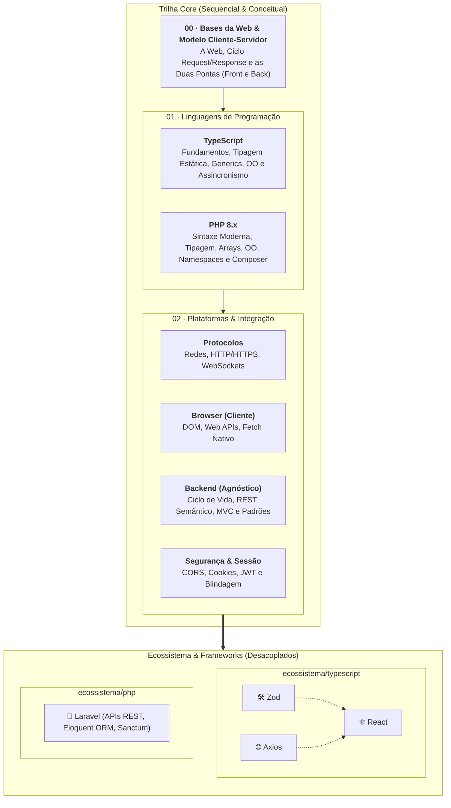

# 🌐 Desenvolvimento Web Fullstack Moderno (FATEC)

> Material didático aberto e autossuficiente para a formação em
> **Desenvolvimento Web Fullstack Moderno**, estruturado com foco em boas
> práticas da indústria, tipagem estática rigorosa com **TypeScript**, robustez
> no backend com **PHP 8.x & Laravel**, padrões nativos da plataforma web e
> bibliotecas modernas do ecossistema.

## 🎯 Sobre o Curso e Postura Pedagógica

Este repositório reúne todo o material instrucional do curso de
**Desenvolvimento Web** da **FATEC**. O conteúdo foi planejado para atender
turmas heterogêneas de graduação em tecnologia, proporcionando uma trilha de
aprendizado gradual, acolhedora e com profundidade técnica.

### 💡 Nossos Pilares Pedagógicos

1. **Didática Construtivista ("O Porquê antes do Como"):** Apresentamos sempre o
   problema e a dor real do desenvolvimento antes de introduzir novas sintaxes
   ou ferramentas.
2. **Conceito sobre a Ferramenta:** Dominamos os fundamentos da plataforma Web
   nativa (protocolos de rede, ciclo de vida de requisições, manipulação de
   eventos, arquitetura de backend e segurança) antes de adotar bibliotecas e
   frameworks de terceiros.
3. **Código Limpo e Padrões da Indústria:** Todos os identificadores de código
   são escritos em **inglês**, acompanhados de comentários explicativos e
   narrativa em **português**, com contraste visual claro entre abordagens
   frágeis (`// ❌`) e soluções idiomáticas (`// ✅`).
4. **Material Autossuficiente:** Cada capítulo é autocontido, ilustrado com
   diagramas visuais e tabelas comparativas, com aprofundamentos técnicos
   isolados em blocos expansíveis.

---

## 🗺️ Mapa da Trilha de Aprendizado

---

## 📚 Sumário Completo do Curso

### 📦 Módulo 00: Bases da Web & Modelo Cliente-Servidor ✅

_A fundação conceitual da Web: compreendendo a arquitetura distribuída, o ciclo
de vida de uma requisição e a divisão de papéis entre cliente e servidor._

- [01. Como a Web Funciona e o Modelo
  Cliente-Servidor](00-bases-da-web/01-como-a-web-funciona-e-o-modelo-cliente-servidor.md)
- [02. As Duas Pontas da Web: Frontend e
  Backend](00-bases-da-web/02-as-duas-pontas-da-web-frontend-e-backend.md)

---

### 📘 Módulo 01: Linguagens de Programação

#### 🔷 Trilha: TypeScript (`01-linguagens-de-programacao/typescript/`) ✅

_Um mergulho completo na linguagem TypeScript, desde a motivação da tipagem
estática e runtimes até recursos avançados de Generics, Orientação a Objetos e
Assincronismo._

##### Bloco 1: O Que É, Runtime & Setup

- [01. O Que É o TypeScript e Por Que Ele
  Existe?](01-linguagens-de-programacao/typescript/01-o-que-e-typescript-e-por-que-ele-existe.md)
- [02. O Que É um Runtime
  JavaScript?](01-linguagens-de-programacao/typescript/02-o-que-e-um-runtime-js.md)
- [03. Gerenciadores de Pacotes e o Ecossistema
  NPM](01-linguagens-de-programacao/typescript/03-gerenciadores-de-pacotes.md)
- [04. Instalação e Primeiro Programa em
  TypeScript](01-linguagens-de-programacao/typescript/04-instalacao-e-primeiro-programa.md)

##### Bloco 2: Fundamentos, Tipos & Memória

- [05. Tipos Primitivos e
  Especiais](01-linguagens-de-programacao/typescript/05-tipos-primitivos-e-especiais.md)
- [06. Strings e Template
  Literals](01-linguagens-de-programacao/typescript/06-string-e-template-literals.md)
- [07. Variáveis: `const`, `let` e o Fim do
  `var`](01-linguagens-de-programacao/typescript/07-variaveis.md)
- [08. Objetos
  Literais](01-linguagens-de-programacao/typescript/08-objetos-literais.md)
- [09. Tipos por Referência e Modelo de
  Memória](01-linguagens-de-programacao/typescript/09-tipos-por-referencia-e-memoria.md)
- [10. Type Aliases: Nomeando
  Contratos](01-linguagens-de-programacao/typescript/10-type-aliases.md)
- [11. Expressões e Operadores
  Modernos](01-linguagens-de-programacao/typescript/11-expressoes-e-operadores.md)
- [12. Estruturas
  Condicionais](01-linguagens-de-programacao/typescript/12-estruturas-condicionais.md)
- [13. Laços de
  Repetição](01-linguagens-de-programacao/typescript/13-lacos-de-repeticao.md)

##### Bloco 3: Funções, Escopo & Erros

- [14. Funções: Anatomia, Sintaxe e
  Contratos](01-linguagens-de-programacao/typescript/14-funcoes-anatomia-e-sintaxe.md)
- [15. Funções de Primeira Classe e
  Callbacks](01-linguagens-de-programacao/typescript/15-funcoes-de-primeira-classe.md)
- [16. Escopo, Cadeia Léxica e
  Sombreamento](01-linguagens-de-programacao/typescript/16-escopo-e-sombreamento.md)
- [17. Exceções e Tratamento de
  Erros](01-linguagens-de-programacao/typescript/17-excecoes-e-tratamento-de-erros.md)

##### Bloco 4: Coleções & Padrões Modernos

- [18. Arrays Tipados](01-linguagens-de-programacao/typescript/18-arrays.md)
- [19. Tuplas: Estruturas Heterogêneas
  Fixas](01-linguagens-de-programacao/typescript/19-tuplas.md)
- [20. Desestruturação de Arrays e
  Objetos](01-linguagens-de-programacao/typescript/20-desestruturacao-de-arrays-e-objetos.md)
- [21. Operadores Rest e
  Spread](01-linguagens-de-programacao/typescript/21-operadores-rest-e-spread.md)
- [22. Métodos Funcionais de
  Array](01-linguagens-de-programacao/typescript/22-metodos-funcionais-de-array.md)
- [23. Closures e Fábricas de
  Funções](01-linguagens-de-programacao/typescript/23-closures-e-fabricas-de-funcoes.md)
- [24. Coleções Nativas: Set e
  Map](01-linguagens-de-programacao/typescript/24-colecoes-set-e-map.md)

##### Bloco 5: Tipagem Avançada & Contratos

- [25. Interfaces: Modelagem de
  Contratos](01-linguagens-de-programacao/typescript/25-interfaces.md)
- [26. Tipagem Estrutural (Duck
  Typing)](01-linguagens-de-programacao/typescript/26-tipagem-estrutural-e-duck-typing.md)
- [27. Uniões Literais e Discriminated
  Unions](01-linguagens-de-programacao/typescript/27-unioes-literais-e-discriminated-unions.md)
- [28. Type Narrowing e Type
  Guards](01-linguagens-de-programacao/typescript/28-type-narrowing-e-type-guards.md)
- [29. Generics: Tipagem
  Parametrizada](01-linguagens-de-programacao/typescript/29-generics.md)
- [30. Tipos Utilitários
  Essenciais](01-linguagens-de-programacao/typescript/30-tipos-utilitarios.md)

##### Bloco 6: Módulos, Orientação a Objetos & Assincronismo

- [31. Sistema de Módulos (ES
  Modules)](01-linguagens-de-programacao/typescript/31-sistema-de-modulos.md)
- [32. O Paradigma Orientado a Objetos na
  Web](01-linguagens-de-programacao/typescript/32-o-paradigma-orientado-a-objetos-na-web.md)
- [33. Classes em
  TypeScript](01-linguagens-de-programacao/typescript/33-classes.md)
- [34. Modificadores de Acesso e
  Propriedades](01-linguagens-de-programacao/typescript/34-modificadores.md)
- [35. Herança e Sobrescrita de
  Métodos](01-linguagens-de-programacao/typescript/35-heranca-e-sobrescrita-de-metodos.md)
- [36. Classes Abstratas e Template
  Method](01-linguagens-de-programacao/typescript/36-classes-abstratas.md)
- [37. Programação Assíncrona: Promises e
  Async/Await](01-linguagens-de-programacao/typescript/37-programacao-assincrona.md)

---

#### 🐘 Trilha: PHP Moderno (`01-linguagens-de-programacao/php/`) ✅

_Uma formação completa em PHP 8.x Moderno para a Web: modelo de execução,
tipagem estática com strict_types, arrays e coleções, Orientação a Objetos
moderna (Constructor Property Promotion, Readonly, Traits, Enums, Atributos) e
ecossistema Composer._

##### Bloco 1: O Que É, Runtime & Execução

- [01. O Que É o PHP e o Modelo de Execução
  Web](01-linguagens-de-programacao/php/01-o-que-e-php-e-o-modelo-de-execucao-web.md)
- [02. Configuração do Ambiente PHP e
  CLI](01-linguagens-de-programacao/php/02-configuracao-do-ambiente-php-e-cli.md)

##### Bloco 2: Fundamentos, Tipos & Memória

- [03. Tipos Primitivos e Tipagem
  Estrita](01-linguagens-de-programacao/php/03-tipos-primitivos.md)
- [04. Strings e Interpolação de
  Texto](01-linguagens-de-programacao/php/04-strings-e-interpolacao.md)
- [05. Declaração de Variáveis e
  Constantes](01-linguagens-de-programacao/php/05-variaveis-e-constantes.md)
- [06. Atribuição por Valor vs
  Referência](01-linguagens-de-programacao/php/06-atribuicao-por-valor-e-referencia.md)
- [07. Operadores e
  Expressões](01-linguagens-de-programacao/php/07-operadores-e-expressoes.md)
- [08. Estruturas
  Condicionais](01-linguagens-de-programacao/php/08-estruturas-condicionais.md)
- [09. Expressões
  Match](01-linguagens-de-programacao/php/09-expressoes-match.md)
- [10. Estruturas de Repetição e
  Foreach](01-linguagens-de-programacao/php/10-estruturas-de-repeticao.md)

##### Bloco 3: Funções, Escopo & Erros

- [11. Declaração de Funções e
  Parâmetros](01-linguagens-de-programacao/php/11-declaracao-de-funcoes-e-parametros.md)
- [12. Funções de Primeira Classe e
  Callables](01-linguagens-de-programacao/php/12-funcoes-de-primeira-classe-e-callables.md)
- [13. Escopo de
  Variáveis](01-linguagens-de-programacao/php/13-escopo-de-variaveis.md)
- [14. Tratamento de Erros e
  Exceções](01-linguagens-de-programacao/php/14-tratamento-de-erros-e-excecoes.md)

##### Bloco 4: Coleções & Manipulação de Dados

- [15. Arrays Indexados e
  Associativos](01-linguagens-de-programacao/php/15-arrays-indexados-e-associativos.md)
- [16. Desestruturação e Operador
  Spread](01-linguagens-de-programacao/php/16-desestruturacao-e-operador-spread.md)
- [17. Closures e Fábricas de
  Funções](01-linguagens-de-programacao/php/17-closures-e-fabricas-de-funcoes.md)
- [18. Funções Nativas de Manipulação de
  Arrays](01-linguagens-de-programacao/php/18-funcoes-nativas-de-manipulacao-de-arrays.md)
- [19. Manipulação de JSON e
  Serialização](01-linguagens-de-programacao/php/19-manipulacao-de-json-e-serializacao.md)

##### Bloco 5: Orientação a Objetos Moderna (PHP 8+)

- [20. Classes e
  Objetos](01-linguagens-de-programacao/php/20-classes-e-objetos.md)
- [21. Modificadores de Acesso e
  Encapsulamento](01-linguagens-de-programacao/php/21-modificadores-de-acesso-e-encapsulamento.md)
- [22. Clonagem e Comparação de
  Objetos](01-linguagens-de-programacao/php/22-clonagem-e-comparacao-de-objetos.md)
- [23. Interfaces e
  Polimorfismo](01-linguagens-de-programacao/php/23-interfaces-e-polimorfismo.md)
- [24. Herança e Sobrescrita de
  Métodos](01-linguagens-de-programacao/php/24-heranca-e-sobrescrita-de-metodos.md)
- [25. Classes Abstratas e Modificador
  Final](01-linguagens-de-programacao/php/25-classes-abstratas-e-modificador-final.md)

##### Bloco 6: Web Nativa, Modularização & Composer

- [26. Superglobais e Ciclo de Vida da
  Requisição](01-linguagens-de-programacao/php/26-superglobais-e-ciclo-de-vida-da-requisicao.md)
- [27. Namespaces e PSR-4
  Autoloading](01-linguagens-de-programacao/php/27-namespaces-e-psr-4-autoloading.md)
- [28. Gerenciamento de Pacotes com
  Composer](01-linguagens-de-programacao/php/28-gerenciamento-de-pacotes-com-composer.md)

##### Bloco 7: Recursos Avançados de OO, Tipagem & Metaprogramação

- [29. Enums e Backed
  Enums](01-linguagens-de-programacao/php/29-enums-e-backed-enums.md)
- [30. Traits e Composição
  Horizontal](01-linguagens-de-programacao/php/30-traits-e-composicao-horizontal.md)
- [31. Métodos Mágicos](01-linguagens-de-programacao/php/31-metodos-magicos.md)
- [32. Atributos: Metadados
  Nativos](01-linguagens-de-programacao/php/32-atributos-metadados-nativos.md)

---

### 🌐 Módulo 02: Plataformas e Integração

#### 📡 Submódulo: Protocolos (`02-plataformas-e-integracao/protocolos/`) ✅

- [01. Fundamentos de Redes na
  Web](02-plataformas-e-integracao/protocolos/01-fundamentos-de-redes-na-web.md)
- [02. O Protocolo HTTP e
  HTTPS](02-plataformas-e-integracao/protocolos/02-o-protocolo-http-e-https.md)
- [03. WebSockets e Server-Sent Events
  (SSE)](02-plataformas-e-integracao/protocolos/03-websockets-e-sse.md)

#### 🖥️ Submódulo: Browser (`02-plataformas-e-integracao/browser/`) ✅

- **Manipulação do DOM (`manipulacao-do-dom/`):**
  - [01. A Árvore do DOM e o Processo de
    Renderização](02-plataformas-e-integracao/browser/manipulacao-do-dom/01-a-arvore-do-dom-e-renderizacao.md)
  - [02. Seleção e Manipulação com
    TypeScript](02-plataformas-e-integracao/browser/manipulacao-do-dom/02-selecao-e-manipulacao-com-typescript.md)
  - [03. Sistema de Eventos e
    Propagação](02-plataformas-e-integracao/browser/manipulacao-do-dom/03-sistema-de-eventos-e-propagacao.md)
  - [04. Introdução aos Web
    Components](02-plataformas-e-integracao/browser/manipulacao-do-dom/04-introducao-aos-web-components.md)
  - [05. Custom Elements e Ciclo de
    Vida](02-plataformas-e-integracao/browser/manipulacao-do-dom/05-custom-elements-e-ciclo-de-vida.md)
  - [06. Shadow DOM e
    Encapsulamento](02-plataformas-e-integracao/browser/manipulacao-do-dom/06-shadow-dom-e-encapsulamento.md)
  - [07. Templates e
    Slots](02-plataformas-e-integracao/browser/manipulacao-do-dom/07-templates-e-slots.md)
- **Catálogo de Web APIs (`web-apis/`):**
  - [01. O Que São Web
    APIs?](02-plataformas-e-integracao/browser/web-apis/01-o-que-sao-web-apis.md)
  - [Fetch API e Consumo Nativo de
    Dados](02-plataformas-e-integracao/browser/web-apis/fetch-api-e-consumo-nativo.md)
  - [Local Storage e Session
    Storage](02-plataformas-e-integracao/browser/web-apis/local-storage-e-session-storage.md)
  - [IndexedDB](02-plataformas-e-integracao/browser/web-apis/indexeddb.md)
  - [Geolocation
    API](02-plataformas-e-integracao/browser/web-apis/geolocation.md)
  - [Intersection
    Observer](02-plataformas-e-integracao/browser/web-apis/intersection-observer.md)
  - [Permissions
    API](02-plataformas-e-integracao/browser/web-apis/permissions.md)
  - [Notifications
    API](02-plataformas-e-integracao/browser/web-apis/notifications.md)

#### ⚙️ Submódulo: Backend Agnóstico (`02-plataformas-e-integracao/backend/`) ⚪

- **Fundamentos & Ciclo de Vida (`fundamentos-e-ciclo-de-vida/`):**
  - [01. O Ciclo de Vida de uma Requisição no
    Servidor](02-plataformas-e-integracao/backend/fundamentos-e-ciclo-de-vida/01-o-ciclo-de-vida-de-uma-requisicao-no-servidor.md)
  - [02. Middlewares e Pipeline de
    Execução](02-plataformas-e-integracao/backend/fundamentos-e-ciclo-de-vida/02-middlewares-e-pipeline-de-execucao.md)
    _(⚪ Planejado)_
- **Design & Arquitetura de APIs (`design-e-arquitetura-de-apis/`):**
  - [01. Design de APIs e REST
    Semântico](02-plataformas-e-integracao/backend/design-e-arquitetura-de-apis/01-design-de-apis-e-rest-semantico.md)
    _(⚪ Planejado)_
  - [02. Panorama de Padrões de API: REST vs GraphQL vs gRPC vs
    SOAP](02-plataformas-e-integracao/backend/design-e-arquitetura-de-apis/02-panorama-de-padroes-de-api.md)
    _(⚪ Planejado)_
  - [03. Contratos, Versionamento e
    Paginação](02-plataformas-e-integracao/backend/design-e-arquitetura-de-apis/03-contratos-versionamento-e-paginacao.md)
    _(⚪ Planejado)_
- **Padrões de Arquitetura (`padroes-de-arquitetura/`):**
  - [01. O Padrão MVC no Contexto de
    APIs](02-plataformas-e-integracao/backend/padroes-de-arquitetura/01-o-padrao-mvc-no-contexto-de-apis.md)
    _(⚪ Planejado)_
  - [02. Arquitetura em Camadas: Controllers, Services e
    Repositories](02-plataformas-e-integracao/backend/padroes-de-arquitetura/02-arquitetura-em-camadas-controllers-services-repositories.md)
    _(⚪ Planejado)_
  - [03. DTOs e Transferência de
    Dados](02-plataformas-e-integracao/backend/padroes-de-arquitetura/03-dtos-e-transferencia-de-dados.md)
    _(⚪ Planejado)_

#### 🔒 Submódulo: Segurança & Sessão (`02-plataformas-e-integracao/seguranca-e-sessao/`) ✅

- [01. Same-Origin Policy (SOP) e
  CORS](02-plataformas-e-integracao/seguranca-e-sessao/01-same-origin-policy-e-cors.md)
- [02. Métodos de Persistência de
  Sessão](02-plataformas-e-integracao/seguranca-e-sessao/02-metodos-de-persistencia-de-sessao.md)
- [03. Armazenamento de Tokens e Segurança no
  Frontend](02-plataformas-e-integracao/seguranca-e-sessao/03-armazenamento-de-tokens-e-seguranca-no-frontend.md)

---

### 🧩 Módulo Ecossistema

#### 🔷 Eixo TypeScript (`ecossistema/typescript/`)

- **Zod (`zod/`):**
  - [01. O Problema do Runtime e Introdução ao
    Zod](ecossistema/typescript/zod/01-o-problema-do-runtime-e-introducao-ao-zod.md)
  - [02. Schemas Primitivos, Validações e
    Coerção](ecossistema/typescript/zod/02-schemas-primitivos-validacoes-e-coercao.md)
  - [03. Objetos, Arrays e Inferência de
    Tipos](ecossistema/typescript/zod/03-objetos-arrays-e-inferencia-de-tipos.md)
  - [04. Unions, Enums e Discriminated
    Unions](ecossistema/typescript/zod/04-unions-enums-e-discriminated-unions.md)
  - [05. Refinamentos e
    Transformações](ecossistema/typescript/zod/05-refinamentos-e-transformacoes.md)
  - [06. Tratamento de Erros e Casos
    Reais](ecossistema/typescript/zod/06-tratamento-de-erros-e-casos-reais.md)
- **Axios (`axios/`):**
  - [01. Introdução ao Axios vs Fetch
    Nativo](ecossistema/typescript/axios/01-introducao-ao-axios-vs-fetch.md)
  - [02. Métodos HTTP, Query Params e
    Tipagem](ecossistema/typescript/axios/02-metodos-http-query-params-e-tipagem.md)
  - [03. Instâncias Customizadas e Configurações
    Globais](ecossistema/typescript/axios/03-instancias-customizadas-e-configuracoes.md)
  - [04. Tratamento de Erros e
    Exceções](ecossistema/typescript/axios/04-tratamento-de-erros-e-excecoes.md)
  - [05. Interceptors de Requisição e
    Resposta](ecossistema/typescript/axios/05-interceptors-de-requisicao-e-resposta.md)
- **React (`react/`):**
  - [01. O Que É o React e o Paradigma
    Declarativo](ecossistema/typescript/react/01-o-que-e-react-e-o-paradigma-declarativo.md)
  - [02. Ponto de Entrada, Vite e
    Componentes](ecossistema/typescript/react/02-o-ponto-de-entrada-e-componentes.md)
  - [03. Conteúdo e Atributos Dinâmicos no
    JSX](ecossistema/typescript/react/03-conteudo-e-atributos-dinamicos-no-jsx.md)
  - [04. Eventos no React](ecossistema/typescript/react/04-eventos-no-react.md)
  - [05. Estado e Reatividade com
    useState](ecossistema/typescript/react/05-estado-e-reatividade-com-usestate.md)

#### 🐘 Eixo PHP: Laravel (`ecossistema/php/laravel/`) ⚪

- **Base & Arquitetura:**
  - [01. Introdução ao Laravel e Arquitetura do
    Framework](ecossistema/php/laravel/01-introducao-ao-laravel-e-arquitetura.md)
    _(⚪ Planejado)_
  - [02. O Padrão MVC no Laravel para
    APIs](ecossistema/php/laravel/02-o-padrao-mvc-no-laravel.md) _(⚪ Planejado)_
- **Rotas & Controllers (`rotas-e-controllers/`):**
  - [01. Definição de Rotas de
    API](ecossistema/php/laravel/rotas-e-controllers/01-definicao-de-rotas-de-api.md)
    _(⚪ Planejado)_
  - [02. Controllers e Métodos de
    Ação](ecossistema/php/laravel/rotas-e-controllers/02-controllers-e-metodos.md)
    _(⚪ Planejado)_
  - [03. Form Requests e
    Validação](ecossistema/php/laravel/rotas-e-controllers/03-form-requests-e-validacao.md)
    _(⚪ Planejado)_
  - [04. API Resources e Transformação de
    Respostas](ecossistema/php/laravel/rotas-e-controllers/04-api-resources-e-transformacao-de-respostas.md)
    _(⚪ Planejado)_
- **ORM & Banco de Dados (`orm-e-banco-de-dados/`):**
  - [01. Migrations e Versionamento de Banco de
    Dados](ecossistema/php/laravel/orm-e-banco-de-dados/01-migrations-e-esquemas-de-banco.md)
    _(⚪ Planejado)_
  - [02. Eloquent ORM e Modelos de
    Domínio](ecossistema/php/laravel/orm-e-banco-de-dados/02-eloquent-orm-e-modelos.md)
    _(⚪ Planejado)_
  - [03. Relacionamentos no
    Eloquent](ecossistema/php/laravel/orm-e-banco-de-dados/03-relacionamentos-no-eloquent.md)
    _(⚪ Planejado)_
  - [04. Seeders e Factories para Povoamento de
    Dados](ecossistema/php/laravel/orm-e-banco-de-dados/04-seeders-e-factories-para-testes.md)
    _(⚪ Planejado)_
- **Segurança & Middlewares (`seguranca-e-middlewares/`):**
  - [01. Middlewares Customizados no
    Pipeline](ecossistema/php/laravel/seguranca-e-middlewares/01-middlewares-customizados.md)
    _(⚪ Planejado)_
  - [02. Autenticação Stateless de APIs com Laravel
    Sanctum](ecossistema/php/laravel/seguranca-e-middlewares/02-autenticacao-de-apis-com-sanctum.md)
    _(⚪ Planejado)_

---

## 📄 Licença

Este material é distribuído sob a licença [MIT](LICENSE).
