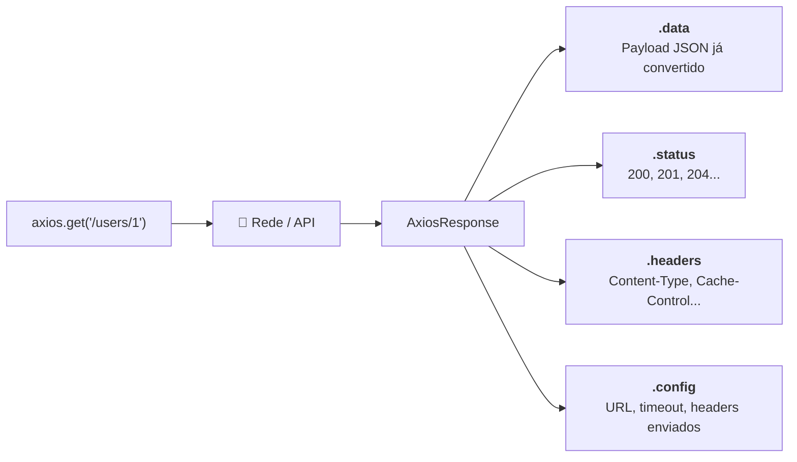

# 01. Introdução ao Axios vs. Fetch Nativo

No **Módulo 02 (Comunicação & Protocolos)**, aprendemos como a Web se comunica
por meio do protocolo HTTP e vimos como realizar requisições nativas com a
função `fetch()`.

O `fetch()` é uma API fantástica e embutida nos navegadores modernos e runtimes
recentes (Node.js 18+). No entanto, à medida que construímos aplicações frontend
de médio e grande porte, o consumo direto de `fetch()` revela uma quantidade
considerável de código repetitivo e armadilhas sutis.

Neste capítulo, você compreenderá as limitações do `fetch()` em escala,
conhecerá o **Axios**, dominará a anatomia dos seus métodos HTTP e entenderá por
que ele continua sendo uma das bibliotecas mais utilizadas na história da Web.

## A Dor: As Limitações do `fetch()` no Dia a Dia

Para entender por que o Axios existe e por que milhões de equipes o adotam,
vamos analisar uma operação comum de envio de dados (`POST`) usando `fetch()`
nativo:

```typescript
// ❌ Consumo com fetch nativo: prolixo e com armadilhas manuais
async function createUser(userData: { name: string; email: string }) {
  try {
    const response = await fetch("https://api.example.com/users", {
      method: "POST",
      headers: {
        "Content-Type": "application/json", // 1. Obrigatório lembrar de definir manualmente
      },
      body: JSON.stringify(userData), // 2. Obrigatório serializar para texto manualmente
    });

    // 3. A ARMADILHA: fetch() NÃO rejeita a Promise em status 400, 404 ou 500!
    if (!response.ok) {
      throw new Error(`Erro HTTP: ${response.status}`);
    }

    // 4. Obrigatório fazer o parse manual da resposta
    const data = await response.json();
    return data;
  } catch (error) {
    console.error("Falha ao criar usuário:", error);
  }
}
```

Observe os 4 problemas fundamentais:

1. **Serialização Manual:** Você é obrigado a chamar `JSON.stringify(body)` em
   cada requisição `POST` ou `PUT`;
2. **Cabeçalhos Repetitivos:** É necessário informar explicitamente
   `"Content-Type": "application/json"` repetidas vezes;
3. **A Pegadinha do `response.ok`:** O `fetch()` **não lança erros** quando o
   backend responde com status `400 Bad Request`, `401 Unauthorized` ou `500 Internal Server Error`.
   Ele só entra no bloco `catch` se houver falha total de rede (computador
   offline, queda de DNS ou bloqueio de CORS). Se o desenvolvedor esquecer de
   checar `if (!response.ok)`, a aplicação processará a resposta de erro como se
   fosse um dado de sucesso!
4. **Duplo `await`:** Você precisa de um `await` para a conexão HTTP (`fetch`) e
   outro `await` para ler o corpo (`response.json()`).

## A Solução: O Que é o Axios?

O **Axios** é um cliente HTTP isomórfico baseado em Promises projetado para
simplificar a comunicação de rede tanto no navegador quanto no Node.js.

Ao reescrever o mesmo exemplo anterior com Axios:

```typescript
import axios from "axios";

// ✅ Consumo com Axios: conciso, direto e com tratamento automático
async function createUser(userData: { name: string; email: string }) {
  try {
    // 1. Serializa o objeto JS para JSON automaticamente
    // 2. Define Content-Type: application/json automaticamente
    // 3. Rejeita a Promise automaticamente se o status for 4xx ou 5xx
    // 4. Faz o parse automático do JSON retornado em response.data
    const response = await axios.post(
      "https://api.example.com/users",
      userData,
    );

    return response.data;
  } catch (error) {
    // Erros HTTP (400, 401, 404, 500) caem automaticamente aqui!
    console.error("Falha ao criar usuário:", error);
  }
}
```

## Instalação e Setup

Para instalar o Axios no seu projeto, execute:

```bash
npm install axios
```

O Axios já inclui todas as suas definições de tipos TypeScript nativamente no
pacote, dispensando a instalação de pacotes adicionais como `@types/axios`.

## Anatomia dos Métodos HTTP

O Axios fornece métodos convenientes com nomes diretos para todos os verbos HTTP
fundamentais:

```typescript
import axios from "axios";

// 1. GET: Buscar recursos (recebe URL e objeto de configuração opcional)
const getUsersResponse = await axios.get("https://api.example.com/users");

// 2. POST: Criar recurso (recebe URL, corpo de dados e configuração opcional)
const postResponse = await axios.post("https://api.example.com/users", {
  name: "Alice",
  email: "alice@fatec.sp.gov.br",
});

// 3. PUT: Substituir recurso integralmente
const putResponse = await axios.put("https://api.example.com/users/1", {
  name: "Alice Silva",
  email: "alice.silva@fatec.sp.gov.br",
});

// 4. PATCH: Atualizar parcialmente um recurso
const patchResponse = await axios.patch("https://api.example.com/users/1", {
  name: "Alice S.",
});

// 5. DELETE: Remover recurso
const deleteResponse = await axios.delete("https://api.example.com/users/1");
```

## A Estrutura do Objeto `AxiosResponse<T>`

Quando uma requisição é concluída com sucesso (códigos de status HTTP na faixa
`2xx`), o Axios resolve a Promise entregando um objeto com a interface
**`AxiosResponse`**:

```typescript
import axios from "axios";

const response = await axios.get("https://api.example.com/users/1");

console.log(response.data); // O payload JSON retornado pela API (já convertido em objeto JS)
console.log(response.status); // Código de status HTTP numérico (ex: 200, 201)
console.log(response.statusText); // Mensagem de status do servidor (ex: "OK", "Created")
console.log(response.headers); // Cabeçalhos HTTP enviados pelo servidor
console.log(response.config); // Objeto de configuração original utilizado na requisição
```



## Tabela Comparativa: `fetch()` vs. `axios`

| Recurso / Comportamento                      |                  `fetch()` Nativo                  |                     `axios`                      |
| :------------------------------------------- | :------------------------------------------------: | :----------------------------------------------: |
| **Instalação**                               |        Nativa (Embutida no runtime/browser)        |            Exige `npm install axios`             |
| **Serialização de Envio (POST/PUT)**         |         Manual (`JSON.stringify(payload)`)         |       **Automática** (Envia objeto direto)       |
| **Desserialização de Resposta**              |          Manual (`await response.json()`)          |         **Automática** (`response.data`)         |
| **Rejeição em Erros HTTP (4xx / 5xx)**       | ❌ **Não** (Exige checagem de `if (!response.ok)`) |  **Sim** (Cai automaticamente no bloco `catch`)  |
| **Interceptors (Middlewares de Requisição)** |   ❌ **Não** (Exige wrappers manuais complexos)    |        **Nativo** (`axios.interceptors`)         |
| **Instâncias Customizadas com `baseURL`**    |   ❌ **Não** (Repetição da URL em cada chamada)    |     **Nativo** (`axios.create({ baseURL })`)     |
| **Suporte Nativo a Timeout de Conexão**      | ❌ **Complexo** (Requer `AbortController` + timer) | **Simples** (Basta passar `timeout: 5000` em ms) |
| **Monitoramento de Upload de Arquivos**      |  ❌ **Não suportado** no modelo de streams padrão  |      **Sim** (Callback `onUploadProgress`)       |

## O Que Vem a Seguir?

Neste capítulo introdutório, compreendemos a motivação do Axios, a anatomia das
chamadas e a estrutura de respostas.

No próximo capítulo, aprenderemos a criar **Instâncias Customizadas
(`axios.create`)**, centralizar configurações de `baseURL`, definir limites de
`timeout` e gerenciar múltiplos serviços de backend de forma profissional.

---

<a href="../zod/06-tratamento-de-erros-e-casos-reais.md">← Zod: Tratamento de
Erros e Casos Reais</a>

<p align="right"><a href="02-instancias-customizadas-e-configuracoes.md">Próximo: Instâncias Customizadas e Configurações →</a></p>
