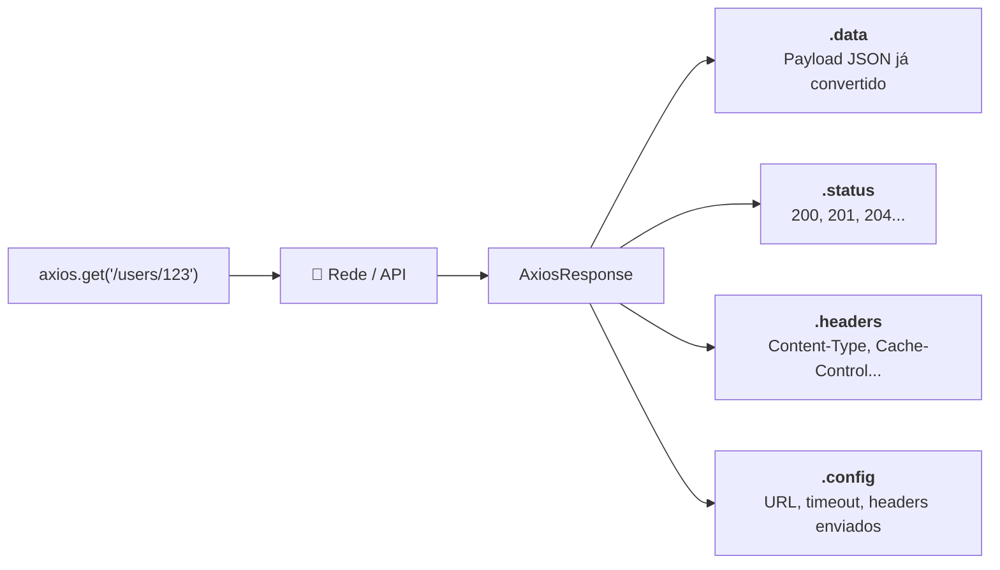
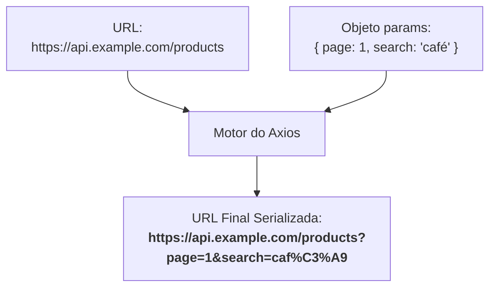

# Métodos HTTP, Query Params e Tipagem

No capítulo anterior, compreendemos a motivação do Axios e as vantagens da
serialização e desserialização automática em comparação ao `fetch()` nativo. No
dia a dia do desenvolvimento, interagimos com APIs REST realizando operações
completas de CRUD (_Create, Read, Update, Delete_), inspecionando respostas,
enviando filtros de busca e garantindo contratos de dados consistentes com
TypeScript.

Neste capítulo, aprenderemos a utilizar todos os métodos HTTP do Axios,
compreender a anatomia do objeto de resposta `AxiosResponse`, manipular
parâmetros de consulta (_query strings_) de forma segura com `params` e tipar
requisições e respostas usando **Generics** do TypeScript.

## Catálogo de Métodos HTTP

O Axios fornece métodos específicos para cada verbo do protocolo HTTP. Eles são
divididos em duas categorias principais de acordo com a sua assinatura:

### 1. Métodos sem Corpo de Dados (`GET` e `DELETE`)

Os métodos `get` e `delete` recebem apenas a URL e um objeto de configuração
opcional:

- `axios.get(url, config)`
- `axios.delete(url, config)`

```typescript
import axios from "axios";

// 1. GET: Buscar uma lista de recursos ou um item por ID
const usersResponse = await axios.get("https://api.example.com/users");
console.log(usersResponse.data);

// 2. DELETE: Remover um recurso existente
const deleteResponse = await axios.delete("https://api.example.com/users/123");
console.log(`Status da remoção: ${deleteResponse.status}`); // 204 No Content ou 200 OK
```

### 2. Métodos com Corpo de Dados (`POST`, `PUT` e `PATCH`)

Os métodos de envio e alteração de recursos recebem a URL, o **corpo de dados
(_payload_)** como segundo argumento, e o objeto de configuração opcional como
terceiro argumento:

- `axios.post(url, data, config)`
- `axios.put(url, data, config)`
- `axios.patch(url, data, config)`

```typescript
import axios from "axios";

// 1. POST: Criar um novo recurso no servidor
const createResponse = await axios.post("https://api.example.com/users", {
  name: "Alice Silva",
  email: "alice@fatec.sp.gov.br",
});

// 2. PUT: Substituir o recurso por completo
const putResponse = await axios.put("https://api.example.com/users/123", {
  name: "Alice Santos Silva",
  email: "alice.silva@fatec.sp.gov.br",
  role: "admin",
});

// 3. PATCH: Atualizar apenas propriedades específicas do recurso
const patchResponse = await axios.patch("https://api.example.com/users/123", {
  role: "superadmin",
});
```

## A Estrutura do Objeto `AxiosResponse<T>`

Quando qualquer um desses métodos é concluído com sucesso (código de status na
faixa `2xx`), o Axios resolve a Promise entregando um objeto com a interface
**`AxiosResponse`**:

```typescript
import axios from "axios";

const response = await axios.get("https://api.example.com/users/123");

console.log(response.data); // O payload JSON retornado pela API (já convertido em objeto JS)
console.log(response.status); // Código de status HTTP numérico (ex: 200, 201)
console.log(response.statusText); // Mensagem de status do servidor (ex: "OK", "Created")
console.log(response.headers); // Cabeçalhos HTTP enviados pelo servidor
console.log(response.config); // Objeto de configuração original utilizado na requisição
```



## Manipulação de Query Parameters com `params`

Frequentemente precisamos enviar parâmetros de consulta na URL para operações de
listagem, paginação, busca e filtros (ex:
`/products?page=2&limit=10&search=teclado`).

Concatenar strings manualmente para construir URLs é propenso a falhas de
sintaxe e exige codificação manual de caracteres especiais
(`encodeURIComponent`). Com a propriedade `params`, o Axios monta a query string
de forma automática:

```typescript
// ❌ Concatenação manual: propensa a erros de formatação e encoding
const page = 2;
const search = "café com leite";
const url = `https://api.example.com/products?page=${page}&search=${encodeURIComponent(search)}`;
await axios.get(url);

// ✅ Uso limpo da propriedade 'params' do Axios
interface ProductFilters {
  page: number;
  limit: number;
  search?: string;
  inStock?: boolean;
}

async function searchProducts(filters: ProductFilters) {
  const response = await axios.get("https://api.example.com/products", {
    params: filters,
  });

  return response.data;
}

// Execução: o Axios converte para:
// https://api.example.com/products?page=1&limit=20&search=caf%C3%A9%20com%20leite&inStock=true
searchProducts({
  page: 1,
  limit: 20,
  search: "café com leite",
  inStock: true,
});
```



<details>
<summary>🔍 Aprofundamento: Serialização de Arrays em Query Strings (<code>paramsSerializer</code>)</summary>

Diferentes frameworks de backend interpretam arrays na URL de maneiras
distintas:

- Formato de repetição: `?tags=javascript&tags=typescript`
- Formato de colchetes: `?tags[]=javascript&tags[]=typescript`
- Formato separado por vírgula: `?tags=javascript,typescript`

Por padrão nas versões recentes, o Axios utiliza o formato de colchetes. Caso
sua API backend exija outro formato, você pode customizar o `paramsSerializer`
nas configurações:

```typescript
import axios from "axios";

await axios.get("https://api.example.com/catalog", {
  params: { tags: ["typescript", "javascript"] },
  paramsSerializer: {
    indexes: null, // Produz: ?tags=typescript&tags=javascript
  },
});
```

</details>

## Tipagem Estrita com Generics

O TypeScript nos permite parametrizar chamadas do Axios usando **Generics**,
definindo com precisão o tipo esperado em `response.data`.

### 1. Tipando o Retorno de Consultas (`GET`)

Ao chamar `axios.get<T>()`, você define o tipo do DTO (_Data Transfer Object_)
que a Promise entregará em `response.data`:

```typescript
interface User {
  id: string;
  name: string;
  email: string;
  role: "admin" | "member";
  createdAt: string;
}

// response.data é automaticamente inferido como User
const response = await axios.get<User>("https://api.example.com/users/123");
console.log(response.data.name); // ✅ TypeScript valida e autocompleta as propriedades
```

### 2. Tipando Operações de Criação e Atualização (`POST` / `PUT`)

Ao disparar mutações com payload, você também pode tipar tanto a resposta
retornada quanto o corpo enviado:

```typescript
interface CreateProductInput {
  title: string;
  price: number;
  category: string;
}

interface ProductResponse {
  id: string;
  title: string;
  price: number;
  category: string;
  createdAt: string;
}

async function createProduct(
  payload: CreateProductInput,
): Promise<ProductResponse> {
  const response = await axios.post<ProductResponse>(
    "https://api.example.com/products",
    payload,
  );
  return response.data;
}
```

<details>
<summary>🛡️ Aprofundamento: Tipagem Segura de Respostas com Validação de Runtime (Zod)</summary>

Generics no Axios oferecem suporte excelente para autocompletar e validação
estática em tempo de desenvolvimento. Contudo, como aprendemos no módulo do
TypeScript, **tipos estáticos são eliminados durante a compilação e não existem
no navegador**.

Se o backend alterar o contrato em produção ou retornar campos nulos
inesperados, um generic ingênuo como `axios.get<User>()` pode ocultar
inconsistências e gerar falhas silenciosas na interface.

Para sistemas com alta exigência de confiabilidade, a prática recomendada na
comunidade moderna é combinar o Axios com bibliotecas de validação em tempo de
execução, como o **Zod**:

```typescript
import axios from "axios";
import { z } from "zod";

// 1. Schema em tempo de execução
const UserSchema = z.object({
  id: z.string(),
  name: z.string(),
  email: z.email(),
  role: z.enum(["admin", "member"]),
});

type User = z.infer<typeof UserSchema>;

async function fetchSafeUser(id: string): Promise<User> {
  const response = await axios.get(`https://api.example.com/users/${id}`);

  // 2. Valida o payload real recebido da rede antes de repassar para a aplicação
  return UserSchema.parse(response.data);
}
```

Para aprofundar em schemas, refinamentos e inferência de tipos em runtime,
consulte o módulo dedicado ao
[Zod](../zod/01-o-problema-do-runtime-e-introducao-ao-zod.md).

</details>

## O Que Vem a Seguir?

Até agora, realizamos chamadas informando a URL completa em cada requisição.
Conforme a aplicação cresce, duplicar URLs base e cabeçalhos em dezenas de
arquivos torna-se inviável.

No próximo capítulo, aprenderemos a criar **Instâncias Customizadas
(`axios.create`)**, definir configurações globais de `baseURL` e `timeout`, e
gerenciar múltiplos serviços de backend de forma profissional.

---

<a href="01-introducao-ao-axios-vs-fetch.md">← Anterior: Introdução ao Axios vs.
Fetch Nativo</a>

<p align="right"><a href="03-instancias-customizadas-e-configuracoes.md">Próximo: Instâncias Customizadas e Configurações →</a></p>
