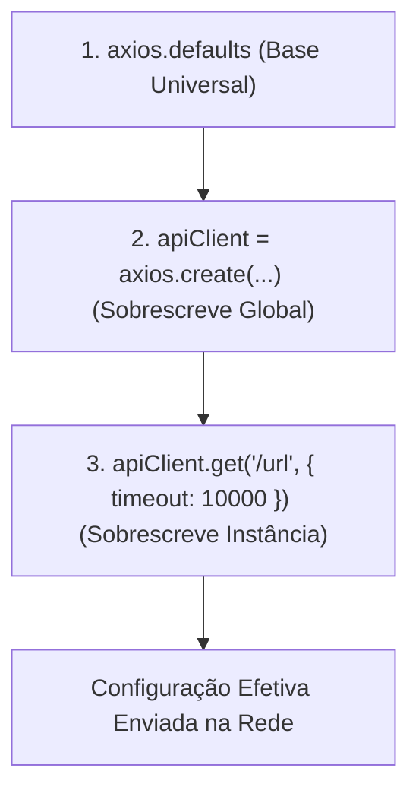

# Instâncias Customizadas e Configurações

No capítulo anterior, aprendemos como executar operações HTTP com o Axios,
manipular parâmetros de consulta e tipar contratos de dados. No entanto, em
aplicações reais, raramente fazemos chamadas passando URLs completas e
configurações repetidas em dezenas de arquivos diferentes.

Neste capítulo, aprenderemos a criar **instâncias customizadas** com
`axios.create()`, definir configurações padrão como `baseURL`, `timeout` e
cabeçalhos compartilhados, entender a ordem de precedência de configurações e
gerenciar múltiplos serviços de backend de forma isolada e profissional.

## O Problema: A Dor da Repetição de Configurações

Imagine que sua aplicação consome uma API REST hospedada em
`https://api.loja.com/v1`. Se você utilizar o objeto global `axios` diretamente
em cada componente ou função do seu sistema, o código começará a se parecer com
isto:

```typescript
// ❌ Abordagem frágil: repetição de URLs base, timeouts e headers em toda chamada
import axios from "axios";

async function fetchProducts() {
  return await axios.get("https://api.loja.com/v1/products", {
    timeout: 5000,
    headers: {
      Accept: "application/json",
      "X-App-Version": "2.4.0",
    },
  });
}

async function fetchUserOrders(userId: string) {
  return await axios.get(`https://api.loja.com/v1/users/${userId}/orders`, {
    timeout: 5000,
    headers: {
      Accept: "application/json",
      "X-App-Version": "2.4.0",
    },
  });
}
```

Essa abordagem traz problemas severos para a manutenção do software:

1. **Acoplamento com a URL:** Se o domínio mudar ou a versão da API for
   atualizada de `/v1` para `/v2`, você terá que alterar dezenas de arquivos
   manualmente.
2. **Duplicação de Regras de Transporte:** Configurações como tempo limite de
   resposta (_timeout_) e cabeçalhos de identificação da aplicação precisam ser
   copiados e colados em cada requisição.
3. **Impossibilidade de Isolamento:** Se sua aplicação consumir duas APIs
   diferentes (por exemplo, a API do seu backend e uma API externa de
   pagamentos), você não consegue gerenciar as particularidades de cada uma de
   forma limpa.

## A Solução: Criando Instâncias com `axios.create()`

O Axios oferece a função `axios.create()`, que funciona como uma **fábrica de
clientes HTTP**. Ela instancia um novo cliente Axios contendo configurações
pré-definidas que serão aplicadas a todas as requisições disparadas por ele.

```typescript
// ✅ Solução profissional: criando um cliente HTTP centralizado e reutilizável
import axios from "axios";

export const apiClient = axios.create({
  baseURL: "https://api.loja.com/v1",
  timeout: 5000, // Tempo limite de 5 segundos
  headers: {
    Accept: "application/json",
    "X-App-Version": "2.4.0",
  },
});
```

Agora, as chamadas nos seus arquivos de serviço tornam-se extremamente concisas,
utilizando caminhos relativos:

```typescript
import { apiClient } from "./apiClient";

async function fetchProducts() {
  // A requisição será enviada para: https://api.loja.com/v1/products
  const response = await apiClient.get("/products");
  return response.data;
}

async function fetchUserOrders(userId: string) {
  // A requisição será enviada para: https://api.loja.com/v1/users/usr_123/orders
  const response = await apiClient.get(`/users/${userId}/orders`);
  return response.data;
}
```

<details>
<summary>💡 Dica Arquitetural: Onde instanciar e exportar seus clientes de API?</summary>

Em projetos frontend (como React, Vue ou Angular) ou backends em
Node.js/Express, a melhor prática é manter a criação de instâncias em um arquivo
de infraestrutura centralizado (frequentemente nomeado `src/services/api.ts`,
`src/lib/api.ts` ou `src/infra/http.ts`).

Dessa forma, suas funções de negócio, hooks ou controladores apenas importam a
instância configurada, sem nunca precisarem conhecer URLs de ambiente ou
detalhes de transporte.

</details>

## Anatomia das Opções de Configuração

Ao criar instâncias ou executar requisições no Axios, passamos um objeto de
configuração do tipo `AxiosRequestConfig`. As propriedades mais comuns e
importantes são:

| Propriedade      | Tipo                          | Descrição                                                                                                               |
| :--------------- | :---------------------------- | :---------------------------------------------------------------------------------------------------------------------- |
| `baseURL`        | `string`                      | Prefixo da URL. É concatenado automaticamente ao caminho relativo fornecido na requisição.                              |
| `timeout`        | `number`                      | Tempo máximo (em milissegundos) que a requisição pode demorar antes de ser abortada com um erro de timeout.             |
| `headers`        | `Record<string, string>`      | Objeto de cabeçalhos HTTP que serão enviados junto da requisição.                                                       |
| `params`         | `Record<string, any>`         | Objeto com parâmetros que o Axios converte automaticamente em _Query Strings_ na URL (`?chave=valor`).                  |
| `responseType`   | `ResponseType`                | Tipo de dado esperado na resposta (`'json'`, `'text'`, `'blob'`, `'arraybuffer'`, `'document'`). O padrão é `'json'`.   |
| `validateStatus` | `(status: number) => boolean` | Função que determina se um status HTTP deve resolver ou rejeitar a Promise. O padrão rejeita qualquer status $\ge 300$. |

### Configuração de `timeout` (Prevenção de Requisições Travadas)

Por padrão no `fetch()` nativo, se um servidor backend travar e nunca responder,
a requisição pode ficar pendurada indefinidamente até o navegador decidir
abortá-la.

No Axios, definir `timeout` garante que sua aplicação falhe rápido (_fail-fast_)
e possa exibir uma mensagem amigável ao usuário caso a rede ou o servidor
estejam instáveis:

```typescript
const paymentClient = axios.create({
  baseURL: "https://api.gateway.com",
  timeout: 3000, // Aborta automaticamente se demorar mais de 3 segundos
});
```

## Ordem de Precedência de Configurações

O Axios aplica uma lógica de mesclagem em cascata (_cascade merge_) para
determinar a configuração final de cada requisição.

A precedência segue a seguinte ordem (do menor para o maior poder de
sobrescrita):

1. **Defaults Globais da Biblioteca (`axios.defaults`):** Configurações
   universais padrão do pacote.
2. **Defaults da Instância (`apiClient.defaults`):** Configurações passadas no
   momento de `axios.create({ ... })`.
3. **Configurações Específicas da Chamada:** Opções passadas como argumento na
   execução do método (`apiClient.get('/path', config)`).



Veja na prática como uma configuração pontual pode sobrescrever o padrão da
instância:

```typescript
import axios from "axios";

const client = axios.create({
  baseURL: "https://api.empresa.com/v1",
  timeout: 5000,
  headers: {
    "Content-Type": "application/json",
  },
});

// Nesta chamada, o timeout padrão de 5s é mantido
await client.get("/relatorio-rapido");

// Nesta chamada específica, precisamos de mais tempo (ex: geração pesada de PDF)
// O timeout de 30s sobrescreve os 5s apenas para esta requisição:
await client.get("/relatorio-pesado-pdf", {
  timeout: 30000,
  responseType: "blob", // Sobrescreve o responseType padrão 'json'
});
```

## Múltiplas Instâncias: Conectando a Múltiplos Serviços

Em sistemas modernos, é muito comum o frontend ou a aplicação Node.js se
comunicar simultaneamente com mais de um serviço. Cada serviço pode exigir URLs
base distintas, cabeçalhos de autenticação diferentes ou timeouts específicos.

Ao invés de poluir uma configuração global, criamos instâncias isoladas:

```typescript
import axios from "axios";

// Instância para o Backend Principal da Aplicação
export const coreApi = axios.create({
  baseURL: "https://api.meusistema.com/v1",
  timeout: 8000,
});

// Instância para o Microsserviço de Pagamentos (com chave de API externa)
export const paymentGatewayApi = axios.create({
  baseURL: "https://gateway.pagamentos.com/api",
  timeout: 15000,
  headers: {
    "X-Merchant-Key": "sec_live_9988776655",
  },
});

// Instância para API Pública de CEPs / Endereços
export const viacepApi = axios.create({
  baseURL: "https://viacep.com.br/ws",
  timeout: 3000,
});
```

```typescript
// Exemplo de uso conjunto sem qualquer conflito de cabeçalhos ou URLs
async function checkoutOrder(orderId: string, merchantToken: string) {
  // 1. Busca os detalhes do pedido no nosso backend
  const { data: order } = await coreApi.get(`/orders/${orderId}`);

  // 2. Dispara a transação no gateway externo
  const { data: paymentResult } = await paymentGatewayApi.post("/charges", {
    amount: order.totalAmount,
    currency: "BRL",
  });

  return paymentResult;
}
```

## O Que Vem a Seguir?

Agora que dominamos a criação e configuração de instâncias reutilizáveis,
precisamos aprender como o Axios lida com falhas.

No próximo capítulo, exploraremos a fundo o **Tratamento de Erros e Exceções**,
aprendendo a utilizar a classe `AxiosError` e o _type guard_
`axios.isAxiosError()`.

---

<a href="02-metodos-http-query-params-e-tipagem.md">← Anterior: Métodos HTTP,
Query Params e Tipagem</a>

<p align="right"><a href="04-tratamento-de-erros-e-excecoes.md">Próximo: Tratamento de Erros e Exceções →</a></p>
