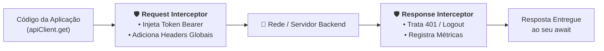

# Interceptors de Requisição e Resposta

Em aplicações profissionais, certas regras de comunicação precisam ser
executadas em quase todas as requisições: injetar tokens de autenticação
(`Authorization: Bearer ...`), registrar logs de auditoria e performance,
formatar erros do backend ou redirecionar o usuário automaticamente quando a
sessão expirar (`401 Unauthorized`).

Repetir essa lógica manualmente em cada função de serviço geraria código
duplicado, frágil e difícil de manter. Para resolver isso, o Axios oferece o
conceito de **Interceptors** (_interceptadores_), que funcionam como
_middlewares_ posicionados na entrada e na saída do cliente HTTP.

Neste capítulo, aprenderemos como funcionam os interceptors de requisição e de
resposta, como injetar tokens dinamicamente, como capturar falhas de forma
centralizada e como remover (_ejetar_) interceptors quando necessário.

## O Que São Interceptors?

Um interceptor é uma função que você registra no cliente Axios para "atravessar"
a requisição ou a resposta no momento exato em que ela transita entre o seu
código e a rede.

Existem dois tipos fundamentais de interceptors:

1. **Request Interceptor (Interceptador de Requisição):** Executado **antes**
   que os dados saiam do cliente rumo à rede. Permite inspecionar e alterar as
   configurações da requisição (como adicionar cabeçalhos, parâmetros de busca
   ou metadados de telemetria).
2. **Response Interceptor (Interceptador de Resposta):** Executado **assim que a
   resposta chega da rede**, antes de ser entregue à função que chamou o Axios
   (`await apiClient.get(...)`). Permite inspecionar a resposta de sucesso ou
   capturar e tratar erros globais.



## Interceptor de Requisição (Request Interceptor)

O caso de uso mais popular do interceptor de requisição é a **injeção dinâmica
de tokens de autenticação**. Ao invés de passar o token manualmente em cada
chamada, o interceptor lê o token mais recente armazenado e o anexa ao cabeçalho
`Authorization`.

### Sintaxe e Anatomia

A função `apiClient.interceptors.request.use()` aceita dois callbacks:

- `onFulfilled`: recebe o objeto de configuração (`InternalAxiosRequestConfig`)
  e **deve retorná-lo** (ou retornar uma Promise que resolve a configuração).
- `onRejected`: recebe eventuais erros ocorridos antes do disparo da requisição.

```typescript
// src/services/apiClient.ts
import axios, { InternalAxiosRequestConfig } from "axios";

export const apiClient = axios.create({
  baseURL: "https://api.empresa.com/v1",
  timeout: 10000,
});

// Registrando o Interceptor de Requisição
apiClient.interceptors.request.use(
  (config: InternalAxiosRequestConfig) => {
    // 1. Obtém o token dinamicamente (ex: de uma função de sessão ou storage)
    const token = getStoredAuthToken();

    // 2. Se o token existir, injeta no cabeçalho Authorization
    if (token && config.headers) {
      config.headers.Authorization = `Bearer ${token}`;
    }

    // 3. Adiciona um timestamp para auditoria/métricas
    config.headers["X-Request-Started-At"] = Date.now().toString();

    // ⚠️ REGRA DE OURO: Sempre retorne o objeto 'config' modificado
    return config;
  },
  (error) => {
    // Tratamento de falha pré-disparo (raro)
    return Promise.reject(error);
  },
);

function getStoredAuthToken(): string | null {
  // Exemplo de leitura de token (em navegadores ou memória)
  return localStorage.getItem("auth_token");
}
```

Agora, qualquer chamada disparada por essa instância incluirá o token
automaticamente:

```typescript
// O cabeçalho Authorization: Bearer <token> é anexado automaticamente nos bastidores!
const userOrders = await apiClient.get("/orders");
```

## Interceptor de Resposta (Response Interceptor)

O interceptor de resposta permite monitorar tanto o caminho feliz (status $2xx$)
quanto o caminho de erro (status fora de $2xx$ ou falhas de rede).

### Sintaxe e Anatomia

A função `apiClient.interceptors.response.use()` aceita dois callbacks:

- `onFulfilled`: recebe a resposta bem-sucedida (`AxiosResponse`) e **deve
  retorná-la** (ou retornar os dados modificados).
- `onRejected`: recebe o `AxiosError` quando a requisição falha. É o local ideal
  para capturar sessões expiradas (`401`) ou exibir alertas globais.

```typescript
import axios, { AxiosResponse } from "axios";
import { apiClient } from "./apiClient";

apiClient.interceptors.response.use(
  // 1. Caminho de Sucesso (Status 2xx)
  (response: AxiosResponse) => {
    // Exemplo: calcular o tempo total da requisição
    const startedAt = Number(response.config.headers["X-Request-Started-At"]);
    if (startedAt) {
      const durationMs = Date.now() - startedAt;
      console.log(
        `[HTTP ${response.status}] ${response.config.url} respondeu em ${durationMs}ms`,
      );
    }

    // Sempre retorne o objeto de resposta para a chamada original
    return response;
  },

  // 2. Caminho de Erro (Status fora de 2xx ou falhas de rede)
  (error) => {
    if (axios.isAxiosError(error)) {
      const status = error.response?.status;

      if (status === 401) {
        console.warn(
          "Sessão expirada detectada pelo Interceptor. Limpando credenciais...",
        );
        localStorage.removeItem("auth_token");

        // Redireciona o usuário para a tela de autenticação
        window.location.href = "/login";
      } else if (status === 503) {
        console.error("Servidor em manutenção temporária.");
      }
    }

    // ⚠️ REGRA DE OURO: Sempre repasse o erro com Promise.reject(error)
    // para que o bloco try/catch da função chamadora ainda possa reagir se necessário
    return Promise.reject(error);
  },
);
```

## Removendo Interceptors com `eject()`

Cada vez que você chama `interceptors.request.use()` ou
`interceptors.response.use()`, o Axios retorna um identificador numérico (_ID_).
Caso você precise desativar um interceptor em tempo de execução (muito comum em
testes automatizados ou durante a desmontagem de módulos dinâmicos), utilize o
método `eject()`:

```typescript
import { apiClient } from "./apiClient";

// 1. Registra o interceptor e guarda seu ID único
const loggerInterceptorId = apiClient.interceptors.request.use((config) => {
  console.log(`Disparando requisição para: ${config.url}`);
  return config;
});

// 2. Quando o interceptor não for mais necessário (ex: fim de um teste ou desmonte):
apiClient.interceptors.request.eject(loggerInterceptorId);
```

## Boas Práticas e Cuidados com Interceptors

1. **Nunca Esqueça de Retornar o `config` ou `response`:** Se você esquecer de
   dar `return config` no interceptor de requisição, a chamada travará
   silenciosamente e nunca sairá da máquina.
2. **Sempre Retorne `Promise.reject(error)` no Callback de Erro:** Se você
   apenas tratar o erro e não retornar `Promise.reject(error)`, o Axios
   considerará que o erro foi "resolvido" com sucesso e entregará um valor
   `undefined` no `.then()` da chamada original.
3. **Mantenha os Interceptors Focados em Infraestrutura:** Interceptors são
   ótimos para telemetria, autenticação e renovação de tokens. Evite colocar
   regras de negócio complexas específicas de uma única tela dentro de um
   interceptor global.

---

<a href="03-tratamento-de-erros-e-tipagem.md">← Anterior: Tratamento de Erros e
Tipagem</a>
