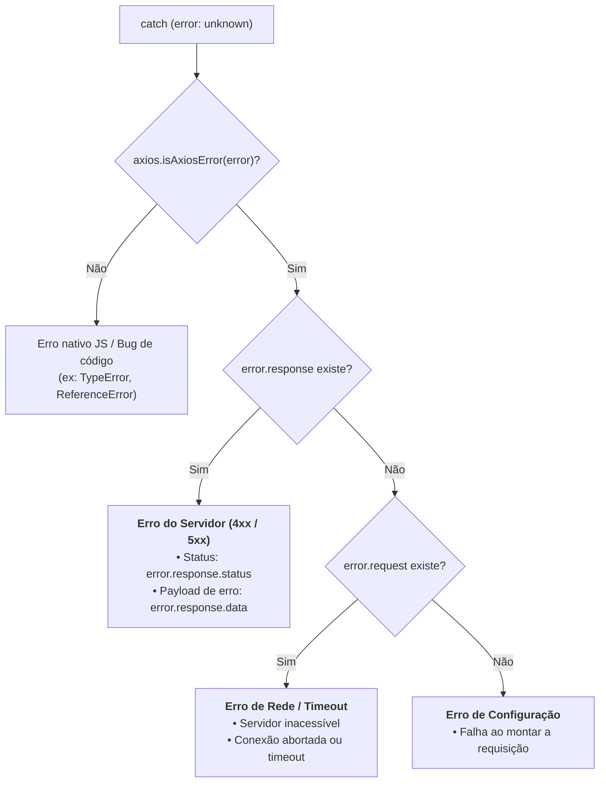

# Tratamento de Erros e Exceções

Ao realizar requisições HTTP, falhas são inevitáveis: o servidor pode retornar
um erro de validação (`422 Unprocessable Entity`), uma rota pode não existir
(`404 Not Found`), o usuário pode estar sem conexão de rede ou a requisição pode
ultrapassar o limite de tempo estipulado (_timeout_).

Neste capítulo, aprenderemos como o Axios lida com o ciclo de vida de exceções,
como dissecar a anatomia do objeto `AxiosError` com o _type guard_
`axios.isAxiosError()` e como tipar contratos de erro retornados pelo backend.

## O Modelo de Falhas do Axios vs. Fetch Nativo

Uma das principais dores do `fetch()` nativo é que ele **não rejeita a Promise**
quando a API responde com status de erro HTTP (como `401`, `404` ou `500`). Ele
apenas rejeita se houver uma falha de rede catastrófica (como perda total de
conexão ou bloqueio de CORS).

No Axios, o comportamento é intuitivo e segue o padrão da indústria: **qualquer
código de status fora da faixa 2xx rejeita a Promise automaticamente**,
desviando o fluxo de execução para o bloco `catch`:

```typescript
// ❌ Com fetch: você é obrigado a lembrar de testar res.ok manualmente
try {
  const response = await fetch("/api/users/999");
  if (!response.ok) {
    throw new Error(`Erro HTTP: ${response.status}`);
  }
  const data = await response.json();
} catch (error) {
  // Lida com o erro
}

// ✅ Com Axios: status 4xx e 5xx caem automaticamente no catch
try {
  const response = await apiClient.get("/users/999");
  console.log("Sucesso:", response.data);
} catch (error: unknown) {
  // Executado para 400, 401, 403, 404, 500, timeout, falta de rede, etc.
  console.error("Falha na requisição");
}
```

## Os 3 Cenários de Falha no Bloco `catch`

Quando uma requisição falha no Axios, o objeto capturado no bloco `catch` pode
representar três cenários fundamentalmente diferentes:

1. **Erro de Resposta do Servidor (`error.response`):** A requisição chegou ao
   servidor e o servidor respondeu com um código de erro (status $4xx$ ou
   $5xx$). O corpo da resposta com detalhes do erro está disponível em
   `error.response.data`.
2. **Erro de Conexão ou Rede (`error.request`):** A requisição foi disparada
   pelo cliente, mas nenhuma resposta foi recebida (queda de internet, servidor
   fora do ar, bloqueio de CORS ou estouro de _timeout_).
3. **Erro de Configuração Local (`error.message`):** Ocorreu um erro antes mesmo
   da requisição sair da máquina (por exemplo, erro de sintaxe na configuração
   ou objeto inválido).



## O Type Guard `axios.isAxiosError()`

Como no TypeScript moderno toda cláusula `catch` recebe `error` do tipo
`unknown` (conforme estudamos no Módulo 01), precisamos de uma forma segura de
fazer o afunilamento de tipo (_type narrowing_).

O Axios fornece o utilitário nativo `axios.isAxiosError()`, que atua como um
_Type Guard_ garantindo ao compilador que a variável é uma instância de
`AxiosError`:

```typescript
import axios, { AxiosError } from "axios";
import { apiClient } from "./apiClient";

// Contrato do payload de erro padronizado retornado pelo backend
interface ApiErrorPayload {
  message: string;
  errorCode: string;
  fieldErrors?: Record<string, string[]>;
}

async function loadUserProfile(userId: string) {
  try {
    const response = await apiClient.get(`/users/${userId}`);
    return response.data;
  } catch (error: unknown) {
    // 1. Verificamos se o erro foi originado pelo Axios
    if (axios.isAxiosError<ApiErrorPayload>(error)) {
      if (error.response) {
        // O servidor respondeu com status fora de 2xx
        const status = error.response.status;
        const apiError = error.response.data; // Fortemente tipado como ApiErrorPayload

        if (status === 404) {
          console.warn("Usuário não encontrado no banco de dados.");
        } else if (status === 401) {
          console.warn("Sessão expirada. Redirecionando para login...");
        } else {
          console.error(
            `Erro da API [${apiError.errorCode}]: ${apiError.message}`,
          );
        }
      } else if (error.request) {
        // A requisição foi feita, mas não houve resposta (queda de rede ou timeout)
        if (error.code === "ECONNABORTED") {
          console.error(
            "A requisição demorou muito e foi cancelada (Timeout).",
          );
        } else {
          console.error(
            "Servidor inacessível. Verifique sua conexão com a internet.",
          );
        }
      } else {
        // Erro na montagem da requisição
        console.error("Erro de configuração:", error.message);
      }
    } else {
      // Erro Javascript comum e não relacionado à rede (ex: bug de código)
      console.error("Erro inesperado na aplicação:", error);
    }

    throw error;
  }
}
```

### Principais Propriedades do `AxiosError`

| Propriedade             | Tipo                              | Descrição                                                                                |
| :---------------------- | :-------------------------------- | :--------------------------------------------------------------------------------------- |
| `error.response`        | `AxiosResponse<T>` \| `undefined` | Objeto contendo `status`, `data` e `headers` retornados pelo servidor.                   |
| `error.response.status` | `number`                          | Código HTTP retornado (ex: `400`, `401`, `403`, `404`, `500`).                           |
| `error.response.data`   | `T` (Generic)                     | O corpo da resposta de erro enviado pelo backend (geralmente um JSON).                   |
| `error.code`            | `string` \| `undefined`           | Código de erro padronizado (ex: `'ECONNABORTED'`, `'ERR_NETWORK'`, `'ERR_BAD_REQUEST'`). |
| `error.message`         | `string`                          | Descrição textual da falha (ex: `"Request failed with status code 404"`).                |
| `error.config`          | `InternalAxiosRequestConfig`      | A configuração original utilizada para disparar a requisição.                            |

## O Que Vem a Seguir?

Até agora, tratamos cada chamada e erro de forma pontual nos nossos serviços. No
entanto, em aplicações de grande porte, tratar tokens de autenticação ou exibir
notificações de erro repetidamente em cada função de API viola o princípio de
responsabilidade única.

No próximo capítulo, aprenderemos sobre **Interceptors de Requisição e
Resposta**, o poderoso mecanismo de _middlewares_ do Axios para injetar
cabeçalhos de autenticação dinamicamente e centralizar o tratamento de erros em
um único ponto da arquitetura.

---

<a href="03-instancias-customizadas-e-configuracoes.md">← Anterior: Instâncias
Customizadas e Configurações</a>

<p align="right"><a href="05-interceptors-de-requisicao-e-resposta.md">Próximo: Interceptors de Requisição e Resposta →</a></p>
