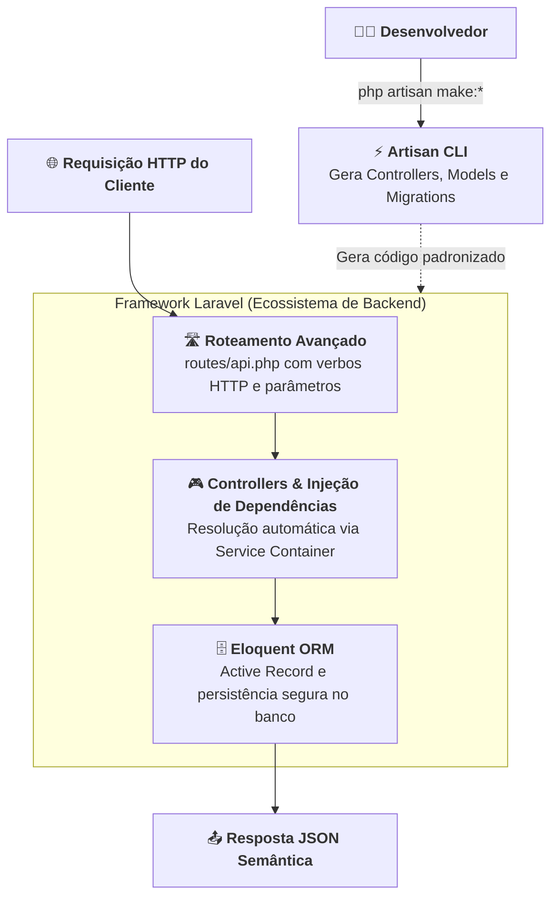

# 01. Introdução ao Laravel, Arquitetura e Artisan

Ao longo do **Módulo 01**, dominamos a evolução profunda do **PHP 8 moderno**:
seu sistema de tipos estrito, classes imutáveis, enums, atributos, tratamento
elegante de exceções e a governança de dependências via **Composer** com o
padrão de carregamento PSR-4. No **Módulo 02**, desvendamos como a plataforma
Web realmente opera por baixo dos panos: o ciclo de vida das requisições HTTP no
servidor, o pipeline de middlewares, o design de APIs RESTful e a separação de
responsabilidades em camadas (Controllers, Services e Repositories).

Munidos dessa base sólida de engenharia, surge uma questão inevitável:

> _"Se já dominamos a linguagem e os padrões de arquitetura, como os times de
> engenharia constroem backends profissionais e escaláveis sem ter que
> reinventar a roda do zero a cada novo projeto?"_

No ecossistema profissional de PHP, a resposta consolidada pela indústria é o
**Laravel**.

Neste capítulo, você compreenderá que dor estrutural os frameworks modernos
resolvem, como o Laravel organiza sua arquitetura de pastas na versão **11.x**,
o gerenciamento seguro de variáveis de ambiente com o arquivo **`.env`** e,
acima de tudo, o papel central do **Artisan** — a interface de linha de comando
que transforma a produtividade do desenvolvedor.

## A Dor: O Custo de Construir Tudo do Zero em PHP Puro

Imagine que você foi encarregado de criar uma API REST para um sistema de
e-commerce utilizando apenas PHP puro nativo. Para colocar o primeiro endpoint
no ar com um padrão minimamente profissional, você precisará:

1. **Escrever um Roteador Manual:** Processar a superglobal
   `$_SERVER['REQUEST_URI']`, tratar verbos HTTP (`GET`, `POST`, `PUT`,
   `DELETE`) e escrever expressões regulares complexas para capturar parâmetros
   dinâmicos de rota (como `/products/{id}`);
2. **Gerenciar Conexões com Banco de Dados:** Criar uma instância de `PDO`
   manualmente, configurar charset, modo de erros (`ERRMODE_EXCEPTION`) e
   injetar essa conexão manualmente em cada script que precisar consultar
   tabelas;
3. **Controlar Variáveis de Ambiente:** Escrever um parser para ler arquivos
   `.env` ou expor senhas e credenciais diretamente no código-fonte;
4. **Criar Código Repetitivo (Boilerplate) Manualmente:** Toda vez que precisar
   de uma nova classe de domínio, repositório ou controlador, você precisará
   criar o arquivo em disco, digitar manualmente as tags `<?php`, declarar o
   `namespace` PSR-4 sem errar nenhuma barra invertida e configurar suas
   dependências.

Veja como seria o arquivo de inicialização de uma API construída do zero:

```php
<?php
// ❌ CÓDIGO PROBLEMÁTICO / ARTESANAL: Gerenciamento manual, frágil e repetitivo
declare(strict_types=1);

// 1. Carregamento manual de variáveis de ambiente
$dbHost = getenv('DB_HOST') ?: '127.0.0.1';
$dbUser = getenv('DB_USER') ?: 'root';
$dbPass = getenv('DB_PASS') ?: 'secret';
$dbName = getenv('DB_NAME') ?: 'shop';

// 2. Conexão manual e propensa a falhas não tratadas
try {
    $pdo = new PDO("mysql:host={$dbHost};dbname={$dbName};charset=utf8mb4", $dbUser, $dbPass, [
        PDO::ATTR_ERRMODE => PDO::ERRMODE_EXCEPTION,
        PDO::ATTR_DEFAULT_FETCH_MODE => PDO::FETCH_ASSOC,
    ]);
} catch (PDOException $e) {
    http_response_code(500);
    echo json_encode(['error' => 'Database connection failed']);
    exit;
}

// 3. Roteamento primitivo baseado em strings e superglobais
$path = parse_url($_SERVER['REQUEST_URI'], PHP_URL_PATH);
$method = $_SERVER['REQUEST_METHOD'];

if ($method === 'GET' && $path === '/products') {
    $stmt = $pdo->query("SELECT id, name, price FROM products");
    header('Content-Type: application/json');
    echo json_encode($stmt->fetchAll());
    exit;
}

http_response_code(404);
echo json_encode(['error' => 'Route not found']);
```

Essa abordagem artesanal apresenta sérios problemas para equipes de
desenvolvimento:

- **Fragilidade Extrema:** Qualquer ajuste nas rotas ou credenciais exige
  alterações diretas no código de inicialização;
- **Falta de Padronização:** Cada desenvolvedor do time organiza pastas, nomes
  de classes e conexões do seu próprio jeito;
- **Alto Tempo Gasto com Infraestrutura:** Horas preciosas de engenharia são
  desperdiçadas configurando encanamento de código em vez de construir as regras
  de negócio reais da empresa.

## O Que É o Laravel?

O **Laravel** é um framework web open-source de altíssimo nível para PHP, criado
por Taylor Otwell em 2011. Sua filosofia central é maximizar a **Developer
Experience (DX)** — proporcionando uma sintaxe expressiva, limpa e elegante, sem
sacrificar robustez, escalabilidade e rigor técnico.

Em vez de obrigar o desenvolvedor a decidir onde colocar cada classe ou como
plugar o roteamento, o Laravel opera sob o princípio da **Convenção sobre
Configuração** (_Convention over Configuration_): ele estabelece um padrão
arquitetural consagrado pela indústria e já entrega toda a infraestrutura pronta
para uso:



No desenvolvimento de APIs REST modernas, o Laravel brilha ao fornecer:

1. **Roteamento Semântico e Declarativo:** Mapeamento fluente de endpoints e
   verbos HTTP;
2. **Eloquent ORM:** Mapeamento objeto-relacional completo que substitui SQL cru
   por métodos orientados a objetos;
3. **Injeção de Dependências Automática:** O próprio framework resolve e
   instancia classes no construtor dos seus controladores;
4. **Artisan CLI:** Um gerador de código que elimina o trabalho manual e tedioso
   de criar arquivos.

## Anatomia de um Projeto Laravel 11

Ao criar um novo projeto Laravel (utilizando o comando `composer create-project
laravel/laravel minha-api`), uma estrutura de pastas organizada e enxuta é
criada.

Na versão **11.x**, o Laravel passou por uma importante modernização, removendo
pastas e arquivos desnecessários para deixar o projeto focado exclusivamente no
código que você realmente precisa escrever:

```text
minha-api/
├── app/                      (O coração da sua aplicação)
│   ├── Http/
│   │   └── Controllers/      (Controladores que atendem às requisições)
│   └── Models/               (Classes de domínio e modelos Eloquent)
├── bootstrap/
│   └── app.php               (Configuração central de roteamento, middlewares e exceções)
├── config/                   (Arquivos de configuração do sistema: banco, cache, logs)
├── database/
│   ├── factories/            (Fábricas de dados fictícios para testes)
│   ├── migrations/           (Controle de versão do esquema do banco de dados)
│   └── seeders/              (Povoadores de dados iniciais para o banco)
├── public/
│   └── index.php             (Único ponto de entrada do servidor web HTTP)
├── routes/
│   ├── api.php               (Definição de rotas REST da sua API)
│   ├── console.php           (Comandos customizados de terminal)
│   └── web.php               (Rotas tradicionais com renderização de páginas)
├── storage/                  (Logs do sistema, uploads e arquivos temporários)
├── .env                      (Configurações de ambiente e credenciais locais)
├── .env.example              (Modelo de variáveis de ambiente para a equipe)
└── composer.json             (Dependências PHP e regras de autoload PSR-4)
```

### O que você precisa saber sobre as pastas principais:

- **`app/Models/`:** Onde residirão suas classes de negócio (como `Product.php`,
  `User.php`, `Order.php`). Elas herdam do Eloquent ORM e representam suas
  tabelas no banco de dados.
- **`app/Http/Controllers/`:** Onde ficam os controladores. Eles recebem as
  requisições HTTP, consultam os Models e devolvem respostas formatadas em JSON.
- **`bootstrap/app.php`:** No Laravel 11, este arquivo unifica e simplifica o
  registro de rotas, middlewares globais e tratamento de erros, eliminando a
  complexidade dos antigos arquivos `Kernel.php`.
- **`database/migrations/`:** Contém o histórico de evolução do seu banco de
  dados escrito em PHP fluente, garantindo que qualquer desenvolvedor da equipe
  recrie as tabelas com um único comando.

## O Arquivo `.env`: Gestão Segura de Configurações

Uma regra fundamental de segurança em desenvolvimento web é: **nunca armazene
senhas, chaves de API ou configurações de ambiente dentro do código-fonte
versionado no Git**.

O Laravel resolve isso utilizando o padrão de variáveis de ambiente no arquivo
**`.env`** localizado na raiz do projeto:

```ini
APP_NAME=LojaVirtual
APP_ENV=local
APP_KEY=base64:exemploDeChaveCriptograficaGeradaPeloArtisan=
APP_DEBUG=true
APP_URL=http://localhost:8000

DB_CONNECTION=sqlite
# Para usar MySQL ou PostgreSQL, descomente e ajuste os valores:
# DB_CONNECTION=mysql
# DB_HOST=127.0.0.1
# DB_PORT=3306
# DB_DATABASE=loja_virtual
# DB_USERNAME=root
# DB_PASSWORD=minha_senha_segura
```

### O papel do `.env.example`:

- O arquivo `.env` contém credenciais reais do seu computador e **está listado
  no `.gitignore`**, impedindo que senhas vazem para repositórios públicos.
- O arquivo `.env.example` serve como **molde** documentando quais variáveis o
  projeto necessita, sem incluir valores confidenciais. Quando um novo membro da
  equipe clona o projeto, basta copiar o molde (`cp .env.example .env`) e
  preencher seus dados locais.

## O Coração da Produtividade: A CLI Artisan

O **Artisan** é a interface de linha de comando embutida no Laravel. Ele fornece
dezenas de utilitários prontos para executar tarefas repetitivas, rodar
servidores, inspecionar rotas e gerar esqueletos de código (_scaffolding_) de
forma padronizada.

Para visualizar todos os comandos disponíveis no seu projeto, basta executar na
raiz do projeto:

```bash
php artisan
```

### 1. Inicializando o Servidor Local de Desenvolvimento

Não é necessário configurar Apache ou Nginx durante o aprendizado. O Artisan
possui um comando integrado que inicia o servidor embutido do PHP apontando para
o diretório seguro `public/`:

```bash
php artisan serve
```

O terminal exibirá:

```text
  INFO  Server running on [http://127.0.0.1:8000].
  Press Ctrl+C to stop the server
```

### 2. A Mágica do Scaffolding com os Comandos `make:*`

A grande virtude do Artisan para desenvolvedores é eliminar o trabalho braçal de
criar arquivos manualmente.

Veja a comparação entre a abordagem manual e o uso do Artisan:

```bash
# ❌ ABORDAGEM MANUAL (Propensa a erros)
# 1. Abrir o editor de código
# 2. Navegar até app/Models/
# 3. Criar arquivo Product.php
# 4. Digitar <?php, namespace App\Models;, use Illuminate\Database\Eloquent\Model;
# 5. Criar a classe e torcer para não errar maiúsculas/minúsculas
```

```bash
# ✅ ABORDAGEM ARTISAN: Rápida, padronizada e sem erros de namespace
php artisan make:model Product
```

Ao executar o comando acima, o Laravel gera instantaneamente a classe completa
com os imports corretos:

```php
<?php

namespace App\Models;

use Illuminate\Database\Eloquent\Model;

class Product extends Model
{
    //
}
```

Podemos utilizar os comandos `make:` para gerar praticamente qualquer artefato
do sistema:

```bash
# Cria um controlador de API pronto com métodos REST (index, store, show, update, destroy)
php artisan make:controller ProductController --api

# Cria um arquivo de migração para versionamento de tabela no banco
php artisan make:migration create_products_table

# Cria uma fábrica de dados falsos para testes
php artisan make:factory ProductFactory

# Cria um seeder para popular o banco de dados
php artisan make:seeder ProductSeeder
```

### 3. O Laboratório Interativo: `php artisan tinker`

O **Tinker** é um ambiente REPL (_Read-Eval-Print Loop_) interativo que carrega
todo o ecossistema do Laravel no terminal. Ele permite testar códigos PHP,
consultar dados de Models e executar métodos em tempo real sem precisar abrir o
navegador ou disparar requisições HTTP:

```bash
php artisan tinker
```

Dentro do terminal interativo:

```php
> $name = "Teclado Mecânico";
= "Teclado Mecânico"

> App\Models\Product::count();
= 0

> exit
```

## Tabela de Comandos Artisan Mais Utilizados

| Comando                       | Finalidade Prática                                                        | Exemplo de Uso                                        |
| :---------------------------- | :------------------------------------------------------------------------ | :---------------------------------------------------- |
| `php artisan serve`           | Inicia o servidor local de desenvolvimento na porta 8000                  | `php artisan serve`                                   |
| `php artisan list`            | Lista todos os comandos disponíveis no framework e pacotes                | `php artisan list`                                    |
| `php artisan make:model`      | Cria uma nova classe de Modelo Eloquent em `app/Models/`                  | `php artisan make:model Product`                      |
| `php artisan make:controller` | Cria um controlador HTTP estruturado em `app/Http/Controllers/`           | `php artisan make:controller ProductController --api` |
| `php artisan make:migration`  | Cria um novo arquivo de migração em `database/migrations/`                | `php artisan make:migration create_products_table`    |
| `php artisan migrate`         | Executa todas as migrações pendentes no banco de dados                    | `php artisan migrate`                                 |
| `php artisan db:seed`         | Executa os seeders para povoar o banco com dados de teste                 | `php artisan db:seed`                                 |
| `php artisan tinker`          | Abre o terminal interativo para testar código com o contexto da aplicação | `php artisan tinker`                                  |
| `php artisan route:list`      | Exibe a tabela com todas as rotas e métodos registrados na aplicação      | `php artisan route:list --path=api`                   |

> **Regra de Ouro:**
>
> **Nunca crie classes do Laravel (Models, Controllers, Migrations) manualmente
> pelo explorador de arquivos do editor.**
>
> Sempre prefira os comandos `php artisan make:*`. Eles garantem que o arquivo
> seja gerado no diretório exato, com o namespace PSR-4 correto e herdando as
> classes base obrigatórias do framework, evitando erros silenciosos de
> carregamento.

<details>
<summary>🔍 Aprofundamento Técnico: Como o Artisan funciona por baixo dos panos?</summary>

Se você inspecionar o arquivo executável `artisan` que fica na raiz do seu
projeto Laravel, verá que ele é um script PHP surpreendentemente simples de
poucas linhas:

```php
#!/usr/bin/env php
<?php

define('LARAVEL_START', microtime(true));

// Carrega o autoloader PSR-4 do Composer
require __DIR__.'/vendor/autoload.php';

// Inicializa a aplicação Laravel e resolve o Kernel de Console
$app = require_once __DIR__.'/bootstrap/app.php';

$status = $app->handleCommand(new Symfony\Component\Console\Input\ArgvInput);

exit($status);
```

Por baixo dos panos, o Artisan é construído sobre o consagrado componente
**Symfony Console** (`symfony/console`). Quando você digita `php artisan
make:model Product`:

1. O script `artisan` carrega o autoloader do Composer (`vendor/autoload.php`);
2. Ele inicializa o **Service Container** do Laravel através de
   `bootstrap/app.php`;
3. O comando correspondente é identificado e executado;
4. No caso dos comandos geradores (`make:*`), o Laravel lê modelos de código em
   texto puro chamados **Stubs** (localizados internamente no framework),
   substitui os marcadores de posição (como `DummyClass` e `DummyNamespace`)
   pelos valores fornecidos e grava o arquivo final no disco.

Essa arquitetura garante que a linha de comando tenha exatamente o mesmo acesso
aos bancos de dados, modelos e configurações que o servidor web HTTP possui.

</details>

## O Que Vem a Seguir?

Agora que compreendemos o que é o Laravel, como suas pastas estão organizadas e
como utilizar o **Artisan** para acelerar nosso fluxo de trabalho, precisamos
entender a arquitetura conceitual que conecta tudo isso:

> _"Como o padrão MVC (Model-View-Controller) funciona na prática quando estamos
> desenvolvendo APIs REST no Laravel?"_

No **[Capítulo 02: O Padrão MVC no Laravel para
APIs](02-o-padrao-mvc-no-laravel.md)**, vamos dissecar o ciclo completo de uma
requisição HTTP moderna — desde a chegada da requisição no arquivo de rotas até
o processamento pelo Controller, interação com o Model e a entrega da resposta
em JSON.

---

<p align="right"><a href="02-o-padrao-mvc-no-laravel.md">Próximo: O Padrão MVC no Laravel para APIs →</a></p>
