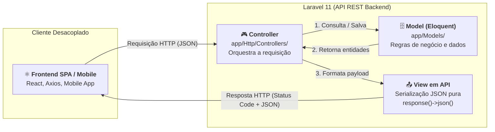
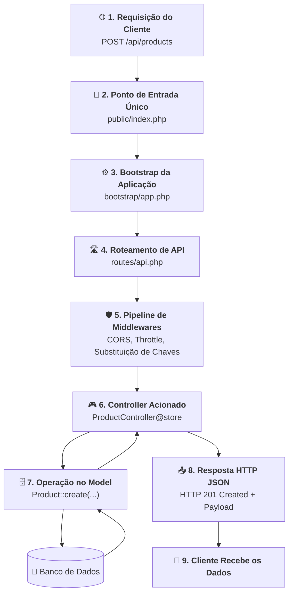

# 02. O Padrão MVC no Laravel para APIs

No **[Capítulo 01: Introdução ao Laravel, Arquitetura e
Artisan](01-introducao-ao-laravel-e-arquitetura.md)**, compreendemos o propósito
de um framework moderno, exploramos a estrutura de diretórios do **Laravel 11**,
configuramos variáveis de ambiente com o arquivo `.env` e descobrimos o poder de
scaffolding da CLI **Artisan**.

No entanto, antes de começarmos a criar tabelas e manipular dados, precisamos
alinhar um modelo mental fundamental de arquitetura: **como o padrão MVC
(Model-View-Controller) funciona quando construímos APIs REST modernas no
Laravel?**

No **Módulo 02**, estudamos a essência teórica do MVC e aprendemos que, no
ecossistema de APIs, a clássica camada de "View" ganha um novo significado.
Neste capítulo, você verá como o Laravel materializa esse conceito na prática, o
ciclo de vida completo de uma requisição HTTP dentro do framework e por que
devemos evitar vícios do desenvolvimento web tradicional centrado em páginas
HTML.

## A Dor: O Acoplamento do MVC Monolítico Tradicional

Historicamente, o Laravel e outros frameworks web clássicos (como Ruby on Rails
e Django) foram desenhados para construir sistemas monolíticos com renderização
no servidor (_Server-Side Rendering_).

Nesse modelo tradicional:

1. O **Controller** recebe a requisição;
2. O **Model** consulta o banco de dados;
3. O Controller injeta os dados em um arquivo de template (no caso do Laravel,
   um arquivo **Blade** com extensão `.blade.php`);
4. O servidor compila as tags PHP misturadas com HTML e entrega uma página
   inteira para o navegador exibir;
5. Se uma validação falhar, o servidor executa um **redirecionamento HTTP**
   (`return redirect()->back()`) guardando mensagens de erro na sessão do
   usuário em cookies.

Veja como seria um controlador clássico desenhado para formulários HTML:

```php
<?php
// ❌ CÓDIGO PROBLEMÁTICO / INADEQUADO PARA APIS REST
namespace App\Http\Controllers;

use App\Models\Product;
use Illuminate\Http\Request;

class TraditionalProductController extends Controller
{
    public function store(Request $request)
    {
        // 1. Validação com redirecionamento de formulário (HTTP 302)
        $validated = $request->validate([
            'name'  => 'required|string',
            'price' => 'required|numeric',
        ]);

        Product::create($validated);

        // 2. Redirecionamento e mensagem de sessão flash (impróprio para APIs)
        return redirect()->route('products.index')
            ->with('success', 'Produto criado com sucesso!');
    }

    public function index()
    {
        $products = Product::all();

        // 3. Retorno de View HTML acoplada ao template Blade
        return view('products.index', ['products' => $products]);
    }
}
```

### Por que essa abordagem quebra quando construímos APIs?

Se um aplicativo mobile (Flutter/React Native) ou uma Single Page Application
moderna (React/Axios) fizer uma requisição `POST` para o método acima:

- O cliente não quer receber um arquivo HTML com menus, rodapés e tags CSS;
- O cliente não entende redirecionamentos `302 Found` com dados guardados em
  sessão de navegador;
- O cliente precisa de uma **resposta com dados puros em formato JSON**, com
  status codes semânticos padronizados (`200 OK`, `201 Created`, `422
Unprocessable Entity`).

## O Conceito: A Reinterpretação do MVC para APIs REST

No desenvolvimento de APIs, o Laravel não abandona o padrão MVC — ele o
**reinventa de forma desacoplada e elegante**:



Vamos dissecar o papel de cada uma das três siglas no contexto do Laravel
voltado para APIs:

### 1. Model (`app/Models/`)

O **Model** é a camada mais nobre da aplicação. Ele representa as entidades do
seu negócio (como `Product`, `User`, `Order`) e interage com o banco de dados
através do **Eloquent ORM**.

- O Model sabe quais campos existem no banco, quais relacionamentos aquela
  entidade possui e como proteger atributos sensíveis;
- Ele **não tem a menor ideia de que existe uma requisição HTTP acontecendo**. O
  Model não sabe o que é um cabeçalho, um IP de cliente ou um formato de saída.

### 2. Controller (`app/Http/Controllers/`)

O **Controller** atua como o maestro do fluxo HTTP:

- Recebe a requisição vinda do roteamento (`routes/api.php`);
- Lê os dados enviados no corpo da requisição ou nos parâmetros de rota;
- Chama os métodos necessários nos Models para consultar ou persistir dados;
- Decide qual **status code HTTP** semântico devolver (`200 OK`, `201 Created`,
  `204 No Content`, `404 Not Found`);
- Entrega o resultado final para a camada de serialização JSON.

### 3. A "View" em APIs (Serialização JSON)

Em uma API REST no Laravel, **a View deixa de ser um arquivo visual `.blade.php`
e passa a ser a representação pura dos dados serializados em JSON**.

- No nível básico, ela é materializada através do método auxiliar fluente
  `response()->json($data, $statusCode)`;
- Esse método define automaticamente o cabeçalho HTTP obrigatório `Content-Type:
application/json` e codifica arrays ou instâncias de Models em JSON com
  altíssima performance.

## O Ciclo de Vida de uma Requisição de API no Laravel 11

Compreender o percurso que uma requisição percorre dentro do framework evita que
você sinta que o Laravel é uma "caixa preta mágica":



### Detalhamento do Fluxo:

1. **Ponto de Entrada (`public/index.php`):** Toda e qualquer requisição HTTP
   que chega ao servidor web passa por este único arquivo. Ele inicializa o
   autoloader do Composer;
2. **Bootstrap (`bootstrap/app.php`):** No Laravel 11, este arquivo configura os
   serviços essenciais, o registro de rotas de API e os middlewares da
   aplicação;
3. **Roteador (`routes/api.php`):** O Laravel inspeciona a URL e o método HTTP
   (`GET`, `POST`, etc.) e localiza qual Controller deve atender à chamada;
4. **Middlewares:** A requisição atravessa o pipeline (verificando limites de
   requisições por minuto com _Rate Limiting_, regras de CORS e cabeçalhos);
5. **Execução do Controller:** O método correspondente do Controller é disparado
   com as dependências devidamente injetadas;
6. **Persistência via Model:** O Model executa as instruções no banco de dados
   com segurança (usando PDO e Prepared Statements por baixo dos panos);
7. **Resposta Semântica:** O Controller devolve o objeto JSON com o código de
   status HTTP preciso diretamente ao cliente.

## Aplicação Prática: Um Controller de API Idiomático

Veja como escrevemos um controlador de API profissional no Laravel, aplicando
com clareza a separação de responsabilidades do MVC:

```php
<?php
// ✅ CÓDIGO IDIOMÁTICO / RECOMENDADO PARA APIS REST
declare(strict_types=1);

namespace App\Http\Controllers;

use App\Models\Product;
use Illuminate\Http\JsonResponse;
use Illuminate\Http\Request;
use Illuminate\Http\Response;

class ProductController extends Controller
{
    /**
     * Lista todos os produtos cadastrados.
     * GET /api/products
     */
    public function index(): JsonResponse
    {
        $products = Product::all();

        // Devolve status HTTP 200 OK e o array de produtos em JSON
        return response()->json($products, Response::HTTP_OK);
    }

    /**
     * Cria um novo produto no banco de dados.
     * POST /api/products
     */
    public function store(Request $request): JsonResponse
    {
        // 1. Validação direta dos dados recebidos no corpo da requisição
        $validated = $request->validate([
            'name'  => 'required|string|max:255',
            'price' => 'required|numeric|min:0.01',
        ]);

        // 2. Criação através do Model Eloquent
        $product = Product::create($validated);

        // 3. Resposta semântica com HTTP 201 Created e o recurso recém-criado
        return response()->json($product, Response::HTTP_CREATED);
    }

    /**
     * Exibe os detalhes de um produto específico.
     * GET /api/products/{id}
     */
    public function show(int $id): JsonResponse
    {
        $product = Product::find($id);

        if ($product === null) {
            return response()->json([
                'error' => 'Product not found',
            ], Response::HTTP_NOT_FOUND);
        }

        return response()->json($product, Response::HTTP_OK);
    }
}
```

Observe a precisão semântica:

- Não há menção a arquivos Blade ou views visuais;
- Não há redirecionamentos com `redirect()`;
- Cada método declara explicitamente o tipo de retorno `: JsonResponse`;
- Utilizamos as constantes semânticas da classe `Response` (`HTTP_OK` para
  `200`, `HTTP_CREATED` para `201`, `HTTP_NOT_FOUND` para `404`).

## Comparativo: MVC Tradicional vs MVC para APIs REST

| Aspecto                    | MVC Monolítico Tradicional (Blade)                   | MVC Moderno para APIs REST                                   |
| :------------------------- | :--------------------------------------------------- | :----------------------------------------------------------- |
| **Destino da Resposta**    | Navegador Web tradicional (Desktop/Mobile)           | Aplicações SPA (React, Vue), Apps Mobile ou outros serviços  |
| **Camada de View**         | Arquivos de template `.blade.php` com tags HTML/CSS  | Serialização de dados puros com `response()->json(...)`      |
| **Cabeçalho de Resposta**  | `Content-Type: text/html`                            | `Content-Type: application/json`                             |
| **Gerenciamento de Erros** | Redirecionamento `302 Found` com mensagens em sessão | Retorno imediato de códigos `4xx` com objeto JSON descritivo |
| **Estado da Conexão**      | Baseado em Sessões e Cookies (`Stateful`)            | Baseado em requisições independentes e tokens (`Stateless`)  |
| **Arquivo de Rotas**       | `routes/web.php`                                     | `routes/api.php`                                             |

> **Regra de Ouro:**
>
> **Em controladores de API, nunca utilize `return view(...)` ou `return
redirect(...)`.**
>
> Sempre devolva respostas explícitas com `return response()->json($dados,
$status)`. Sua API deve se comunicar exclusivamente através de contratos de
> dados em JSON e códigos de status HTTP semânticos.

<details>
<summary>🔍 Aprofundamento Técnico: Content Negotiation e o Cabeçalho Accept</summary>

Você pode ter notado que no método `store()` do exemplo acima utilizamos:

```php
$validated = $request->validate([...]);
```

Uma pergunta comum de quem está começando é: _"Se a validação falhar, o Laravel
não tentará redirecionar o usuário para a página anterior?"_

A resposta está no conceito de **Content Negotiation** (Negociação de Conteúdo
HTTP) implementado pelo Laravel:

1. Quando um cliente HTTP (como o Axios no frontend ou o Postman) faz uma
   requisição para a sua API, ele deve enviar o cabeçalho:

   ```http
   Accept: application/json
   ```

2. Ao receber esse cabeçalho, o método interno `$request->expectsJson()` do
   Laravel passa a retornar `true`;
3. Se qualquer validação falhar dentro do Controller, o Laravel **cancela
   qualquer tentativa de redirecionamento** e monta automaticamente uma resposta
   HTTP com status **`422 Unprocessable Entity`** contendo o detalhamento de
   cada campo inválido em JSON:

   ```json
   {
     "message": "The name field is required.",
     "errors": {
       "name": ["The name field is required."]
     }
   }
   ```

Isso garante que o comportamento da sua aplicação se adapte de forma nativa e
inteligente ao protocolo HTTP sem que você precise escrever dezenas de
`try-catch` manuais.

</details>

## O Que Vem a Seguir?

Agora que alinhamos com precisão o papel do MVC no desenvolvimento de APIs REST
no Laravel e compreendemos o ciclo de vida da requisição até a resposta em JSON,
estamos prontos para mergulhar no coração da persistência de dados.

No próximo bloco, entraremos no submódulo **ORM & Banco de Dados**:

> _"O que é exatamente um Model no paradigma de Orientação a Objetos e como ele
> representa uma entidade do mundo real no Laravel?"_

No **[Capítulo 01: O Conceito de Model e
Entidades](orm-e-banco-de-dados/01-o-conceito-de-model-e-entidades.md)**,
daremos os primeiros passos no estudo das entidades de domínio e desvendaremos o
padrão **Active Record** adotado pelo framework.

---

<a href="01-introducao-ao-laravel-e-arquitetura.md">← Introdução ao Laravel,
Arquitetura e Artisan</a>

<p align="right"><a href="orm-e-banco-de-dados/01-o-conceito-de-model-e-entidades.md">Próximo: O Conceito de Model e Entidades →</a></p>
