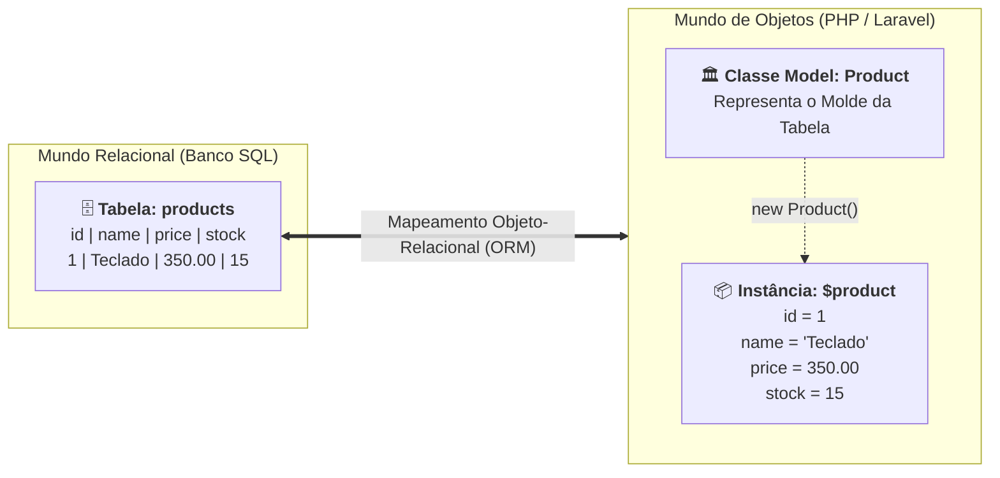

# 01. O Conceito de Model e Entidades

Nos capítulos anteriores, desmistificamos a arquitetura do **Laravel 11** e
compreendemos o papel do padrão **MVC** no desenvolvimento de APIs REST, onde a
"View" foi ressignificada na forma de respostas puras em JSON. No centro dessa
arquitetura, atuando como o verdadeiro guardião dos dados e das regras de
negócio do sistema, encontramos o **Model**.

Mas antes de sairmos digitando comandos no terminal para gerar código ou
executar operações de banco, precisamos construir uma fundação conceitual
sólida:

> _"O que é exatamente um Model no paradigma de Orientação a Objetos, qual é a
> diferença entre uma tabela do banco de dados e uma entidade de negócio, e como
> o padrão Active Record do Laravel conecta esses dois mundos?"_

Neste capítulo, você entenderá por que abandonar arrays associativos soltos em
favor de modelos orientados a objetos é o passo divisor de águas na carreira de
qualquer desenvolvedor backend profissional.

## A Dor: O Caos de Tratar Dados como Arrays Primitivos

Quando aprendemos PHP nativo ou bancos de dados relacionais, é muito comum
manipular os dados retornados de uma consulta SQL (`PDO::FETCH_ASSOC`)
diretamente como **arrays associativos soltos**:

```php
<?php
// ❌ CÓDIGO PROBLEMÁTICO / ABORDAGEM PRIMITIVA COM ARRAYS SOLTOS
declare(strict_types=1);

$query = "SELECT id, title, unit_price, qty_available FROM products WHERE id = 1";
$productData = $pdo->query($query)->fetch();

// 1. Acesso inseguro e dependente de digitação manual de chaves
echo "Produto: " . $productData['title'];
echo "Preço: R$ " . $productData['unit_price'];

// 2. Regra de negócio calculada e executada de forma dispersa
if ($productData['qty_available'] > 0) {
    // Altera manualmente um campo no array em memória
    $productData['qty_available'] -= 1;

    // 3. Persistência manual e tediosa: montar um novo SQL UPDATE cru
    $updateStmt = $pdo->prepare("UPDATE products SET qty_available = ? WHERE id = ?");
    $updateStmt->execute([$productData['qty_available'], $productData['id']]);
}
```

Essa abordagem, embora muito vista em códigos legados, traz quatro problemas
severos para a engenharia de software:

1. **Ausência Total de Identidade e Tipagem:** Um array associativo é apenas um
   dicionário genérico de chaves e valores. Para o interpretador do PHP, um
   array de produto tem a mesma estrutura que um array de usuário ou de carrinho
   de compras;
2. **Propensão a Erros Silenciosos de Digitação:** Se um desenvolvedor digitar
   `$productData['unit_prce']` (com erro de digitação), o PHP simplesmente lerá
   `null` ou emitirá um aviso, mascarando bugs difíceis de rastrear;
3. **Regras de Negócio Espalhadas:** Se cinco partes diferentes da aplicação
   precisarem "dar baixa no estoque de um produto", a verificação `qty_available > 0`
   e a query de `UPDATE` serão duplicadas em cinco lugares diferentes;
4. **Falta de Semântica e Expressividade:** O código não expressa intenção. Ele
   expressa manipulação crua de memória e instruções SQL de baixo nível.

## O Que É uma Entidade e o Que É um Model?

Para resolver esse caos, a engenharia de software recorre à **Modelagem de
Domínio Orientada a Objetos**. Aqui precisamos distinguir dois conceitos
complementares:

### 1. A Entidade (O Conceito de Negócio)

Uma **Entidade** é qualquer elemento do mundo real relevante para o seu sistema
que possui uma **identidade contínua e única ao longo do tempo**,
independentemente de seus atributos mudarem.

- Um **Produto** é uma entidade: se você alterar o seu preço de R$ 50 para R$ 70
  ou renomear seu título, ele continua sendo exatamente o mesmo produto porque
  seu identificador (`id`) permanece o mesmo;
- Um **Usuário**, um **Pedido** ou uma **Fatura** são outros exemplos clássicos
  de entidades.

### 2. O Model (A Classe de Representação)

Um **Model** é a classe em PHP criada para personificar essa entidade no código
da aplicação.

- Enquanto a tabela no banco relacional é um conjunto estático de linhas e
  colunas bidimensionais, o Model é um **objeto de primeira classe** com
  propriedades tipadas e métodos capazes de realizar operações.



## O Padrão Active Record no Laravel

No universo dos frameworks modernos de backend, existem diferentes maneiras de
projetar Models. O Laravel adota uma das abordagens mais populares, produtivas e
expressivas da indústria: o padrão arquitetural **Active Record**, formalizado
por Martin Fowler.

### Os 3 Pilares do Active Record:

1. **A Classe Representa a Tabela:** A classe `Product` representa a tabela
   inteira de produtos no banco de dados;
2. **Cada Instância Representa uma Linha (Registro):** Quando você obtém ou
   instancia um objeto `$product = new Product()`, aquela instância específica
   da classe corresponde a uma **única linha da tabela**;
3. **Dados e Comportamentos Coexistem no Objeto:** No Active Record, o objeto
   não é apenas uma estrutura passiva que guarda variáveis. Ele possui métodos
   para se consultar, se validar, se salvar no banco de dados e se excluir.

Em vez de termos que criar uma classe separada para guardar os dados e outra
classe separada para executar comandos SQL, **a própria instância do Model sabe
como se salvar**:

```php
// Com o padrão Active Record do Laravel:
$product = new Product();
$product->name = 'Monitor Ultrawide';
$product->price = 1899.90;
$product->stock = 5;

// O próprio objeto sabe persistir seu estado no banco de dados!
$product->save();
```

## Anatomia de um Model no Laravel

No Laravel, todo Model estende a classe base abstrata
`Illuminate\Database\Eloquent\Model`.

Veja como uma classe Model é declarada dentro do diretório `app/Models/`:

```php
<?php
// ✅ CÓDIGO IDIOMÁTICO / RECOMENDADO: Model Eloquent no Laravel
declare(strict_types=1);

namespace App\Models;

use Illuminate\Database\Eloquent\Model;

class Product extends Model
{
    // O Laravel gerencia as propriedades dinamicamente por convenção!
}
```

À primeira vista, uma dúvida surge imediatamente na cabeça de quem vem de
linguagens com tipagem nominal rígida (como Java ou C#):

> _"A classe está praticamente vazia! Cadê as propriedades `$id`, `$name` e
> `$price` declaradas como atributos privados da classe?"_

É aqui que entra uma das características mais brilhantes do PHP moderno e do
Laravel: o uso de **Convenção sobre Configuração** aliado a métodos mágicos de
metaprogramação (que você estudou no Cap. 31 de PHP).

O Eloquent conecta-se ao banco de dados e inspeciona o esquema da tabela
correspondente. Quando você escreve `$product->name`, o Laravel intercepta esse
acesso e busca a coluna `name` na linha da tabela, sem que você precise declarar
propriedades manuais com getters e setters para cada coluna do banco!

## As Convenções de Nomenclatura do Laravel

Para que essa integração funcione como mágica e sem necessidade de arquivos de
configuração XML ou dezenas de anotações manuais, o Laravel estabelece um
conjunto consistente de **convenções de nomenclatura**:

### 1. Nome da Tabela no Plural vs Nome do Model no Singular

- O nome da **classe Model** deve ser escrito em **PascalCase** e no
  **singular** (ex: `Product`, `OrderItem`, `Category`);
- O Laravel assume automaticamente que o nome da **tabela no banco** será o
  equivalente no **plural** e em **snake_case** (ex: `products`, `order_items`,
  `categories`).

### 2. Chave Primária Padronizada

- O framework assume por padrão que toda tabela possui uma chave primária
  chamada **`id`**, do tipo inteiro auto-incremento (ou UUID/ULID quando
  configurado).

### 3. Timestamps Automáticos

- Por padrão, o Eloquent espera que sua tabela possua duas colunas para
  auditoria temporal:
  - **`created_at`** (data e hora de criação do registro);
  - **`updated_at`** (data e hora da última alteração do registro).
- O Laravel preenche e atualiza essas duas colunas automaticamente a cada
  operação de inserção ou alteração, sem você precisar escrever uma linha sequer
  de código.

### E se meu banco legado não seguir essas convenções?

Embora o recomendado seja seguir o padrão, o Laravel permite sobrescrever
qualquer convenção através de propriedades protegidas simples dentro da classe:

```php
class LegacyProduct extends Model
{
    // Define explicitamente o nome da tabela no banco
    protected $table = 'tb_produtos_empresa';

    // Define uma chave primária customizada
    protected $primaryKey = 'cod_produto';

    // Desativa o controle automático de created_at e updated_at
    public $timestamps = false;
}
```

## Comparativo: SQL Relacional vs Models no Laravel

| Conceito Relacional (Banco SQL) | Conceito Orientado a Objetos (Laravel)  | Exemplo Prático                          |
| :------------------------------ | :-------------------------------------- | :--------------------------------------- |
| **Tabela**                      | Classe Model (Molde)                    | `class Product extends Model`            |
| **Linha / Registro (_Tuple_)**  | Instância do Model (Objeto em memória)  | `$product = new Product();`              |
| **Coluna / Campo**              | Propriedade dinâmica do Objeto          | `$product->name = 'Teclado';`            |
| **Comando `INSERT INTO`**       | Método de salvamento da instância       | `$product->save();`                      |
| **Comando `SELECT * FROM ...`** | Métodos estáticos de consulta da classe | `Product::all();` ou `Product::find(1);` |
| **Comando `DELETE FROM ...`**   | Método de exclusão da instância         | `$product->delete();`                    |

> **Regra de Ouro:**
>
> **Models são exclusivamente responsáveis pela modelagem dos dados e das regras
> de negócio do seu domínio.**
>
> Um Model **nunca** deve interagir com o protocolo HTTP: ele não deve receber
> objetos `$request`, não deve ler cabeçalhos, não deve saber o IP do cliente e
> não deve gerar respostas `response()->json()`. Quem dialoga com o HTTP é o
> Controller; o Model foca unicamente em representar suas entidades de dados com
> pureza.

<details>
<summary>🔍 Aprofundamento Técnico: Padrão Active Record vs Data Mapper</summary>

Na arquitetura de software corporativa, existem duas filosofias consagradas para
resolver o problema de mapeamento entre código orientado a objetos e bancos
relacionais:

### 1. Active Record (Utilizado pelo Laravel Eloquent e Ruby on Rails):

- **Como funciona:** O próprio objeto da entidade conhece o banco de dados e
  carrega os métodos para persistir a si mesmo (`$product->save()`,
  `$product->delete()`);
- **Vantagens:** Altíssima velocidade de desenvolvimento, sintaxe limpa, fluente
  e extremamente intuitiva para mais de 95% dos projetos de mercado;
- **Crítica teórica:** Viola ligeiramente o Princípio da Responsabilidade Única
  (SRP), pois a mesma classe carrega os dados de domínio e a responsabilidade de
  executar I/O no banco.

### 2. Data Mapper (Utilizado pelo Doctrine no PHP, Hibernate no Java ou TypeORM no TypeScript):

- **Como funciona:** A entidade de domínio é uma classe puramente desacoplada
  (chamada de POPO/POJO - _Plain Old PHP Object_). Ela não possui nenhum método
  de banco. Existe uma classe externa separada (o _EntityManager_ ou
  _Repository_) encarregada de gravar a entidade no banco de dados
  (`$entityManager->persist($product)`);
- **Vantagens:** Isolamento arquitetural 100% puro entre o domínio de negócio e
  o banco de dados;
- **Desvantagens:** Maior verbosidade, curva de aprendizado mais íngreme e
  desenvolvimento mais lento para CRUDs e APIs convencionais.

O ecossistema Laravel escolheu conscientemente o **Active Record** por entender
que a produtividade e a legibilidade do código geram uma experiência de
engenharia insuperável para a grande maioria das aplicações da Web moderna.

</details>

## O Que Vem a Seguir?

Agora que dominamos o **conceito fundamental de Model**, entendemos o padrão
**Active Record** e sabemos como o Laravel mapeia classes para tabelas por
convenção, estamos prontos para ver o Eloquent operar na prática!

> _"Como criar Models utilizando a CLI Artisan, proteger nossos dados contra
> preenchimento indevido (Mass Assignment) e executar consultas e inserções
> reais no banco?"_

No **[Capítulo 02: Eloquent ORM e Métodos do
Model](02-eloquent-orm-e-metodos-do-model.md)**, utilizaremos o comando `php
artisan make:model`, conheceremos as propriedades essenciais como `$fillable` e
exploraremos todos os métodos de CRUD diretamente no laboratório interativo do
**Tinker**!

---

<a href="../02-o-padrao-mvc-no-laravel.md">← O Padrão MVC no Laravel para
APIs</a>

<p align="right"><a href="02-eloquent-orm-e-metodos-do-model.md">Próximo: Eloquent ORM e Métodos do Model →</a></p>
