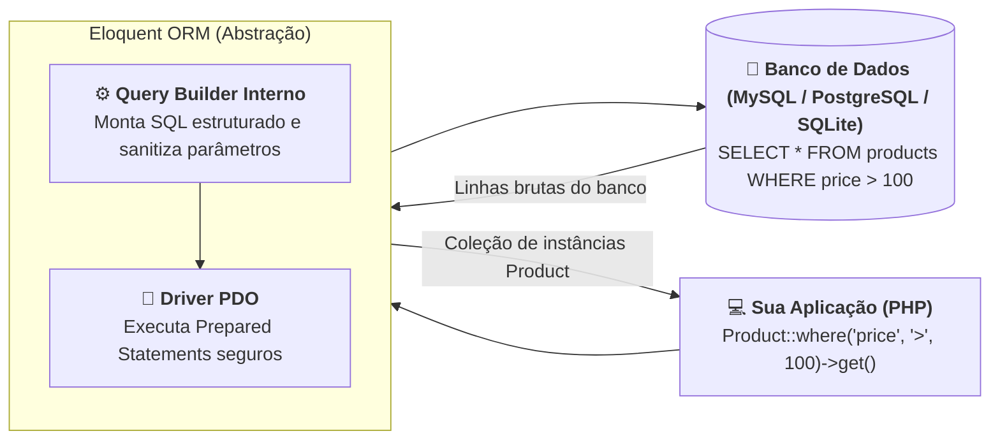

# 02. Eloquent ORM e Métodos do Model

No **[Capítulo 01: O Conceito de Model e
Entidades](01-o-conceito-de-model-e-entidades.md)**, compreendemos a essência
teórica do padrão **Active Record**: como uma classe Model personifica uma
entidade do domínio de negócio e representa o molde de uma tabela do banco de
dados, transformando cada linha da tabela em um objeto inteligente em memória.

Agora, precisamos dar o próximo passo prático:

> _"Como criar classes de Model usando a CLI Artisan, proteger nossos dados
> contra vulnerabilidades graves de preenchimento em massa e executar operações
> completas de CRUD (criação, leitura, atualização e exclusão) utilizando a
> elegância do Eloquent ORM?"_

Neste capítulo, você conhecerá o arsenal de métodos que torna o **Eloquent** uma
das ferramentas mais admiradas do ecossistema PHP e aprenderá a testar consultas
e mutações em tempo real no terminal através do **Tinker**.

## A Dor: O Fardo do SQL Manual e a Brecha do Mass Assignment

Antes do surgimento de ORMs modernas, desenvolver operações básicas de CRUD em
PHP exigia uma quantidade exaustiva de código boilerplate repetitivo com PDO:

1. Montar strings SQL cruas com comandos `INSERT INTO`, `SELECT`, `UPDATE` e
   `DELETE`;
2. Vincular parâmetros com `bindValue()` para evitar ataques clássicos de SQL
   Injection;
3. Instanciar objetos e mapear manualmente cada coluna retornada do array do
   banco.

Contudo, existia um perigo ainda mais insidioso: a vulnerabilidade de **Mass
Assignment** (Atribuição em Massa).

Considere um cenário real em que você recebe os dados de um formulário de
cadastro de usuário e os insere diretamente no banco de dados:

```php
<?php
// ❌ CÓDIGO VULNERÁVEL: Inserção manual de arrays e brecha de Mass Assignment
$userData = $_POST; // ou json_decode(file_get_contents('php://input'), true)

// O invasor envia intencionalmente no payload:
// { "name": "Carlos", "email": "carlos@email.com", "password": "123", "is_admin": true }

$stmt = $pdo->prepare("INSERT INTO users (name, email, password, is_admin) VALUES (?, ?, ?, ?)");
$stmt->execute([
    $userData['name'],
    $userData['email'],
    $userData['password'],
    $userData['is_admin'] ?? false, // 💥 Invasor se tornou administrador do sistema!
]);
```

Quando aceitamos que dados vindos de fora da aplicação sejam passados
diretamente para o banco sem uma política rígida de blindagem, qualquer usuário
mal-intencionado pode inspecionar o tráfego HTTP, deduzir o nome de colunas
sensíveis (como `is_admin`, `balance` ou `role`) e injetar valores arbitrários,
comprometendo totalmente a segurança do sistema.

## O Que É uma ORM e Como o Eloquent Opera?

Uma **ORM** (_Object-Relational Mapping_ ou Mapeamento Objeto-Relacional) é a
camada de abstração responsável por traduzir chamadas orientadas a objetos em
código PHP para instruções SQL perfeitamente otimizadas e seguras,
comunicando-se com o banco através do driver PDO:



O **Eloquent** não apenas protege automaticamente suas consultas contra SQL
Injection utilizando _Prepared Statements_ em 100% dos comandos, como também
fornece um mecanismo nativo e obrigatório de defesa contra **Mass Assignment**.

## Criando Models com a CLI Artisan

Conforme aprendemos no capítulo introdutório, nunca criamos arquivos do Laravel
manualmente pelo explorador de arquivos. Utilizamos a CLI **Artisan**:

```bash
php artisan make:model Product
```

O Laravel criará imediatamente o arquivo `app/Models/Product.php`:

```php
<?php

namespace App\Models;

use Illuminate\Database\Eloquent\Model;

class Product extends Model
{
    //
}
```

## Blindando o Model: A Propriedade `$fillable`

Para neutralizar a brecha de Mass Assignment, o Eloquent adota uma abordagem de
**segurança por padrão** (_secure by default_): se você tentar usar o método
`Product::create($dados)` passando um array de campos sem antes configurar a
segurança, o Laravel interromperá a execução imediatamente lançando uma exceção:

```text
Illuminate\Database\Eloquent\MassAssignmentException:
Add [name] to fillable property to allow mass assignment on [App\Models\Product].
```

Para autorizar quais campos podem ser preenchidos em operações em massa,
declaramos a propriedade protegida **`$fillable`** (a lista branca ou
_whitelist_ de atributos permitidos):

```php
<?php
// ✅ CÓDIGO IDIOMÁTICO / RECOMENDADO: Model blindado com $fillable e $casts
declare(strict_types=1);

namespace App\Models;

use Illuminate\Database\Eloquent\Model;

class Product extends Model
{
    /**
     * Os atributos que podem ser atribuídos em massa com segurança.
     * Qualquer campo fora desta lista será sumariamente ignorado pelo Eloquent.
     *
     * @var array<int, string>
     */
    protected $fillable = [
        'name',
        'description',
        'price',
        'stock',
    ];

    /**
     * Conversão automática de tipos nativos ao ler ou gravar dados.
     *
     * @var array<string, string>
     */
    protected $casts = [
        'price' => 'decimal:2',
        'stock' => 'integer',
    ];
}
```

### O papel da propriedade `$casts`

O banco de dados armazena valores numéricos e datas frequentemente como strings
de texto puro. Com a propriedade `$casts`, o Eloquent converte automaticamente
esses valores para tipos nativos do PHP no momento em que você acessa o
atributo:

- `'price' => 'decimal:2'` garante precisão monetária;
- `'is_active' => 'boolean'` transforma `1` e `0` do banco nos booleanos `true`
  e `false`;
- `'metadata' => 'array'` converte automaticamente colunas JSON do banco em
  arrays PHP associativos!

## O Arsenal de Métodos de CRUD do Eloquent

Com o Model configurado e blindado, vejamos como realizar as quatro operações
fundamentais de persistência.

### 1. Criação de Registros (Create)

Existem duas formas clássicas de criar registros no Eloquent:

#### Abordagem A: Instanciação manual com `save()`

Ideal quando você precisa calcular valores passo a passo antes de salvar:

```php
$product = new Product();
$product->name = 'Mouse Gamer';
$product->description = 'Sensor óptico de alta precisão';
$product->price = 150.00;
$product->stock = 20;

$product->save(); // Dispara o comando INSERT INTO no banco
```

#### Abordagem B: Criação em lote com `create()`

A abordagem mais concisa e utilizada em APIs REST:

```php
$product = Product::create([
    'name'        => 'Teclado Mecânico RGB',
    'description' => 'Switches azuis táteis',
    'price'       => 320.00,
    'stock'       => 15,
]);

// O objeto $product já é retornado com o 'id' preenchido e salvo no banco!
echo $product->id; // Ex: 1
```

### 2. Leitura e Consultas (Read)

O Eloquent oferece uma API fluente e intuitiva para consultar registros:

```php
// Busca todos os registros da tabela (retorna uma Collection do Laravel)
$allProducts = Product::all();

// Busca um produto pela chave primária (id)
$product = Product::find(1); // Retorna a instância ou null se não encontrar

// Busca pelo id ou lança ModelNotFoundException (Gera HTTP 404 automático em APIs!)
$product = Product::findOrFail(1);

// Consulta com filtros encadeados (WHERE)
$expensiveProducts = Product::where('price', '>', 200.00)
    ->where('stock', '>', 0)
    ->orderBy('price', 'desc')
    ->get(); // Executa a consulta e retorna a coleção

// Busca o primeiro registro que atenda a um critério
$firstKeyboard = Product::where('name', 'Teclado Mecânico RGB')->first();
```

### 3. Atualização de Registros (Update)

Assim como na criação, podemos atualizar registros de forma pontual ou em lote:

#### Abordagem A: Alteração de propriedades com `save()`

```php
$product = Product::findOrFail(1);

// Altera uma propriedade individual em memória
$product->price = 289.90;

// O Eloquent detecta apenas as colunas que foram modificadas (dirty attributes)
$product->save(); // Dispara o UPDATE no banco
```

#### Abordagem B: Atualização direta com `update()`

Aplica um array de novos valores respeitando a lista `$fillable`:

```php
$product = Product::findOrFail(1);

$product->update([
    'price' => 279.90,
    'stock' => 12,
]);
```

### 4. Exclusão de Registros (Delete)

Podemos excluir um registro através de sua instância ou diretamente pelo
identificador:

```php
// Abordagem A: Exclusão através da instância existente
$product = Product::findOrFail(1);
$product->delete(); // Dispara o DELETE no banco

// Abordagem B: Exclusão direta pela chave primária
Product::destroy(2);

// Exclusão de múltiplos registros de uma vez
Product::destroy([3, 4, 5]);
```

## O Laboratório Prático: Experimentando com o Tinker

O Laravel disponibiliza uma ferramenta fantástica para que você teste os métodos
do Eloquent imediatamente, sem precisar criar controladores ou rotas: o
**Tinker** (`php artisan tinker`).

Abra seu terminal na raiz do projeto e execute:

```bash
php artisan tinker
```

Você verá o prompt interativo do PHP carregado com todo o contexto da sua
aplicação:

```php
> use App\Models\Product;

// 1. Criando um produto interativamente:
> $p = Product::create(['name' => 'Headset 7.1', 'price' => 450.00, 'stock' => 8]);
= App\Models\Product {#6024
    name: "Headset 7.1",
    price: "450.00",
    stock: 8,
    updated_at: "2026-09-22 23:45:00",
    created_at: "2026-09-22 23:45:00",
    id: 1,
  }

// 2. Contando quantos registros existem no banco:
> Product::count();
= 1

// 3. Buscando o produto recém-criado:
> $item = Product::find(1);
= App\Models\Product {#6030
    id: 1,
    name: "Headset 7.1",
    ...
  }

// 4. Atualizando o preço:
> $item->update(['price' => 399.90]);
= true

// 5. Excluindo o registro:
> $item->delete();
= true

// 6. Verificando que a tabela está vazia novamente:
> Product::count();
= 0

// Digite 'exit' para fechar o Tinker:
> exit
```

O Tinker é o ambiente ideal para prototipar ideias, testar consultas complexas e
verificar o funcionamento de métodos de negócio antes de implementá-los na
camada de controladores HTTP.

## Tabela de Métodos Essenciais do Eloquent

| Operação               | Método                             | Descrição                                                                |
| :--------------------- | :--------------------------------- | :----------------------------------------------------------------------- |
| **Criação**            | `Model::create($array)`            | Cria e persiste um novo registro em lote respeitando `$fillable`         |
| **Salvamento**         | `$instance->save()`                | Salva uma nova instância (`INSERT`) ou atualiza uma existente (`UPDATE`) |
| **Listagem Geral**     | `Model::all()`                     | Retorna todos os registros da tabela encapsulados em uma `Collection`    |
| **Busca Simples**      | `Model::find($id)`                 | Localiza um registro pela chave primária ou retorna `null`               |
| **Busca Estrita**      | `Model::findOrFail($id)`           | Localiza pela chave primária ou lança exceção (404 em APIs)              |
| **Filtro**             | `Model::where('col', 'op', 'val')` | Adiciona uma cláusula WHERE à consulta SQL                               |
| **Primeiro Registro**  | `Model::first()`                   | Retorna a primeira linha que atenda aos critérios da consulta            |
| **Atualização**        | `$instance->update($array)`        | Atualiza múltiplos atributos da instância respeitando `$fillable`        |
| **Exclusão de Objeto** | `$instance->delete()`              | Remove o registro correspondente do banco de dados                       |
| **Exclusão por ID**    | `Model::destroy($id)`              | Remove um ou mais registros diretamente pelas suas chaves primárias      |
| **Contagem**           | `Model::count()`                   | Retorna o número total de registros sem carregar os dados na memória     |

> **Regra de Ouro:**
>
> **Sempre declare a propriedade protegida `$fillable` nos seus Models.**
>
> Nunca utilize métodos de criação em lote (`Model::create()`) ou atualização
> direta (`$model->update()`) recebendo dados externos sem uma lista explícita
> de campos autorizados no `$fillable`. Essa disciplina simples neutraliza uma
> das vulnerabilidades mais exploradas em backends web: a injeção indevida de
> privilégios via Mass Assignment.

<details>
<summary>🔍 Aprofundamento Técnico: Lazy Execution e o Query Builder</summary>

Uma dúvida frequente de quem começa a utilizar o Eloquent é: _"Quando encadeamos
vários métodos em um Model, o Laravel dispara uma consulta no banco a cada
chamada?"_

Considere o seguinte trecho:

```php
$query = Product::where('price', '>', 50)
    ->where('stock', '>', 0)
    ->orderBy('name', 'asc');
```

Neste momento exato, **nenhuma consulta SQL foi enviada ao banco de dados!**

O Eloquent utiliza um padrão de projeto chamado **Lazy Execution** (Execução
Tardia / Preguiçosa). Quando você encadeia métodos como `where()`, `orWhere()`
ou `orderBy()`, você não está manipulando dados ainda, mas sim configurando uma
instância intermediária da classe `Illuminate\Database\Eloquent\Builder`.

A consulta SQL real só é compilada e disparada através do PDO quando você chama
um método terminal, tal como:

- **`get()`**: Para obter a coleção de resultados;
- **`first()`**: Para obter apenas o primeiro registro correspondente com `LIMIT
1`;
- **`count()`**: Para executar um `SELECT COUNT(*)`;
- **`paginate()`**: Para montar a paginação automática com `LIMIT` e `OFFSET`.

Essa separação inteligente permite compor filtros dinâmicos de forma modular e
altamente performática antes de exigir qualquer I/O do banco de dados.

</details>

## O Que Vem a Seguir?

Agora que dominamos a criação de Models e exploramos todos os métodos de
manipulação de dados com o Eloquent ORM, você pode estar se perguntando:

> _"Mas de onde vieram as tabelas do banco de dados? Como definimos os nomes das
> colunas, seus tipos (`VARCHAR`, `INT`, `DECIMAL`) e chaves primárias sem ter
> que abrir o MySQL Workbench ou executar scripts SQL manuais?"_

No **[Capítulo 03: Migrations e Esquemas de
Banco](03-migrations-e-esquemas-de-banco.md)**, entraremos no maior superpoder
de infraestrutura do Laravel: o versionamento automático de banco de dados
através de **Migrations**, aprendendo a criar tabelas profissionais com código
PHP fluente via `php artisan migrate`!

---

<a href="01-o-conceito-de-model-e-entidades.md">← O Conceito de Model e
Entidades</a>

<p align="right"><a href="03-migrations-e-esquemas-de-banco.md">Próximo: Migrations e Esquemas de Banco →</a></p>
