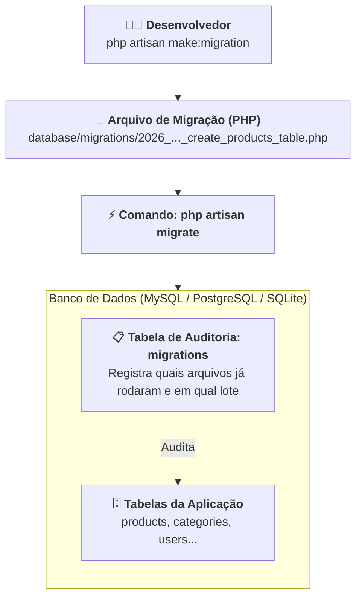

# 03. Migrations e Esquemas de Banco

No **[Capítulo 02: Eloquent ORM e Métodos do
Model](02-eloquent-orm-e-metodos-do-model.md)**, dominamos o arsenal de métodos
de CRUD do Eloquent, aprendemos a blindar nossos Models contra a vulnerabilidade
de Mass Assignment utilizando `$fillable` e exploramos operações interativas de
banco de dados diretamente pelo **Tinker**.

Contudo, deixamos uma questão primordial propositalmente em aberto:

> _"Como as tabelas do banco de dados são criadas, como garantimos que todos os
> desenvolvedores da equipe trabalhem exatamente com o mesmo esquema e como
> versionamos o banco de dados sem depender de scripts SQL manuais?"_

No ecossistema do Laravel, a resposta para esse desafio arquitetural reside em
um dos seus recursos mais elegantes e poderosos: as **Migrations**.

Neste capítulo, você aprenderá a estruturar e versionar esquemas de banco de
dados profissionais utilizando código PHP declarativo e fluente através da CLI
**Artisan**.

## A Dor: O Caos dos Scripts SQL Manuais

Imagine que você está desenvolvendo uma API de comércio eletrônico em equipe.
Para criar a tabela de produtos, um desenvolvedor abre um cliente de banco de
dados gráfico (como DBeaver ou phpMyAdmin) e executa um script manual:

```sql
-- ❌ ABORDAGEM PROBLEMÁTICA / SCRIPT SQL MANUAL SEM CONTROLE DE VERSÃO
CREATE TABLE products (
    id INT AUTO_INCREMENT PRIMARY KEY,
    name VARCHAR(255) NOT NULL,
    price DECIMAL(10,2) NOT NULL,
    created_at TIMESTAMP NULL
);
```

Duas semanas depois, outro desenvolvedor do time percebe que a aplicação precisa
de uma coluna para armazenar o estoque e executa localmente na sua própria
máquina:

```sql
ALTER TABLE products ADD COLUMN stock INT DEFAULT 0;
```

Essa abordagem artesanal gera três problemas catastróficos para projetos
profissionais:

1. **Desincronização de Ambientes ("Na Minha Máquina Funciona"):** O
   desenvolvedor que criou a coluna `stock` esquece de avisar o colega de equipe
   ou a equipe de infraestrutura. Quando o código sobe para homologação ou
   produção, a aplicação quebra imediatamente com o erro `Column not found:
Unknown column 'stock'`;
2. **Histórico Perdido:** Ninguém na equipe sabe responder com certeza: _"Quem
   adicionou essa coluna?", "Quando ela foi criada?"_ ou _"Por que esse campo
   foi alterado de INT para BIGINT?"_;
3. **Impossibilidade de Reversão Confiável (_Rollback_):** Se uma alteração de
   banco introduzir um problema grave em produção, não existe uma forma
   automatizada e segura de voltar o banco para o estado exato em que ele estava
   antes da implantação.

## O Que São Migrations?

As **Migrations** atuam como o **sistema de controle de versão (o "Git") do seu
banco de dados**.

Em vez de escrever comandos SQL crus e executá-los manualmente em cada servidor,
você define as tabelas e alterações de colunas em **arquivos PHP estruturados**.
O Laravel se encarrega de ler esses arquivos, traduzir as instruções fluentes
para o dialeto SQL específico do seu banco (seja MySQL, PostgreSQL ou SQLite) e
registrar o histórico de execução:



### O Diário de Bordo: A Tabela `migrations`

Na primeira vez em que você executa o comando `php artisan migrate`, o Laravel
cria automaticamente uma tabela especial no seu banco de dados chamada
**`migrations`**.

Toda vez que uma nova migration é executada, o Laravel grava o nome daquele
arquivo e o número do lote (_batch_) nessa tabela. Dessa forma, o framework sabe
com precisão cirúrgica **quais migrations já foram executadas e quais estão
pendentes**, garantindo que nenhum script seja aplicado duas vezes.

## Criando Migrations com a CLI Artisan

Para criar um novo arquivo de migração, utilizamos o utilitário `make:migration`
da CLI Artisan:

```bash
php artisan make:migration create_products_table
```

O Laravel criará um arquivo dentro do diretório `database/migrations/` com um
prefixo temporal em seu nome:

```text
database/migrations/2026_09_22_235000_create_products_table.php
```

> 💡 **O Significado do Prefixo Temporal:**
>
> O prefixo numérico no nome do arquivo (ano, mês, dia e horário exato) garante
> que o Laravel execute as migrações em **ordem cronológica estrita**. Uma
> tabela de categorias, por exemplo, sempre será criada antes da tabela de
> produtos que depende dela.

### O Atalho Produtivo: Criando Model e Migration Juntos

No dia a dia, raramente criamos um Model e uma Migration em comandos separados.
O Artisan fornece a flag conjugada **`-m`** (ou `--migration`):

```bash
php artisan make:model Category -m
```

Esse único comando gera tanto o Model `app/Models/Category.php` quanto a
migration correspondente `database/migrations/..._create_categories_table.php`
perfeitamente sincronizados!

## Anatomia de um Arquivo de Migration

Ao inspecionar o arquivo de migration recém-gerado pelo Artisan, você encontrará
uma classe anônima contendo apenas o esqueleto inicial com a chave primária e os
timestamps:

```php
<?php
// O que o Artisan gera por padrão (apenas o esqueleto básico):
return new class extends Migration
{
    public function up(): void
    {
        Schema::create('products', function (Blueprint $table) {
            $table->id();
            $table->timestamps();
        });
    }

    public function down(): void
    {
        Schema::dropIfExists('products');
    }
};
```

> ⚠️ **Atenção: O Artisan cria o esqueleto; você define os campos de negócio!**
>
> O Artisan não tem como adivinhar quais colunas o seu produto precisa ter. Ele
> gera apenas a casca com `$table->id()` e `$table->timestamps()`.
>
> **É você, desenvolvedor**, quem abre o arquivo gerado e digita as colunas de
> negócio da entidade (`name`, `price`, `stock`, etc.):

```php
<?php
// ✅ CÓDIGO IDIOMÁTICO / RECOMENDADO: Migration preenchida com as colunas de negócio
declare(strict_types=1);

use Illuminate\Database\Migrations\Migration;
use Illuminate\Database\Schema\Blueprint;
use Illuminate\Support\Facades\Schema;

return new class extends Migration
{
    /**
     * Executa as alterações de esquema no banco (Subida).
     */
    public function up(): void
    {
        Schema::create('products', function (Blueprint $table) {
            $table->id();

            // 👉 Colunas de negócio adicionadas manualmente por nós:
            $table->string('name', 150);
            $table->text('description')->nullable();
            $table->decimal('price', 10, 2);
            $table->integer('stock')->default(0);
            $table->boolean('is_active')->default(true);

            $table->timestamps();
        });
    }

    /**
     * Desfaz as alterações executadas no método up (Descida / Rollback).
     */
    public function down(): void
    {
        Schema::dropIfExists('products');
    }
};
```

Toda migration é composta por dois métodos complementares e espelhados:

1. **`up()`:** Define o que deve ser **construído** ou adicionado quando a
   migração for executada (como criar uma tabela ou adicionar uma nova coluna);
2. **`down()`:** Define como **desfazer exatamente** o que o método `up()` fez
   (como excluir a tabela criada ou remover a coluna adicionada). Isso viabiliza
   o recurso de rollback com segurança.

### 💡 A Divisão de Papéis: Migration vs Model

Essa distinção é o segredo para entender o ecossistema do Laravel:

1. **A Migration é a arquiteta da estrutura física:** Ela dita para o banco de
   dados quais tabelas e colunas existem, seus tipos SQL (`VARCHAR`, `DECIMAL`,
   `INT`) e chaves estrangeiras.
2. **O Model reflete essa estrutura dinamicamente:** Você **não precisa**
   redigitar colunas no arquivo `Product.php`. O Eloquent inspeciona o banco e
   sabe que elas existem. No Model, você apenas configura o **`$fillable`** para
   dizer ao Laravel quais dessas colunas criadas pela migration têm permissão de
   escrita em massa!

## Definindo Esquemas Fluentes com a Façade `Schema` e `Blueprint`

O objeto `$table` injetado na closure do `Schema::create` é uma instância de
`Illuminate\Database\Schema\Blueprint`. Ele disponibiliza uma API fluente e
expressiva para declarar colunas e regras de integridade:

### 1. Tipos de Colunas Mais Utilizados

Uma das maiores vantagens do Laravel é que a classe `Blueprint` é
**completamente agnóstica ao banco de dados**. Você declara o método
correspondente à natureza do dado em PHP, e o framework traduz automaticamente
para o tipo nativo correto do banco configurado no `.env` (seja SQLite, MySQL ou
PostgreSQL):

- **`$table->id()`:** Cria uma coluna de chave primária auto-incremento de alta
  capacidade (inteiro sem sinal de 64 bits), padronizada como `id`;
- **`$table->string('name', 150)`:** Armazena textos curtos (nomes, títulos,
  e-mails). O segundo parâmetro opcional define o limite máximo de caracteres (o
  padrão é 255);
- **`$table->text('description')`:** Armazena textos longos sem limite fixo de
  tamanho (como descrições de produtos, posts ou mensagens);
- **`$table->decimal('price', 10, 2)`:** Armazena números de ponto fixo de alta
  precisão (10 dígitos no total e 2 dígitos após a vírgula), formato padrão para
  valores monetários;
- **`$table->integer('stock')`:** Armazena números inteiros (como quantidades em
  estoque ou contadores);
- **`$table->boolean('is_active')`:** Armazena valores booleanos (`true` ou
  `false`);
- **`$table->timestamps()`:** Atalho que cria automaticamente as duas colunas
  padrão de auditoria temporal do Eloquent: `created_at` e `updated_at`.

### 2. Modificadores de Coluna

Você pode encadear métodos modificadores para refinar o comportamento de cada
campo:

- **`->nullable()`:** Permite que a coluna armazene valores `NULL` (por padrão,
  toda coluna no Laravel é `NOT NULL`);
- **`->default($value)`:** Define um valor padrão caso nenhum dado seja
  informado na inserção;
- **`->unique()`:** Adiciona uma restrição de unicidade na tabela (nenhum
  registro poderá ter o mesmo valor nessa coluna).

### 3. Criando Chaves Estrangeiras (Relacionamentos)

Para relacionar tabelas (por exemplo, vincular cada produto a uma categoria), o
Laravel disponibiliza o método fluente **`foreignId()`**:

```php
Schema::create('products', function (Blueprint $table) {
    $table->id();

    // Cria a coluna category_id (BIGINT UNSIGNED) e estabelece a Foreign Key para a tabela categories
    $table->foreignId('category_id')
          ->constrained('categories') // Vincula à tabela categories (opcional se seguir a convenção)
          ->cascadeOnDelete();        // Se a categoria for excluída, exclui os produtos filhos

    $table->string('name');
    $table->decimal('price', 10, 2);
    $table->timestamps();
});
```

## O Ciclo de Comandos de Execução do Artisan

Depois de escrever o arquivo de migração, utilizamos a CLI Artisan para
interagir com o banco de dados.

> 💡 **Qual banco de dados estamos utilizando? (O Padrão SQLite no Laravel 11)**
>
> Ao longo de todo este curso, adotamos o **SQLite** como o banco de dados
> padrão para nossos exemplos e experimentos. No Laravel 11, o arquivo `.env` já
> vem pré-configurado de fábrica exatamente assim:
>
> ```ini
> DB_CONNECTION=sqlite
> ```
>
> **Por que essa escolha é ideal para o aprendizado?**
>
> 1. **Zero Instalação de Servidores Externos:** Você não precisa instalar
>    servidores pesados (como MySQL ou Postgres) nem abrir o XAMPP no seu
>    computador;
> 2. **Zero Conflito de Portas e Senhas:** Não há risco de erros de conexão por
>    portas ocupadas (como a porta 3306) ou senhas incorretas de usuário
>    `root`;
> 3. **Banco em Arquivo Único:** Todo o banco de dados da sua aplicação é
>    armazenado em um único arquivo local em `database/database.sqlite`;
> 4. **Criação Automática na Primeira Execução:** Na primeira vez em que você
>    executar o comando `php artisan migrate`, se o arquivo `database.sqlite`
>    ainda não existir, o próprio terminal perguntará:
>
>    ```text
>    The SQLite database does not exist: database/database.sqlite. Would you like to create it? (yes/no)
>    ```
>
>    Basta digitar `yes` (ou apenas pressionar Enter) e o Laravel criará o
>    arquivo do banco e aplicará todas as migrações imediatamente!
>
> E lembre-se: graças à camada de abstração do **Blueprint** e do **Eloquent
> ORM**, 100% do código PHP que você escrever em suas migrations e models
> funcionará de forma idêntica se um dia você alterar o `.env` para apontar para
> um banco MySQL ou PostgreSQL em produção.

### 1. Executando Migrações Pendentes (`migrate`)

Para aplicar todas as migrações que ainda não foram executadas:

```bash
php artisan migrate
```

Saída no terminal:

```text
  INFO  Running migrations.
  2026_09_22_235000_create_products_table ........................... 12ms DONE
```

### 2. Inspecionando o Status das Migrações (`migrate:status`)

Para auditar quais arquivos já foram executados e quais ainda estão pendentes:

```bash
php artisan migrate:status
```

O Artisan exibe uma tabela detalhada com o status de cada migração e o número do
lote (_Batch_) em que ela rodou:

```text
  Ran?   Migration ..................................................... Batch
  Yes .. 0001_01_01_000000_create_users_table .............................. 1
  Yes .. 2026_09_22_235000_create_products_table ........................... 2
```

### 3. Revertendo o Último Lote de Migrações (`migrate:rollback`)

Se você cometeu um engano de modelagem ou precisa testar a reversão de uma
migração, execute:

```bash
php artisan migrate:rollback
```

O Laravel executará o método `down()` de todos os arquivos que foram rodados no
**último lote**, desfazendo a operação de forma limpa.

### 4. Recriando o Banco do Zero (`migrate:fresh`)

Durante a fase de desenvolvimento local, é extremamente comum querermos limpar
todas as tabelas e reconstruir o banco de dados do zero. O comando ideal para
isso é:

```bash
php artisan migrate:fresh
```

> ⚠️ **Atenção:**
>
> O comando `migrate:fresh` apaga todas as tabelas e dados existentes no banco.
> Use-o livremente em seu ambiente local de desenvolvimento, mas **nunca em
> servidores de produção**!

## Tabela de Tipos e Modificadores Mais Utilizados

| Método / Modificador             | Natureza do Dado (Agnóstica)     | Finalidade Prática                                      |
| :------------------------------- | :------------------------------- | :------------------------------------------------------ |
| `$table->id()`                   | Identificador numérico único     | Chave primária auto-incremento da tabela                |
| `$table->string('name', 100)`    | Texto curto limitado             | Nomes, e-mails, títulos (padrão até 255 caracteres)     |
| `$table->text('description')`    | Texto longo ilimitado            | Descrições detalhadas, mensagens ou artigos extensos    |
| `$table->integer('stock')`       | Número inteiro                   | Quantidades em estoque, contadores ou pontuações        |
| `$table->decimal('price', 8, 2)` | Número decimal de ponto fixo     | Valores monetários e medidas com precisão exata         |
| `$table->boolean('is_active')`   | Booleano (`true` ou `false`)     | Indicadores de status e permissões ativas/inativas      |
| `$table->timestamps()`           | Data e hora de auditoria (duplo) | Colunas `created_at` e `updated_at` do Eloquent         |
| `$table->foreignId('user_id')`   | Chave estrangeira referencial    | Vínculo relacional com a chave primária de outra tabela |
| `->nullable()`                   | Modificador de nulidade          | Permite que a coluna aceite valores nulos (`NULL`)      |
| `->default($valor)`              | Modificador de fallback          | Preenche um valor padrão automático caso omitido        |
| `->unique()`                     | Restrição de integridade         | Impede valores duplicados em toda a tabela              |

> **Regra de Ouro:**
>
> **Nunca altere o arquivo de uma migration que já foi executada e compartilhada
> com outros membros da equipe ou implantada em produção.**
>
> Se você precisar adicionar uma nova coluna a uma tabela que já existe,
> **sempre crie uma nova migration aditiva** utilizando o comando:
>
> ```bash
> php artisan make:migration add_stock_to_products_table --table=products
> ```
>
> Migrações antigas devem permanecer imutáveis para garantir que qualquer pessoa
> que clone o projeto a partir do commit zero consiga reconstruir o banco de
> dados passo a passo sem inconsistências.

<details>
<summary>🔍 Aprofundamento Técnico: Como o Laravel gerencia os Batches de Rollback?</summary>

Se você inspecionar a tabela interna `migrations` no seu banco de dados, verá
três colunas:

```sql
SELECT id, migration, batch FROM migrations;
```

A coluna **`batch`** (lote) é um número inteiro que atua como uma foto do
momento em que o comando `php artisan migrate` foi disparado:

- Suponha que na instalação inicial do projeto rodaram 3 migrations juntas.
  Todas elas receberão `batch = 1`;
- Dias depois, você criou a migração `create_products_table` e rodou `php
artisan migrate`. Ela receberá `batch = 2`;
- Se você executar `php artisan migrate:rollback`, o Laravel não desfaz todas as
  migrations do banco. Ele busca qual é o maior número de batch atual (`2`) e
  executa o método `down()` **exclusivamente das migrations que pertencem àquele
  lote**, preservando intactas as migrações do lote `1`.

Isso garante que o comando de rollback seja granular, atômico e seguro.

</details>

## O Que Vem a Seguir?

Agora que criamos nossas tabelas de forma versionada, segura e padronizada
utilizando as **Migrations**, chegamos a outro desafio clássico do
desenvolvimento de software:

> _"Como preencher o banco de dados com centenas de registros realistas
> (produtos com nomes variados, preços aleatórios e descrições) para testar
> nossas consultas, filtros e endpoints sem precisar cadastrar dados um por um
> na mão?"_

No **[Capítulo 04: Seeders e Factories para
Testes](04-seeders-e-factories-para-testes.md)**, aprenderemos a gerar massas de
dados profissionais utilizando **Database Seeders** e **Model Factories**
integradas à biblioteca Faker!

---

<a href="02-eloquent-orm-e-metodos-do-model.md">← Eloquent ORM e Métodos do
Model</a>

<p align="right"><a href="04-seeders-e-factories-para-testes.md">Próximo: Seeders e Factories para Testes →</a></p>
